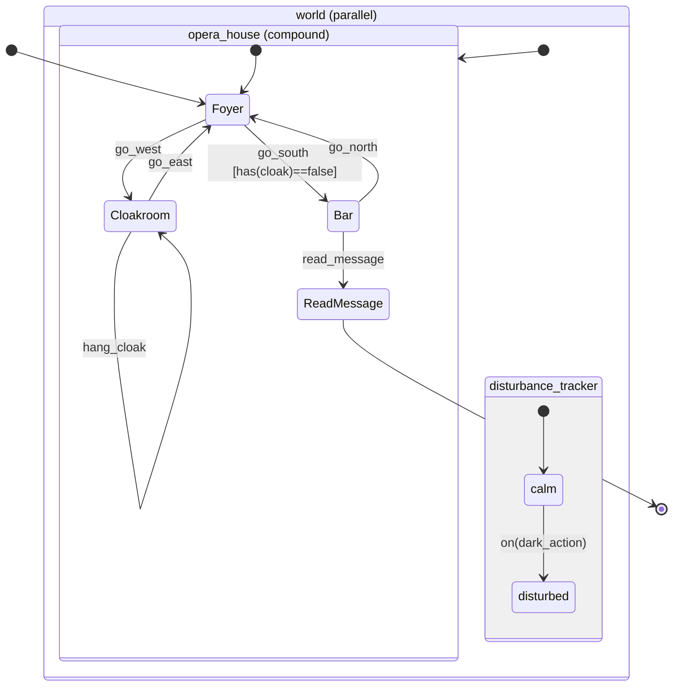
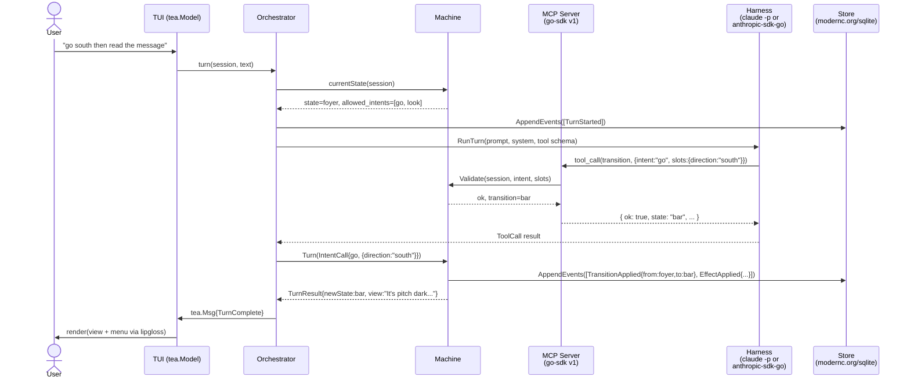

# Kitsoki — Design Document

**Status:** Draft v0.1
**Author:** Brad Smith
**Date:** 2026-04-20

Kitsoki is a deterministic orchestrator that lets a human drive a structured application with free-text input. The LLM is not the decision maker: it is a *translator* between natural language and a finite alphabet of intents defined by the application. The application itself is a directed, possibly cyclic graph of states whose transitions, guards, and persistence are entirely deterministic.

This document defines the conceptual model, the YAML authoring format, the runtime architecture, the MCP tool contract between Kitsoki and the LLM harness, and the determinism and replay guarantees. It also picks a concrete demo application (a freely-licensed text adventure) and walks through how a single user turn maps onto the machinery.

### Target platform

Kitsoki is implemented in **Go 1.23+** and ships as a **single statically-linked binary** with no CGO, no external runtime, and no managed service dependency. The CLI/TUI is built on [charmbracelet/bubbletea](https://github.com/charmbracelet/bubbletea) v2. The rationale for this stack — distribution, compile-time interface enforcement, the maturity of the Charm TUI ecosystem, and the stable MCP Go SDK v1 — is documented in `stack-comparison.md`; this document encodes the decision and uses Go-specific library names throughout. Where earlier drafts said "Go or Python" or "TBD," we now commit to Go.

---

## 1. Context and Positioning

### 1.1 What problem is Kitsoki actually solving?

Traditional CLIs demand exact syntax and memorization: `kubectl patch deployment foo -p '{"spec":{"replicas":3}}' --type=merge`. Chat agents accept anything but guarantee nothing: they hallucinate flags, invoke destructive operations from ambiguous prose, and have no concept of "you are currently inside the rollout wizard." Kitsoki splits the difference: free-text in, but an explicit, author-defined state graph decides what can happen next.

Concretely:

- The application author writes a YAML definition describing *states*, *transitions*, the *intents* available in each state, and the *slots* each intent needs.
- At runtime the user types free text. Kitsoki forwards the text to an LLM harness (Claude Code `claude -p`, OpenCode, Codex-CLI) with an MCP server attached.
- The LLM's only permitted output is a call to an MCP tool that maps the free text onto one of the currently-valid intents with typed, validated arguments.
- If the input is ambiguous, incomplete, or out-of-state, the MCP call returns a structured error payload that tells the LLM what was wrong. The LLM retries. After N retries we surface the problem to the human with a context-sensitive menu.
- The state machine then applies the transition deterministically, producing the next state and a rendered view.

### 1.2 What Kitsoki is not

- **Not a chat agent.** The LLM has no latitude to "decide" what the user wants outside the intent alphabet.
- **Not a general workflow engine.** We don't compete with Temporal or Step Functions on multi-worker durability, distributed activities, or scheduler timers. Kitsoki hosts one conversation per session — but the surface that carries the conversation is plural: a local TUI, a Jira ticket comment thread, a Bitbucket PR comment thread, later a Slack thread. Long-pause sessions and per-event invocations are first-class. See §1.4.
- **Not a wizard library.** Wizards are strictly linear; Kitsoki models cyclic graphs, compound states, and free exploration.
- **Not a natural language understanding framework in its own right.** NLU is outsourced to the LLM through a constrained tool surface.

### 1.3 Prior-art snapshot

Four bodies of work inform the design. In each, I extract concrete ideas to steal and pitfalls to avoid.

#### Interactive fiction engines

**Inform 7** compiles an English-like source into an I6 program whose parser matches input against *grammar tokens* that produce noun-phrase, preposition, number, or unparsed-text bindings ([Writing With Inform §17.4](https://ganelson.github.io/inform-website/book/WI_17_4.html)). Rules fire in declared precedence, and verbs can be adapted to new syntactic forms via conjugation ([§14.3](https://ganelson.github.io/inform-website/book/WI_14_3.html)). **TADS 3** takes a similar approach with explicit verb grammar rules combined with `VerbProd` action maps and `singleDobj`-style slot keywords that the parser fills ([Creating Verbs in TADS 3](http://www.tads.org/howto/t3verb.htm)).

**Ink** takes the opposite tack: knots and stitches as addressable units, diverts (`-> london`) for flow, and choices presented as a menu — no parser ([ink docs](https://github.com/inkle/ink/blob/master/Documentation/WritingWithInk.md)). **Yarn Spinner** similarly uses nodes with headers/bodies and `<<jump>>`/`<<command>>` directives ([Nodes and Lines](https://docs.yarnspinner.dev/write-yarn-scripts/scripting-fundamentals/lines-nodes-and-options), [Commands](https://yarnspinner.dev/docs/write-yarn-scripts/scripting-fundamentals/commands)). **Twine/Harlowe** makes passages the unit and treats everything — including navigation — as macro calls on an interactive text surface ([Harlowe 3.3.8 manual](https://twine2.neocities.org/)). **ChoiceScript** exposes `*choice`, `*label`, `*goto` as the whole grammar ([Introduction to ChoiceScript](https://www.choiceofgames.com/make-your-own-games/choicescript-intro/)).

*Steal:*
1. Grammar-first *intent* declarations (Inform, TADS) — authors should think in verbs and object slots, not in "if/else."
2. Addressable navigation units with diverts/jumps (Ink, Yarn) — a clean way to represent a state graph in text.
3. Distinction between the *narrative* surface (what the user sees) and the *mechanics* (state mutations) — every IF system separates these.
4. Parser fallbacks that say "I didn't understand" with targeted nudges — we need the same for the LLM retry loop.

*Avoid:*
1. Inform 7's natural-language rule-declaration aesthetic — readable to English speakers but famously hard for programmers to debug when precedence goes wrong. Kitsoki's DSL is structured YAML, not prose.
2. Twine's "everything is a macro in a passage" model — it leaks presentation into logic. We separate view from transition.

#### Workflow and state-machine frameworks

**XState / statecharts** give us the vocabulary we need: hierarchical states, parallel regions, guards as pure synchronous predicates, composable `and()`/`or()` and the `stateIn()` predicate for parallel-region cross-reference ([Guards](https://stately.ai/docs/guards), [Parallel states](https://stately.ai/docs/parallel-states)). **SCXML** is the W3C-standardized version with the same semantics in XML, including explicit event-to-transition matching and cond expressions ([W3C SCXML Rec](https://www.w3.org/TR/scxml/)).

**Temporal** enforces workflow determinism by replaying an event history and comparing re-emitted commands to the recorded sequence ([Temporal Workflow Definition](https://docs.temporal.io/workflow-definition)). **LangGraph** provides a graph API with conditional edges plus a checkpointer (`SqliteSaver`, `PostgresSaver`) that snapshots state per step under a thread ID ([LangGraph Persistence](https://docs.langchain.com/oss/python/langgraph/persistence)). **BPMN** adds a vocabulary of gateway types — exclusive, parallel, inclusive, event-based, complex — that is a useful sanity check when designing transitions ([Camunda BPMN Reference](https://camunda.com/bpmn/reference/)).

*Steal:*
1. Compound/hierarchical states + parallel regions (XState, SCXML). Without these, "you're in the edit flow AND still have the inventory sub-state" gets expressed as a combinatorial state explosion.
2. Pure synchronous guards that evaluate against a state snapshot (XState, SCXML). Side-effecting guards are a nightmare to replay.
3. Event-history-as-truth (Temporal). Replay is straightforward when the log is the source of state.
4. Event-based gateways (BPMN) — "wait for whichever event arrives first" is the clean way to model LLM retry timeouts.

*Avoid:*
1. Temporal-scale durability. We do not need workers, activities, and long polling; we have a single local process talking to one user.
2. LangGraph's implicit state-is-whatever-you-return pattern — too flexible, too easy to lose track of what's persisted.

#### Conversational AI / dialogue frameworks

**Rasa** models *forms* as slot-filling containers with `required_slots`; the form re-prompts for the first unfilled slot via an `utter_ask_<slot>` response and deactivates when every required slot is set ([Rasa Forms](https://legacy-docs-oss.rasa.com/docs/rasa/forms/)). **Dialogflow CX** splits agents into *flows*, each composed of *pages*; each page has a *form* — a list of parameters with prompts — and *routes* (state handlers) that transition on intents, conditions, or parameter-filled events ([Dialogflow CX Pages](https://cloud.google.com/dialogflow/cx/docs/concept/page)). **Microsoft Bot Framework Adaptive Dialogs** are event-driven declarative trees with triggers, actions, and `Recognizer`/`Generator`/`Selector` components ([AdaptiveDialog class](https://learn.microsoft.com/en-us/javascript/api/botbuilder-dialogs-adaptive/adaptivedialog?view=botbuilder-ts-latest)).

*Steal:*
1. Page ≈ state with a form (Dialogflow CX). A state's slot list is first-class and the runtime loops until filled.
2. Dynamic `required_slots` (Rasa) — the shape of the form can depend on previously filled values.
3. Separation of *recognizer* (turns free text into intent+entities) from *dialog manager* (moves through states). Kitsoki's LLM is the recognizer; our state machine is the dialog manager.

*Avoid:*
1. Rasa's story/rule training data paradigm — it confuses "authoring" with "example data." Kitsoki is author-first, not ML-first.
2. Dialogflow's hidden built-in intents and implicit sys parameters — opaque magic. Every intent in Kitsoki is declared by the author.

#### LLM-specific orchestration

LangGraph's conditional edges run after a node and select the next node deterministically, based on the node's return value ([LangGraph overview from its docs](https://docs.langchain.com/oss/python/langgraph/persistence)). LLM-retry-with-validation-feedback is an established pattern: libraries like Instructor ([overview](https://techsy.io/en/blog/best-llm-structured-output-libraries)) pipe the Pydantic validation error back into the next prompt, achieving >95% recovery at small-schema sizes. MCP itself specifies that *tool* errors should live inside the result envelope (`isError: true`), not as JSON-RPC protocol errors, so the LLM sees them and can self-correct ([MCP schema reference](https://modelcontextprotocol.io/specification/draft/schema)).

*Steal:*
1. Validation-feedback retry loop with a bounded budget.
2. Structured tool errors in-band, always JSON, with a `suggestions` array the LLM can read.

*Avoid:*
1. "Planner" agents that reason about what tool to call over multi-step plans. We want a one-shot extraction: free text → intent. If the user needs multi-step, the state graph models it, not the LLM.

### 1.4 Conversation surfaces and the orchestrator boundary

Kitsoki is a *conversation engine*. Conversations may be driven from different surfaces — a local TUI, a Jira ticket comment thread, a Bitbucket pull-request comment thread, later a Slack thread — and the same room (the same state graph, intents, phases, and checkpoints) must work driven from any of them. The TUI is one such surface; it is not privileged. The canonical examples in §1.1 are TUI-flavored, but every claim about "the user types" generalises to "the user replies via the surface."

#### Transports

A *transport* is the output adapter that translates a kitsoki `Post(key, body)` call into the surface's native form: a TUI panel render, a Jira `POST /comment`, a Bitbucket PR comment-create. Transports own native markup rendering (Jira wiki vs. markdown), authentication, and rate-limiting against the external surface.

Inbound — turning an external reply into a kitsoki intent — is *not* a transport responsibility in the v1 design (see "the orchestrator boundary" below). Transports may grow `Open(handler)` polling or webhook loops in a future revision; they do not have one yet.

#### The orchestrator boundary (v1)

Kitsoki hosts the per-session conversation. It does not poll Jira, watch Bitbucket webhooks, or schedule its own work. The *orchestrator* — for the bug-fix and PR-refine rooms today, `tools/loopy/loop.py` in `cyber-repo` — owns:

- ticket / PR selection and dispatch
- polling external surfaces for new replies
- mapping a reply to a kitsoki intent (or passing the raw body to kitsoki's intent router)
- knowledge extraction, capability boundaries, metrics, dashboards, and other supervisor-level concerns that span sessions

The contract between an orchestrator and kitsoki is a small CLI surface keyed by external ID:

```bash
kitsoki session create   --app stories/bugfix/app.yaml --key jira:PLTFRM-12345
kitsoki session continue --key jira:PLTFRM-12345 --intent <name> --slots <json>
kitsoki session continue --key jira:PLTFRM-12345 --raw "<reply body>"
kitsoki session show     --key jira:PLTFRM-12345
kitsoki session list     --transport jira
kitsoki tui              --key jira:PLTFRM-12345    # attended attach
```

Each invocation runs kitsoki to a quiescent point — the next checkpoint or a terminal state — posts whatever output the room declares via the configured transport, then exits. State is event-sourced (§8) so no process needs to stay resident between events.

This keeps kitsoki focused — one binary, one session per process, no in-process scheduler — and lets `loop.py` keep its accumulated features (knowledge subsystem, capability boundaries, metrics, cross-run analysis, dashboards) without re-homing them in kitsoki. A future "orchestrator-in-kitsoki" mode (e.g. `kitsoki serve` with its own polling loops) is not ruled out, but it is **not v1**, and we will not design for it until a concrete need surfaces.

#### Sessions are persistent singletons

A session is keyed by `(transport, thread)` — e.g. `jira:PLTFRM-12345`, `bitbucket:DBI/some-repo/pulls/123` — and persists indefinitely in the SQLite event store. A session may carry **multiple** external keys (a bug-fix session attached to both its Jira ticket and the Bitbucket PR it eventually opens); keys are bound as the session progresses.

At most one process at a time may write to a given session. Concurrent invocations serialize on a row-level writer lock with a configurable retry deadline; the loser fails fast with `session busy`. This is what lets `kitsoki tui --key X` and an orchestrator's `kitsoki session continue --key X` co-exist safely against the same persistent session — first writer wins, second writer either waits or reports busy.

#### Phases are the model unit; checkpoints are a transport concern

Kitsoki models conversations at *phase* granularity, not at coarse stage granularity. Each phase is a state with its own artifacts, prompts, guards, history, and intent menu. A phase may be marked as a *checkpoint* — when entered, kitsoki posts the phase output via the configured transport and the session pauses awaiting a reply. Non-checkpoint phases auto-advance.

Whether a phase is a checkpoint is a **transport concern**, not a model concern. The bug-fix pipeline today batches 14 fine-grained phases into 4 stage-group checkpoints because human reviewers don't want to be pinged 14 times per ticket; that batching is a property of the Jira surface, not of the bug-fix room. A more verbose surface (e.g. an attended TUI session) may checkpoint every phase against the same room.

#### Reply parsing is room-defined and extensible

Replies are not constrained to a fixed framework vocabulary (no hardcoded `continue` / `refine` / `quit`). Each checkpoint state declares its own intent menu — `continue`, `quit`, `refine`, `restart_from(stage)`, `jump_to(phase)`, `block_on(reason)`, or anything else the room needs. The orchestrator either:

1. Pre-parses well-known keywords and passes `--intent <name> --slots <json>`, or
2. Passes the raw reply body via `--raw "<body>"` and lets kitsoki's existing intent-router (the same one that parses TUI free text) map the body to one of the menu's intents using each intent's `examples:` and slot schema.

Synonyms and aliases (`approve`/`lgtm`/`proceed` for `continue`; `skip`/`abandon`/`stop` for `quit`) are declared as intent `examples:`, not hardcoded in the parser. This keeps reply behavior room-specific and lets reviewers' historical vocabulary continue to work without framework changes.

---

## 2. Conceptual Model

The user's idea says: *"application as explorable space"*, not *"wizard as linear path"*. The model below unifies a statechart, a text-adventure world, and a command palette.

### 2.1 Primitives

| Primitive | Role |
|---|---|
| **App** | The top-level definition: metadata, world schema, root state, intent library. |
| **State** | A node in the directed graph. May be *atomic*, *compound* (contains child states with an initial child), or *parallel* (all children active simultaneously). |
| **Intent** | A named, typed action available *in* a state. An intent has a `schema` (its slot list) and a `transition` (what happens when it fires). Intents are the alphabet the LLM must produce. |
| **Slot** | A typed parameter on an intent. Has a name, type, optional default, optional `required` flag, optional `enum`, and an optional `prompt` used when the LLM is missing it. |
| **Guard** | A pure synchronous predicate over `world` and `slots`. Decides whether a transition is eligible. Never mutates. |
| **Transition** | `target: <state ref>` + optional `effects` (pure world mutations) + optional `emit` (events for parallel regions). |
| **World** | The author-declared persistent context: inventory, variables, counters, anything carried across turns. Schema is declared. Updates happen only via transition `effects`. |
| **View** | The render template for a state: what the user sees when they arrive. Separate from the mechanics. |
| **Menu** | A runtime-derived list of intents currently available given the state and guards. Always shown to the user in progressive-disclosure form. |
| **Off-path** | An opt-in mode where the underlying chat agent answers freely, visually framed as "off the path." No world mutations are persisted from off-path turns. |

### 2.2 Why this shape

- A text-adventure room maps to a state; the exits are transitions; the inventory is the world; the verbs the room understands are its intent set; the objects are slot enums.
- A wizard maps to a linear chain of compound states; slots on each step are the form parameters; the "back" button is a cyclic transition.
- A command palette is exactly the *menu* primitive — the set of currently-valid intents.
- A statechart's *parallel region* is naturally modeled as a parallel state: e.g., a file-editor state running alongside a background-validator state that emits `saved` / `error` events the editor can consume.

### 2.3 Progressive disclosure

Progressive disclosure has a precise definition here: at any given moment the user sees *only the intents reachable from the current state whose guards currently evaluate true*, and each intent's slot list is revealed only as preceding slots are filled. This is generated mechanically — not by the LLM — from the app definition. The menu is the canonical source of truth; the LLM is free to offer more natural-sounding rephrasings but cannot invent intents outside the set. Progressive disclosure is one face of the broader feedback story; the full surface-by-surface treatment (location, menu, slot-fill, disambiguation, guard-failure, narrative, off-path) is §7.

### 2.4 Reference diagram



The `disturbance_tracker` region runs alongside the room graph — this is how "messed with things in the dark" is counted without polluting every room state.

---

## 3. YAML Authoring Format

Authors write YAML. The format is declarative, author-ergonomic, and carries no executable code — effects and guards are small expressions in a restricted language (see §3.5), not arbitrary functions. This is deliberate: it keeps apps portable, sandboxable, and replay-safe.

### 3.1 Complete annotated example: Cloak of Darkness

This is a full, running app. *Cloak of Darkness* is the "hello world" of interactive fiction — three rooms, three objects, a winnable conclusion in about five moves ([IFWiki](https://www.ifwiki.org/index.php/Cloak_of_Darkness), [IF Archive spec](https://users.ox.ac.uk/~manc0049/TADSGuide/cloak.htm)). It was designed specifically as a benchmark for comparing IF authoring systems, which makes it the ideal first app for Kitsoki.

```yaml
# cloak-of-darkness.kitsoki.yaml
app:
  id: cloak-of-darkness
  version: 0.1.0
  title: "Cloak of Darkness"
  author: "Roger Firth (spec), ported to Kitsoki"
  license: "Spec in public domain; this port CC0"

# Top-level world schema. Every variable is typed and has a default.
world:
  wearing_cloak: { type: bool, default: true }
  disturbance: { type: int, default: 0 }   # counts dark fumbling
  message_rumpled: { type: bool, default: false }

# Intent library -- reusable intent definitions that states reference.
# This is the "verb grammar" in Inform/TADS terms, but typed and explicit.
# Each intent declares user-facing fields that feed the §7 feedback surfaces:
# `title` is the menu label, `description` is shown beneath it, `examples`
# seed both the menu "try saying..." hints and the Mode 1 fixtures,
# `priority` orders the menu (higher first), and `hidden` keeps advanced or
# spoiler intents out of the primary menu list.
intents:
  go:
    title: "Go"
    description: "Move in a compass direction."
    examples: ["go south", "head north", "walk east", "n"]
    priority: 100
    slots:
      direction:
        type: enum
        values: [north, south, east, west, up, down]
        required: true
        description: "Which compass direction to move."
        examples: ["south", "n", "east"]
        format_hint: "One of n/s/e/w/up/down, spelled out or abbreviated."
        prompt: "Which direction?"
  hang_cloak:
    title: "Hang the cloak"
    description: "Hang the cloak on the hook in the cloakroom."
    examples: ["hang the cloak", "hang my cloak on the hook", "put the cloak up"]
    priority: 80
    # No slots -- zero-arg intent.
  drop_cloak:
    title: "Drop the cloak"
    description: "Drop the cloak on the floor wherever you're standing."
    examples: ["drop the cloak", "discard the cloak"]
    hidden: true           # spoiler-ish; available but not listed in the primary menu
    priority: 10
  wear_cloak:
    title: "Wear the cloak"
    description: "Put the cloak back on."
    examples: ["wear the cloak", "put on the cloak", "take the cloak"]
    priority: 70
  read_message:
    title: "Read the message"
    description: "Read the message scrawled in the sawdust on the bar floor."
    examples: ["read the message", "read the writing", "read it"]
    priority: 90
  look:
    title: "Look around"
    description: "Describe the current room again."
    examples: ["look", "look around", "describe the room"]
    priority: 20

# The state graph. `root` is the initial state.
root: foyer

states:
  foyer:
    description: "The entrance hall of the opera house. South leads to the bar; west to the cloakroom."
    # `relevant_*` pins what the location-indicator pane (§7.1) surfaces. Omit
    # either one and the runtime falls back to "everything in the world schema".
    relevant_world: [wearing_cloak]
    relevant_slots: []
    view: |
      You are in a spacious hall, splendidly decorated in red and gold,
      with glittering chandeliers overhead. The entrance from the street
      is to the north, and there are doorways south and west.
    on:
      # "on" is a map from intent-name -> list of guarded transitions.
      # First matching guard wins (XState-style).
      go:
        - when: "slots.direction == 'south'"
          target: bar
        - when: "slots.direction == 'west'"
          target: cloakroom
        - when: "slots.direction == 'north'"
          # Dead-end: stay here but say something.
          target: foyer
          guard_hint: "The weather outside is awful -- you've only just arrived."
          effects:
            - say: "You've only just arrived, and besides, the weather outside seems to be getting worse."
        - default: true
          target: foyer
          effects:
            - say: "You can't go that way."
      look:
        - target: foyer   # self-transition; re-renders the view.

  cloakroom:
    description: "A small cloakroom with a single hook. Exit east."
    relevant_world: [wearing_cloak]
    view: |
      The walls of this small room were clearly once lined with hooks,
      though now only one remains. The exit is a door to the east.
      {{ if world.wearing_cloak }}You are wearing a velvet cloak.{{ end }}
      {{ if not world.wearing_cloak }}A velvet cloak hangs on the hook.{{ end }}
    on:
      go:
        - when: "slots.direction == 'east'"
          target: foyer
      hang_cloak:
        - when: "world.wearing_cloak == true"
          target: cloakroom
          effects:
            - set: { wearing_cloak: false }
            - say: "You hang the cloak on the hook."
        - default: true
          target: cloakroom
          guard_hint: "You aren't wearing the cloak -- nothing to hang."
          effects:
            - say: "You aren't wearing the cloak."
      wear_cloak:
        - when: "world.wearing_cloak == false"
          target: cloakroom
          guard_hint: "You're already wearing the cloak."
          effects:
            - set: { wearing_cloak: true }
            - say: "You take the cloak from the hook."

  bar:
    # Compound state: behavior depends on whether cloak is worn.
    type: compound
    description: "A small bar off the foyer. Lit when the cloak is hung up; dark otherwise."
    relevant_world: [wearing_cloak, disturbance]
    initial: "{{ world.wearing_cloak ? 'dark' : 'lit' }}"
    states:
      dark:
        description: "Too dark to see. Fumbling around increases disturbance."
        relevant_world: [disturbance]
        view: |
          It's pitch dark in here. You can just make out a message
          on the floor, but can't read it without more light.
        on:
          go:
            - when: "slots.direction == 'north'"
              target: ../../foyer
            - default: true
              target: .    # stay put
              guard_hint: "You can't see well enough in the dark to head that way. Try going north, or finding a way to make light."
              effects:
                - increment: { disturbance: 1 }
                - say: "Blundering around in the dark isn't a good idea."
          # Any non-movement intent in the dark bumps disturbance.
          "*":   # wildcard: catches anything not otherwise handled here
            - target: .
              guard_hint: "It's pitch dark -- you can't see to do that."
              effects:
                - increment: { disturbance: 1 }
                - say: "You can't see a thing."
      lit:
        description: "The bar, lit now the cloak is hung up. A message is scrawled on the floor."
        relevant_world: [disturbance]
        view: |
          The bar, much rougher than you'd have guessed after the
          opulence of the foyer, is completely empty. There seems
          to be some sort of message scrawled in the sawdust on the
          floor.
        on:
          go:
            - when: "slots.direction == 'north'"
              target: ../../foyer
          read_message:
            - target: ended
              effects:
                - set: { message_rumpled: "{{ world.disturbance > 2 }}" }

  ended:
    terminal: true
    description: "The journey is over."
    view: |
      {{ if world.message_rumpled }}
      The message, now little more than a dusty blur, appears to say:
      "You have lost."
      {{ else }}
      The message, neatly marked in the sawdust, reads:
      "You have won."
      {{ end }}

# Off-path escape hatch. When triggered, the LLM runs unconstrained and
# the TUI marks the session visually. Nothing persists to world.
off_path:
  trigger: "/freeform"   # explicit command; never auto-entered
  banner: "*** off the path -- responses do not affect your story ***"
  return: "/onpath"
```

Three things worth flagging:

1. **`on: "*"` wildcard.** This is the "anything else" handler — the equivalent of Inform's rulebook default. It keeps the author from having to enumerate every intent they want to suppress.
2. **Expression language in `view` and `initial`.** Small, side-effect-free templating (`{{ world.foo }}`, `{{ if ... }}`, ternary). Deterministic, no I/O, no function calls. Details in §3.5.
3. **User-facing metadata fields.** The `description`, `title`, `examples`, `priority`, `hidden`, `relevant_world`, and `guard_hint` fields exist to feed the feedback surfaces in §7. They are strongly encouraged but validated, not required — a state without `description` still loads, it just surfaces an empty description pane. Authors who skip them trade guidance quality for brevity. See §7 for the full surface-by-surface treatment.

### 3.2 Example: a CLI-ish "deploy" wizard with cyclic navigation

Showing the model isn't only for games:

```yaml
app:
  id: deploy-wizard
  version: 0.1.0

world:
  env: { type: enum, values: [dev, staging, prod], default: null }
  service: { type: string, default: null }
  image_tag: { type: string, default: null }
  confirmed: { type: bool, default: false }

intents:
  pick_env:
    slots:
      env: { type: enum, values: [dev, staging, prod], required: true }
  pick_service:
    slots:
      name:
        type: string
        required: true
        validator: "matches('^[a-z][a-z0-9-]{1,40}$')"
  pick_tag:
    slots:
      tag: { type: string, required: true }
  back: {}                # zero-arg nav intent
  confirm: {}
  deploy: {}

root: choose_env

states:
  choose_env:
    view: "Which environment? (dev / staging / prod)"
    menu: [pick_env]       # explicit menu override; default is "all intents with handlers"
    on:
      pick_env:
        - target: choose_service
          effects: [{ set: { env: "{{ slots.env }}" } }]

  choose_service:
    view: "Deploying to {{ world.env }}. Which service?"
    on:
      pick_service:
        - target: choose_tag
          effects: [{ set: { service: "{{ slots.name }}" } }]
      back:
        - target: choose_env

  choose_tag:
    view: |
      Service: {{ world.service }}   Env: {{ world.env }}
      Image tag to deploy?
    on:
      pick_tag:
        - target: review
          effects: [{ set: { image_tag: "{{ slots.tag }}" } }]
      back:
        - target: choose_service

  review:
    view: |
      About to deploy:
        env:     {{ world.env }}
        service: {{ world.service }}
        tag:     {{ world.image_tag }}
      Confirm?
    on:
      confirm:
        - target: deploying
          effects: [{ set: { confirmed: true } }]
      back:
        - target: choose_tag

  deploying:
    # Terminal-ish: fires a side effect through the host, then done.
    on_enter:
      - invoke: host.run
        with:
          cmd: "deploy --env {{ world.env }} --svc {{ world.service }} --tag {{ world.image_tag }}"
    view: "Deploying..."
    on:
      deploy_complete:   # system-emitted event, not a user intent
        - target: done
    timeout:
      after: 300s
      target: failed

  done:
    terminal: true
    view: "Deployed {{ world.service }}@{{ world.image_tag }} to {{ world.env }}."

  failed:
    terminal: true
    view: "Deploy timed out. State captured at {{ run.id }} for retry."
```

### 3.3 Example: parallel region for background validation

```yaml
app:
  id: form-with-validator
  version: 0.1.0

# Parallel root. Both regions tick on every event.
root:
  type: parallel
  regions:
    - id: form
      initial: entering
      states:
        entering:
          on:
            submit:
              - target: ../done
                when: "stateIn('validator.valid')"   # XState-like cross-region guard
              - default: true
                effects: [{ say: "Validator says the data isn't clean yet." }]
        done:
          terminal: true
    - id: validator
      initial: idle
      states:
        idle:
          on:
            field_changed:
              - target: checking
        checking:
          on_enter:
            - invoke: host.validate
              emit: validator_result
          on:
            validator_result:
              - when: "event.ok"
                target: valid
              - default: true
                target: invalid
        valid: {}
        invalid: {}
```

The parallel primitive is the escape valve from state explosion. The `stateIn(...)` guard is lifted straight from XState's catalog ([Guards](https://stately.ai/docs/guards)).

### 3.4 Intent-in-state ergonomics

Authors frequently want *local* intents defined inline, not lifted to the library. YAML allows both:

```yaml
states:
  puzzle_room:
    intents:          # locally-scoped, only valid in this state
      solve_puzzle:
        slots:
          answer: { type: string, required: true }
    on:
      solve_puzzle:
        - when: "slots.answer == 'XYZZY'"
          target: secret_room
        - default: true
          target: puzzle_room
          effects: [{ say: "Nothing happens." }]
```

Local intents are scoped to the state; the global `intents:` block is reusable. This mirrors Inform's ability to attach grammar rules to specific objects.

### 3.5 The expression language

Guards (`when:`), template interpolation (`{{...}}`), and `validator:` all evaluate expressions against a well-defined context:

- Scope: `slots.*`, `world.*`, `event.*`, `run.*` (run id, turn number, timestamps).
- Operators: `== != < <= > >= && || !`, arithmetic, string concatenation, `in`, `?:`.
- Functions: `len(x)`, `matches(pattern)`, `has(collection, x)`, `now()`, `stateIn(path)`.
- No user-defined functions, no I/O, no loops, no allocations beyond literals. Deterministic by construction.

We implement this with [expr-lang/expr](https://github.com/expr-lang/expr), locked down with a strict typed environment and an AST whitelist (a `Patch` visitor that rejects any node outside the approved operator/function set at compile time). Out-of-scope: lambdas, map literals, method chains on user types. Expr's compile-once / eval-many model means guards are compiled at YAML load time; eval cost at runtime is sub-microsecond.

Slot payloads coming in from the MCP `transition` tool are first shape-checked against a JSON Schema derived from the intent's slot declarations, using [santhosh-tekuri/jsonschema/v6](https://github.com/santhosh-tekuri/jsonschema) (Draft 2020-12). Enum/regex/range constraints declared in YAML compile directly into schema keywords; validation errors map one-to-one onto the `INVALID_SLOT_VALUE` / `MISSING_SLOTS` error codes in §5.2.

---

## 4. Runtime Architecture

### 4.1 Process model

A single Go process, one statically-linked binary, no in-process scheduler, no resident server. Every component communicates in-process; the only external boundaries are the LLM harness subprocess and the MCP stdio/socket transport between the harness and our server.

Kitsoki is invoked **per session-event**. An attended TUI session is one continuous process for the duration of the user's seat at the keyboard; an orchestrator-driven session (Jira, Bitbucket — see §1.4) is invoked once per inbound reply via `kitsoki session continue`, runs forward to the next checkpoint, posts via the configured transport, and exits. Durability across invocations is provided by the event-sourced SQLite store (§8). The diagram below depicts the attended (TUI) shape; in the orchestrator-driven shape the TUI box is absent and the orchestrator (e.g. `loop.py`) sits outside the diagram, invoking kitsoki over the CLI.

```
+-------------------------------------------------------------------+
|                        kitsoki process (Go)                         |
|                                                                   |
|  +-----------+    +-----------+    +-----------+   +-----------+ |
|  |    TUI    |<-->|  Orches-  |<-->|   State   |<->|  Journey  | |
|  | Bubble    |    |  trator   |    |  Machine  |   |   Store   | |
|  | Tea v2 +  |    | (custom)  |    |  (custom, |   | modernc.  | |
|  | Lipgloss  |    |           |    |   pure)   |   |  org/     | |
|  | + Huh +   |    |           |    |           |   |  sqlite   | |
|  | Glamour   |    |           |    |           |   |           | |
|  +-----------+    +-----+-----+    +-----------+   +-----------+ |
|                         |                                         |
|                         v                                         |
|                  +------------+         +---------------+         |
|                  |    MCP     |<--mcp-->|  claude -p /  |         |
|                  |  Server    |  stdio  |   opencode    |         |
|                  |  go-sdk v1 |         |   subprocess  |         |
|                  +------------+         +---------------+         |
|                         ^                                         |
|                         |  (optional direct Anthropic API         |
|                         v   via anthropic-sdk-go, §14.5)          |
|                  +------------+                                   |
|                  | anthropic- |                                   |
|                  |   sdk-go   |                                   |
|                  +------------+                                   |
+-------------------------------------------------------------------+
```

Component-to-library mapping:

- **TUI**: [charmbracelet/bubbletea](https://github.com/charmbracelet/bubbletea) v2 (Elm-architecture event loop, Cursed Renderer), [charmbracelet/bubbles](https://github.com/charmbracelet/bubbles) (viewport, list, textinput, spinner, table), [charmbracelet/lipgloss](https://github.com/charmbracelet/lipgloss) v2 (layout + styling), [charmbracelet/huh](https://github.com/charmbracelet/huh) v2 (slot-filling modal forms), [charmbracelet/glamour](https://github.com/charmbracelet/glamour) (markdown rendering inside the transcript pane).
- **Orchestrator**: custom, ~500 lines. Single-threaded per session; owns the turn lifecycle, hands tool calls to the MCP server, applies results to the Machine, appends events to the Store, and publishes `tea.Msg` values back to the TUI goroutine.
- **State Machine**: custom, built on top of the compiled YAML model. We deliberately reject off-the-shelf FSM libraries — [looplab/fsm](https://github.com/looplab/fsm) is flat-only, and [qmuntal/stateless](https://github.com/qmuntal/stateless) does hierarchical states but not the XState-flavored compound + parallel + first-guard-wins semantics we need (see stack-comparison §A and the "Risks" in that doc). Writing the ~600 lines of reducer ourselves is cheaper than bending a library to fit.
- **MCP Server**: the official [modelcontextprotocol/go-sdk](https://github.com/modelcontextprotocol/go-sdk) v1 (stable semver as of late 2025). We explicitly do not use `mark3labs/mcp-go` — the official SDK is now the canonical path and ships Anthropic/Google-maintained tool-handler idioms.
- **LLM Harness**: pluggable via a `Harness` interface (§12). Default implementation spawns `claude -p` or `opencode` as a subprocess over stdio. An in-process fallback uses [anthropic-sdk-go](https://github.com/anthropics/anthropic-sdk-go) directly (Claude Opus 4.7, prompt caching, tool use).
- **Journey Store**: [modernc.org/sqlite](https://pkg.go.dev/modernc.org/sqlite) — pure-Go SQLite, no cgo, which is what keeps the single static binary promise alive on every `GOOS`.

The MCP server is embedded in the Kitsoki binary and speaks stdio to a child harness process. That is how Claude Code spawns MCP servers today, so we invert the relationship: we *are* the MCP server, and the LLM harness connects to us over the transport it was given. Alternatively (and more robust for OpenCode-style harnesses), Kitsoki starts the MCP server on a local socket and launches the harness with `--mcp-config` pointing at it.

### 4.2 A single user turn



Key points:

- The LLM is called once per user utterance with a *single-shot* directive: "call the `transition` tool exactly once with the intent and slots, or call `clarify` with a reason."
- The MCP server (Go SDK v1) is the gatekeeper. Tool-call validation is our deterministic boundary. Everything after the MCP handshake is pure Go.
- Events append to the SQLite journal via `Store.AppendEvents`, keyed by session+turn. State is derived; snapshots are optional caches.
- The TUI goroutine and the orchestrator goroutine communicate exclusively by `tea.Msg` values on Bubble Tea's command channel — no shared mutable state.

### 4.3 Concurrency

The orchestrator is single-threaded per session. If the author declares parallel regions, they execute serially within one turn using an ordered micro-step (SCXML-style): dequeue event, run eligible transitions in each region, re-evaluate, repeat until no eligible transitions remain. This is cooperative multitasking; there is no `go` statement per region.

---

## 5. MCP Tool Surface

**Decision: one generic `transition` tool, plus a small set of meta tools.**

Why not per-state typed tools? Two reasons:

1. The LLM's tool list would change every turn. Most LLM tool-calling APIs today cache the tool list per session; reshuffling it per turn defeats caching and adds latency.
2. Authors would be forced to expose internal intent names in their tool schemas. That couples the LLM prompt to the app's internals.

With one `transition` tool whose payload is `{intent, slots}`, the LLM's job is uniform across apps: "given the current state's intent catalog (which I'll include in the system prompt), call `transition` with one of them."

### 5.1 Tool registration (Go SDK v1)

Concretely, the four tools are registered with the official [modelcontextprotocol/go-sdk](https://github.com/modelcontextprotocol/go-sdk) like this:

```go
import (
    "context"
    mcp "github.com/modelcontextprotocol/go-sdk/mcp"
)

// TransitionArgs is the typed payload; the SDK auto-generates JSON Schema
// from struct tags. We additionally post-validate slots against the active
// intent's dynamic slot schema via santhosh-tekuri/jsonschema.
type TransitionArgs struct {
    Intent     string         `json:"intent"      jsonschema:"description=allowed intent name for the current state"`
    Slots      map[string]any `json:"slots,omitempty" jsonschema:"description=intent-specific slot values"`
    Confidence float64        `json:"confidence,omitempty"`
}

type TransitionOK struct {
    OK    bool     `json:"ok"`    // always true on this branch
    State string   `json:"state"` // new current state path
    View  string   `json:"view"`  // rendered narrative
    Menu  []string `json:"menu"`  // currently-allowed intents
}

func registerTools(srv *mcp.Server, h *kitsokiHandler) {
    mcp.AddTool(srv, &mcp.Tool{
        Name:        "transition",
        Description: "Map the user utterance to one allowed intent with filled slots.",
    }, h.handleTransition)

    mcp.AddTool(srv, &mcp.Tool{Name: "clarify", /* ... */}, h.handleClarify)
    mcp.AddTool(srv, &mcp.Tool{Name: "describe_state", /* ... */}, h.handleDescribe)
    mcp.AddTool(srv, &mcp.Tool{Name: "off_path", /* ... */}, h.handleOffPath)
}

// Handler signature follows the Go SDK v1 convention: context, session, typed
// args; return the structured result and either nil error (ok path) or an
// error whose payload is serialized to the client as the ToolError body.
func (h *kitsokiHandler) handleTransition(
    ctx context.Context, sess *mcp.ServerSession, args TransitionArgs,
) (*mcp.CallToolResult, any, error) {
    res := h.machine.Validate(h.currentState(sess), h.world(sess),
        IntentCall{Intent: args.Intent, Slots: args.Slots})
    if !res.OK {
        // isError:true at the envelope, structured payload in content so the
        // LLM sees it and can self-correct (§5.2).
        return &mcp.CallToolResult{IsError: true}, res.Err, nil
    }
    turn, err := h.machine.Turn(ctx, h.currentState(sess), h.world(sess), res.Accepted)
    if err != nil { return nil, nil, err }
    h.store.AppendEvents(h.sessionID(sess), turn.Events)
    return nil, TransitionOK{
        OK: true, State: string(turn.NewState), View: turn.View, Menu: turn.Menu,
    }, nil
}
```

The three other tools (`clarify`, `describe_state`, `off_path`) follow the same `mcp.AddTool` + typed-args pattern. Input/output schemas below are the canonical description; the Go SDK generates them from struct tags so the schema and the handler stay in sync.

### 5.1.1 Tool catalog (schema-level description)

```yaml
# The four tools exposed to the LLM. Schemas expressed in JSONSchema-like YAML.

tools:
  - name: transition
    description: >
      Map the user's utterance to exactly one allowed intent for the current
      state, with all required slots filled. Returns ok+next-state on success
      or a structured error listing missing slots and suggestions.
    input_schema:
      type: object
      required: [intent]
      properties:
        intent:
          type: string
          description: "One of the currently-allowed intent names (see system context)."
        slots:
          type: object
          description: "Intent-specific slot values. Keys match the intent's declared slot names."
        confidence:
          type: number
          description: "0..1 self-reported extraction confidence, optional."
    output_schema:
      oneOf:
        - type: object
          required: [ok, state]
          properties:
            ok: { const: true }
            state: { type: string, description: "Path of the new current state." }
            view: { type: string, description: "Rendered narrative for the user." }
            menu: { type: array, items: { type: string } }
        - type: object
          required: [ok, error]
          properties:
            ok: { const: false }
            error:
              type: object
              required: [code]
              properties:
                code:
                  enum: [UNKNOWN_INTENT, INTENT_NOT_ALLOWED_IN_STATE,
                         MISSING_SLOTS, INVALID_SLOT_VALUE, GUARD_FAILED,
                         AMBIGUOUS_INTENT, INTENT_UNKNOWN]
                message: { type: string }
                missing_slots: { type: array, items: { type: string } }
                suggestions: { type: array, items: { type: string } }
                allowed_intents: { type: array, items: { type: string } }
                candidates:
                  type: array
                  description: "Populated on AMBIGUOUS_INTENT and INTENT_UNKNOWN. Feeds the §7.4 disambiguation surface."
                  items:
                    type: object
                    properties:
                      intent: { type: string }
                      title: { type: string }
                      description: { type: string }
                      why: { type: string, description: "Optional rationale; author `description` is the fallback." }
                guard_hint:
                  type: string
                  description: "Populated on GUARD_FAILED when the transition author declared one. Rendered by the §7.5 guard-failure surface."

  - name: clarify
    description: >
      Use when the user's input is genuinely ambiguous AND you cannot narrow
      to a single intent. Produces a question back to the user without
      consuming a transition.
    input_schema:
      type: object
      required: [question]
      properties:
        question: { type: string }
        candidates:
          type: array
          items: { type: object, properties: { intent: {type: string}, why: {type: string} } }

  - name: describe_state
    description: "Read-only: returns the current state, world snapshot, and menu."
    input_schema: { type: object }

  - name: off_path
    description: >
      Explicitly exit the deterministic path. The harness takes over free-form
      until the user returns with /onpath.
    input_schema:
      type: object
      required: [reason]
      properties:
        reason: { type: string }
```

### 5.2 Error payload in detail

When the LLM calls `transition` with incomplete or mismatched input, the MCP server replies inside the tool result (`isError:true` at the MCP envelope level, plus a detailed object in `content`). Example:

```json
{
  "ok": false,
  "error": {
    "code": "MISSING_SLOTS",
    "message": "Intent 'go' requires slot 'direction'.",
    "missing_slots": ["direction"],
    "suggestions": [
      "Did the user say a compass direction? (north|south|east|west|up|down)",
      "Accept 'n', 's', 'e', 'w' as aliases."
    ],
    "allowed_intents": ["go", "look", "hang_cloak", "wear_cloak"]
  }
}
```

The LLM now has everything it needs to retry: it sees the missing slot, the valid enum, and what other intents exist in case it misclassified. This is the same validation-feedback pattern Instructor and mirascope popularized ([mirascope retries](https://mirascope.com/tutorials/more_advanced/llm_validation_with_retries/)) — but here the feedback is authoritative, not a post-hoc JSON-schema error.

The error `code` enum (`UNKNOWN_INTENT`, `INTENT_NOT_ALLOWED_IN_STATE`, `MISSING_SLOTS`, `INVALID_SLOT_VALUE`, `GUARD_FAILED`, `AMBIGUOUS_INTENT`, `INTENT_UNKNOWN`) is the same surface that Mode 1 adversarial fixtures assert against via `expect_failure.any_of` (§10.2.1); changing or adding a code is a breaking change for those tests. `AMBIGUOUS_INTENT` replaces the earlier informal `AMBIGUOUS` label and pairs with `INTENT_UNKNOWN` so the §7.4 disambiguation surface can distinguish "LLM couldn't pick between two valid intents" from "LLM had no candidate at all."

The same envelope drives the user-facing feedback surfaces in §7:

- `missing_slots` + `suggestions` feed the §7.3 slot-fill clarification surface.
- `candidates` (added here) is a list of `{intent, title, description, why?}` records populated on `AMBIGUOUS_INTENT` and `INTENT_UNKNOWN`; it drives the §7.4 disambiguation menu. The LLM may populate `why` per candidate; absent that, the runtime falls back to the author's intent `description`.
- `guard_hint` (added here) is populated on `GUARD_FAILED` when the transition declared a `guard_hint:`; it drives the §7.5 surface verbatim (after expr-lang interpolation against the pre-transition `slots` and `world`).
- `allowed_intents` + the menu (§7.2) are the "exhaustion" fallback rendered by §5.3 when the retry budget is spent.

All four additions are backward-compatible: pre-§7 consumers ignore unknown fields per the JSON-Schema `additionalProperties: true` default on the `error` object.

### 5.3 Retry policy

- Up to 3 MCP tool-call attempts within a single turn (configurable per app, default 3).
- After the first retry, the system prompt for the retry is augmented with the previous error payload.
- After exhaustion, the orchestrator surfaces the last error to the TUI with a context-sensitive menu of allowed intents and a prompt like: *"I couldn't figure that out. Do you mean one of: go south | go west | look?"*
- If the LLM called `clarify`, we skip the retry loop and show its question directly to the user.

---

## 6. Determinism Contract

Precisely what is deterministic and what is not:

| Layer | Deterministic? | Notes |
|---|---|---|
| User input (free text) | No | Human behavior. Captured verbatim in the event log. |
| LLM extraction (free text → intent + slots) | No | LLM output varies per call. Not replayed by re-invoking the LLM. |
| MCP tool arguments actually accepted | **Yes** | The accepted `{intent, slots}` tuple is what gets logged, not the prompt or the full LLM trace. |
| Guard evaluation | **Yes** | Pure over `(world, slots, event)`. No clocks (except `now()`, which is logged), no randomness. |
| Transition target selection | **Yes** | First-guard-wins, stable ordering from YAML source order. |
| Effect application on `world` | **Yes** | The effect DSL is restricted and pure. |
| View rendering | **Yes** | Templates are pure over the post-transition world. |
| Host side effects (`invoke: host.*`) | No at the edge, **yes at the boundary** | We log the *request* and the *response*. On replay, we replay the response, not the external call. |

**Replay** proceeds by scanning the event log, feeding accepted intents back into the state machine, and reapplying effects. This is the same design Temporal uses ([Temporal determinism](https://docs.temporal.io/workflow-definition)): the LLM call is the equivalent of a Temporal "activity" — its result is recorded, and replay reuses the recorded result.

Changes to the app definition that would change transition shape (renaming an intent, deleting a state) invalidate old event logs. We version app definitions and refuse to replay incompatible histories unless explicitly migrated. Same issue as LangGraph checkpoint compatibility; same resolution ([checkpoint threads](https://docs.langchain.com/oss/python/langgraph/persistence)).

---

## 7. Feedback and Guidance

Free-text input is only humane if the user can always answer three questions without leaving the terminal:

1. **Where am I?** — current state, what it means, what's known so far, whether they're on-path.
2. **Where can I go from here?** — the currently-valid intents, filtered by guards, with descriptions and example phrasings.
3. **What do you need from me?** — when a well-formed intent is missing slots, is ambiguous, or is blocked by a guard, *what specifically* unblocks progress.

These decompose into seven feedback *surfaces*. Each surface has four concerns: (a) what the author writes in YAML, (b) what the runtime computes mechanically, (c) what (if anything) the LLM is asked to generate, and (d) how the TUI renders it. The YAML additions are collected in §7.8. The error-envelope fields the surfaces consume are in §5.2.

Three design principles apply throughout:

- **Mechanical first, LLM second.** Any surface that can be generated from YAML + runtime state is generated that way. LLM calls are reserved for cases where author-supplied text is absent or where free-form natural language is genuinely needed. Cost-sensitive authors can disable every LLM-fallback with a single app-level flag (`feedback.llm_fallback: false`).
- **One question at a time.** When multiple things are missing, the user is asked one thing at a time by default; batching into a form is opt-in and constrained to primitive-typed slots.
- **Cross-reference, don't duplicate.** The TUI (§9a) renders the surfaces; the MCP error envelope (§5.2) carries the structured fields; Mode 2 tests (§10) assert on the fields. This section is the conceptual spec.

### 7.1 Location indicator — the "where am I" surface

A persistent status component pinned to the top of the TUI's transcript pane (see §9a.2), rendering:

- **State breadcrumb.** The current compound-state path as `bar > dark`; for parallel regions, one breadcrumb per region joined by ` | ` (e.g. `form > entering | validator > checking`).
- **On/off-path indicator.** A small glyph: filled circle when on-path, outline circle with a warning hue when in `/freeform` (see §7.7).
- **Turn counter.** Monotonic within the session.
- **Short state description.** One-line text pulled from the state's `description:` field (required in spirit, tolerated if absent).
- **Relevant-context summary.** The active slots (if the user is mid-turn in a slot-fill loop) plus the subset of `world.*` the author pinned via `relevant_world:`.

(a) **Author YAML.** `description:` on every state (strongly encouraged; loader emits a lint warning if missing). `relevant_world: [...]` and `relevant_slots: [...]` on each state — *author-declared*, no heuristic inference. If omitted, the runtime defaults to showing the full world snapshot (compact) and no slot summary; this is deliberately ugly so authors are nudged to pin. The loader refuses to start if a `relevant_world` entry isn't declared in the `world:` schema.

(b) **Runtime.** Computes the breadcrumb from the active state path; reads `description` and `relevant_*` directly. No LLM.

(c) **LLM.** None.

(d) **TUI.** A one-line lipgloss-styled header bar above the transcript viewport. Collapsible to just the breadcrumb via `/menu compact`; expanded by default. Rendered by the `locationModel` sub-model (§9a).

### 7.2 Available-actions menu — the "where can I go" surface

The menu is the command-palette-of-the-moment: the canonical, mechanically derived list of intents available *right now*.

(a) **Author YAML.** Per intent: `title` (menu label, required-in-spirit), `description` (one-line subtitle), `examples` (2–4 canonical phrasings rendered as *"try: 'go south'"* hints), `priority` (integer, higher first; stable source order ties), `hidden: true` (omitted from the primary list but still callable and still shown in the "blocked" list when its guard fails). Per state, the existing `menu: [...]` override still works to restrict the list further (§3.2).

(b) **Runtime.** For each distinct intent at the active state(s) and ancestors: evaluate every guard with the current world and a null slot bag. Intents whose guards all currently pass form the **primary list**, sorted by `priority` then source order. Intents that are bound *and* would match the user's intent name *but* have every guard currently failing appear in the **blocked list** with a one-line reason (§7.5 `guard_hint` interpolated at menu-compute time, *not* at failure time). `hidden: true` intents are suppressed from the primary list unconditionally; they still appear in the blocked list when their guard fails *and* the user attempted them.

(c) **LLM.** None for the menu itself. The LLM separately receives the primary allowed-intent names in its system prompt each turn (caps the search space, makes `UNKNOWN_INTENT` unlikely when the prompt is healthy).

(d) **TUI.** A `bubbles/list` sub-model rendered as the right-side pane. Keyboard affordances: arrow keys to navigate, `Enter` to select (either fires the intent if zero-arg, or opens a §7.3 slot-fill modal), `1`–`9` as hotkeys for the first nine items, `/do <name>` as a slash-command alternative. Toggleable compact/full via `/menu` (default full, compact on narrow terminals ≤80 cols). The blocked list is collapsed-by-default beneath a `+2 blocked` disclosure; expanding it shows title + interpolated `guard_hint`.

### 7.3 Slot-fill clarification — the "what do you need from me" surface (missing slots)

Fires when the LLM returns a tool call matching the right intent but with one or more required slots missing (`MISSING_SLOTS` in §5.2).

(a) **Author YAML.** Per slot: `type` (existing), `required` (existing), `description` (what the slot means, one line), `examples` (2–3 values), `enum` (if constrained; existing), `format_hint` (free-form guidance, e.g. *"ISO-8601 or a relative phrase like 'tomorrow at 5pm'"*), `prompt` (existing; the short prompt shown in forms).

(b) **Runtime.** For each missing slot, decide between two sub-modes:

- **Sub-mode A — deterministic form.** Used when the slot has a constrained type — `enum`, `bool`, `int`/`float` with bounds, or `string` with a `matches()` validator whose pattern the form widget can render. The TUI overlays a `huh` field (§9a.3) generated directly from the slot declaration. No LLM call. Fast, free, reproducible in Mode 2.
- **Sub-mode B — LLM-generated question.** Used when the slot is free-form `string` or `text` with no constraining validator. A single auxiliary LLM call produces one natural-language question. The prompt template:
  ```
  System: You are generating a single clarification question to collect one
  missing piece of information. Do not ask for anything else. Maximum 20
  words. Return only the question text.
  Slot name: {{slot.name}}
  Slot description: {{slot.description}}
  Examples of valid values: {{slot.examples | join ", "}}
  Format hint: {{slot.format_hint}}
  Current intent: {{intent.title}} — {{intent.description}}
  ```
  The system prompt is stable across turns (cache-friendly). Each call is ≤100 input + ≤30 output tokens; with prompt caching the marginal cost is sub-cent. Gated by `feedback.llm_fallback` (default on).

**Multi-slot case.** Default: ask one slot at a time, in declaration order. Rationale: least-surprise for conversational apps; keeps the Mode 2 flow-test fixture simple. Exception: if *all* missing slots are sub-mode-A eligible (primitive constrained types), batch them into a single `huh` form. Authors may force single-question mode via `slot_fill: { batch: false }` at the state level.

(c) **LLM.** Sub-mode A: none. Sub-mode B: one auxiliary call with the cache-friendly prompt above.

(d) **TUI.** Sub-mode A: a `huh` modal overlaid on the transcript (§9a.3), dismissible with `Esc`. Sub-mode B: the generated question is appended to the transcript as a system message, and the prompt input auto-focuses. In both sub-modes, the `mode` field on the root TUI model is set to `SlotFilling` so slash commands and menu hotkeys behave accordingly.

### 7.4 Ambiguity / no-match feedback — the disambiguation surface

Fires on `AMBIGUOUS_INTENT` (LLM confidence below threshold or multiple candidates) or `INTENT_UNKNOWN` (LLM could not map the utterance to any allowed intent). The runtime's job is to narrow the field and hand the decision back to the user.

(a) **Author YAML.** Reuses intent `title`, `description`, `examples` from §7.2. No new fields. Author may set `feedback.disambiguate_with_llm: true` to enable (c) below.

(b) **Runtime.** Extracts the top-N (default 3) candidates:

- From the LLM's `candidates` payload (§5.2) when present — the LLM has already ranked.
- Otherwise, from the allowed-intents list, ranked by string similarity between the user's raw utterance and each intent's `title` + `examples` using a deterministic Jaro-Winkler fallback (`github.com/xrash/smetrics`, considered in the "no new libs if avoidable" spirit — already a transitive dependency; if not, substring-match fallback).

(c) **LLM.** Optional. When `feedback.disambiguate_with_llm` is true and the `candidates` payload lacks a `why` field per candidate, a single auxiliary call generates one-line rationales:
```
System: For each candidate intent, write one 10-word rationale for why
the user's utterance might mean it. Be literal. Return JSON:
[{"intent":"...", "why":"..."}].
Utterance: {{utterance}}
Candidates: {{candidates}}
```
Default off. The fallback when disabled is to render the author's `description` verbatim under each candidate title.

(d) **TUI.** A modal list of candidates with title, description, and `why` (when available). Numbered hotkeys (`1`/`2`/`3`) pick; `Tab` rephrase goes back to the prompt. On pick, the runtime re-invokes `Machine.Turn` with the chosen intent and the original slot payload, *not* via the LLM again.

### 7.5 Guard-failure explanation — the off-path rejection surface

Fires on `GUARD_FAILED`: the intent was recognized and slots are valid, but every candidate transition's guard evaluated false. Today the behavior is "silently fall through to the default branch's `say:`"; that is insufficient when the user needs to understand *why* their action was rejected.

(a) **Author YAML.** Per transition (inside the `on.<intent>` list entry): `guard_hint:` — a templated string, interpolated through the expr-lang template engine (§3.5) against the pre-transition `slots`, `world`, and `event` context. Strongly encouraged on every guarded transition. Example from §3.1:

```yaml
bar.dark:
  on:
    go:
      - default: true
        target: .
        guard_hint: "You can't see well enough in the dark to head that way. Try going north, or finding a way to make light."
```

(b) **Runtime.** On `GUARD_FAILED`, the runtime picks the *first* handler whose guard was evaluated and failed (XState-ish stable order), reads its `guard_hint:`, interpolates, and emits it as the `guard_hint` field in the error envelope (§5.2). If no `guard_hint` is declared:

- If `feedback.llm_fallback` is true (default), the runtime invokes the LLM once with a small prompt (template below) to generate a one-sentence explanation.
- If false, the runtime falls back to a boilerplate `"That isn't possible right now."` and logs the raw expression at `slog` DEBUG.

(c) **LLM fallback prompt.**
```
System: Explain in one sentence (max 25 words) why an action is not
possible right now, given the state and world. Plain prose, no jargon.
State: {{state.path}} — {{state.description}}
Intent attempted: {{intent.title}} ({{intent.description}})
Guard expression that failed: {{guard.expr}}
World: {{world | json}}
```

(d) **TUI.** Renders the `guard_hint` as a styled inline-italic paragraph appended to the transcript, prefixed with a `[blocked]` tag in warning hue. The state does *not* advance. The existing menu is re-rendered.

### 7.6 Post-transition narrative — the confirmation surface

What changed after a successful transition. Two layers:

- **Mechanical diff.** `state: foyer → bar.dark`, `world.disturbance: 0 → 1`. Always generated. Shown in the collapsible debug pane (toggle `/trace`).
- **Authored narrative.** The `view:` template, rendered through `glamour` as markdown into the transcript pane.

(a) **Author YAML.** `view:` already exists on states (§3). We additionally allow `view:` on a transition entry. **Precedence decision:** if both are declared, the **transition's `view` wins** for that turn, falling back to the target state's `view` when the transition doesn't declare one. Rationale: transition-level views model the "announcement" moment (*"You take the cloak from the hook."*) without the author having to introduce a one-off intermediate state. State-level views model the "arrival" description. When both exist, the transition view is shown first in a `## (italic header)` block, followed by the state view.

(b) **Runtime.** Computes the diff from pre- and post-turn snapshots; renders view templates deterministically. No LLM.

(c) **LLM.** None.

(d) **TUI.** The transition+state view is appended to the transcript pane and rendered by glamour (§9a.4). The mechanical diff appears in the `/trace` modal. Turn index increments.

### 7.7 Off-path escape feedback

When the user enters freeform mode (either `/freeform` slash command or the LLM calls the `off_path` tool), the TUI makes the mode impossible to miss and state advancement is paused.

(a) **Author YAML.** `off_path:` block (existing, §3.1): `trigger:`, `banner:`, `return:`. New optional field: `return_signal:` — a structured marker the LLM must emit to automatically return to path. **Decision:** we commit to **explicit user-driven return only**, via the `return:` slash command (default `/onpath`). No LLM-driven auto-return. Rationale: determinism of the on-path/off-path boundary is a trust contract with the user; giving the LLM a programmatic return would create a security-sensitive edge we don't need for the PoC. Authors who want sub-agent style patterns can compose off-path entry/exit into explicit intents.

(b) **Runtime.** On entry, sets `Mode = OffPath`; gates `Store.AppendEvents` so only `OffPathEntered`/`OffPathExited` events are appended (no world mutations). On `return`, restores `Mode = OnPath` and re-renders the current state's view to re-ground the user.

(c) **LLM.** Runs unconstrained; the system prompt omits the tool catalog.

(d) **TUI.** Lipgloss v2 border style swap on the transcript pane (solid → double), border color shift to the `warning` hue, a persistent banner (`*** off the path -- responses do not affect your story ***`) pinned to the top of the viewport, location-indicator glyph (§7.1) switches to the off-path form. The prompt placeholder text switches from *"what now?"* to *"freeform chat — /onpath to resume"*.

### 7.8 YAML additions, collected

The schema delta introduced in this section (all additive; the loader applies defaults and emits lint warnings, never errors, for missing recommended fields):

```
app:
  feedback:                       # app-level toggles for LLM fallbacks
    llm_fallback: bool            # default true; master switch for §7.3B, §7.5 fallback
    disambiguate_with_llm: bool   # default false; §7.4 per-candidate rationales

states:
  <state>:
    description: string           # §7.1
    relevant_world: [string]      # §7.1; must reference declared world keys
    relevant_slots: [string]      # §7.1
    view: template                # existing; §7.6

    on:
      <intent>:
        - target: ref
          when: expr              # existing
          guard_hint: template    # §7.5; interpolated at failure time
          view: template          # §7.6 transition-scoped view; wins over state.view

intents:
  <intent>:
    title: string                 # §7.2
    description: string           # §7.2
    examples: [string]            # §7.2, §7.4
    priority: int                 # §7.2; default 0
    hidden: bool                  # §7.2; default false
    slots:
      <slot>:
        type: ...                 # existing
        description: string       # §7.3
        examples: [string]        # §7.3
        enum: [...]               # existing; used by §7.3 sub-mode A
        format_hint: string       # §7.3
        prompt: string            # existing
```

All new fields are optional. The `app.id`, `root:`, state `view:`, and intent `slots:` schemas are unchanged. Test fixtures in §10.2 and §10.3 remain valid against the extended schema.

### 7.9 Summary: which surfaces use the LLM

| Surface | Mechanical | LLM (default) | LLM (opt-in) |
|---|---|---|---|
| §7.1 Location | Yes | — | — |
| §7.2 Menu | Yes | — | — |
| §7.3 Slot-fill (constrained types) | Yes | — | — |
| §7.3 Slot-fill (free-form strings) | — | One aux call | off switch: `feedback.llm_fallback: false` |
| §7.4 Disambiguation (candidate list) | Yes | — | — |
| §7.4 Disambiguation (per-candidate rationale) | Author `description` fallback | — | `feedback.disambiguate_with_llm: true` |
| §7.5 Guard-failure (author `guard_hint`) | Yes | — | — |
| §7.5 Guard-failure (no hint declared) | Boilerplate fallback | One aux call when `llm_fallback: true` | — |
| §7.6 Narrative | Yes | — | — |
| §7.7 Off-path | Yes (mode flag + TUI style swap) | — | — |

The only always-on LLM feedback path is §7.3 sub-mode B, and it is gated behind an opt-out. Every other LLM fallback is opt-in.

---

## 8. Persistence

**Decision: event-sourced, SQLite-backed, snapshot-on-every-N-events.**

- **Storage:** `~/.kitsoki/sessions/<session-id>.db`, one SQLite file per session.
- **Driver:** [modernc.org/sqlite](https://pkg.go.dev/modernc.org/sqlite). Pure-Go, CGO-free. This is load-bearing for the distribution story: with `CGO_ENABLED=0` we cross-compile a single static binary for `linux/amd64`, `linux/arm64`, `darwin/arm64`, and `windows/amd64` with one invocation of `go build`. Benchmarks show modernc within 1.5–2× of the mattn cgo driver on realistic workloads ([cvilsmeier/go-sqlite-bench](https://github.com/cvilsmeier/go-sqlite-bench)); for our write volume (single-digit events per user turn) that gap is invisible.
- **Schema (DDL):**
  ```sql
  -- Append-only event log. One row per event; never UPDATEd or DELETEd.
  CREATE TABLE events (
      turn          INTEGER NOT NULL,
      seq           INTEGER NOT NULL,
      ts            INTEGER NOT NULL,         -- unix micros, monotonic-within-turn
      kind          TEXT    NOT NULL,
      payload_json  TEXT    NOT NULL,
      PRIMARY KEY (turn, seq)
  ) STRICT;

  -- Periodic materialized snapshots, one per N turns (default N=20).
  CREATE TABLE snapshots (
      turn          INTEGER PRIMARY KEY,
      state_path    TEXT    NOT NULL,
      world_json    TEXT    NOT NULL,
      rng_seed      INTEGER NOT NULL
  ) STRICT;

  -- Session metadata.
  CREATE TABLE meta (
      app_id           TEXT    NOT NULL,
      app_version      TEXT    NOT NULL,
      created_at       INTEGER NOT NULL,
      last_active_at   INTEGER NOT NULL
  ) STRICT;

  CREATE INDEX events_kind_idx ON events(kind);
  ```
- **Event kinds:** `TurnStarted`, `LLMCalled`, `LLMToolCall`, `ValidationFailed`, `TransitionApplied`, `EffectApplied`, `HostInvoked`, `HostReturned`, `OffPathEntered`, `OffPathExited`, `TurnEnded`.
- **Resumption:** open the latest snapshot, replay events with `turn > snapshot.turn`. Semantically identical to LangGraph thread+checkpoint semantics ([persistence docs](https://docs.langchain.com/oss/python/langgraph/persistence)), scoped per local session, but owned by us.
- **Write path:** each turn is wrapped in a single `BEGIN IMMEDIATE ... COMMIT`; `events` append is one multi-VALUES insert. WAL mode enabled on open.

Rationale for SQLite: single file, zero-op, well-understood, transactional, and the target audience is local CLI users. Remote persistence and multi-tenant storage are out of scope for the PoC.

#### External session keys

Per §1.4, sessions are addressable by an external key — a `(transport, thread)` pair such as `jira:PLTFRM-12345` or `bitbucket:DBI/some-repo/pulls/123`. The mapping lives in a separate table; one session may carry multiple keys (a bug-fix session attached to both its Jira ticket and the Bitbucket PR it opens):

```sql
CREATE TABLE external_keys (
    transport   TEXT    NOT NULL,
    thread      TEXT    NOT NULL,
    session_id  TEXT    NOT NULL,
    created_at  INTEGER NOT NULL,
    PRIMARY KEY (transport, thread)
) STRICT;
CREATE INDEX external_keys_session_idx ON external_keys(session_id);
```

The first key is set on `kitsoki session create --key X`; later keys are bound by an effect (e.g. `bind_external_key:` after a Bitbucket PR is opened by the room).

#### Singleton writer-lock semantics

At most one process at a time may write to a given session. Concurrent `kitsoki session continue` (and TUI attach) invocations against the same key serialize on a row-level lock taken at session-load time, with a configurable retry deadline. The loser of the race fails fast with a `session busy` exit code so an orchestrator can choose to retry, queue, or skip.

The lock is held for the duration of one event — load → run to next checkpoint → post → release — not for the lifetime of the session. A long-paused session sitting at `phase_8_awaiting_reply` holds no lock; the next `session continue` may come hours later.

---

## 9. Observability

- **Structured logs** via the stdlib [`log/slog`](https://pkg.go.dev/log/slog) package (JSON handler to stderr) for every MCP tool call, every transition, every guard evaluation that changed the menu. Slow guards (> 10ms) are flagged. No third-party logging dependency.
- **Trace view** in the TUI: `kitsoki trace <session>` shows the event log as a table, turn by turn, with the LLM prompt/response excerpts. Rendered with `bubbles/table` inside a Bubble Tea sub-model.
- **Graph visualization:** `kitsoki viz <app.yaml>` emits Graphviz DOT via [emicklei/dot](https://github.com/emicklei/dot) and Mermaid source via a small templated string generator — nodes for states, labelled edges for transitions, dashed edges for off-path, dotted clusters for parallel regions. The same DOT output is rendered in-terminal inside a lipgloss pane (the `?` overlay) with the current state highlighted; operators can also `kitsoki viz --mermaid app.yaml | mmdc` for external viewing.
- **Replay-diff:** `kitsoki replay <session>` runs the state machine against the event log and diffs intermediate state against recorded snapshots. The authoritative test that a change to an app is backward-compatible with old sessions.
- **OpenTelemetry:** intentionally deferred. `slog`'s handler interface is the seam we'd extend later via an OTel bridge ([`go.opentelemetry.io/contrib/bridges/otelslog`](https://pkg.go.dev/go.opentelemetry.io/contrib/bridges/otelslog)). We add it when a concrete operator asks for it; we don't ship it by default because a zero-dependency PoC is the point.

---

## 9a. CLI and TUI

The CLI is [spf13/cobra](https://github.com/spf13/cobra) with subcommands `kitsoki run`, `kitsoki viz`, `kitsoki trace`, `kitsoki replay`, `kitsoki test`. The TUI is the full-screen surface invoked by `kitsoki run`.

### 9a.1 Bubble Tea foundation

The TUI is a single [charmbracelet/bubbletea](https://github.com/charmbracelet/bubbletea) `tea.Model` composed of sub-models, one per pane. The root update loop turns every `tea.Msg` (including our own `TurnComplete`, `MenuChanged`, `OffPathToggled`) into a model transition:

```go
type rootModel struct {
    location   locationModel    // §7.1: breadcrumb + on/off-path indicator + turn + relevant context
    transcript transcriptModel  // viewport + glamour, renders §7.6 narrative
    menu       menuModel        // bubbles/list, renders §7.2 primary + blocked lists
    graph      graphModel       // custom; renders DOT inside a lipgloss pane
    prompt     promptModel      // bubbles/textarea
    modal      modalModel       // overlay for §7.3 slot-fill (huh) and §7.4 disambiguation
    mode       Mode             // OnPath | OffPath | SlotFilling | Disambiguating
}

func (m rootModel) Update(msg tea.Msg) (tea.Model, tea.Cmd) {
    switch msg := msg.(type) {
    case TurnComplete:
        m.transcript = m.transcript.Append(msg.View)
        m.menu       = m.menu.SetItems(msg.Allowed)
        m.graph      = m.graph.Highlight(msg.NewState)
        return m, nil
    case tea.KeyMsg:
        return m.routeKey(msg)
    }
    return m, nil
}
```

Orchestrator-to-TUI communication is exclusively via `tea.Cmd` closures returned from `Update`. No shared mutable state; no locks.

### 9a.2 Multi-pane layout with Lipgloss

The four-pane layout (location header, transcript, menu, graph) is composed declaratively. Each pane renders one or more feedback surfaces from §7:

```go
import "github.com/charmbracelet/lipgloss/v2"

func (m rootModel) View() string {
    header := locationStyle.Render(m.location.View())          // §7.1 + §7.7 indicator
    left   := transcriptStyle.Render(m.transcript.View())      // §7.5 guard hints, §7.6 narrative
    right  := lipgloss.JoinVertical(lipgloss.Left,
                 menuStyle.Render(m.menu.View()),              // §7.2 primary + blocked
                 graphStyle.Render(m.graph.View()))
    body   := lipgloss.JoinHorizontal(lipgloss.Top, left, right)
    stack  := lipgloss.JoinVertical(lipgloss.Left, header, body, m.prompt.View())
    return  m.modal.Overlay(stack)                             // §7.3, §7.4 modals
}
```

Lipgloss v2 handles truecolor, adaptive (light/dark) styling, wide Unicode, and bidirectional text. The modal overlay layer is rendered last so §7.3 and §7.4 surfaces float above the rest.

### 9a.3 Slot-filling modals via huh

When the user picks an intent from the menu that has missing slots — or when the LLM returns `MISSING_SLOTS` — we overlay a [charmbracelet/huh](https://github.com/charmbracelet/huh) v2 form. This is the §7.3 sub-mode A rendering. Each form field is generated mechanically from the intent's slot declarations (enum → `huh.Select`, string → `huh.Input`, bool → `huh.Confirm`), with the slot's `description` as the field title, `format_hint` as the help text, and `examples` shown as placeholder hints. The form is embedded as a sub-model, not run standalone, so it composes with the rest of the TUI. Sub-mode B (free-form questions for unconstrained slots) is rendered inline in the transcript pane instead of in a modal — see §7.3 for the split.

### 9a.4 Markdown and graph rendering

The view templates (§3) are rendered through [charmbracelet/glamour](https://github.com/charmbracelet/glamour) inside the transcript pane; syntax highlighting in fenced code blocks comes for free via `chroma`. Graphs render in-terminal as a DOT-to-ASCII pane (the DOT string is emitted by [emicklei/dot](https://github.com/emicklei/dot) and laid out by a small ASCII layout pass); for external viewing operators can `kitsoki viz --dot` or `kitsoki viz --mermaid`. Mermaid is the preferred export for pasting into PRs and README files.

### 9a.5 Off-path visual mode

This is the TUI side of §7.7. When the user enters off-path (`/freeform` or the LLM calls the `off_path` tool), the lipgloss styles swap: the transcript-pane border changes from solid to double, the border color flips to a warning hue, and a persistent banner (`*** off the path -- responses do not affect your story ***`) pins to the top of the transcript. The location-indicator pane (§7.1) also flips its on-path filled-circle glyph to the warning outline form. Returning with `/onpath` restores the default style. The signal is entirely stylistic; the underlying `tea.Model` mode flag is what gates world mutations, and the return is explicit (no LLM-driven auto-return; see §7.7).

### 9a.6 Demo recording

Demos and README GIFs are authored in declarative [`.tape` files](https://github.com/charmbracelet/vhs). A single `vhs demo.tape` emits a publishable GIF; the tape is checked into the repo so CI can regenerate demo assets deterministically.

### 9a.7 Slash commands

`/freeform`, `/onpath`, `/menu`, `/trace`, `/viz`, `/quit` are recognized before any turn is fired. Slash commands never reach the orchestrator — they only mutate the TUI model (and, for `/trace`/`/viz`, push a modal screen).

---

## 10. Authoring and Testing

Testing is a first-class concern in Kitsoki, not a post-hoc concern for authors. Two distinct failure modes demand two distinct test modes, and the `Harness` seam from §12 is what makes the split cheap to implement.

### 10.1 Testing philosophy and the determinism boundary

An LLM-driven app can fail for two independent reasons:

1. **The LLM mis-routes.** The system prompt, the tool schema, or the intent names disagree with how real users phrase things, so `"toss my cloak on the hook"` routes to `drop_cloak` instead of `hang_cloak`. The app's state machine is fine; the recognizer is broken.
2. **The app's logic is wrong.** Guards, slot schemas, transitions, world effects, or journey shape are authored incorrectly. The LLM could be perfect and the user would still end up in the wrong state.

These are orthogonal, so we test them orthogonally. The determinism table in §6 draws the line: everything below "MCP tool arguments actually accepted" is deterministic; everything above it is not. That line is exactly where the `Harness` interface sits — it is the only place the code can switch between "call a real LLM" and "look up the answer in a table." Mode 1 exercises what's above the line; Mode 2 exercises what's below.

Both modes feed the same `Machine.Validate`/`Machine.Turn` core (§12). Tests are authored in YAML (the same flavor as app definitions) so author-ergonomics stay consistent. The two modes compose: Mode 1's output — "here's the pass rate of each phrasing at each state" — can be emitted as the replay oracle that Mode 2 consumes (§10.4).

### 10.2 Mode 1: input→intent pass-rate tests

**Purpose:** answer *"does the LLM, as configured today, reliably map realistic user phrasings onto the allowed intents of each state?"* This is a statistical question. Answers are pass rates, not booleans.

**When to run:** on prompt changes, on tool-schema changes, on model-version bumps, nightly in CI, and in the release gate. Never on every PR — these tests call the real LLM and cost real money.

#### 10.2.1 Fixture format

One YAML file per state (or per related cluster of states). The file declares the state under test, the fixtures (groups of phrasings tied to an expected intent + slots), and per-file overrides of the global defaults.

```yaml
# tests/intents/cloak/foyer.intents.yaml
test_kind: intents
app: cloak-of-darkness
state: foyer                # fully qualified state path; matches §3.1 port
defaults:
  runs: 25                  # N samples per phrasing; global default is 10
  min_pass_rate: 0.90       # global floor for "passing"; per-fixture can override
  temperature: 0.2          # held constant so pass-rate noise is bounded

fixtures:

  - id: go-south-canonical
    intent: { name: go, slots: { direction: south } }
    inputs:
      - "go south"
      - "head south"
      - "walk south"
      - "s"                 # single-letter compass abbreviations
    # No overrides -- uses defaults above.

  - id: go-south-colloquial
    intent: { name: go, slots: { direction: south } }
    min_pass_rate: 0.80     # colloquial phrasings allowed to be noisier
    inputs:
      - "toward the bar"    # tests that the LLM maps bar-direction to 'south'
      - "into the south room"
      - "let's try the south door"

  - id: look-again
    intent: { name: look, slots: {} }
    inputs:
      - "look"
      - "what do I see"
      - "describe the room"
      - "look around"

  # Adversarial fixtures: these inputs MUST fail to produce a valid transition.
  # Expected outcome is either a `clarify` tool call or a transition error code.
  - id: adversarial-out-of-scope
    expect_failure:
      any_of: [UNKNOWN_INTENT, INTENT_NOT_ALLOWED_IN_STATE]
    inputs:
      - "hack the mainframe"      # not in the intent library
      - "order a drink"           # bar isn't open yet; no such intent

  - id: adversarial-ambiguous
    expect_failure:
      any_of: [clarify]           # "clarify" signals the LLM asked for more info
    inputs:
      - "go"                      # missing direction
      - "move somewhere"          # indeterminate direction

  - id: adversarial-out-of-state
    expect_failure:
      any_of: [INTENT_NOT_ALLOWED_IN_STATE]
    inputs:
      - "hang up my cloak"        # hang_cloak not bound in foyer
      - "read the message"        # read_message not bound in foyer
```

A second file tests the `bar` compound state; its child `dark` sub-state is tested separately because its intent surface is different:

```yaml
# tests/intents/cloak/bar_dark.intents.yaml
test_kind: intents
app: cloak-of-darkness
state: bar.dark             # compound child; see §3.1
defaults: { runs: 20, min_pass_rate: 0.85 }
fixtures:
  - id: leave-north
    intent: { name: go, slots: { direction: north } }
    inputs:
      - "go north"
      - "back to the foyer"
      - "leave"
      - "n"
  - id: adversarial-dark-fumble
    # In the dark, any non-go action falls through to the wildcard handler
    # (§3.1) and increments `disturbance`. The LLM should still extract a
    # plausible intent; we validate that the wildcard path was taken via the
    # `expect_fallthrough` key, which is unique to this mode.
    expect_fallthrough: true
    inputs:
      - "read the message"
      - "look around"
```

The `expect_failure` and `expect_fallthrough` keys make the *expected outcome* explicit. Positive fixtures require a specific `intent` + `slots`; adversarial fixtures require a specific error class or clarify. We do not accept "whatever the LLM says" as passing — a fixture always declares its expected outcome.

#### 10.2.2 Reporting format

After a run, Kitsoki emits a report in three tiers: per-input, per-fixture, per-state. The terminal output renders the per-fixture view by default:

```
$ kitsoki test intents tests/intents/cloak/
Running 2 files, 11 fixtures, 31 inputs x 25 runs = 775 LLM calls
Est. cost: $0.47 (Claude Opus 4.7, prompt cache enabled)
Proceed? [y/N] y

state: foyer
  go-south-canonical ............ 100/100 (100.0%)  PASS  (threshold 90%)
      "go south"              25/25 (100%)
      "head south"            25/25 (100%)
      "walk south"            25/25 (100%)
      "s"                     25/25 (100%)
  go-south-colloquial ........... 62/75 ( 82.7%)  PASS  (threshold 80%)
      "toward the bar"        21/25 ( 84%)
      "into the south room"   22/25 ( 88%)
      "let's try the south..." 19/25 ( 76%)   -- below fixture floor on its own
  look-again .................... 100/100 (100.0%) PASS
  adversarial-out-of-scope ...... 50/50 (100.0%)  PASS  (all rejected as expected)
  adversarial-ambiguous ......... 48/50 ( 96.0%)  PASS  (2 LLM over-confident guesses)
  adversarial-out-of-state ...... 50/50 (100.0%)  PASS

state: bar.dark
  leave-north ................... 97/100 ( 97.0%)  PASS
  adversarial-dark-fumble ....... 49/50 ( 98.0%)  PASS

Summary: 8/8 fixtures pass, 775/775 calls made, total cost $0.46
Regression vs. baseline (.kitsoki/intents-baseline.json): no regressions
```

A `--format json` flag emits the same data for machine consumption; `--format junit` emits JUnit XML for CI ingestion.

#### 10.2.3 Cost controls and CLI

```
kitsoki test intents [flags] <path-or-app.yaml>

  --dry-run            Print the plan (files, fixtures, call count, estimated cost) and exit 0.
  --max-cost <usd>     Refuse to start if the estimate exceeds this; default $2.00.
  --only <state-glob>  Filter to matching states, e.g. --only 'bar.*'.
  --runs <n>           Override default runs per input (e.g. 5 for a spot check, 50 for release).
  --parallel <n>       Concurrent LLM calls; default 4. Bounded by provider rate limits.
  --emit-oracle <path> Write majority-vote (state, input) -> (intent, slots) map to <path>
                       as a replay oracle for Mode 2 (§10.4). Only emitted on a passing run.
  --baseline <path>    Compare results to a stored JSON; default .kitsoki/intents-baseline.json.
  --fail-regression-at <pct>  Fail if any fixture's pass rate dropped by >pct from baseline; default 5.
  --format <fmt>       One of: text (default), json, junit.
  --harness <live|replay>  Override KITSOKI_HARNESS. Running Mode 1 against `replay` is an
                           explicit footgun (§10.8) and prints a red warning.
```

Cost estimation uses the token counts from the latest recorded oracle plus a 20% slack for retries. With prompt caching hitting the whole system prompt (§5.1) and the allowed-intents list (§7), each incremental call is dominated by the user utterance tokens — a state with ten phrasings at 25 runs costs low cents on Claude Opus 4.7.

Parallelism is per-provider; we serialize calls per state (so cache entries are reused) and parallelize across states.

#### 10.2.4 CI integration and regression tracking

- **On every PR:** Mode 1 is NOT run. Mode 2 + unit tests + golden transcripts are the PR gate (§10.8).
- **Nightly:** the full Mode 1 suite runs against `main` with `--runs 25`. Results are written to `.kitsoki/intents-baseline.json` (majority-vote mapping + per-fixture pass rate + timestamp) and committed by a bot branch if anything changed. Regressions > 5% on any fixture open a GitHub issue tagged `intent-regression`.
- **Pre-release:** a release job runs with `--runs 100` and `--fail-regression-at 2`. The job is gated on the global pass-rate floor configured in the app's `release-gate.yaml`.
- **On prompt/schema diff:** a git pre-push hook (installable via `kitsoki install-hooks`) runs `kitsoki test intents --runs 5 --only <states touched by the diff>` as a cheap smoke. The author can skip it with `git push --no-verify` when iterating locally.

The baseline JSON is the history. Its shape:

```json
{
  "generated_at": "2026-04-19T02:14:00Z",
  "app_id": "cloak-of-darkness",
  "app_version": "0.1.0",
  "fixtures": {
    "foyer::go-south-canonical": { "pass_rate": 1.00, "runs": 25, "samples": 100 },
    "foyer::go-south-colloquial": { "pass_rate": 0.83, "runs": 25, "samples": 75 }
  },
  "oracle": [
    { "state": "foyer", "input": "go south", "intent": "go",
      "slots": { "direction": "south" }, "confidence": 1.00, "majority_of": 25 }
  ]
}
```

### 10.3 Mode 2: deterministic flow tests

**Purpose:** answer *"given a known-good routing, does the app's state machine do the right thing?"* This is a boolean question. Every assertion either holds or doesn't.

**When to run:** every PR, every push, every local save. Fast. Cost-free. No LLM involved.

#### 10.3.1 Fixture format

A flow fixture declares an initial state, a sequence of turns, and assertions after each turn. Each turn supplies *either* a structured `intent:` (bypassing the recognizer entirely) *or* a free-text `input:` that is resolved via the replay oracle (§10.4). Both paths feed the same `Machine.Turn`.

```yaml
# tests/flows/cloak/winning-path.flow.yaml
test_kind: flow
app: cloak-of-darkness
oracle: ../../oracles/cloak-of-darkness.oracle.yaml
initial_state: foyer         # matches `root:` in the app's YAML; §3.1
initial_world:               # optional overrides; otherwise uses world defaults
  wearing_cloak: true
  disturbance: 0
  message_rumpled: false

turns:

  # Turn 1: go west from foyer to cloakroom. Uses a structured intent; no
  # oracle lookup needed. This is the cheapest way to write a flow test.
  - intent: { name: go, slots: { direction: west } }
    expect_state: cloakroom
    expect_events:
      - kind: TransitionApplied
        from: foyer
        to: cloakroom

  # Turn 2: hang the cloak. Same structured form.
  - intent: { name: hang_cloak, slots: {} }
    expect_state: cloakroom
    expect_world:
      wearing_cloak: false    # effect applied (§3.1)
    expect_events:
      - kind: EffectApplied
        effect: { set: { wearing_cloak: false } }

  # Turn 3: use free text and the oracle instead of a structured intent.
  # The oracle maps (state=cloakroom, input="head east") -> (go, east).
  - input: "head east"
    expect_state: foyer

  # Turn 4: go south from foyer. Because wearing_cloak == false, the bar's
  # compound `initial:` expression resolves to 'lit', not 'dark' (§3.1).
  - intent: { name: go, slots: { direction: south } }
    expect_state: bar.lit
    expect_not_state: bar.dark

  # Turn 5: read the message. Because disturbance == 0, message_rumpled
  # will be set to false, producing the "You have won" ending.
  - intent: { name: read_message, slots: {} }
    expect_state: ended
    expect_world:
      message_rumpled: false
    expect_view_matches: "You have won"

# Optional session-level assertions at the end of the sequence.
expect_terminal: true
expect_events_count_atleast: 5
expect_no_errors: true
```

A losing-path fixture exercises the dark-fumbling branch:

```yaml
# tests/flows/cloak/losing-path.flow.yaml
test_kind: flow
app: cloak-of-darkness
initial_state: foyer
turns:
  - intent: { name: go, slots: { direction: south } }
    expect_state: bar.dark                 # wearing cloak -> dark
  - intent: { name: look, slots: {} }       # non-go intent in the dark
    expect_state: bar.dark                  # stays put
    expect_world: { disturbance: 1 }        # wildcard handler bumps counter
  - intent: { name: go, slots: { direction: east } }   # invalid direction
    expect_state: bar.dark
    expect_world: { disturbance: 2 }        # default branch also bumps
  - intent: { name: go, slots: { direction: west } }
    expect_state: bar.dark
    expect_world: { disturbance: 3 }
  - intent: { name: go, slots: { direction: north } }
    expect_state: foyer                     # escapes the dark
  - intent: { name: go, slots: { direction: west } }
    expect_state: cloakroom
  - intent: { name: hang_cloak, slots: {} }
    expect_world: { wearing_cloak: false }
  - intent: { name: go, slots: { direction: east } }
    expect_state: foyer
  - intent: { name: go, slots: { direction: south } }
    expect_state: bar.lit
  - intent: { name: read_message, slots: {} }
    expect_state: ended
    expect_world: { message_rumpled: true } # disturbance > 2 => rumpled
    expect_view_matches: "You have lost"
```

A negative fixture asserts that an illegal call is rejected cleanly:

```yaml
# tests/flows/cloak/illegal-intent.flow.yaml
test_kind: flow
app: cloak-of-darkness
initial_state: foyer
turns:
  - intent: { name: hang_cloak, slots: {} }  # not bound in foyer
    expect_error:
      code: INTENT_NOT_ALLOWED_IN_STATE      # matches §5.2 catalog
      allowed_contains: [go, look]
    expect_state: foyer                      # state unchanged on error
    expect_world_unchanged: true
```

#### 10.3.2 Assertion vocabulary

The complete set of assertions available on a turn:

| Key | Meaning |
|---|---|
| `expect_state: <path>` | The post-turn state path equals this exactly. |
| `expect_not_state: <path>` | Negation of the above. |
| `expect_state_in: [<paths>]` | The post-turn state is one of these. Useful for compound-state tests where child resolution is nondeterministic against bad world values. |
| `expect_slots: {...}` | The accepted `IntentCall.Slots` deep-equals this map. Lets tests assert on slot normalization (e.g. `"s"` → `"south"`). |
| `expect_world: {...}` | A subset match: asserted keys must equal; unlisted world keys are ignored. |
| `expect_world_full: {...}` | A full match: the entire world map must equal. Use for regression fences. |
| `expect_world_unchanged: true` | World is identical to the pre-turn snapshot. |
| `expect_events: [...]` | Ordered subsequence: each listed event must appear in order within the turn's emitted events. Extra events are allowed between them. |
| `expect_events_exact: [...]` | Full ordered match; no extra events permitted. |
| `expect_error: { code, ... }` | The turn produced a structured validation error matching §5.2. Shortcircuits positive assertions. |
| `expect_view_matches: <regex>` | The rendered view matches this regex (anchored substring). |
| `expect_no_view: true` | The turn did not render a new view (e.g. a pure effect turn). |

Session-level assertions (at the end of `turns:`): `expect_terminal`, `expect_events_count_atleast`, `expect_events_count_atmost`, `expect_no_errors`, `expect_world_final`.

**Feedback-surface coverage.** Mode 2 fixtures assert on the deterministic §7 surfaces: `expect_view_matches` covers §7.6 (post-transition narrative, both state- and transition-scoped `view:` templates — including the precedence rule where a transition's `view` wins); `expect_error: { code: GUARD_FAILED, guard_hint: <regex> }` covers §7.5 (`guard_hint` interpolation against `slots`/`world`); `expect_error: { code: MISSING_SLOTS, missing_slots: [...] }` covers §7.3's trigger; `expect_error: { code: AMBIGUOUS_INTENT, candidates_contain: [...] }` covers §7.4's candidate payload. Mechanical surfaces (§7.1 location, §7.2 menu) are covered by `expect_state` and `expect_allowed_intents`, which already live in the assertion vocabulary. LLM-driven surfaces (§7.3 sub-mode B, §7.4 rationales, §7.5 fallback) are *not* asserted in Mode 2 — they belong in Mode 1 because their output is nondeterministic by construction.

#### 10.3.3 CLI

```
kitsoki test flows [flags] <path-or-app.yaml>

  --only <pattern>       Run only test files matching glob.
  --fail-fast            Stop at first failure (default: run all).
  --update-golden        Regenerate any expected views marked `expect_view_matches: <<auto>>`.
  --oracle <path>        Override the oracle referenced in test files.
  --allow-missing-oracle Treat oracle misses as test skips rather than failures.
                         Useful when the oracle is stale and you want to flag,
                         not block, CI.
  --parallel <n>         Run flow files in parallel goroutines; default GOMAXPROCS.
  --format <fmt>         text (default), json, junit.
  --trace <session-dir>  Dump the full event log for each flow into <session-dir>/ for debug.
```

Flow tests share the `kitsokitest` helper package (§12, `pkg/kitsokitest`): a flow fixture YAML is compiled into a Go test function via `kitsokitest.Flow(t, "path/to/flow.yaml")` for authors who want to embed flow tests inside their own Go test files.

### 10.4 Mode 1 → Mode 2 composition

Mode 1 produces a table of `(state, input text) → (intent, slots)` mappings with pass rates. That table is exactly what Mode 2 needs to resolve free-text `input:` turns without an LLM. We make the pipeline explicit:

```
$ kitsoki test intents tests/intents/cloak/ \
    --runs 50 \
    --emit-oracle tests/oracles/cloak-of-darkness.oracle.yaml
...
Wrote oracle with 47 entries (majority vote, min confidence 0.80) to
  tests/oracles/cloak-of-darkness.oracle.yaml
```

The emitted oracle is a plain YAML file:

```yaml
# tests/oracles/cloak-of-darkness.oracle.yaml
kind: oracle
app_id: cloak-of-darkness
app_version: 0.1.0
generated_at: "2026-04-19T02:14:00Z"
generator: "kitsoki test intents --runs 50"
min_confidence: 0.80
entries:
  - state: foyer
    input: "go south"
    intent: { name: go, slots: { direction: south } }
    confidence: 1.00
    majority_of: 50
  - state: foyer
    input: "head south"
    intent: { name: go, slots: { direction: south } }
    confidence: 1.00
    majority_of: 50
  - state: cloakroom
    input: "head east"
    intent: { name: go, slots: { direction: east } }
    confidence: 0.96
    majority_of: 50
  # ... one entry per (state, input) pair that cleared min_confidence.
```

Oracles can also be hand-written — useful for the first pass before any real LLM run exists — but the long-term story is that oracles are generated from Mode 1 and regenerated whenever Mode 1 is re-run.

**Staleness.** The oracle's `generated_at` field gates flow tests. On flow-test startup, if the oracle is older than the configured staleness window (default 30 days), `kitsoki test flows` prints:

```
warning: oracle tests/oracles/cloak-of-darkness.oracle.yaml is 47 days old.
         Flow tests may pass against a routing the LLM no longer produces.
         Regenerate with: kitsoki test intents --runs 25 --emit-oracle <path>
```

With `--fail-on-stale-oracle`, the warning becomes an error. The release gate sets this. PR CI emits it as a warning only, so day-to-day flow work isn't blocked by nightly Mode 1 lag.

An oracle miss (a flow test uses `input: "..."` that isn't in the oracle) is a hard failure by default; `--allow-missing-oracle` downgrades it to a skip with a warning, so authors can add flow tests ahead of Mode 1 coverage and watch them light up after the next nightly.

### 10.5 Harness implementations

The `Harness` interface from §12 has exactly three implementations. Each is deliberately small. These make the interface concrete and show the seam between the two test modes:

```go
// LiveHarness calls the real LLM. Used by `kitsoki run` and by `kitsoki test intents`.
type LiveHarness struct {
    client *anthropic.Client
    tools  []mcp.Tool    // the §5 tool catalog
    system string        // cached system prompt; stable across turns for the same app
}

func (h *LiveHarness) RunTurn(ctx context.Context, in TurnInput) (mcp.CallToolParams, error) {
    resp, err := h.client.Messages.New(ctx, anthropic.MessageNewParams{
        Model:       anthropic.ModelClaudeOpus4_7_20260401,
        System:      anthropic.F([]anthropic.TextBlockParam{{Text: h.system, CacheControl: anthropic.CacheControlEphemeral}}),
        Tools:       toAnthropicTools(h.tools),
        Messages:    []anthropic.MessageParam{userMsg(in.UserText, in.AllowedIntents)},
        MaxTokens:   anthropic.F(int64(512)),
        Temperature: anthropic.F(in.Temperature), // 0.2 default for Mode 1 reproducibility
    })
    if err != nil { return mcp.CallToolParams{}, err }
    return extractToolCall(resp) // pulls the single tool_use block; errors if zero or >1.
}

func (h *LiveHarness) Close() error { return nil }
```

```go
// ReplayHarness reads an oracle YAML and returns deterministic tool calls.
// Used by `kitsoki test flows` and by any non-LLM execution path.
type ReplayHarness struct {
    oracle map[oracleKey]mcp.CallToolParams // keyed by (state, normalized user text)
}

type oracleKey struct{ State, Input string }

func (h *ReplayHarness) RunTurn(_ context.Context, in TurnInput) (mcp.CallToolParams, error) {
    k := oracleKey{State: string(in.State), Input: normalize(in.UserText)}
    call, ok := h.oracle[k]
    if !ok { return mcp.CallToolParams{}, &OracleMissErr{State: k.State, Input: k.Input} }
    return call, nil
}

func (h *ReplayHarness) Close() error { return nil }
```

```go
// RecordingHarness wraps a LiveHarness and writes every call to an output file,
// so an interactive `kitsoki run` session can be captured as a future test cassette.
type RecordingHarness struct {
    inner Harness
    w     *json.Encoder        // append-only JSONL writer
}

func (h *RecordingHarness) RunTurn(ctx context.Context, in TurnInput) (mcp.CallToolParams, error) {
    out, err := h.inner.RunTurn(ctx, in)
    if err != nil { return out, err }
    _ = h.w.Encode(recordedTurn{State: in.State, Input: in.UserText, Call: out})
    return out, nil
}

func (h *RecordingHarness) Close() error { return h.inner.Close() }
```

An env flag (`KITSOKI_HARNESS=live|replay|record`) selects at startup. These are the only places that distinguish "this run talks to an LLM" from "this run doesn't" — everything downstream (MCP validation, machine turn, store append, TUI rendering) is identical.

**ClaudeCLIHarness** is a fourth implementation that shells out to the `claude -p` CLI (Claude Code's non-interactive mode) instead of calling the Anthropic SDK directly. It pipes the full prompt — built from the same `buildStablePrefix`/`buildDynamicSuffix` helpers as `LiveHarness` — to `claude` via stdin and parses the JSON envelope (`{"type":"result","subtype":"success","result":"..."}`) emitted by `--output-format json`. This avoids the need for `ANTHROPIC_API_KEY`: auth comes from the user's existing Claude Code login. `ClaudeCLIHarness` is the default when the `claude` binary is on `PATH`; it falls back to `LiveHarness` when `ANTHROPIC_API_KEY` is set instead, and to `ReplayHarness` otherwise. Up to 2 parse-failure retries are attempted before the turn fails, each re-prompting the model with an explicit correction instruction.

### 10.6 Additional test surfaces

These supplement the two primary modes; they are not replacements.

**Unit tests for guards and expressions.** Guards are pure functions over `(slots, world)`, which makes them table-test-friendly. The `expr` programs compiled at YAML-load time are exported through a debug API so tests can hit them directly:

```go
func TestCloakBarInitialExpr(t *testing.T) {
    app := must(kitsokitest.LoadApp(t, "cloak-of-darkness.kitsoki.yaml"))
    prog := app.CompiledExpr("states.bar.initial")
    cases := []struct{ wearing bool; want string }{
        {true, "dark"}, {false, "lit"},
    }
    for _, c := range cases {
        got, err := expr.Run(prog, map[string]any{"world": map[string]any{"wearing_cloak": c.wearing}})
        require.NoError(t, err)
        require.Equal(t, c.want, got)
    }
}
```

**Snapshot/golden tests for transcripts.** A full journey is captured as a rendered transcript file (view text + menu + observable events) under `testdata/transcripts/<flow>.golden.txt`. `kitsoki test flows --update-golden` rewrites them; CI fails on diff. These catch "my refactor changed the wording in a way players will notice" — useful for demo stability but secondary to flow tests, because transcripts are brittle under innocuous copy edits.

**Fuzzing.** `testing.F` fuzzes two surfaces: the JSON Schema slot validator (malformed slot payloads must never panic the MCP handler) and the guard evaluator (adversarial expressions must be rejected by the AST whitelist at compile time, never at eval time). Seeded with the Mode 1 adversarial fixtures.

**Property tests for the state machine.** A generator walks the app graph and synthesizes random journeys. Invariants: every journey reaching a terminal state passes through a valid path; every event log replays deterministically; no sequence of intents can push `world` outside its declared schema. Implemented on top of [leanovate/gopter](https://github.com/leanovate/gopter) behind a build tag; runs nightly, not on PRs.

### 10.7 What NOT to test (anti-patterns)

- **Don't assert on LLM-generated prose.** View templates are deterministic (§6) and worth asserting on. LLM prose output — if we ever surface any beyond the structured tool call — is not. Mode 1 asserts on the *routing*, not on the phrasing the LLM chose.
- **Don't run Mode 1 inside Mode 2.** Using `KITSOKI_HARNESS=live` under `kitsoki test flows` silently turns every flow test into a flaky, expensive integration test. The CLI prints a red warning and requires `--i-know-what-i-am-doing` if this is attempted.
- **Don't use Mode 2 to claim the LLM works.** Passing flow tests mean the app's logic is correct given the recorded oracle. They say nothing about whether the LLM, today, produces that oracle. Only Mode 1 answers that.
- **Don't let the oracle silently drift.** The `generated_at` staleness gate is the enforcement. Disabling it is a documented footgun, not a supported configuration.
- **Don't hand-author enormous oracles.** Anything over ~50 entries should be Mode-1-generated; hand-authored oracles are fine for the bootstrap phase and for adversarial inputs that shouldn't appear in Mode 1's majority-vote output.

### 10.8 CI integration

The recommended pipeline:

| Trigger | What runs | Cost | Gate |
|---|---|---|---|
| Every PR | `kitsoki test flows` (all) + guard unit tests + golden transcripts + `testing.F` with `-fuzztime=10s` | $0 | Must pass to merge |
| Pre-push hook (opt-in) | `kitsoki test intents --runs 5 --only <touched-states>` | cents | Advisory; author can skip |
| Nightly (cron) | `kitsoki test intents --runs 25` over full suite; updates baseline; opens issue on >5% regression | ~$1 | Issue opens; doesn't block |
| Pre-release | `kitsoki test intents --runs 100 --fail-regression-at 2 --fail-on-stale-oracle` | ~$5 | Blocks release |
| Weekly | Property tests; full golden-transcript regeneration with `--update-golden` on a bot branch | $0 | PR opened for review |

Mode 2 is the correctness gate. Mode 1 is the quality gate. Neither subsumes the other, and CI should reflect that.

---

## 11. Security and Trust Boundary

Since app authors write YAML and the author may not be the operator, we need a sandbox story.

- **Expression language is whitelisted.** No reflection, no I/O. The evaluator is given only the declared world fields and slot types.
- **Effects are enumerated.** `set`, `increment`, `append`, `say`, `emit`, `invoke: host.*`. The `host.*` namespace is a registry; the operator chooses which host capabilities are exposed (e.g., `host.run` for shell is off by default).
- **Off-path is opt-in and marked.** Operators can turn off-path off entirely. When enabled, the TUI renders a red frame and the prompt mentions the app name so the user knows what they're outside of.
- **LLM trust model.** The LLM is assumed to be adversarial. It can only cause effects the state machine permits. A malicious `slots` payload can't escape enum/regex validation. A malicious `invoke` can't happen because the LLM doesn't control effects — the *app author* does, via YAML.
- **Secrets.** App definitions never contain secrets. Hosts may reference secrets from `~/.kitsoki/secrets.yaml` (600-permissions). We will not ship a secrets manager; defer to OS keychain integrations.
- **App signing.** Future work: detached signatures on YAML, so a distributed app can be verified.

---

## 12. Go Implementation Sketch

Package layout:

```
kitsoki/
  cmd/kitsoki/                   # CLI entrypoint (spf13/cobra)
  internal/
    app/                       # YAML loader (goccy/go-yaml), schema validation, linting
    machine/                   # pure state machine — custom, no third-party FSM
    intent/                    # intent & slot types, jsonschema validation
    expr/                      # expr-lang/expr wrapper + AST whitelist
    world/                     # typed world snapshot
    store/                     # event store + snapshots on modernc.org/sqlite
    mcp/                       # MCP server using modelcontextprotocol/go-sdk v1
    harness/                   # claude -p / opencode subprocess + anthropic-sdk-go fallback
    tui/                       # bubbletea program, lipgloss styles, huh forms, glamour rendering
    viz/                       # emicklei/dot + templated mermaid emitter
    trace/                     # replay + diff
  pkg/kitsokitest/               # testing helpers authors can import (testify-flavored)
```

### 12.1 Core interfaces

The design pins five interfaces. Everything else is a concrete type built on top of them.

```go
package kitsoki

import (
    "context"

    mcp "github.com/modelcontextprotocol/go-sdk/mcp"
)

// App is a loaded, validated application definition. Pure data; no I/O.
type App interface {
    ID() string                                             // app identifier from YAML
    Version() string                                        // app version; used for replay compat
    InitialState() StatePath                                // root state path
    LookupState(p StatePath) (State, bool)                  // resolve path; false if missing
    LookupIntent(ctx StatePath, name string) (Intent, bool) // resolve intent in a state's scope (local then global)
    WorldSchema() WorldSchema                               // typed schema for world variables
}

// Machine is the pure deterministic core. No I/O. Consumers: MCP server, replay, tests.
type Machine interface {
    // Turn applies exactly one accepted intent call. Returns the new state, the
    // events emitted (for Store.AppendEvents), the rendered view, and any host
    // invocations the caller must dispatch.
    Turn(ctx context.Context, cur StatePath, w World, call IntentCall) (TurnResult, error)

    // AllowedIntents enumerates valid intents for progressive disclosure (§7).
    AllowedIntents(cur StatePath, w World) []AllowedIntent

    // Validate is the deterministic side of the MCP `transition` tool.
    // Called by the MCP server before Turn; returns either an accepted
    // transition or a structured ValidationError matching §5.2.
    Validate(cur StatePath, w World, call IntentCall) ValidationResult
}

// Store is event-sourced session persistence, backed by modernc.org/sqlite.
type Store interface {
    AppendEvents(session SessionID, events []Event) error         // atomic append within one BEGIN IMMEDIATE tx
    LoadHistory(session SessionID) (History, error)               // returns ordered events since last snapshot
    Snapshot(session SessionID, at TurnNumber, snap Snapshot) error // materialize state every N turns (default 20)
    LatestSnapshot(session SessionID) (Snapshot, bool, error)     // resume path: load snap, then replay events
    Close() error                                                 // flush and close the underlying *sql.DB
}

// Harness is the pluggable LLM runner. Three implementations ship (see §10.5):
//   - Live:      anthropic-sdk-go client (or claude -p subprocess); used by
//                `kitsoki run` and by Mode 1 `kitsoki test intents`.
//   - Replay:    reads a YAML oracle keyed by (state, user_text); used by
//                Mode 2 `kitsoki test flows` and by any fully-deterministic path.
//   - Recording: wraps Live and writes every call to an oracle fixture, so an
//                interactive session can seed future tests.
type Harness interface {
    // RunTurn pipes the user utterance + app context to the LLM; blocks until
    // the LLM makes a tool call or exits. The returned ToolCall is validated
    // upstream by the MCP server, not here.
    RunTurn(ctx context.Context, in TurnInput) (mcp.CallToolParams, error)
    Close() error
}

// Visualizer renders an app graph. Stateless; reads App and nothing else.
type Visualizer interface {
    DOT(a App) ([]byte, error)                               // Graphviz DOT via emicklei/dot
    Mermaid(a App) ([]byte, error)                           // Mermaid source via templated string
    HighlightCurrent(a App, cur StatePath) ([]byte, error)   // DOT with the current state styled for the TUI overlay
}
```

Relationships: `Machine` is the kernel. The MCP server wraps it; the TUI asks the `Harness` to talk to the LLM, feeds the resulting `ToolCall` to the MCP server, then applies `Turn`. `Store` observes everything via events. `Visualizer` is pure-read over `App`.

### 12.2 Concrete dependencies (pinned)

| Concern | Library | Notes |
|---|---|---|
| TUI framework | [charmbracelet/bubbletea](https://github.com/charmbracelet/bubbletea) v2 | Elm architecture; Cursed Renderer |
| TUI widgets | [charmbracelet/bubbles](https://github.com/charmbracelet/bubbles) | viewport, list, textarea, table |
| TUI styling | [charmbracelet/lipgloss](https://github.com/charmbracelet/lipgloss) v2 | Layout + truecolor + adaptive |
| Forms | [charmbracelet/huh](https://github.com/charmbracelet/huh) v2 | Slot-filling modals |
| Markdown | [charmbracelet/glamour](https://github.com/charmbracelet/glamour) | View rendering in transcript |
| Recording | [charmbracelet/vhs](https://github.com/charmbracelet/vhs) | README/CI demo GIFs |
| State machine | *custom* | XState-flavored compound+parallel; no fit in looplab/fsm or qmuntal/stateless |
| Expressions | [expr-lang/expr](https://github.com/expr-lang/expr) | Guards + templates, AST-whitelisted |
| MCP server | [modelcontextprotocol/go-sdk](https://github.com/modelcontextprotocol/go-sdk) v1 | Stable semver since late 2025; NOT mark3labs/mcp-go |
| LLM client | [anthropic-sdk-go](https://github.com/anthropics/anthropic-sdk-go) | Opus 4.7, prompt caching, tool use |
| YAML | [goccy/go-yaml](https://github.com/goccy/go-yaml) | Better errors and struct-tag ergonomics than `yaml.v3` |
| JSON Schema | [santhosh-tekuri/jsonschema/v6](https://github.com/santhosh-tekuri/jsonschema) | Slot payload validation, Draft 2020-12 |
| SQLite | [modernc.org/sqlite](https://pkg.go.dev/modernc.org/sqlite) | Pure-Go; keeps CGO_ENABLED=0 |
| Graph DOT | [emicklei/dot](https://github.com/emicklei/dot) | DOT emission for viz and highlight overlay |
| Logging | stdlib [`log/slog`](https://pkg.go.dev/log/slog) | JSON to stderr |
| CLI | [spf13/cobra](https://github.com/spf13/cobra) | `kitsoki run`, `viz`, `trace`, `replay`, `test` |
| Testing | stdlib [`testing`](https://pkg.go.dev/testing) + [`testify/require`](https://github.com/stretchr/testify) | Table-driven + `testing.F` fuzz + cassettes |

---

## 13. Addressing the 12 Specification Gaps

The original idea doc had 12 open items. They map into the design as follows:

1. **Formal execution model** — §2 (Conceptual Model), §4.3 (SCXML-style micro-steps for parallel regions).
2. **What "deterministic" means** — §6 (Determinism Contract), explicit table of deterministic vs. nondeterministic layers.
3. **App-definition DSL** — §3 (YAML format, three worked examples, §3.5 expression language).
4. **MCP tool surface** — §5 (one `transition` tool, plus `clarify`, `describe_state`, `off_path`; error payload shape).
5. **LLM orchestration policy** — §5.3 (retry budget, augmented prompt on retry, surface to user after exhaustion) + §7.2 (LLM receives the allowed-intents list in system prompt) + §7.9 (which feedback surfaces fall back to the LLM and when).
6. **UX & CLI grammar** — §4 (single-process TUI), §7 (location/menu/slot-fill/disambiguation/guard/narrative/off-path surfaces), §9a (pane rendering), slash commands `/freeform`, `/onpath`, `/menu`.
7. **Persistence & resumption** — §8 (event-sourced + SQLite snapshots, `kitsoki resume <session>`).
8. **Observability** — §9 (structured logs, trace view, graph viz, replay-diff).
9. **Side effects & integrations** — §3.2 (`invoke: host.*`) + §6 (side effects logged at the boundary and replayed from logs) + §11 (host namespace is registry-opted-in).
10. **Security/trust boundary** — §11 (expression whitelist, effect enumeration, off-path framing, LLM-adversarial model).
11. **Scope & positioning vs. prior art** — §1.2 (not a chat agent, not Temporal, not Rasa) + §1.3 (what we steal and reject from IF/workflow/dialogue/LLM prior art).
12. **Smaller gaps** —
    - *Off-path:* §3.1 (opt-in `off_path:` block) + §11 (operator-disableable, visually framed).
    - *Timeouts:* §3.2 `timeout:` on state entry.
    - *Multi-turn clarification:* `clarify` MCP tool in §5.1.
    - *i18n:* out of scope for v0.1; view templates are strings, which can later be keys into a localization bundle.
    - *Terminal reqs:* bubbletea targets 256-color, UTF-8 xterm-compatible terminals. Kitsoki degrades gracefully — no ASCII-only mode yet but it's a clean option because the TUI is isolated from the core.

---

## 14. Tradeoffs and Open Questions

The implementation language is **closed** (Go 1.23+; see stack-comparison.md). The following decisions remain genuinely open. For each: what would tip it.

1. **One `transition` tool vs. per-intent tools.** *Current decision:* one generic tool (§5). *Tip condition:* if benchmarks show that LLMs' per-turn accuracy is materially better with typed per-intent tools even with the prompt-cache cost, switch — but measure first. A hybrid (one tool per state, regenerated only on state change) is plausible.

2. **YAML vs. a dedicated text DSL.** YAML is verbose and has known ergonomic issues (types, quoting, anchors). A small Ink-like DSL might be friendlier to authors; a Starlark-like scripting DSL would allow richer guards. *Tip condition:* once a dozen apps exist, look at the pain points; if authors keep building macros with YAML anchors to DRY up intents, we have our answer.

3. **Event-sourced vs. snapshot-only persistence.** Event-sourced is great for debugging and replay but heavier per turn. *Tip condition:* if average session length exceeds, say, 200 turns and write amplification becomes a problem on constrained devices, move to snapshot-only with opt-in tracing.

4. **Where does the LLM live?** Current assumption: `claude -p` subprocess per turn, or a persistent OpenCode session. Fallback is direct `anthropic-sdk-go` calls inside Kitsoki. *Tip condition:* if harness subprocess startup dominates turn latency (it will on cold start), flip the default to the in-process client for latency-sensitive apps, keeping the harness subprocess for dev/debug.

5. **How strict is the "first guard wins" rule?** XState picks first-match deterministically; SCXML picks first-match-in-source-order. This is fine for most apps but surprises authors when they reorder rules for readability. *Tip condition:* if lint warnings for "multiple guards could match" are common in real apps, consider requiring explicit priorities.

6. **Is parallel-region support worth the complexity in v0.1?** It is elegant but SCXML-level semantics are subtle and authors will get confused. *Tip condition:* if the first five real apps all fit in flat compound-state-only graphs, defer parallel to v0.2 behind a flag.

7. **Visual editor.** The user asked for graph visualization, which is a generator, not an editor. The question is whether we also ship a Graphviz-like bidirectional editor (à la Stately Editor). *Tip condition:* only if adoption takes off and YAML authorship becomes a barrier. Until then, `kitsoki viz` is sufficient.

8. **OpenTelemetry vs. `slog`-only.** We start with `slog` JSON-to-stderr and expose no OTel surface in v0.1. *Tip condition:* the first operator who wants to pipe Kitsoki traces into their own observability stack. The seam is the `slog.Handler` interface, so adding `otelslog` later is additive, not a breaking change.

9. **Error-wrapping conventions.** Go has two live idioms: sentinel errors with `errors.Is`/`errors.As`, or typed error structs matched by `errors.As`. Kitsoki's MCP tool layer needs structured errors in the protocol envelope, which argues for typed structs end-to-end. *Open:* codify the convention in `CONTRIBUTING.md` with `var ErrXxx = &kitsoki.Err{Code: ...}` as the canonical form, or keep sentinels for simple cases. Pick before the first external contributor.

10. **Bubble Tea v2 GA timing.** We target v2 (RC2 as of March 2026) because the Cursed Renderer and kitty-keyboard support are meaningful upgrades, but v2 is not yet GA. *Tip condition:* if v2 GA slips past our M2 milestone, ship M2 on v1.3.10 stable and upgrade in a follow-up. The Bubble Tea model API is near-identical between v1 and v2; the migration cost is bounded.

11. **LLM-fallback defaults for feedback surfaces.** The §7.3 free-form slot-fill fallback defaults on; §7.5 guard-hint fallback defaults on; §7.4 per-candidate rationale generation defaults off. Rationale: slot-fill without a natural-language path leaves unconstrained `string` slots stranded; guard-failure without an explanation is a usability cliff; disambiguation rationales are nice-to-have when the author's `description` is already good enough. *Tip condition:* if first-time-author telemetry (or the early user's gut) says cost-sensitive authors routinely hit surprising LLM bills, flip §7.3B and §7.5 fallback to default-off and require opt-in. Easy reversal — one config default flip.

12. **`view` precedence: state vs. transition.** We chose transition-wins (with state-view fallback) in §7.6. The alternative is to render both, unconditionally, in a fixed order. *Tip condition:* if authors routinely end up duplicating their transition text into state views because "the state view didn't show," we've picked the wrong default. The fix is declarative: add `view_render: both|transition|state` per transition. Revisit after the first five real apps.

13. **Author-pinned vs. heuristic relevant-context.** §7.1 commits to author-declared `relevant_world:` with no heuristic inference. *Tip condition:* if state files routinely declare `relevant_world: [*]` (meaning "just show everything"), the authored pin is noise and a heuristic (e.g. "world keys touched by any transition reachable from here") is the better default. Harder to reverse — authors will have grown used to the current shape. Decide before M5.

---

## 15. Milestones

| Milestone | Scope |
|---|---|
| M0 | Machine core, YAML loader, expression language, replay harness, no LLM. Passes Cloak of Darkness scripted tests. |
| M1 | MCP server + `claude -p` integration. End-to-end free-text play of Cloak. |
| M2 | TUI (bubbletea) with menu + trace view + `kitsoki viz`. |
| M3 | SQLite persistence, session resume, replay-diff. |
| M4 | Parallel states, `host.*` effect registry, deploy-wizard sample. |
| M5 | Authoring docs, `kitsokitest` package, first external author onboarded. |

---

## Sources

- Inform 7, *Writing With Inform* §17.4 Standard tokens of grammar. https://ganelson.github.io/inform-website/book/WI_17_4.html
- Inform 7, *Writing With Inform* §14.3 More on adapting verbs. https://ganelson.github.io/inform-website/book/WI_14_3.html
- TADS 3 — Creating Verbs. http://www.tads.org/howto/t3verb.htm
- Ink — Writing With Ink. https://github.com/inkle/ink/blob/master/Documentation/WritingWithInk.md
- Yarn Spinner — Nodes and Lines. https://docs.yarnspinner.dev/write-yarn-scripts/scripting-fundamentals/lines-nodes-and-options
- Yarn Spinner — Commands. https://yarnspinner.dev/docs/write-yarn-scripts/scripting-fundamentals/commands
- Twine/Harlowe 3.3.8 manual. https://twine2.neocities.org/
- ChoiceScript — Introduction. https://www.choiceofgames.com/make-your-own-games/choicescript-intro/
- Stately (XState) — Guards. https://stately.ai/docs/guards
- Stately (XState) — Parallel states. https://stately.ai/docs/parallel-states
- W3C — State Chart XML (SCXML) Recommendation. https://www.w3.org/TR/scxml/
- Temporal — Workflow Definition. https://docs.temporal.io/workflow-definition
- LangChain — LangGraph Persistence. https://docs.langchain.com/oss/python/langgraph/persistence
- Camunda — BPMN 2.0 Symbols Reference. https://camunda.com/bpmn/reference/
- Rasa — Forms. https://legacy-docs-oss.rasa.com/docs/rasa/forms/
- Google Cloud — Dialogflow CX Pages. https://cloud.google.com/dialogflow/cx/docs/concept/page
- Microsoft — AdaptiveDialog class reference. https://learn.microsoft.com/en-us/javascript/api/botbuilder-dialogs-adaptive/adaptivedialog?view=botbuilder-ts-latest
- Model Context Protocol — Schema Reference. https://modelcontextprotocol.io/specification/draft/schema
- mirascope — LLM Validation With Retries. https://mirascope.com/tutorials/more_advanced/llm_validation_with_retries/
- IFWiki — Cloak of Darkness. https://www.ifwiki.org/index.php/Cloak_of_Darkness
- TADS Guide — Cloak of Darkness specification. https://users.ox.ac.uk/~manc0049/TADSGuide/cloak.htm
- ESR — Open Adventure resource page. http://www.catb.org/~esr/open-adventure/
- Charm — Bubble Tea framework. https://github.com/charmbracelet/bubbletea
