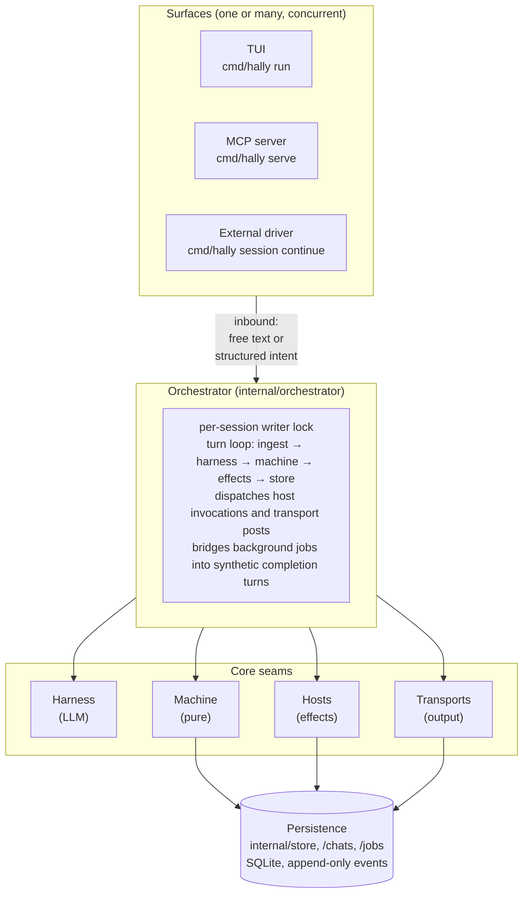
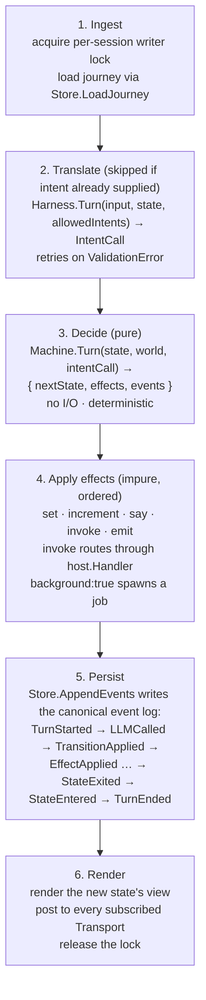

# Architecture

Hally is a deterministic conversation engine. A user (or an external
orchestrator) drives a finite-state machine with free text; an LLM is used
only to translate that text into one of a finite alphabet of intents. The
machine itself is pure — no side effects live inside it. Side effects flow
through a registry of named **host** handlers, and outbound user-facing
messages flow through a registry of named **transports**.

This document is the map. For the philosophy and the long-form design,
see [`design.md`](../design.md). For runnable examples, see
[`testdata/apps/`](../testdata/apps).

---

## 1. Layered view



Five interfaces hold the architecture together. They are deliberately the
only seams that vary across deployments:

| Interface | Defined in | Implementations |
|---|---|---|
| `Machine` | `internal/machine` | `machine.machine` (only one — the pure core) |
| `Harness` | `internal/harness` | `claude_cli`, `live`, `replay`, `recording` |
| `Store` | `internal/store` | `sqlite` (production); in-memory test stub |
| `Transport` | `internal/transport` | `tui`, `jira`, `bitbucket` |
| `host.Handler` | `internal/host` | one per built-in (`host.run`, `host.oracle.*`, `host.chat.*`, …) |

---

## 2. Anatomy of one turn

A turn begins with an inbound event — a user keystroke, an MCP `transition`
call, or a `hally session continue` invocation — and ends when the
orchestrator commits the resulting events to the store and renders the
next view.



Every step that matters is also a trace event — see
[observability](#7-observability) below.

---

## 3. Package map

Rough size, by responsibility. Read top-to-bottom; downstream packages
depend on upstream ones, never the reverse.

### Pure core (no I/O)

| Package | Purpose |
|---|---|
| `internal/app` | YAML loader, types, schema validation. The single source of truth for `app.yaml`. |
| `internal/intent` | `IntentCall`, `ValidationError`, error-code enum (used by harness, machine, MCP). |
| `internal/world` | Typed world snapshot — immutable map passed to guards, templates, and effects. |
| `internal/expr` | Wrapped `expr-lang/expr` evaluator with an AST whitelist. Templates use `{{ … }}`; guards use bare expressions. |
| `internal/machine` | The state machine. `Machine.Turn` is pure: state + world + intent → next state + effects + events. Used by the orchestrator, the MCP server, and the replay path. |
| `internal/proposal` | Draft → review → execute lifecycle helpers. |
| `internal/history` | Bounded room-history stack used by `back` intents. |
| `internal/workspace` | Typed workspace context (repos, issue, PR list) loaded by `host.workspace_manager.get`. |

### Coordination

| Package | Purpose |
|---|---|
| `internal/orchestrator` | The only writer to `Store`. Drives the turn loop, dispatches effects, manages background-job listeners, hot-reloads on `app.yaml` change, handles teleport / off-path / clarification flows. |
| `internal/host` | Registry of named side-effect handlers. Built-ins under the same package: `host.run`, `host.oracle.{ask,talk,ask_with_mcp}`, `host.transport.post`, `host.chat.*`, `host.jobs.answer_clarification`, `host.workspace_manager.get`. |
| `internal/harness` | LLM abstraction. Implementations: `claude_cli` (default — shells out to Claude Code), `live` (Anthropic SDK), `replay` (oracle YAML), `recording` (wraps any harness, captures to JSONL). |
| `internal/transport` | Output-only adapters. `Transport.Post(ctx, key, msg)` delivers a message to a TUI transcript, a Jira ticket, or a Bitbucket PR thread. |
| `internal/clock` | Injectable time source. Tests use `clock.Fake` to advance virtual time; production uses `clock.Real`. |
| `internal/jobs` | Background job scheduler + persistence + clarification flow. Every long-running host handler can run as a job. |
| `internal/inbox` | In-app notifications surfaced to the TUI; teleport metadata for clarifications. |
| `internal/chathost` | Adapter that bridges `internal/chats.Store` into the `host.ChatStore` interface (avoids an import cycle). |

### Persistence

| Package | Purpose |
|---|---|
| `internal/store` | SQLite-backed event log + session metadata + external-key index. The append-only `events` table is the canonical record of every turn. |
| `internal/chats` | Persistent multi-turn chat threads (the back-end behind `host.chat.*` and the chat-aware mode of `host.oracle.{talk,ask_with_mcp}`). One `claude --resume` session per chat row. |
| `internal/ulid` | 26-char monotonically-increasing IDs used for sessions, jobs, chats, messages. |

### Surfaces

| Package | Purpose |
|---|---|
| `internal/tui` | Bubble Tea TUI — transcript pane, action menu, clarify dialog, inbox panel, hot-reload edit mode. |
| `internal/mcp` | MCP server (`hally serve`). Exposes a single `transition` tool over stdio; per-intent JSON Schema is generated from the app definition. |
| `internal/viz` | Graphviz DOT and Mermaid `stateDiagram-v2` emitters. |
| `internal/trace` | Structured slog-based event tracing. JSONL plus a colour pretty-printer. |

### Authoring & testing

| Package | Purpose |
|---|---|
| `internal/authoring` | Edit-mode flow: shadow-copy the app dir, run `claude -p` with full Read/Edit/Write access, diff and apply changes. |
| `internal/testrunner` | Mode 1 (intent pass-rate) and Mode 2 (deterministic flow) test runners. Includes the static / replay harnesses. |
| `pkg/hallytest` | Public testing helpers for app authors (still a thin wrapper over `internal/testrunner`). |

### CLI

| Package | Purpose |
|---|---|
| `cmd/hally` | Cobra root + every subcommand (`run`, `serve`, `viz`, `trace`, `replay`, `test`, `record`, `session`, `chat`, `inspect`, `turn`, `render`, `mcp-validator`, `docs`, `version`). |
| `cmd/devstory_loader` | One-off utility to seed a sample `dev-story` session. |

---

## 4. Determinism boundary

Determinism is a hard contract for the **machine** and a soft contract for
the **orchestrator**.

- **Pure (always deterministic).** `internal/machine`, `internal/expr`,
  `internal/world`, `internal/app`, `internal/proposal`. Same inputs →
  identical outputs, byte-for-byte. The `replay` harness exists to make
  the LLM step deterministic too: an oracle YAML maps `(state, input)` →
  `(intent, slots)` and the harness looks up rather than calls.

- **Effectful but reproducible.** `internal/orchestrator`,
  `internal/store`, `internal/jobs`. Time and randomness are injected
  (`clock.Clock`, `ulid.New`); test code substitutes deterministic
  versions. The event log is the source of truth — replaying it on a
  fresh store produces the same world snapshot.

- **Not deterministic.** The `live` and `claude_cli` harnesses; real
  network calls inside host handlers (`host.run`, `host.oracle.*`,
  `host.transport.post`, `host.workspace_manager.get`).

The orchestrator quarantines non-determinism into the harness call and
the host invocations. Everything downstream of those — guard evaluation,
effect application, view rendering — is replayable from the recorded
result of those calls.

---

## 5. Persistence model

Three stores share one SQLite file (default
`$XDG_DATA_HOME/hally/sessions.db`):

```
sessions    one row per session         (id, app_id, state_path, world_json,
                                         status, transport, thread, …)
events      append-only event log       (session_id, seq, ts, kind, payload_json)
jobs        background-job lifecycle    (id, session_id, status, payload_json,
                                         result_json, clarification_json, …)
chats       persistent chat threads     (id, app_id, room, scope_key, status,
                                         claude_session_id, lock_owner, …)
messages    chat transcript rows        (chat_id, seq, role, content, ts)
external_keys (transport, thread) → session_id  for singleton lookup
```

Key invariants:

- The orchestrator is the **only** writer to `events` and `sessions`.
- Each session has a writer lock — `cmd/hally session continue` returns
  EX_TEMPFAIL (75) if the lock is held, so external orchestrators can
  back off.
- Chats have their own per-row lock so a TUI session and an external
  driver can both hold the session lock without racing on a chat.
- Replaying `events` through `Store.LoadJourney` rebuilds the world
  snapshot byte-for-byte. The world column on `sessions` is a cache.

The full event-kind enum is defined in
[`internal/store/event.go`](../internal/store/event.go); a representative
slice: `TurnStarted`, `LLMCalled`, `LLMToolCall`, `ValidationFailed`,
`TransitionApplied`, `EffectApplied`, `HostInvoked`, `HostReturned`,
`StateExited`, `StateEntered`, `JobSubmitted`, `JobCompleted`,
`GuardRejected`, `OffPathEntered`, `OffPathExited`, `TurnEnded`.

---

## 6. Conversation surfaces

A "conversation" is a session driven from one or more **surfaces**.

- **TUI** is `cmd/hally run` — Bubble Tea, single-process, the local
  developer's view. The TUI transport is the local mirror of the
  transcript.
- **MCP** is `cmd/hally serve` — Claude Desktop and Claude Code reach
  into hally via the `transition` tool to drive a session.
- **External orchestrators** (`loop.py`, future webhook receivers) drive
  sessions over the CLI via `hally session continue`. Each external
  invocation is one inbound event; the orchestrator runs one turn and
  exits.

`Transport.Post` is the dual: any room can output to **all** subscribed
transports for a session — Jira ticket comments, Bitbucket PR comments,
the local TUI. Output transports are output-only in v1; inbound is the
external driver's responsibility.

The session table's `(transport, thread)` index makes singleton lookup
cheap: `jira:PLTFRM-12345` resolves to exactly one session, and the
writer lock guarantees serial execution against it. This is what makes
hally usable as the conversation engine behind a comment-thread bot.

For details, see [`docs/transports.md`](transports.md).

---

## 7. Observability

Three lenses, all shipping with the binary:

- **Trace** — `--trace file.jsonl --trace-pretty -` writes one JSON
  object per event (`turn.*`, `harness.*`, `machine.*`, `store.*`,
  `expr.*`, `host.*`, `jobs.*`). `hally trace` pretty-prints it after
  the fact.
- **Inspect** — `hally inspect --session-id <id>` prints a read-only JSON
  snapshot of a stored session: current state, world, allowed intents,
  last view, last N turns. Safe to run alongside an active session.
- **Visualise** — `hally viz` emits Graphviz DOT (default) or Mermaid
  (`--mermaid`); the Mermaid output supports per-room split.

The trace is the canonical post-mortem surface. Every interesting event
in §5 is logged with the same `session_id` and `turn` keys, so grepping
by either reconstructs the full picture.

---

## 8. Where to go from here

- **Authoring an app** → [`authoring.md`](authoring.md) and
  `hally docs app-schema`.
- **Building or contributing** → [`developer-guide.md`](developer-guide.md).
- **Understanding the state machine** → [`state-machine.md`](state-machine.md).
- **Testing** → [`testing.md`](testing.md).
- **Background jobs** → [`background-jobs/`](background-jobs/README.md).
- **Hosts and transports** → [`hosts.md`](hosts.md), [`transports.md`](transports.md).
- **Long-form design rationale** → [`../design.md`](../design.md).
