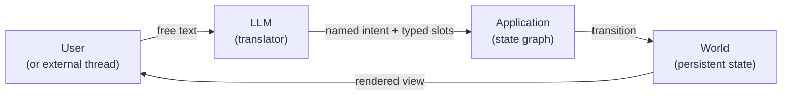
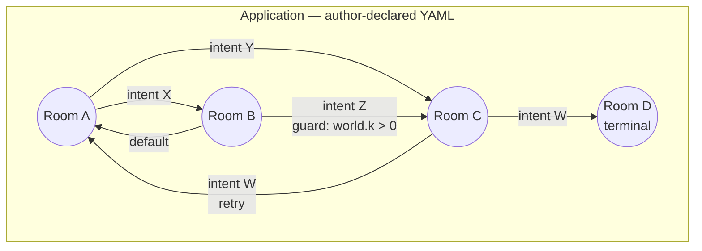
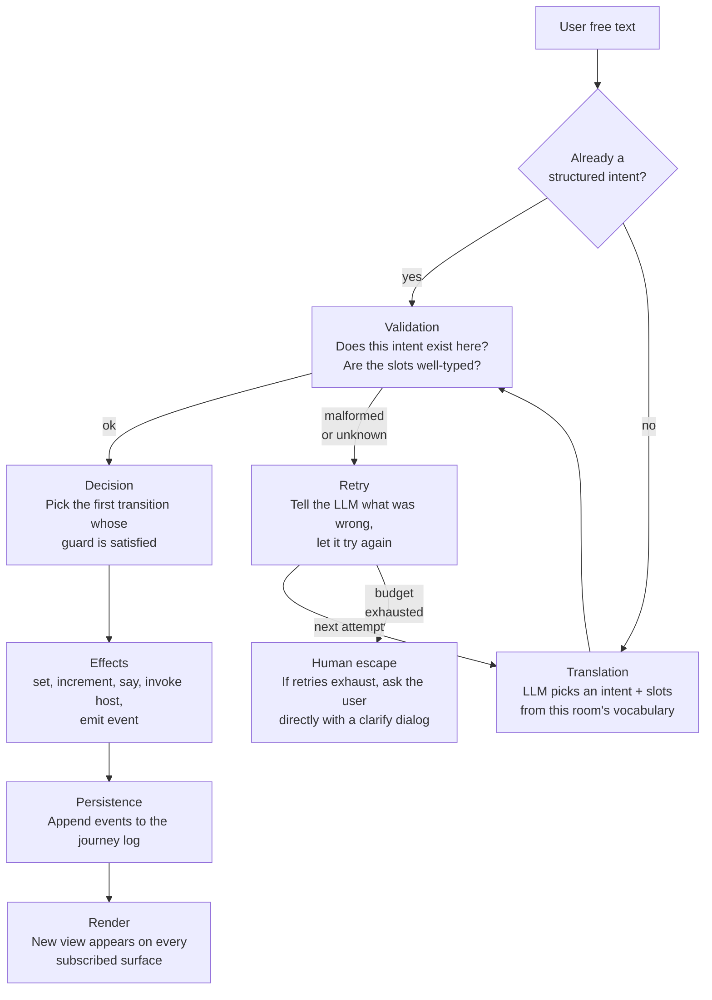
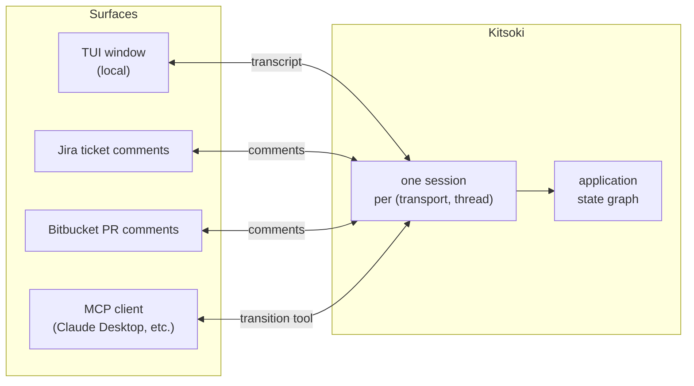
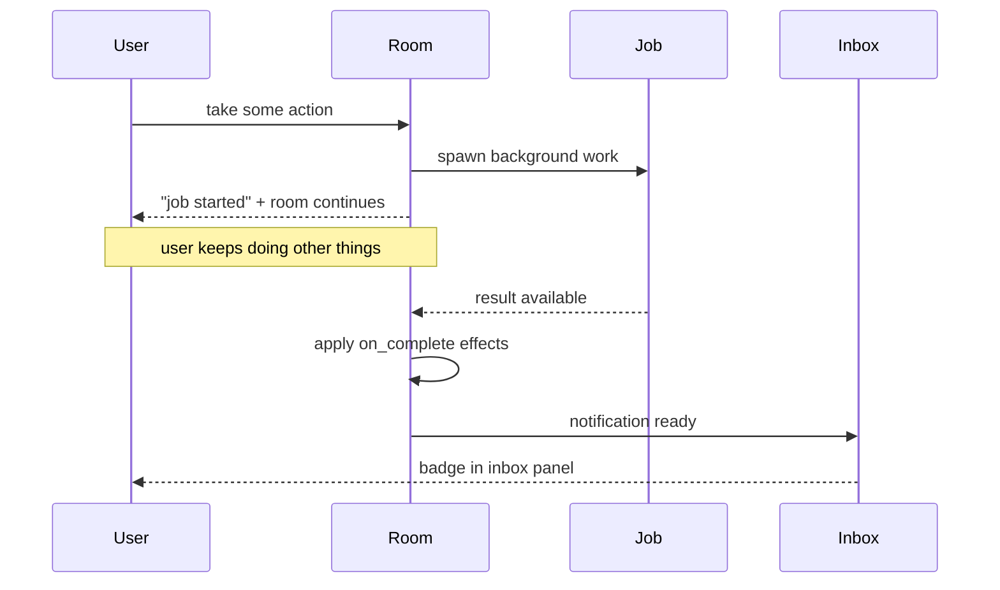
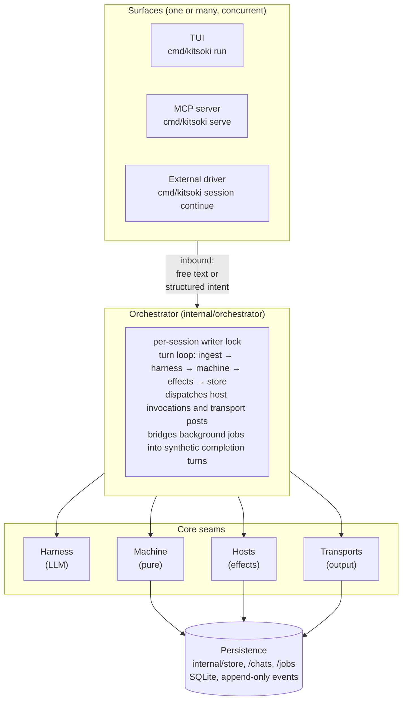

# Architecture

This document describes kitsoki as a **system** — what it is, what it
believes, and how the pieces of the model fit together. It is meant
for someone trying to understand kitsoki, not for someone working in
the code; the implementation map at the end points to where each idea
lives.

For the long-form design rationale, see [`design.md`](../design.md).
For runnable apps, see [`testdata/apps/`](../testdata/apps). For the
state-machine vocabulary in detail, see
[`state-machine.md`](state-machine.md).

---

## 1. The shape of the system

Kitsoki sits between two surfaces of common pain.

**Traditional CLIs** demand exact syntax. `kubectl patch deployment foo
-p '{"spec":{"replicas":3}}' --type=merge` is unforgiving — one missing
flag, one mistyped JSON path, and you get nothing back except a
recovery hint. The compensating virtue is that the CLI does exactly
what you asked, every time.

**Chat agents** accept anything. You can say "scale the frontend to
three replicas, please" and a sufficiently smart agent figures it out.
The compensating cost is that it might also figure out something
*adjacent* — restart pods, edit your manifest, page the on-call —
because no surface boundary tells it not to.

Kitsoki is neither. Kitsoki is a conversation **engine** that splits the
difference: free text in, but a declared, finite alphabet of
**intents** decides what can happen next.



The arrow that matters most is the second one. The LLM never edits the
world directly; it only proposes an intent. If the intent isn't valid
in the current room, or its arguments don't fit the slot schema, the
machine refuses and the LLM gets a structured error to retry against.
The user's free text was a question, not a command — the application
decides what counts as a meaningful answer.

Three things follow:

- **The LLM cannot invent actions.** Every action is declared by the
  application's author. If a user says "delete everything", the LLM
  can only translate that into one of the verbs the current room
  exposes. If no such verb exists, the user gets told "no".
- **The state machine is pure.** Given the same world and the same
  intent, kitsoki always picks the same transition. Replay is mechanical.
- **The author is in charge.** What can happen, in what room, with
  what guards, with what effects — all of it is in YAML, all of it is
  reviewable, none of it is a surprise.

---

## 2. The domain model

Six concepts cover almost everything kitsoki does.

| Concept | What it is |
|---|---|
| **Conversation** | One ongoing exchange between a user and an application, threaded over a *surface*. |
| **Application** | A directed cyclic graph of *rooms* with a vocabulary of intents and a typed *world*. Author-declared in YAML. |
| **Room** | A node in the graph. Has its own intent vocabulary (which actions are valid here), an optional view template (what the user sees), and an optional set of side effects fired on entry. |
| **Intent** | A named action a user can take. May carry typed arguments (slots). The atom of free-text translation. |
| **World** | The application's persistent memory — a typed key/value bag. Rooms read it through guards and view templates; transitions write it through effects. |
| **Transition** | An edge between rooms. Takes an intent, may evaluate a guard, applies an ordered list of effects, lands in a target room. |

A few more concepts come up at the periphery:

| Concept | What it is |
|---|---|
| **Slot** | A typed parameter on an intent — `direction: north`, `branch: main`. Validated before any guard runs. |
| **Effect** | A small declarative mutation: `set` a world value, `increment` a counter, `say` a line of narration, `invoke` a host, `emit` an event to parallel regions. |
| **Host** | A named handler the application can invoke as an effect — `host.run` for a shell command, `host.oracle.ask` for a one-shot Claude call, `host.transport.post` to deliver a message to an external thread. The application's allow-list of hosts is part of the YAML. |
| **Phase** | A repeated room. Phase templates compress pipelines like "execute, post, await reply, retry on failure" into one declaration plus per-phase parameters. |
| **Off-path** | A global escape hatch: the user can ask a free-form question (often "help") that suspends the current room, runs a sub-conversation, and rehydrates the original room on exit. |

These compose into the application's graph:



Cycles are not just allowed — they are the *typical shape*. A "main
menu" room loops back to itself between sub-conversations; a proposal
lifecycle bounces between draft and review until accepted; a phase
pipeline retries on failure until a budget runs out.

---

## 3. The journey of one turn

A **turn** is one round-trip: the user said something (or an external
thread did), and the application responds. From the user's
perspective, this looks like typing and seeing a reply. The model
underneath is:



What the user sees is the path `A → … → H`. What the system *does*
includes the retry off-ramp and the human escape; both happen quietly
unless the LLM keeps producing invalid output. The human escape is
the deliberate fall-through: "I asked the LLM, it tried, it failed,
now it's your turn — pick from this menu."

The system goes out of its way to keep the user out of that branch.
It also goes out of its way to never let the LLM **cause** something
the author didn't declare.

---

## 4. The LLM's role (and its boundaries)

The LLM does exactly one thing: **translate free text into a named
intent with typed slots, picked from the current room's vocabulary.**
It never:

- decides what to do — the state machine does that;
- writes the world — only effects do that;
- invents new actions — the room declares them all;
- holds context across turns of its own accord — the application's
  world is the context.

There are four ways the translation can run, with different
trade-offs:

| Mode | Determinism | Cost | When |
|---|---|---|---|
| `claude` | No (real LLM) | Free with Claude Code login | Default for local play. |
| `live` | No (real LLM) | Paid (Anthropic API) | CI without Claude Code, or to pin a specific model. |
| `replay` | Yes | Zero | Flow tests, demos, byte-reproducible reruns. Reads a hand-written or captured **recording** that maps `(state, input)` to `(intent, slots)`. |
| `recording` | Wraps another | Wraps another | Capture an LLM session to a recording file for later replay. |

The fact that one of these modes is fully deterministic is what makes
kitsoki testable. The same flow YAML that drives the `replay` harness
in CI also drives the `record` command that produces a reproducible
demo GIF. There is no "recording drift" because there is no second
implementation to drift from.

---

## 5. Conversations across surfaces

A conversation has to live somewhere — a TUI window, a Jira ticket
comment thread, a Bitbucket PR, a Slack thread. Kitsoki calls each of
these a **surface** (or, viewed from inside, a **transport**), and
the same application works across all of them.



The user-visible consequence: **the same conversation can move
between surfaces without losing state.** A bug-fix room driven from a
Jira ticket can be inspected from the local TUI on the developer's
laptop; the same session ID resolves both ways. An external
orchestrator (today `loop.py`) drives the session by feeding inbound
comments to kitsoki one at a time; output flows to whichever transports
the application has wired up.

This is what makes kitsoki usable as the **conversation engine behind a
ticket-thread bot**. The state machine is identical; only the surface
moves.

---

## 6. Long-running work and notifications

Many useful things take longer than a turn — a build, a deploy, a
deep LLM analysis. If the conversation blocked while they ran, the
user would either wait or give up.

Kitsoki handles this with **background jobs**. An effect marked
`background: true` spawns a goroutine; the user gets back to the
conversation immediately. When the job finishes, three things happen:

1. The originating room's `on_complete:` effects fire as a synthetic
   turn (so all the usual `set`/`say`/`invoke` work the same way).
2. The world is updated with the job's result.
3. An **inbox notification** appears on the user's surface.



Some background work needs to **pause and ask** mid-flight — "should
I commit to `main` or `develop`?" The handler calls a clarification
helper, which surfaces an `action_required` notification. The user
answers; the handler resumes. The user never sees the goroutine, the
poll loop, or the database row that mediated the pause.

The pattern is intentional: the human and the system trade attention.
The user can keep working while a long task runs; the system can ask
for help when it needs to without crashing the conversation.

---

## 7. Persistence, replay, and auditability

Every turn produces an ordered list of **events**: the harness was
called, the validation passed, this transition fired, that effect
applied, the new room rendered. The events are written to a single
per-session log. The world snapshot is a *cache* derived from the
log — replaying the log on a fresh database produces the same world.

The user-facing consequences:

- **Sessions survive.** Close the TUI, reopen it the next day; the
  conversation picks up where it left off. The session lives in
  `$XDG_DATA_HOME/kitsoki/sessions.db`.
- **The transcript is real.** What the user saw on screen is
  reconstructable from the event log, byte-for-byte.
- **Bugs are diagnosable.** When something goes wrong, an operator
  can read the log, see exactly which intent fired, which guard
  matched, which host returned what — without re-running the LLM.
- **Demos are testable.** The same flow YAML drives both the
  reproducible recording and the deterministic CI test.

This is what "deterministic" actually buys. The LLM is allowed to be
non-deterministic; everything *downstream* of the LLM is recorded
exactly enough that the next person who needs to understand what
happened doesn't have to be online.

---

## 8. Trust and authoring

A kitsoki application is one YAML file (or a tree of them via
`include:`). That YAML declares:

- the **rooms** and their connections,
- the **intent vocabulary**, both globally and per-room,
- the **world schema** with typed defaults,
- the **host allow-list** — which side effects this app may invoke,
- the **off-path trigger** — when free-form chat is acceptable,
- and any **phase templates** for repeated pipelines.

The YAML is the only source of truth. There are no hidden defaults
that the runtime might inject; loader-side validation is strict
(unknown fields are errors). When a host is invoked that wasn't in
the allow-list, the app fails to load.

The author can therefore reason about the application by reading a
single tree of YAML files. Reviewers can do the same. When a
collaborator (LLM or human) proposes a change, it's a diff against
that tree, reviewable like any code change.

Authors who want to evolve an app **while playing it** can use the
TUI's edit mode: a free-text proposal kicks off a Claude session
inside a shadow copy of the app directory; the resulting diff is
shown for review; on accept, the app reloads in place. The entire
cycle is in-process — no checkout, no restart.

---

## 9. Determinism boundary (where surprise is allowed)

Kitsoki is deliberate about where non-determinism can live.

| Layer | Deterministic? | Notes |
|---|---|---|
| Application state machine | Yes, always | Same world + same intent → same transition. No clocks, no random, no I/O inside the machine. |
| Expression evaluator (guards, templates) | Yes | Pure expressions over `world` and `slots`; no user functions. |
| YAML loader | Yes | Strict; unknown fields fail load. |
| Effects (`set`, `increment`, `say`, `emit`) | Yes | Pure mutations over the world snapshot. |
| Effects that invoke a host | No, in general | Hosts touch the network/filesystem; their results are recorded so replays are reproducible. |
| LLM translation | Configurable | `claude`/`live` are non-deterministic; `replay` is fully deterministic against a recording. |
| Time | Injected | Production uses real time; tests inject a virtual clock. |
| IDs | Injected | Production uses ULIDs derived from real time; tests inject a deterministic generator. |

The architecture confines non-determinism to two places: the LLM
call, and host invocations. Both record their inputs and outputs to
the event log. Everything downstream is replayable from those
recordings — which is what makes the test pyramid possible:

- **Mode 2 flow tests** drive the machine through a recording.
  Zero LLM cost, deterministic, run on every PR.
- **Mode 1 intent tests** measure how reliably real LLMs translate a
  given input. Run on demand.

---

## 10. Putting it together

A useful summary frame: kitsoki is what you get when you take three
things — a state-graph application engine, a structured-output LLM
adapter, and a multi-surface conversation runtime — and decide that
the *application author*, not the LLM, is in charge.

Concretely:

- **Authors** describe a finite, reviewable graph of rooms and intents.
- **Users** drive the application with free text, on whichever surface
  they're already in.
- **The LLM** translates that free text into an intent the author
  declared, retrying when its output doesn't fit.
- **The orchestrator** runs the resulting transitions deterministically,
  records every event, and posts the new view to every subscribed
  surface.
- **External orchestrators** (a Jira poller, a webhook receiver) feed
  inbound events through the same primitives, so the same application
  works whether driven by a TUI or a ticket comment.

The result is a system in which the LLM contributes its strengths
(natural-language understanding) and is denied its weaknesses
(deciding what to do, writing state without permission). The
application author retains agency; the user gets a forgiving surface;
the operator gets a replayable log.

---

## 11. Implementation map

The conceptual model above is realised by a small set of Go packages
under `internal/`. This section is for someone working on kitsoki
itself; if you're an application author or a user, you can stop
here and head to [`authoring.md`](authoring.md) or
[`developer-guide.md`](developer-guide.md).

### 11.1 Layered view



### 11.2 Five interfaces

| Interface | Defined in | Implementations |
|---|---|---|
| `Machine` | `internal/machine` | `machine.machine` (only one — the pure core) |
| `Harness` | `internal/harness` | `claude_cli`, `live`, `replay`, `recording` |
| `Store` | `internal/store` | `sqlite` (production); in-memory test stub |
| `Transport` | `internal/transport` | `tui`, `jira` |
| `host.Handler` | `internal/host` | one per built-in (`host.run`, `host.oracle.*`, `host.chat.*`, …) |

### 11.3 Package map

Pure core, no I/O:

| Package | Purpose |
|---|---|
| `internal/app` | YAML loader, types, schema validation. Source of truth for `app.yaml`. |
| `internal/intent` | `IntentCall`, `ValidationError`, error-code enum. |
| `internal/world` | Typed world snapshot — immutable map passed to guards, templates, effects. |
| `internal/expr` | `expr-lang/expr` evaluator with an AST whitelist. |
| `internal/machine` | The pure state machine. `Machine.Turn` is `(state, world, intent) → (next state, effects, events)`. |
| `internal/proposal` | Draft → review → execute lifecycle helpers. |
| `internal/history` | Bounded room-history stack used by `back` intents. |
| `internal/workspace` | Typed workspace context loaded by `host.workspace_manager.get`. |

Coordination:

| Package | Purpose |
|---|---|
| `internal/orchestrator` | The only writer to `Store`. Drives the turn loop, dispatches effects, manages background-job listeners, hot-reloads on `app.yaml` change. |
| `internal/host` | Registry of named side-effect handlers + built-ins. |
| `internal/harness` | LLM abstraction. |
| `internal/transport` | Output-only adapters. |
| `internal/clock` | Injectable time source (real / fake). |
| `internal/jobs` | Background-job scheduler + persistence + clarification flow. |
| `internal/inbox` | In-app notifications and teleport metadata. |
| `internal/chathost` | Adapter bridging `internal/chats.Store` into the host's `ChatStore` interface. |

Persistence:

| Package | Purpose |
|---|---|
| `internal/store` | SQLite-backed event log + session metadata + external-key index. |
| `internal/chats` | Persistent multi-turn chat threads. |
| `internal/ulid` | 26-char monotonically-increasing IDs for sessions, jobs, chats, messages. |

Surfaces:

| Package | Purpose |
|---|---|
| `internal/tui` | Bubble Tea TUI. |
| `internal/mcp` | MCP server (`kitsoki serve`). |
| `internal/viz` | Graphviz DOT and Mermaid emitters. |
| `internal/trace` | Structured slog-based event tracing. |

Authoring & testing:

| Package | Purpose |
|---|---|
| `internal/authoring` | Edit-mode flow — shadow-copy app, run `claude -p`, diff, apply. |
| `internal/testrunner` | Mode 1 (intent pass-rate) and Mode 2 (deterministic flow) test runners. |
| `pkg/kitsokitest` | Public testing helpers for app authors. |

CLI:

| Package | Purpose |
|---|---|
| `cmd/kitsoki` | Cobra root + every subcommand. |
| `cmd/devstory_loader` | One-off utility to seed a sample `dev-story` session. |

### 11.4 Persistence schema

Three concerns share one SQLite file (default
`$XDG_DATA_HOME/kitsoki/sessions.db`):

```
sessions       one row per session         (id, app_id, state_path, world_json, …)
events         append-only event log       (session_id, seq, ts, kind, payload_json)
jobs           background-job lifecycle    (id, session_id, status, payload_json, …)
chats          persistent chat threads     (id, app_id, room, scope_key, status, …)
messages       chat transcript rows        (chat_id, seq, role, content, ts)
external_keys  (transport, thread) → session_id
```

The orchestrator is the only writer to `events` and `sessions`; chats
and jobs each have their own per-row lock. The full event-kind enum
is defined in [`internal/store/event.go`](../internal/store/event.go).

### 11.5 Observability

- **Trace** — `--trace file.jsonl --trace-pretty -` writes one JSON
  object per event (`turn.*`, `harness.*`, `machine.*`, `store.*`,
  `host.*`, `jobs.*`).
- **Inspect** — `kitsoki inspect --session-id <id>` prints a read-only
  JSON snapshot of a stored session.
- **Visualise** — `kitsoki viz` emits Graphviz DOT or Mermaid.

The `turn.done` events carry `view_rendered`, so a `--trace` JSONL
file is a complete after-the-fact transcript.

---

## 12. Where to go next

- **Authoring an app** → [`authoring.md`](authoring.md) and
  `kitsoki docs app-schema`.
- **State machine vocabulary** → [`state-machine.md`](state-machine.md).
- **Building or contributing** → [`developer-guide.md`](developer-guide.md).
- **Testing** → [`testing.md`](testing.md).
- **Background jobs** → [`background-jobs/`](background-jobs/README.md).
- **Hosts and transports** → [`hosts.md`](hosts.md), [`transports.md`](transports.md).
- **Long-form design rationale** → [`../design.md`](../design.md).
