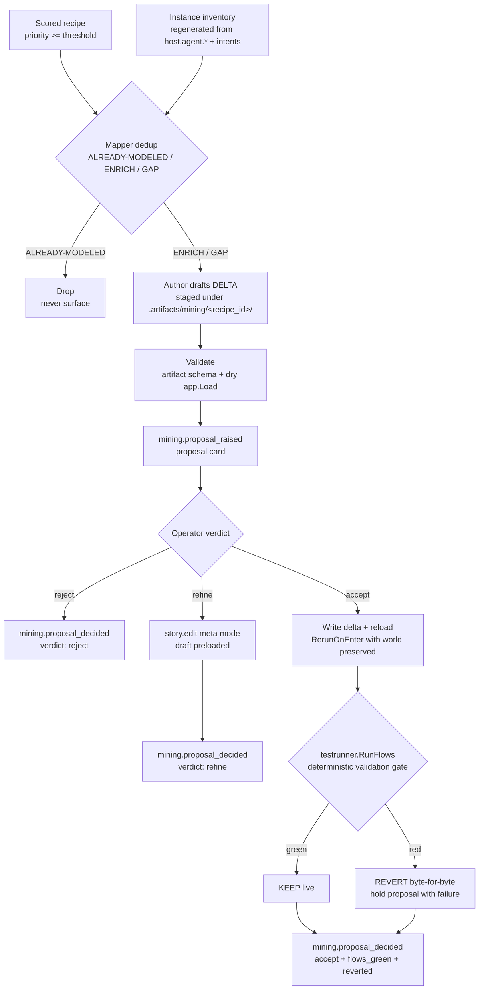
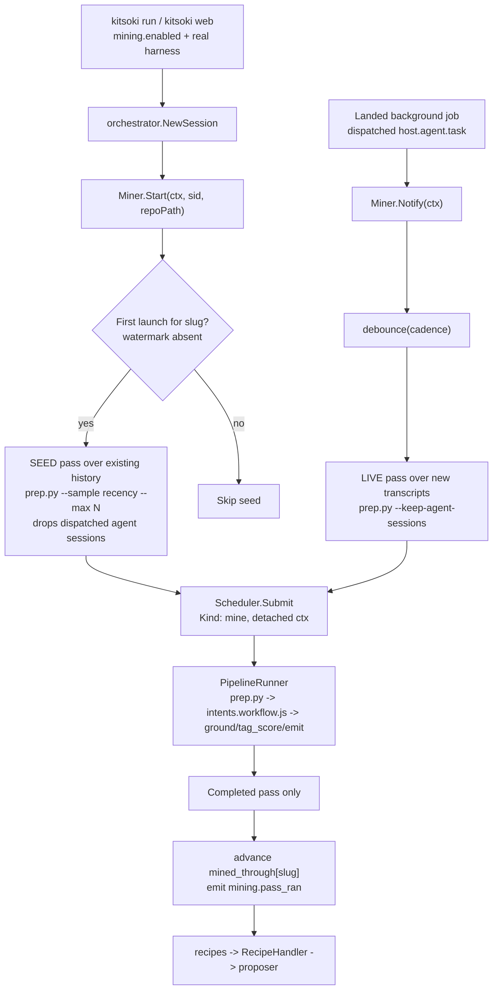

# Ambient mining: the propose → apply loop

Ambient mining turns a running instance's own transcripts into scored recipes,
deduped against the instance's live inventory, drafted into concrete YAML deltas,
surfaced as non-blocking proposals, and — on an explicit human accept — applied
along the meta-mode edit-and-reload path **only when the no-LLM flow suite stays
green**. Every surface-and-verdict is recorded in the trace so the moat
([`concept.md` §4](concept.md)) extends to *which mined recipe captured which
structure, and whether it stuck*.

This document is the authoritative description of the `internal/mining` package:
the **recipe miner** (the always-on service that turns transcripts into scored
recipes) and the **propose → apply loop** it feeds. It does **not** cover the
proposal surface that renders the result or the rung-ladder targets it writes to
— those have their own homes (see [Scope](#scope)).

## The loop

The loop is **deterministic in everything except two recorded interpretive
acts** — the author's YAML draft (`mining.proposal_raised`) and the operator's
accept / refine / reject verdict (`mining.proposal_decided`). The dedup, the
threshold, the rung choice, the apply, the reload, and the flow gate are all
engine-side and replayable.

## The proposer (`internal/mining/proposer.go`)

`Proposer.Propose(recipe, inventory, sink)` runs, in order:

1. **Threshold gate** — recipes below `PriorityThreshold` short-circuit before
   any agent pass (the mapper is never called).
2. **Dedup** — the injected `Mapper` classifies the recipe against the
   **regenerated** inventory (`ALREADY-MODELED` is dropped; `ENRICH` / `GAP`
   proceed). The dedup invariant is the mapper's "regenerate the inventory,
   never from a cache" rule made load-bearing: the inventory is grepped from the
   live tree (`host.agent.*` call sites + the `intents:` block) every pass.
3. **Rung choice** — `RungFor(kind, needsRoom)` picks the lightest rung the kind
   fits (see [Rung ladder](#rung-ladder)).
4. **Draft** — the injected `Drafter` (the dev-story-mining `author` persona in
   production, cassette-backed for any real LLM pass) returns the delta files +
   an `author_artifact`.
5. **Validate, fail-fast** — the `author_artifact` is checked against
   [`author_artifact.json`](../../stories/dev-story-mining/schemas/author_artifact.json)
   and the staged tree (live overlaid with the draft) is dry-`app.Load`ed. A
   structurally-broken draft never reaches the operator.
6. **Stage + record** — the delta is written under `.artifacts/mining/<recipe_id>/`
   (never the live tree) and `mining.proposal_raised` is appended.

The two interpretive seams are **dependency-injected** (`Mapper`, `Drafter`), so
the proposer is fully testable with no LLM. The single genuine LLM step — *is the
mined recipe a good capture and is the drafted YAML correct* — is exercised by
hand in a dogfood run, never in CI.

## The apply gate (`internal/mining/apply.go`)

`Applier.Accept(prop, sink)` is the keep-or-revert gate. It:

1. acquires the per-chat reload lock (the same mutual-exclusion the TUI
   edit-mode uses — [`reload.go`](../../internal/orchestrator/reload.go) is not
   concurrency-safe with a turn in flight);
2. **snapshots** the pre-edit bytes of every file the delta touches;
3. **writes** the delta onto the live tree;
4. drives the meta-mode reload seam — `Reloader.Reload` + `RerunOnEnter`, **world
   preserved** (the orchestrator satisfies `Reloader` via
   [`internal/mining/wire`](../../internal/mining/wire));
5. runs the **gate** — `FlowGate.RunFlows` (wrapping
   [`testrunner.RunFlows`](../../internal/testrunner/flows.go), the same gate
   `kitsoki test flows` runs);
6. **KEEPs** on green; on red (a failed fixture, a reload failure, or a gate that
   could not run) **restores the snapshot byte-for-byte, re-Reloads to the
   original, and HOLDs** the proposal with the failure attached.

It records `mining.proposal_decided{verdict:accept, flows_green, reverted}`
either way. **Invariant:** a regressing edit never survives the turn —
keep-or-revert is total, with no half-applied state. A clean revert is *not* an
error return; only a revert that itself fails (which would leave the tree
inconsistent) is.

`Refine` records the verdict and is paired by the caller with the builtin
`story.edit` meta mode preloaded with the draft; `Reject` records the negative
that suppresses re-surfacing.

### Why the apply rides the existing reload path

A rung-1 delta edits `.kitsoki.yaml` (which the loader re-synthesizes into the
root AppDef); a rung-2 delta edits a file under `stories/<project>/`. **Both**
produce a changed file the meta-mode snapshot detects, so both go through the
*same* `Reload` + `RerunOnEnter` path — the accept seam adds a non-interactive
*caller* of that path, not a new mechanism. The reload emits `story.changed` for
the edit itself, so the trace carries both the *what* (the file diff) and the
*why* (the proposal record). The world is preserved across the swap.

## Rung ladder

The author expresses each delta at the **lowest rung that fits**. This package
chooses *which* rung a `kind` lands at; the rung mechanics (the `.kitsoki.yaml`
`root:` + `overrides:` synthesis and `kitsoki materialize`) are the implicit
project-root work.

| `kind`             | Delta                                                              | Lightest rung |
|--------------------|-------------------------------------------------------------------|---------------|
| `binding`          | bind an `iface.*` default to a concrete provider                  | 1 — `.kitsoki.yaml` `overrides.bindings` |
| `world`            | set a dev-story knob for this project (`judge_mode`, `base_branch`)| 1 — `overrides.world` |
| `intent`           | a deterministically-routed action or slot-template synonym         | 1 if a synonym; **2** if a new `intents:` entry needs a room |
| `stub-wire`        | give a route-back-to-main stub room real content                   | **2** — materialize the project tree |
| `gate`             | a `decider` checkpoint at a recurring judgment fork                | **2** — needs a room to host the gate |
| `dev-story-enrich` | the pattern is generic → the delta lands in the *base* story        | suggestion + opt-in only, never automatic |

## The recipe miner (`internal/mining/miner.go`)

The propose → apply loop above *consumes* scored recipes; the **ambient session
miner** is the always-on service that produces them. It is pure plumbing around
the existing stateless pipeline (`tools/session-mining/`) and the background-job
runner (`internal/jobs`) — it adds orchestration (a resolver, a watermark, a job
wrapper, a config block), never a new analyzer.

Three deterministic, no-LLM pieces, each a DI seam:

- **`TranscriptResolver` (`resolver.go`)** — repo path → `~/.claude/projects/<slug>`,
  a Go port of `tools/session-mining/recap.sh:49-51` (`Slug` replaces every `/`
  and `.` with `-`). `Resolve` is presence-aware (a repo with no history resolves
  to an empty set — a benign no-op, not an error) and appends extra
  `mining.transcript_dirs`. `HomeDir` is injectable so tests resolve against a
  fixture dir.
- **The watermark / dedup ledger (`WatermarkStore`, `watermark.go`)** —
  `mining.mined_through[slug]` = the newest transcript mtime mined for that slug.
  A pass advances it **only on completion** (`onPassComplete`), to the newest
  mtime in its sample; a crashed/cancelled pass leaves it untouched so the next
  pass re-picks the same transcripts. **First-launch detection is exactly "is the
  slug's watermark absent"** — the seed fires iff `Get(slug)` reports unmined.
- **The `PipelineRunner` seam (`pipeline.go`)** — wraps the stateless steps.
  `ExecPipelineRunner` shells `prep.py → intents.workflow.js → ground/tag_score/
  emit` and parses `analysis.json` into recipes; the single interpretive step
  (`intents.workflow.js`) is isolated behind `AgentCmd` so a dogfood run swaps
  the real `node` call for a cassette without touching the deterministic tail.
  Tests inject a fake runner — **no test path ever spends LLM**.

**Seed vs live is a `cli`-vs-`sdk` distinction, not just a cadence change.** The
free-form agent's own turns land as Claude Code transcripts stamped
`entrypoint=sdk`, which `prep.py` drops by default as self-cannibalism. The
**live** pass passes `--keep-agent-sessions` (those dispatched `host.agent.task`
turns *are* what work happened); the **seed** keeps the default (the human's
interactive backlog is genuine `entrypoint=cli` work).

**Lifecycle & survival.** One `Miner` per session, started from
`orchestrator.NewSession` via the narrow `orchestrator.SessionMiner` seam (so
`internal/mining` never imports the orchestrator). Each pass is a detached
`jobs.JobSpec{Kind:"mine"}` (`context.WithoutCancel`) so it outlives the turn and
never blocks input. The miner **owns its own job's terminal handling** (it
subscribes to the job it submitted); `handleJobTerminal` early-returns on a
`"mine"` job so the session listener neither commits a synthetic turn nor
re-triggers `Notify` (a feedback loop). `/mine pause` flips `SetEnabled(false)`,
which stops any pending debounce.

**Off until opted in.** No miner is built unless `mining.enabled` is set **and** a
real harness backs the one agent pass (`cfg.Flow == nil`). Every flow/test
fixture leaves `mining:` unset, so the flow gate above never spends LLM — asserted
by `TestMiningGatedOutOfFlowPosture` (`cmd/kitsoki`).

The `mining:` config block (machine-global, beside `harness_profiles:`) is
validated fail-fast in `webconfig.Load`: `cadence` must parse, `first_pass_sample`
/ `priority_threshold` must be non-negative. See the
[`.kitsoki.yaml` config reference](#kitsokiyaml-mining-block).

### `.kitsoki.yaml` `mining:` block

| key | type | meaning |
|---|---|---|
| `enabled` | bool | gate; default off until set **and** first-run consent recorded |
| `cadence` | duration | live-pass debounce window (default `30s`) |
| `first_pass_sample` | int | N recent sessions the history seed mines (default `12`) |
| `priority_threshold` | float | recipes below it never surface (passed to the proposer) |
| `transcript_dirs` | `[]string` | extra dirs beyond the resolved `~/.claude/projects/<slug>` (`/mine scope`) |
| `mined_through` | `map[slug]int64` | the per-slug watermark ledger; never re-mine a session |

## The two events

`mining.proposal_raised` and `mining.proposal_decided` sit beside
`machine.gate_decided` in the trace. Their full payload shape is documented once
in [`docs/tracing/trace-format.md`](../tracing/trace-format.md#mining-proposal-events);
the typed helpers are `store.MiningProposal{Raised,Decided}Payload`. Both fold as
no-ops in `BuildJourney`.

The miner adds a third event, `mining.pass_ran` — one per **completed** pass,
`{trigger: seed|live, slug, sessions, recipes, job_id, paused}`
(`store.MiningPassRanPayload`). It pins which pass surfaced the recipe a later
`mining.proposal_raised` was drafted from (the chain is `transcript →
mining.pass_ran → recipe → mining.proposal_raised → mining.proposal_decided`);
`paused: true` records a pass that would have fired while the miner was disabled.
It too folds as a no-op (additive optional payload, so older cassettes replay
unchanged).

## Scope

This document covers the propose → apply loop only. Adjacent concerns:

- **The recipe miner** — extraction, scoring, watermarks, debounce, the
  background-job dispatch — is documented above in
  [The recipe miner](#the-recipe-miner-internalminingminergo). This loop
  *consumes* recipes; the miner produces them.
- **The proposal surface** — the card, the badge, and the `/mine` controls —
  is the mine-command UX. This loop emits the proposal *record*; the UX renders
  and routes it. On the **TUI** it is the `proposals: N` footer chip + the
  `/mine status|pause|resume|now|scope|queue|accept|dismiss` command
  (`internal/tui/mine_command.go`); on the **web** it is `ProposalsBadge.vue`
  in the session topbar (count pill, orange when a write-mode opt-in is parked)
  backed by `stores/proposals.ts`. Both kinds — mining-structure proposals and
  write-mode opt-ins — share **one inbox**, **one** accept/refine/dismiss
  gesture, and the **same** operator-question card and `answer_question` RPC
  the operator already answers (see [`operator-ask.md`](operator-ask.md) and
  [`../tui/README.md`](../tui/README.md#input-menu-inbox-meta-mode)). The
  surface reads an injectable `MinerService`/`MineState` (the TUI) or a pushed
  proposal queue (the web); this loop's `internal/mining` records feed it.
- **The rung targets** — the `.kitsoki.yaml` synthesis and `kitsoki materialize`
  — are the implicit project-root work. This loop *picks* the rung.

## Status

Phase 1 (on-disk edit + live reload, gated on the flow suite) is implemented:
the **recipe miner** (resolver, watermark, debounced pass runner, `mining.pass_ran`,
the `mining:` config block, the orchestrator lifecycle wiring), the proposer, the
apply gate, the three events, and the no-LLM tests (`internal/mining`,
`internal/mining/wire`, `internal/webconfig`, the `cmd/kitsoki` flow-gate
assertion). v1 is human-only accept — an LLM judge for
`mining.proposal_decided.by` is deferred until the flow gate has proven
trustworthy in dogfooding.

Two seams are deliberately left for the slices that own them:

- **Recipes → proposer hand-off.** The miner's `RecipeHandler` is the seam; the
  proposer's runtime construction (building the dev-story-mining `Mapper`/`Drafter`
  personas + wiring the handler) lands with the proposal-loop slice's `cmd` wiring.
  Until then a completed pass advances the watermark and emits `mining.pass_ran`;
  recipes are dropped at the seam, not lost (the next pass re-emits only if the
  watermark did not advance).
- **The deterministic C→F argv + cassette.** `ExecPipelineRunner` shells `prep.py`
  and parses `analysis.json`; the exact `intents.workflow.js → ground → tag_score →
  emit` argv and the recording for the one agent pass are settled by the
  dogfood-only end-to-end run (real LLM, gated, never in CI), which also settles
  the `cadence` / `first_pass_sample` defaults.

Phase 2 (in-memory mutable `AppDef` + export-to-YAML, avoiding the file
round-trip) is deferred — Phase 1 unblocks the loop without it.
