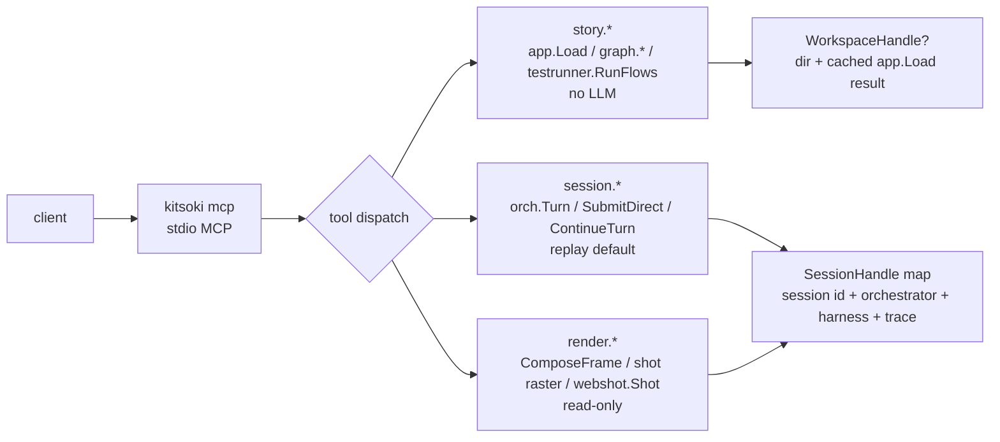

# MCP studio — author, drive & see kitsoki from an external agent

`kitsoki mcp` is a stdio [MCP](https://modelcontextprotocol.io) server an
**external** LLM client (Claude Code, Claude Desktop, an IDE agent) attaches
to. It gives that agent the three things it needs to build a kitsoki story:
**author** it, **drive** a live session of it, and **see / interact with** the
rendered result — terminal *and* browser — over one connection.

It is distinct from the narrow per-app server: [`kitsoki serve`](../../internal/mcp/server.go)
exposes a single `transition` tool that drives one app's state machine.
`kitsoki mcp` is the authoring/introspection *control plane* — its state is an
authoring **workspace** plus zero-or-more live **driving sessions**, exposed as
the `studio.*`, `story.*`, `session.*`, `chat.*`, `render.*`, `visual.*`, and `issue.*`
tool families. It is a sibling of
`kitsoki serve` and the [operator-ask bridge](operator-ask.md): same
`github.com/modelcontextprotocol/go-sdk`, same `StdioTransport`, same
`mcp__<server>__<tool>` naming.

Implementation: [`internal/mcp/studio/`](../../internal/mcp/studio/) (server,
handle model, tools, MCP-client operator prompter) and
[`cmd/kitsoki/mcp.go`](../../cmd/kitsoki/mcp.go) (the subcommand).

## The handle model

An MCP connection is **one studio session** = the server process's in-memory
state ([`StudioSession`](../../internal/mcp/studio/handles.go)). It owns named
handles:

- **At most one workspace handle** — a story directory under authoring, with
  the last `app.Load` result (the cached `AppDef` + `ValidationError`s) on it.
  `story.*` tools operate on the workspace.
- **Zero or more driving-session handles** — each a keyed, trace-backed kitsoki
  session over its own orchestrator + harness, with a harness mode
  (`replay`/`live`) and a JSONL trace path. `session.*` tools take a session
  handle; `render.*` tools take a session handle **or** an explicit
  `{story_path, state, world?}` spec.



The server core records **nothing new**: each driving handle writes through the
same JSONL event sink as [`kitsoki turn --trace`](developer-guide.md#61-the-trace-is-your-transcript),
so routed intents, `agent.call.*`, and transitions land in that session's
trace and replay unchanged. The studio session itself is ephemeral process
state; its handles point at durable traces. Handle resolution is **fail-fast** —
an unknown session handle, or a `story.*` call with no workspace bound, returns
a structured [`ToolError`](../../internal/mcp/studio/server.go) (`ok:false` +
a stable `code`: `UNKNOWN_HANDLE`, `NO_WORKSPACE`, `BAD_REQUEST`, …), mirroring
`serve`'s `TransitionError` — never a panic, never a silent no-op.

## No-LLM by default

Every driving session defaults to the **replay** harness, so the studio never
hits a real LLM unless explicitly told to — the project-wide testing rule
(automated tooling never incurs LLM cost). The harness is built behind an
injectable seam ([`HarnessBuilder`](../../internal/mcp/studio/handles.go)) so a
test can supply a *failing* live harness and assert a default-mode session never
reaches it (`TestServer_NoLiveFallthrough`). A session opts into `live` (or VCR
`record:`) explicitly on `session.new`, and the mode rides the handle's metadata
so the agent — and the human watching it — knows when an LLM is in the loop. A
replay miss is a **hard error**, never a silent live fallthrough.

For deterministic host-side integration tests, `kitsoki mcp --flow <fixture>`
loads the fixture's `host_handlers:` and installs those stubs into every future
driving session. This mirrors the no-LLM `kitsoki web --flow` posture for host
calls while still driving the session through real studio MCP stdio tools.
The MCP flow posture is intentionally narrow today: it supports `host_handlers`
stubs, not `host_cassette` or Starlark cassette fields.

`story.validate` and `story.test` are deterministic by construction.

## Tool surface

Tools keep the dotted `family.verb` name; the SDK exposes each to the client as
`mcp__kitsoki__<name>`. Two liveness tools — `studio.ping` (`→ {ok, version}`)
and `studio.handles` (`→ {sessions[], workspace?}`) — prove transport and attach
before any domain tool runs. `studio.work` adds the global async queue across
open handles, so an external agent can ask "what needs attention now?" without
inspecting every session one by one.

### `studio.*` — attach & reacquire globally

| Tool | Shape | Purpose |
|---|---|---|
| `studio.ping` | `{}` → `{ok, version}` | liveness probe |
| `studio.handles` | `{}` → `{sessions[], workspace?}` | list open handles |
| `studio.work` | `{include_quiet?, limit?}` → `{summary, sessions[], items[]}` | prioritized async work queue across all open driving handles |

`studio.work.items[]` includes unread inbox notifications, running or
awaiting-input jobs, failed jobs, pending/dispatching/failed chat drives,
backgrounded tmux chats, parked operator-ask questions waiting on
`session.answer`, and trace-backed mining proposals awaiting review. Each item
carries the source `handle`, session/story metadata, stable IDs, a priority, and
a `reacquire` hint naming the next MCP tool call (`session.teleport`,
`session.inspect`, `session.answer`, or `chat.show`). By default it omits read
notifications and quiet terminal jobs; pass
`include_quiet:true` when you need the full non-dismissed history. The queue is
sorted by intervention priority: passive `success` / `info` notifications stay
visible and reacquirable, but rank below active jobs/chats/questions and do not
increase `summary.needs_attention`.
`limit` pages only `items[]`; `summary.items` and `summary.needs_attention`
continue to describe the full queue so clients can show accurate global badges.

When a job row has a matching unread job-origin notification, `studio.work`
returns `reacquire.tool: "session.teleport"` with that notification id so the
client can jump directly to the saved origin context. Awaiting-input job rows
also carry the clarification prompt as the item `body` when no more specific
notification body is available. Job rows without a matching unread notification
keep the broader `session.inspect` fallback. Failed chat-drive rows return
`reacquire.tool: "chat.show"` with the failed chat id and failure text, so
clients can reopen the focused subagent context.

When a driven turn parks on the operator-ask fallback, `studio.work` returns an
`operator_question` row with `question_id`, the original `questions[]`, and
`reacquire.tool: "session.answer"`. The client supplies the chosen answers to
that hint's `{handle, question_id}` to resume the parked turn. The row disappears
after the turn is answered or times out.

When the trace contains `mining.proposal_raised` without a later matching
`mining.proposal_decided`, `studio.work` returns a `mining_proposal` row with
`proposal_id`, proposal kind/target, rung, draft path, and `reacquire.tool:
"session.inspect"`. This makes proposal-review work discoverable to a fresh MCP
client without scraping the web inbox's frontend proposal queue.

### `story.*` — author (deterministic, LLM-free)

The agent is the author; these are its compiler, linter, and test runner. Each
wraps a shipped Go API — the same code the human's `kitsoki run` / `/editor`
uses, so the MCP surface can never disagree with them.
([`story_tools.go`](../../internal/mcp/studio/story_tools.go).)

| Tool | Shape | Wraps |
|---|---|---|
| `story.read` | `{path} → {content}` | workspace-scoped file read |
| `story.write` | `{path, content} → {written, validation}` | write, then **auto-validate** in one round-trip; path-escape rejected |
| `story.validate` | `{dir?} → {ok, errors[]}` | `app.Load` → `[]ValidationError{File, Line, Column, Message}` — the full load-time invariant set |
| `story.graph` | `{dir?, room?} → {rooms[] \| detail \| agents[]}` | `graph.RoomList` / `Detail` / `AgentContracts` (the pure functions behind `/editor`) |
| `story.test` | `{dir?, flows?} → {report}` | `testrunner.RunFlows` (no LLM; honours `--recording`/`--host-cassette`) |

### `workflow.*` — draft, validate, launch, export

`workflow.*` wraps the shared dynamic-workflow service. It creates the draft
package, validates it, and can open a tracked studio session over the generated
`punch-list` story.

| Tool | Shape | Wraps |
|---|---|---|
| `workflow.create` | `{goal, slug?} → {receipt}` | draft package + manifest + validation receipt |
| `workflow.validate` | `{workflow_id} → {receipt}` | re-run the deterministic draft validator |
| `workflow.launch` | `{workflow_id} → {receipt}` | persist launch metadata and open a studio session handle over the draft |
| `workflow.status` | `{workflow_id} → {receipt}` | read the stored receipt |
| `workflow.export` | `{workflow_id, target?, allow_base_story?} → {receipt}` | copy the draft to a reusable story package, starter flow/cassette artifacts, and an export report |

The receipt carries the draft path, manifest path, launch basis, trace path,
the lifecycle event log, and, after `workflow.launch`, the studio `session_id`
/ handle plus the relative runstatus session route (`/s/<id>`). The trace path
and launch command are the fallback anchors when no browser origin is
available. `workflow.export` writes the promoted `README.md`, starter flow
fixture, optional starter cassette, and `export-report.json` beside the
promoted story package.

### `session.*` — drive & introspect

`session.drive` is the **one interpretive seam**: it submits free text through
the orchestrator turn loop (live or replay), and that routing decision is
recorded to the trace exactly as a TUI turn is. Everything else is a
deterministic direct path or a read.
([`session_tools.go`](../../internal/mcp/studio/session_tools.go),
[`session_runtime.go`](../../internal/mcp/studio/session_runtime.go).)

| Tool | Shape | Wraps |
|---|---|---|
| `session.new` | `{story_path, harness?, cassette?, trace?} → {handle, state}` | open a driving handle (default `harness:replay`) |
| `session.attach` | `{story_path, key, …} → {handle, state}` | co-drive an existing keyed session via the external-attach bridge |
| `session.drive` | `{handle, input} → {outcome, frame}` | **free text** → `orch.Turn` (interpretive route) |
| `session.submit` | `{handle, intent, slots?} → {outcome, frame}` | `SubmitDirect` — pick a menu intent |
| `session.continue` | `{handle, slots} → {outcome, frame}` | `ContinueTurn` — supply missing slots |
| `session.answer` | `{handle, question_id, answers} → {outcome, frame} \| {awaiting_operator}` | resume a parked operator-ask (see below) |
| `session.status` | `{handle} → {state, allowed_intents, status?, last_error?, exit?}` | compact, overflow-proof snapshot — **never embeds world**; reads only the well-known keys `status`/`last_error`/`exit` from the world. Use instead of `session.inspect` when the world may hold multi-KB LLM artifacts. |
| `session.teleport` | `{handle, notification_id} → {outcome, frame}` | jump to an inbox notification's saved target and mark it read |
| `session.inspect` | `{handle, omit_world?, max_value_len?} → {state, world, allowed_intents, last_view, async, jobs[], notifications[], pending_drives[], backgrounded_chats[], operator_questions[], mining_proposals[], last_turns[]}` | `buildInspectOutput` + session JobStore / ChatStore / trace side channel (read-only); `omit_world:true` drops world entirely; `max_value_len:N` truncates each value to N chars with `…` |
| `session.command` | `{handle, command, cols?, rows?} → {frame}` | run a deterministic TUI slash command such as `/work --all` against the handle |
| `session.trace` | `{handle, since?, until?, limit?, truncate_payload?, kinds?} → {events[], last_turn}` | the session's JSONL trace (read-only); `truncate_payload:N` caps event payloads; `kinds` filters to specific event kinds |
| `chat.show` | `{chat_id, handle?, session_id?, since_seq?} → {context?, chat, pty?, messages[]}` | read-only focused context for a selected async chat/subagent; `chat.display_scope_key` is the operator-facing scope label |

Every drive/submit/continue returns **both** the structured `TurnOutcome` (mode,
new state, allowed intents, slots needed) **and** the rendered `Frame` — so the
agent reasons on metadata and *sees* the screen in one call.

`session.command` exists for TUI-only operator surfaces that are not
orchestrator turns, especially smoke-testing `/work --all` and `/chat show
<id>` through MCP. It uses the live TUI slash dispatcher and rejects commands
that return an asynchronous terminal side effect, such as attaching to tmux.

`session.inspect` also carries compact per-handle background-job and inbox
projections. `async` summarizes running, awaiting-input, terminal, unread,
unread action-required, and operator-question counts; `jobs[]` shows the
session's job IDs, kinds, statuses, origin states, errors, clarification schema,
and timestamps;
`notifications[]` shows active inbox rows, including `action_required` items and
teleport job/state fields. When a chat store is wired, `pending_drives[]` shows
pending/dispatching/failed chat-input-queue rows owned by the session, and
`backgrounded_chats[]` shows tmux-hosted chats left in `pty_background` mode,
and `operator_questions[]` shows parked operator-ask fallback batches with the
same `questions[]`, `question_id`, and `session.answer` reacquire hint as
`studio.work`. `mining_proposals[]` folds the trace's
`mining.proposal_raised` / `mining.proposal_decided` side-channel events into
currently pending proposal-review rows. This is the structured MCP surface for
an external agent to inspect the chosen handle after `studio.work` has ranked
the global queue, notice required operator input, and reacquire or switch to the
task through `session.teleport`, `chat.show`, or `session.answer` without
scraping the TUI frame or decoding trace events.

Story-authored `host.chat.drive` effects are stamped with the originating
session and state before the host handler enqueues the drive, so ordinary
state-machine chat work appears in these same `pending_drives[]` and
`studio.work.items[]` surfaces without fixture-only store seeding.

When the selected async item is chat-backed, `chat.show` drills into the
focused context: chat metadata, the transcript slice, and any recorded tmux PTY
state. That gives an MCP client the same "switch attention to this subagent"
context that `session.inspect.backgrounded_chats[]` points at, without shelling
out to `kitsoki chat show`. When the client follows a `studio.work` reacquire
hint, it can pass the hint's `handle` and `session_id` through unchanged;
`chat.show` validates that the chat belongs to that session and echoes the
focused context back in `context`.

For a copy-paste smoke test of the async path, including background completion,
inbox notification capture, and `session.teleport`, see
[`../recipes/studio-mcp-async-smoke.md`](../recipes/studio-mcp-async-smoke.md).

### `render.*` — see (read-only)

`render.*` re-render a state the agent already reached, or an explicit
`{story_path, state, world?}` spec — and **never advance a session** (least
surprise: "look at this" can't mutate the machine). None of them invent a layout
path: they capture the existing TUI and web renderers.

| Tool | Returns | Source |
|---|---|---|
| `render.tui` | the `Frame` `{text, ansi, metadata}` at any width | `tui.ComposeFrame` |
| `render.tui_png` | the `Frame.text` **+** an MCP image block of the terminal | `internal/tui/shot` raster (ANSI→PNG) |
| `render.web` | text **+** an MCP image block of the **real** browser view; optional `assert_text[]` fails the call unless each string appears in the settled page | `internal/webshot` (headless `kitsoki web`) |

The **`Frame`** is the unit of fidelity — "the full screen a human sees" as a
value, captured once by the TUI's own composer and read by every headless
consumer so a screenshot and a real terminal can never drift. Its composition,
the `kitsoki drive` / `kitsoki shot` / `kitsoki web-shot` substrate commands, and
the `webshot` seam are documented in
[`docs/tui/frame-composition.md`](../tui/frame-composition.md).

Image blocks are gated on client capability: `render.tui_png` / `render.web`
attach an image block when the client advertises image support and **always**
include the textual frame, so a text-only client still gets something.
`kitsoki mcp` wires `render.web` for live handles by serving the open studio
session through the same runstatus web handler and screenshotting it with the
Node/Playwright [`web-shot.ts`](../../tools/runstatus/web-shot.ts) invoker.
That path needs a staged runstatus SPA (`make web`) and local Playwright
dependencies. Story/state spec screenshots still belong to `kitsoki web-shot`,
where a no-LLM flow or host cassette can define the deterministic web session.

### `visual.*` — interact visually without screenshot spam

`visual.*` is the token-efficient interaction layer for vision-capable coding
agents. It deliberately does **not** expose raw Playwright/Puppeteer control to
the model. The default loop is compact structured JSON first, one targeted PNG
only when needed, then deterministic actions through the same session/runtime
seams as `session.*`.

| Tool | Shape | Purpose |
|---|---|---|
| `visual.open` | `{kind:web\|tui\|vscode, handle, viewport?, mode?} → {visual_handle}` | bind a logical visual surface to an existing driving handle |
| `visual.observe` | `{visual_handle, cols?, rows?} → {state, frame preview, actions[], regions[], metadata, image_available}` | cheap default context; no image bytes |
| `visual.snapshot` | `{visual_handle, region?, overlay?, scale?, format?, max_pixels?, query?, assert_text?}` | return one targeted PNG plus JSON metadata including `image_id`/hash, original/display dimensions, crop bbox, scale factor, visible action handles, and, for web/vscode, the compact semantic observation; TUI uses the terminal rasterizer |
| `visual.act` | `{visual_handle, action?, action_handle?, image_id?, point?, text?, key?, value?, region?, delta?, intent?, slots?, command?}` | perform deterministic `submit`, `continue`, `type`, `press`, `select`, `scroll`, `command`, or anchored `pixel_click` actions and return the post-action frame/outcome |
| `visual.diff` | `{from_image_id, to_image_id}` | compare retained snapshot pixels/metadata and return changed-region hints plus a changed pixel bbox without another image |
| `visual.git_diff` | `{dir, from, to, story_path, state, world?, query?, assert_text?, region?, overlay?, scale?, max_pixels?, include_images?:none\|from\|to\|both}` | materialize each git revision with `git archive`, render the same web scene from both trees, retain both screenshots, and return the same compact diff metadata plus image IDs |
| `visual.record` | `{action:start\|stop, visual_handle?, recording_id?, mode?}` | capture a semantic evidence ledger and write `timeline.json` + `capture.semantic.json`; web recordings also write `session.rrweb.json` after a snapshot captures the rolling rrweb buffer |

The implementation is intentionally handle-backed: `web` and `vscode` surfaces
snapshot the real runstatus web view for the open session, while `tui` surfaces
snapshot the composed terminal frame. Browser lifetime remains behind the
existing `webShot` seam; tests inject stub PNG/semantic results, so the tool
surface is covered without Chromium or a real LLM. Snapshot image bytes are sent
only by the snapshot call; the server retains compact `image_id` metadata for
diffing and recorded evidence.

`visual.git_diff` is the git-aware visual regression path. The caller supplies a
repository directory, two commit-ish values, a story path relative to that repo
(or an absolute path inside it), and the state/world/query for the scene. The
server resolves both commits, expands each tree into a temporary directory with
`git archive` (no checkout and no source worktree mutation), renders the same
web scene from each archive through the existing browser seam, stores both
screenshots as retained images, and returns `{from_image_id,to_image_id,...}`
plus the pixel/metadata diff. The default response is JSON-only; `include_images`
can request `from`, `to`, or `both` PNG blocks for a vision-capable client when a
human/model needs to inspect the actual frames.

The runstatus SPA installs `window.__kitsokiVisual` at boot. It exposes a small
semantic helper: `observe()` returns stable action handles from interactive
elements (`data-testid` identity when present, ARIA role/label, disabled state,
and bounding box), named regions (`chat`, `graph`, `trace`, `inbox`,
`composer`, `modal`), viewport/route/focus, and dirty-region hints from
`MutationObserver` + route changes. `tools/runstatus/web-shot.ts` can write this
sidecar with `--semantic-out` during the same browser pass that captures the
PNG, and the Go `internal/webshot` seam returns it as `ShotWithSemantic`.
`visual.observe` uses the same compact sidecar, when the browser seam is wired,
to return helper-derived action handles, region bboxes, focus, viewport, and
dirty-region hints as JSON only. `visual.snapshot` filters that sidecar to the
known compact keys before placing it in MCP metadata, so clients get
action/region context without a DOM dump.
When a web/vscode snapshot names a semantic `region` such as `chat` or `trace`,
the returned PNG is cropped to that region's bbox. `overlay:"action_ids"` draws
visible affordance boxes from the semantic action inventory; `overlay:"regions"`
draws known region boxes. `max_pixels` enforces a hard image budget after crop
while preserving aspect ratio; absent an explicit budget, `scale:"medium"` (the
default) caps screenshots, `scale:"small"` caps more aggressively, and
`scale:"native"` preserves pixels. All of this is done server-side against the
already captured PNG, so the model sees only the targeted pixels it asked for.

Pixel actions are intentionally anchored. `visual.act {action:"pixel_click"}`
requires a recent `image_id` and a `point` in that returned image's coordinate
space. The server hit-tests only the retained semantic action boxes and then
submits the resolved deterministic handle (for runstatus, `intent-btn-*` testids
map back to Kitsoki intents). A free-floating arbitrary click is not part of the
normal action loop; the model must first ask for a frame that defines the
coordinate system.

Text entry is deterministic without owning a browser input element. `type`
buffers text on the visual handle without advancing the story; `press` with
`key:"Enter"` submits the buffered text through the same `session.drive` route
as the web composer, while `Escape` clears and `Backspace` edits the buffer.
`select` submits an explicit intent with slots (plus optional `value`) through
the direct submit path. `scroll` is treated as a viewport hint: it records the
region/delta, returns the current frame unchanged, and sets `needs_snapshot`
because only a later observation/snapshot can prove what is visible after a
client-side scroll.

For `tui` handles, `visual.observe` includes an xterm-like terminal wrapper under
`frame.terminal`: bounded `rows[]` are the cell grid in terminal coordinates,
`dirty_rows[]` identifies rows worth re-reading, `actions[]` maps active intent
handles to cell-coordinate bounding boxes, `focus` names the current input
region, and `slash_commands[]` lists the safe command candidates surfaced by
`visual.act {action:"command"}`. This is still JSON-only; `visual.snapshot`
rasterizes the same composed frame to PNG only when pixels are needed.

Longer-lived web recordings align with Slidey's canonical rrweb formats: rrweb
is the durable motion/evidence substrate, `slidey.chapter` custom events mark
reviewable spans, and PNGs remain targeted stills for vision-model ambiguity.
The runstatus SPA already keeps a masked rolling rrweb buffer for bug reports;
`window.__kitsokiVisual.recording()` wraps that buffer in the same envelope
spine Slidey consumes (`schemaVersion`, `source`, `viewport`, timing fields,
`events`). During an active `visual.record`, a web `visual.snapshot` captures
that envelope through `web-shot.ts --rrweb-out`; `visual.record stop` writes the
latest envelope as `session.rrweb.json` alongside the semantic ledger. Future
chapter markers should reuse Slidey's `slidey.chapter` custom event convention
rather than defining a second recording format.

The contract for agent clients is:

1. Call `visual.observe` first.
2. Use `visual.act` for listed `intent:<name>` action handles whenever possible.
3. Call `visual.snapshot` only for layout, visual ambiguity, or UI failures.
4. Prefer `region`, `overlay`, and `max_pixels` over full-frame native
   screenshots when the client knows what it needs to inspect.
5. Use `pixel_click` only with an `image_id` from the latest relevant snapshot;
   prefer listed action handles when available.
6. Use `visual.record` around exploratory work that may need review; the sidecar
   captures observations, actions, image ids, hashes, and, for web surfaces,
   a masked rrweb replay when a snapshot occurred during the recording.

This keeps PNGs useful for vision models without turning every step into a large
image or accessibility-tree payload.

### `issue.*` — file a gap (with evidence bundled)

The agent that drives kitsoki through this MCP has no shell and no write tools,
so when the *studio surface itself* can't do something needed to develop, test,
run, introspect, trace, or debug a story, it can't reach for `gh`. `issue.create`
closes that gap from inside the MCP — and, because the studio already produces
the evidence, it bundles it in.
([`issue_tools.go`](../../internal/mcp/studio/issue_tools.go).)

| Tool | Shape | Wraps |
|---|---|---|
| `issue.create` | `{title, body?, labels?, repo?, handle?, include_trace?, trace_limit?, include_inspect?, include_visual_recordings?, assets?} → {url, number, labels[], assets[]}` | render assets → `.artifacts`, bundle a handle's trace/inspect and stopped visual recordings, then the injectable `IssueFiler` (prod: `gh`) |

Three things happen server-side so the agent never handles bytes:

- **assets** — each `assets[]` entry (`kind: tui_png | web | tui_text`, targeting
  a handle or a `{story_path, state, world}` spec) is rendered through the same
  `composeRenderFrame` / `shot.RenderPNG` / `webShot` seams `render.*` use,
  written under the artifacts dir (`.artifacts/mcp-issues/<slug>/`), and
  referenced in the body **by relative path**. Asset *upload* isn't wired yet —
  the path is a stopgap reference, flagged with an HTML comment; `IssueResult`
  already carries the asset list so the upgrade is localized to the filer.
- **context** — with a `handle` and `include_trace` / `include_inspect`, the
  session's trace tail (the same `session.trace` returns) and inspect snapshot
  are folded into the body, so a gap report is reproducible by construction.
- **visual recordings** — `include_visual_recordings:["rec1", ...]` copies each
  stopped `visual.record` bundle into the issue artifact directory and links its
  `timeline.json`, `capture.semantic.json`, and optional `session.rrweb.json`.
  This is the no-raw-browser-state path for filing a visual failure: semantic
  state/action history plus the masked rrweb replay, without dumping DOMs into
  the issue body.
- **file** — the composed `{repo, title, body, labels}` goes to the injected
  [`IssueFiler`](../../internal/mcp/studio/issue_tools.go) seam. The
  `source-autonomous` label is always applied (first) so agent-filed issues are
  filterable. Production (`cmd/kitsoki`) shells to `gh issue create` (and
  best-effort `gh label create --force source-autonomous`); a test injects a fake
  that records the request and returns a canned URL — no network, no LLM. With no
  filer wired the tool returns a structured `ISSUE_UNAVAILABLE`. `issue.create`
  is allowed in `--read-only` mode (it mutates `.artifacts` + GitHub, not the
  story tree).

## Operator-ask — the MCP client *is* the operator

A driven turn can dispatch a kitsoki agent sub-agent (`host.agent.ask/decide/
task`) that asks the operator a clarifying question via `mcp__operator__ask`. In
a TUI/web run a live surface answers it; a plain headless session has no operator
and the sub-agent takes the "proceed on your own" path
([operator-ask.md](operator-ask.md)) — so the one story behaviour a headless
session can't reach is the interactive one.

The studio closes that gap by making the **driving MCP client the operator**. It
adds a third [`OperatorPrompter`](operator-ask.md#interactivity-gating--the-tool-is-attached-only-when-answerable)
implementation (alongside the TUI and web ones) whose surface is the MCP
connection, injected with `WithOperatorPrompter` before each driven turn — so
`mcp__operator__ask` auto-attaches to the dispatched sub-agent and the round-trip
runs end to end. Everything else is reused verbatim: the per-call socket, the
attach gate, the wire/answer schema, the bounded wait, and the
`operator.question.*` trace events. See
[operator-ask.md → MCP client surface](operator-ask.md#mcp-client-surface) for
the prompter's two transports (MCP elicitation primary, `session.answer`
suspend/resume fallback) and the no-LLM test posture.

## Attach config

The server drops into a client's `.mcp.json` the same way the bash/operator
servers attach
([`writeMCPConfigTempfile`](../../internal/host/agent_helpers.go) shape):

```json
{ "mcpServers": { "kitsoki": {
    "command": "kitsoki", "args": ["mcp", "--stories-dir", "<dir>"] } } }
```

`kitsoki mcp` flags: `--stories-dir` (workspace resolution root), `--db` (the
session store for driving handles), `--harness replay|live` (default `replay`),
`--workspace` (an initial authoring workspace bound on boot).

## Demo → QA

The studio surface ships a **tour-driven demo video** of an external coding agent
driving it end to end — `tools/mcp-demo/` (Claude Code TUI is the POC; codex/copilot
slot in by swapping a cassette). It generalizes the VS Code demo→QA pipeline
(`tools/vscode-kitsoki`) to a *terminal* surface: an xterm.js terminal **replays a
committed `termcast` cassette**, filmed through the shared demo machinery (camera
1600×900, `ChapterRecorder` sidecar, 25s floor) and gated by the `kitsoki-ui-qa`
review (`mcp-feature.md` / `mcp-scenarios.yaml`).

It is **no-LLM by construction** — the replay plays a static cassette and never
spawns a model (enforced by `tools/mcp-demo/scripts/lint-no-llm.mjs`). Authenticity
comes from *record once, replay forever*: a single **gated** live `claude` ↔
`kitsoki mcp` capture (`claude -p --output-format stream-json` →
`scripts/streamjson-to-termcast.mjs`) becomes the cassette, then replays for free,
identically, on every render. Two cassettes ship: the synthetic `claude-code`
(the CI-safe no-LLM default + QA fixture) and the captured-live `claude-code-live`
(the authentic Claude-Code session — driving a deterministic `barista` story via
direct `session.submit`, rendering the real `render.tui` frame). Both pass the
cast-agnostic `mcp-scenarios.yaml` gate (7/7, 0 visual issues).

```
make mcp-demo-fast   # no-LLM validate (CI-safe: lint + PACE=0 assert)
make mcp-demo        # watch-speed record → .artifacts/mcp-demo/claude-code.mp4
make mcp-qa          # vision QA (GATED: local claude CLI)
```

See [`tools/mcp-demo/README.md`](../../tools/mcp-demo/README.md).

## Non-goals

- **A second view renderer or a hand-rolled web view.** `render.*` capture the
  existing TUI and SPA renderers; readability work is
  [view-rendering-readability](../proposals/view-rendering-readability.md).
- **Cross-process / durable session sharing.** One stdio subprocess per client
  holds its handles in-process; co-driving across processes is the
  [hybrid-session-driving](../proposals/hybrid-session-driving.md) concern.
- **Replacing `kitsoki serve`** (the narrow per-app `transition` server) or the
  TUI/web operator surfaces. This is an additive, agent-facing control plane.
</content>
