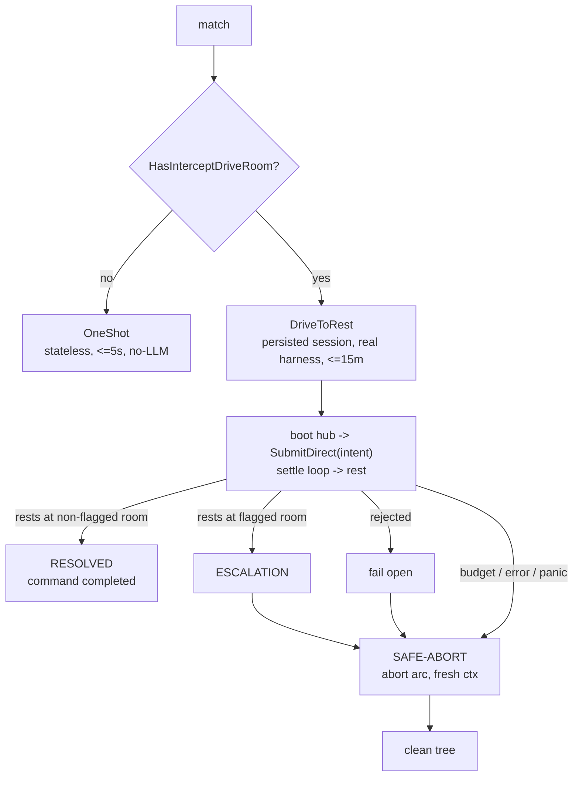

# Pre-LLM prompt interception

In a long coding-agent session a large fraction of what the user types is not a
novel reasoning request — it is a **known command** phrased in natural language:
"rebase this onto main", "run the tests", "open the PR". Every one of those
otherwise costs a full agentic turn (tokens, latency, a result that varies run
to run). Kitsoki already resolves free text → intent with **zero LLM** through
the [semantic-routing](semantic-routing.md) tiers; prompt interception exposes
that stack as a **pre-LLM gate** so a recognized command is handled
deterministically — and identically every time — while the agent's main model is
never invoked for that turn. Everything unrecognized passes through untouched.

This page is the user-facing reference for what shipped. The engine lives in
[`cmd/kitsoki/intercept.go`](../../cmd/kitsoki/intercept.go) and
[`internal/orchestrator/classify.go`](../../internal/orchestrator/classify.go);
the agent-side shim lives in [`cmd/kitsoki/hook.go`](../../cmd/kitsoki/hook.go).

## 1. What shipped

| Surface | Symbol | What it does |
|---------|--------|--------------|
| `kitsoki intercept` | [`interceptCmd`](../../cmd/kitsoki/intercept.go) / [`runInterceptEngine`](../../cmd/kitsoki/intercept.go) | the no-LLM **classify + gate + execute** engine: a JSON verdict + a distinct exit code |
| `Orchestrator.Classify` | [`classify.go:35`](../../internal/orchestrator/classify.go) | the **zero-effect** routing seam — verdict, no effects, no events, no LLM |
| `.kitsoki.yaml intercept:` | [`webconfig.InterceptConfig`](../../internal/webconfig/webconfig.go) | the per-repo binding (app + room + bar + escape prefix) |
| `kitsoki hook install` / `run` | [`hookInstallCmd`](../../cmd/kitsoki/hook.go) / [`hookRunCmd`](../../cmd/kitsoki/hook.go) | the Claude Code `UserPromptSubmit` shim + its idempotent installer |
| `intercept.matched` / `intercept.passed` | [`trace.go:103`](../../internal/trace/trace.go#L103) | the trace events that make every gate decision auditable |

### 1.1 `Orchestrator.Classify` — the zero-effect seam

Every other consumer of the routing tiers **executes on hit**: the deterministic
tier ends in `o.SubmitDirectRouted(...)` the moment it matches
([`deterministic.go:214`](../../internal/orchestrator/deterministic.go#L214) and
`:237`). There was no way to *ask* "would this input deterministically resolve,
and to what?" without also running the effects. `Classify`
([`classify.go:35`](../../internal/orchestrator/classify.go#L35)) is exactly that
ask:

```go
func (o *Orchestrator) Classify(ctx context.Context, state app.StatePath,
    w world.World, input string) (semroute.Verdict, bool, error)
```

It runs the no-LLM tiers in order — deterministic display/example (1.00) →
semantic synonym/template via the extract resolver → optional embedding tier —
and returns the [`semroute.Verdict`](../../internal/semroute/verdict.go) with
**no store touched and no event written**. The extract-LLM and main-turn LLM
tiers are never reached: a verdict unreachable without the model is a no-match.
It deliberately takes no `session_id`, so it *cannot* mutate session state —
matching is not mutating, which a flow fixture proves byte-for-byte
(`TestClassify_ZeroEffectNonMutating`). The two `Orchestrator.Turn` callers are
untouched; `Classify` is a new read-only sibling, not a refactor of the live
turn path.

### 1.2 `kitsoki intercept` — classify, gate, execute

`kitsoki intercept` resolves a binding (flags win; unset fields fall back to the
`intercept:` block), reads a prompt (`--input`, or stdin as `{"prompt":…}` JSON
or raw text), calls `Classify`, applies **the gate** (§2), and — only on a
confident, fully-slotted, unambiguous match — executes the resolved intent
directly via `Orchestrator.OneShot`
([`orchestrator.go:1893`](../../internal/orchestrator/orchestrator.go#L1893)):
stateless, in-memory, no LLM, no persistence. It then emits an
[`interceptOutput`](../../cmd/kitsoki/intercept.go) JSON document and maps the
outcome to an exit code:

| Exit | Meaning |
|------|---------|
| `0`  | intercepted; transition fired |
| `1`  | intercepted; intent rejected (guard failed / not allowed) |
| `2`  | intercepted; landed in a terminal state |
| `3`  | infrastructure error (missing app, bad world JSON, no binding) |
| `10` | **pass-through** — no confident no-LLM match; the prompt should reach the LLM |

Exit `10` is deliberately distinct from `turn`'s `1` (`interceptExitPassThrough`,
[`intercept.go:57`](../../cmd/kitsoki/intercept.go#L57)): the hook must never
confuse "kitsoki declined to handle this" (pass to the agent) with "kitsoki
handled it and the intent was rejected" (a real, surfaced result).

```
$ kitsoki intercept --app stories/intercept-demo/app.yaml --room commands \
    --input "rebase this onto main"
{ "matched": true, "intent": "rebase", "confidence": 1, "exit": 0, "result": { … } }

$ kitsoki intercept --app stories/intercept-demo/app.yaml --room commands \
    --input "what does this function do?"
{ "matched": false, "reason": "no_match", "gate_bar": 0.9, "exit": 10 }
```

The runnable fixture is [`stories/intercept-demo/`](../../stories/intercept-demo)
— three dev-command intents (`rebase`, `run_tests`, `open_pr`) whose declared
examples/synonyms are the natural phrasings a user types to Claude Code. The
classify+gate path is covered by `cmd/kitsoki/intercept_fixture_test.go`; the
execute path (fire the arc → run the host call via cassette → bind → say) by
[`stories/intercept-demo/flows/intercept_commands.yaml`](../../stories/intercept-demo/flows/intercept_commands.yaml).
No LLM anywhere.

### 1.3 The binding — `.kitsoki.yaml intercept:`

The repo opts in with an `intercept:` block on `webconfig.WebConfig`
([`webconfig.go`](../../internal/webconfig/webconfig.go)) — the same "stable
extension point for machine-global keys" that carries `story_dirs` and
`harness_profiles`. `.kitsoki.local.yaml` can override or disable it per
developer:

```yaml
intercept:
  enabled: true
  app: stories/dev-commands/app.yaml   # the bound app
  room: commands                        # the room whose intents are the gate's alphabet
  confidence_bar: 0.90                  # synonym floor; deterministic (1.00) always wins
  escape_prefix: "//"                   # optional: a leading token forces pass-through
```

The room must exist and load when the command starts — a missing/invalid binding
is an infra error (exit 3), never a silent pass-through-everything. With no
`intercept:` block (or `enabled: false`) nothing intercepts: the feature is
purely additive and opt-in.

### 1.4 The Claude Code hook — `kitsoki hook install` / `run`

`kitsoki hook install --agent claude` merges, idempotently, a `UserPromptSubmit`
entry into `.claude/settings.json` (dry-run diff by default; `--write` to apply;
re-running is a no-op). The installed command is `kitsoki hook run --agent
claude`, the shim Claude invokes on every prompt. The contract:

```
stdin : {"prompt": "...", "session_id": "...", "cwd": "..."}
stdout: {"decision":"block","reason":<report>}  ⇒ kitsoki answered; the prompt is
        NOT sent to the model and <reason> is shown to the user.
stdout: <empty> + exit 0                         ⇒ pass-through; the prompt proceeds.
```

The shim reuses `runInterceptEngine` **in-process** — no subprocess, no second
classify — so the latency budget is a single in-memory `OneShot`, capped at a
`5s` timeout ([`hook.go:43`](../../cmd/kitsoki/hook.go#L43)). On a clean match it
composes a **marked interception report**
([`composeInterceptReport`](../../cmd/kitsoki/hook.go)) — attribution line,
one bullet per `host.*` side-effect, then the outcome line:

```
⌁ kitsoki handled this (no LLM) — rebase
  • host.run command=git rebase origin/main
Rebased onto origin/main, no conflicts.   ·   ⟲ recorded in the kitsoki trace
↳ prefix "//" to skip kitsoki and send the prompt to the agent
```

The escape line is appended only when an `escape_prefix` is configured (it names
the actual prefix), so the bypass is discoverable from the one surface the user
sees — the blocked prompt's reason.

**Fail-open is the cardinal rule** ([`hook.go`](../../cmd/kitsoki/hook.go) doc
comment): a misconfigured, slow, erroring, or *panicking* interceptor must never
wedge the agent. Only a clean, confident match that actually executed blocks;
every other outcome — no `intercept:` block, escape prefix, pass-through, rejected
execute, infra error, even a recovered panic — exits `0` silently so the prompt
flows to the model untouched.

## 2. The conservative gate

Pass-through is the default; the gate intercepts only when it is sure (principle
of least surprise — a turn the user meant for the agent must never be silently
hijacked). The gate is **pure data** over the verdict — `Confidence`,
`Candidates`, `MissingSlots` — read against the configured bar in
[`runInterceptEngine`](../../cmd/kitsoki/intercept.go#L265):

| Verdict | Gate | Outcome |
|---------|------|---------|
| deterministic display/example — **1.00** | always ≥ bar | **intercept** |
| synonym/template — **≥ `confidence_bar`** (default 0.90) | clears the bar | **intercept** |
| tie — **0.50** (or any surfaced `Candidates`) | ambiguous | pass-through (`reason: tie`) |
| below the bar | too weak | pass-through (`reason: below_bar`) |
| match needs an unfilled required slot | not executable as-is | pass-through (`reason: missing_slot`) |
| no tier matched | — | pass-through (`reason: no_match`) |

The missing-slot branch applies the same `RequiresUnfilledSlot` guard production
routing already uses
([`semantic.go:148`](../../internal/orchestrator/semantic.go#L148)): a verb that
names a command but can't fill a required slot passes through rather than
half-executing. These are the same confidence bands the routing tiers emit, so
the gate is a thin, honest reading of
[semantic-routing.md §1](semantic-routing.md) — not a parallel scoring scheme.
See that doc for how each band is produced.

## 3. Decision recording

Every intercept is auditable. `runInterceptEngine` emits one of two events
through its logger ([`trace.go:103`](../../internal/trace/trace.go#L103)):

| Event | Fields |
|-------|--------|
| `intercept.matched` | `input`, `intent`, `confidence`, `match_reason`, `gate_bar`, `executed` |
| `intercept.passed`  | `input`, `top_confidence`, `reason` (`below_bar` \| `tie` \| `missing_slot` \| `no_match`) |

Statelessly executed, `kitsoki intercept` writes these to an optional `--trace
<path>` JSONL sink (and discards them otherwise); the Claude shim runs with no
sink. A **passed-through** phrasing is precisely a synonym-growth candidate, so
this feeds the existing read-only loop unchanged
([`kitsoki inspect --synonym-suggestions`](semantic-routing.md#32-kitsoki-inspect---synonym-suggestions)):
a phrasing that passed through today is the candidate to add as a synonym so it
intercepts tomorrow.

## 4. Agent capability matrix (honest)

The agents expose *different* pre-model contracts — and two of three expose
none. The matrix says so plainly rather than implying "a hook for all three":

| Agent | Pre-model hook | Bypass the LLM? | Our path |
|-------|----------------|-----------------|----------|
| **Claude Code** | `UserPromptSubmit` | **yes** — `decision:"block"` erases the prompt; no assistant turn | **Full.** The shim blocks + surfaces a composed report (§1.4). |
| **Codex CLI** | none (`PreToolUse`/`PostToolUse` only — post-reasoning, tool-level) | no | **Degraded.** Explicit `k <cmd>` invoke; the MCP-tool fallback (**model-in-the-loop, NOT a bypass**). |
| **GitHub Copilot** | `userPromptSubmitted` (**observe-only**) | no | **Degraded.** Same: explicit invoke; MCP fallback labeled model-in-the-loop. |

For Claude Code the result is **full**: the block fires before the model, and the
composed report is shown in-the-moment. For Codex/Copilot, `kitsoki hook install
--agent codex|copilot` does **not** write a hook — it prints an honest "no
pre-model hook today" message
([`codexNoHookMessage`](../../cmd/kitsoki/hook.go) /
[`copilotNoHookMessage`](../../cmd/kitsoki/hook.go)) and leaves two fallbacks:

- **Explicit invoke.** A shell alias `k() { kitsoki intercept --input "$*"; }`
  runs a known command deterministically *on purpose* — the value (deterministic
  + recorded + no tokens) survives even without auto-interception.
- **MCP tool.** Pointing an agent at the interceptor room through `kitsoki serve`
  lets the *model choose* to route a command there. This is **not** a bypass —
  the agent's LLM still ran to make that choice — and the matrix labels it so no
  one mistakes it for the Claude path.

The Claude shim is the reference; a Codex/Copilot shim is a near-drop-in the day
they ship a pre-model hook (Codex `BeforeModel`, Copilot pre-prompt control).

## 5. Informing the user, not disappearing

The mechanics force a specific posture. The *only* pre-model lever is **block + a
reason string** (Claude) or nothing (Codex/Copilot) — no agent supports
substituting a synthetic assistant answer before the model. So kitsoki does the
real work in the room, and the outcome rides along as the block `reason`, composed
as a **marked interception report** (§1.4) that names the recognized command,
lists what ran, and ends in the outcome. The user is always told what happened,
in-the-moment — never left with a vanished turn.

This is the inverse of the [operator-ask](operator-ask.md) finding ("a
`PreToolUse` hook can only allow/deny, it cannot supply a `tool_result`"): there
allow/deny was *insufficient* so operator-ask used an MCP tool; here allow/deny
is *exactly enough* — we want to deny (block) — and we accept the ceiling
honestly.

The report is **in-the-moment but ephemeral** in Claude's transcript: a blocked
prompt is erased and is absent from scrollback / `--resume`. That is a Claude
limitation, not our choice — so the **durable** record is the kitsoki trace (the
`intercept.*` events of §3), which a `kitsoki trace` / web surface can replay in
full.

**Open verification.** Whether returning a `systemMessage` *alongside*
`decision:"block"` yields a *persisted*, user-visible transcript note **and**
still bypasses the model is undocumented. If it does, the shim adopts it to close
the ephemerality gap. We will **not** trade the bypass for persistence: emitting
`systemMessage` *instead of* blocking persists a note but lets the prompt reach
the model, defeating the whole point. Until verified, the in-moment report + the
durable trace is the contract.

## 6. Worked example — git-ops command hub

The runnable, real-git example is the [`intercept`
room](../../stories/git-ops/rooms/intercept.yaml) in
[`stories/git-ops/`](../../stories/git-ops): a branch-agnostic hub that groups
every common git command (`rebase`, `stage`, `commit`, `squash`,
`merge_into_main`, `undo`, `pull`, worktree ops) in **one** room, each arc
delegating to git-ops's existing command rooms (no duplicated git logic). It
exists because the gate is **stateless** and binds to one room: a user types
"rebase this onto main" without first navigating a hub. The room's `on_enter`
refresh serves the interactive path; the one-shot gate skips it and relies on
git-ops's world defaults (`integration_branch=main`, `working_dir=.`) plus each
command's own `git rev-parse` self-derivation.

The flagship [`stories/dev-story/`](../../stories/dev-story) surfaces the same
room by importing git-ops (`imports.gitops`, entry `intercept`), so the gate can
bind through either story — git-ops directly (`room: intercept`) or dev-story
(`room: gitops.intercept`, the folded path):

```yaml
intercept:
  enabled: true
  app: stories/dev-story/app.yaml   # or stories/git-ops/app.yaml
  room: gitops.intercept            # or `intercept` for git-ops directly
  confidence_bar: 0.90
  escape_prefix: "//"
```

Then "rebase this onto main" runs the real `git rebase`, no main-turn LLM.
Because git-ops also declares a room flagged `intercept_drive: rest` (the
`conflict` room), this binding is **multi-turn-capable**: every match is driven on
a persisted session rather than one-shotted (§7). A clean single command
(`rebase` with no conflict, `pull`, `undo`) still settles in one drive round with
the agent never invoked — the no-LLM promise holds for it; a *conflicting* rebase
enters the multi-turn resolution loop, where the `conflict_resolver` agent does
run (acknowledged, recorded LLM use). De-risked no-LLM by
[`flows/intercept_hub.yaml`](../../stories/git-ops/flows/intercept_hub.yaml)
(mocked `host.run`) and
[`TestClassify_GitOpsInterceptRoom`](../../internal/orchestrator/classify_intercept_room_test.go)
(matching quality, zero execution).

## 7. Multi-turn commands

Some recognized commands are not self-contained one-shots: their real execution
is a **multi-turn, agent-in-the-loop loop**. The canonical case is *"rebase, and
resolve any conflicts."* When the rebase conflicts, git-ops routes to the
[`conflict` room](../../stories/git-ops/rooms/conflict.yaml), whose `on_enter`
runs `host.agent.task` against the `conflict_resolver` agent and — only if the
verdict is `resolved:true` — drives `rebase_continue` → build-check →
`conflict_resolved` → `branch_ops`. The stateless `OneShot` (§1.2) **cannot** drive
this: it stops at the first resting place (`conflict`), and abandoning a
conflicting rebase **strands the working tree** mid-rebase.

So the gate escalates. A room whose entry begins such a loop is marked
`intercept_drive: rest`; when the bound app declares any such room
([`Orchestrator.HasInterceptDriveRoom`](../../internal/orchestrator/intercept_drive.go)),
the binding is multi-turn-capable and a match is driven **synchronously to rest**
on a real, persisted session instead of one-shotted:



[`Orchestrator.DriveToRest`](../../internal/orchestrator/intercept_drive.go) adds
no new driving logic — the driver is the existing `settlePostBindEmits` settle
loop, which `SubmitDirect` already runs to completion in a single call (a resolved
conflict loop settles `conflict → rebase_continue → conflict_resolved →
branch_ops` in one turn). What it adds is the gate-level concerns the settle loop
has no opinion about:

- **Escalation detection.** A settle that rests *at* the flagged room means the
  sub-flow could not complete (the resolver returned `resolved:false`).
- **Safe-abort — the cardinal invariant.** Any non-success that may have started
  work (escalation, budget exhaustion, drive error, panic) fires the room's
  `abort` arc (`git rebase --abort`) on a **fresh context** (the original budget
  may be blown), so **the gate never leaves a session it started mid-rebase**. A
  *rejected* command started nothing, so it skips the abort and fails open.
- **The gate-level trace record.** `intercept.escalated` (opened) paired with
  `intercept.resolved` / `intercept.aborted` (closed); see
  [trace.go](../../internal/trace/trace.go). The live, round-by-round feed while
  the drive runs is the persisted session's own native events (`agent.call.*`,
  transitions).

### 7.1 Synchronous, with feedback — not backgrounded

The drive blocks the hook for its full duration (minutes for a real conflict)
rather than backgrounding. This is deliberate: a mid-rebase tree is a transient,
inconsistent state on which no other work can proceed, so "hand off and return
control" would be false freedom — the user genuinely is waiting. The design effort
goes into **feedback** so the wait is not a degraded experience versus a normal
LLM turn:

- **In Claude — a spinner, then a complete report.** A spike against the Claude
  Code hooks reference settled the mechanism: a blocking `UserPromptSubmit` hook
  **cannot stream** progress into the transcript (stderr is buffered until exit;
  `statusMessage` is a static spinner). So the in-Claude account is the final
  block report
  ([`composeDriveReport`](../../cmd/kitsoki/intercept_drive.go)) — the command,
  its disposition (drove to completion / safely aborted), the hop count, and a
  `kitsoki trace --follow <session>` pointer.
- **Live, off to the side — the persisted session.** The drive runs against the
  same on-disk store the web/TUI read, emitting its events in real time, so the
  play-by-play (the equivalent of watching the LLM's tool calls) is watchable in
  `kitsoki web` / TUI / `kitsoki trace --follow` *while the hook blocks*.

**Two budgets, both lifted from the 5s fast-path cap.** kitsoki's own
`interceptDriveBudget` (15m) bounds the drive; and because Claude defaults a
`UserPromptSubmit` hook to a **30s timeout** and kills the process past it (which
would strand a tree mid-rebase), `kitsoki hook install` writes a raised `timeout`
(`1200`s) on the entry. kitsoki's budget sits under the installed Claude timeout
so it always reaches safe-abort first.

### 7.2 Verification

Deterministic and free, via the real-git dogfood harness: a `git init` conflict
repo + the real `host.run` registry + the `conflict_resolver` agent **stubbed**
(no LLM). [`TestDriveToRest_ResolvesAndReports`](../../internal/orchestrator/intercept_drive_test.go)
drives a resolving stub through to `branch_ops` (Resolved, clean tree);
`TestDriveToRest_EscalationSafeAborts` drives a `resolved:false` stub and asserts
the safe-abort leaves a clean (not mid-rebase) tree — the strand-prevention
invariant. The cmd-layer routing (match → multi-turn signal; the install timeout)
is covered by
[`intercept_drive_test.go`](../../cmd/kitsoki/intercept_drive_test.go). The one
genuinely LLM-needing test — does the *real* `conflict_resolver` resolve a real
conflict — stays gated/manual (no automatic real-LLM tests). The story's own
`rebase_continue` path is exercised end-to-end by
[`TestGitOps_RebaseConflict_ResolvesAndLandsBranchOps`](../../internal/orchestrator/gitops_rebase_resolve_test.go).

## 8. See also

- [`semantic-routing.md`](semantic-routing.md) — the no-LLM tiers the gate reads;
  §1 for the confidence bands, §3 for the synonym-growth loop the
  `intercept.passed` event feeds.
- [`operator-ask.md`](operator-ask.md) — the inverse allow/deny finding the gate
  posture mirrors.
- [`stories/git-ops/rooms/intercept.yaml`](../../stories/git-ops/rooms/intercept.yaml)
  — the real-git command hub (§6); [`stories/intercept-demo/`](../../stories/intercept-demo)
  — the minimal echo-stub fixture story.
