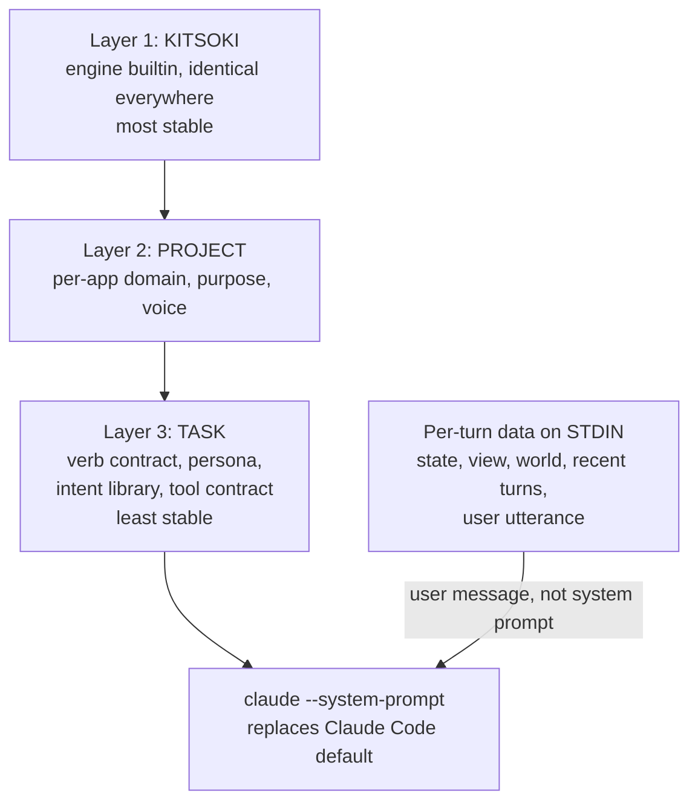

# The layered system prompt

Every `claude` invocation kitsoki makes — the intent-routing harness and all
`host.agent.*` verbs — builds its system prompt the same way: three layers
composed by [`internal/sysprompt`](../../internal/sysprompt/doc.go), ordered
most-stable → least-stable, passed to claude via `--system-prompt` (which
**replaces** Claude Code's default coding-agent prompt).



## Why layered, and why this order

Two problems motivated it. The router had a healthy but bespoke prompt; every
other agent verb passed the agent's `system_prompt` via
`--append-system-prompt`, so it stacked **on top of Claude Code's full default
coding-agent prompt** — an agent judge inherited a large, wrong base prompt and
its author's persona was a footnote. And **neither** path told the model what
kitsoki is or what the project is about.

Layering fixes grounding; the order makes it cheap. Anthropic caches a stable
prompt prefix (≥1024 tokens). Because per-turn data stays on stdin, the composed
system prompt is byte-identical across every call a given agent/verb makes in a
project. Ordering Layer 1 (global) → Layer 2 (per-app) → Layer 3 (per-agent)
maximizes the shared cached prefix: the kitsoki layer is identical for *every*
call everywhere, the project layer for every call in one app.

Grounding is **unconditional**: Layer 1 is always present, so even a call with no
persona is grounded — an author cannot drop the kitsoki framing per call. This is
deliberate ([the moat](concept.md) is that every decision is a grounded,
recorded datapoint).

## Replace vs. append, and the dynamic-sections policy

The composed prompt is passed with `--system-prompt` (replace). Claude Code also
injects *dynamic* sections (cwd, git status, env, memory) that are irrelevant to
a hermetic decision but useful to agentic repo work. `internal/sysprompt`
encodes the per-verb policy in `Composed.ExcludeDynamic`:

| Verb | base prompt | CC dynamic sections (cwd/git/env/memory) |
|---|---|---|
| route (harness) | replace | exclude |
| ask / decide / converse / extract / ask_with_mcp / ask_structured | replace | exclude |
| **task** | replace | **keep** — agentic repo work needs them |

**Escape hatch.** An agent may set `inherit_claude_default: true` to opt out of
layering entirely and fall back to the legacy posture: its persona is appended
via `--append-system-prompt` onto Claude Code's default, with no kitsoki/project
grounding. A migration knob; default `false`.

## Authoring Layer 2 (project context)

Set **one** of these on `app:` (loader-enforced; both is an error):

```yaml
app:
  id: oregon-trail
  context: |          # inline template string
    This is The Oregon Trail, a frontier survival sim set in 1848 …
```

```yaml
app:
  context_path: prompts/_project.md   # a prompt file on the search path
```

When neither is set, the optional `prompts/_project.md` **convention** supplies
Layer 2 if that file exists. On the agent path the project context is rendered
through the same [prompt renderer](../stories/prompts.md) used for every prompt,
so it can `` shared fragments and an overlay/import can
supply it. (The router resolves the inline/file forms only — it has no prompt
renderer wired — so the convention and `@shared` forms are agent-path.)

Worked examples: [`stories/oregon-trail/app.yaml`](../../stories/oregon-trail/app.yaml)
and [`stories/dev-story/app.yaml`](../../stories/dev-story/app.yaml).

Layer 3 (the agent persona) is unchanged: keep authoring
`agents: <name>: system_prompt` / `system_prompt_path` (see
[prompts](../stories/prompts.md) and [hosts](hosts.md)). It is now composed
*under* Layers 1–2 instead of on top of Claude Code's default.

## Where it lives

- [`internal/sysprompt`](../../internal/sysprompt/doc.go) — the pure leaf:
  embedded Layer 1, per-verb contracts, `Compose` (ordering + join), and the
  `ExcludeDynamic` policy. No I/O — exhaustively table-tested.
- `internal/host/sysprompt.go` — resolves Layer 2 (through the ctx prompt
  renderer) and Layer 3 (the agent persona) for every agent verb, then calls
  `Compose`. The single funnel `appendComposedSystemPrompt` emits the
  `--system-prompt` (+ exclude) flags or the legacy `--append` flag.
- `internal/harness/claude_cli.go` — the router composes through the same
  `sysprompt.Compose` with `Verb: Route`.

All claude invocations fork through one runner
(`host.RunClaudeOneShotForHarness`; see [agent-cli](agent-cli.md)), so the
composed prompt is applied identically everywhere.

A `sysprompt.composed` debug trace record (verb, layer manifest, byte count,
exclude_dynamic) is emitted per agent call so a timeline shows which layers were
present without re-deriving them.
