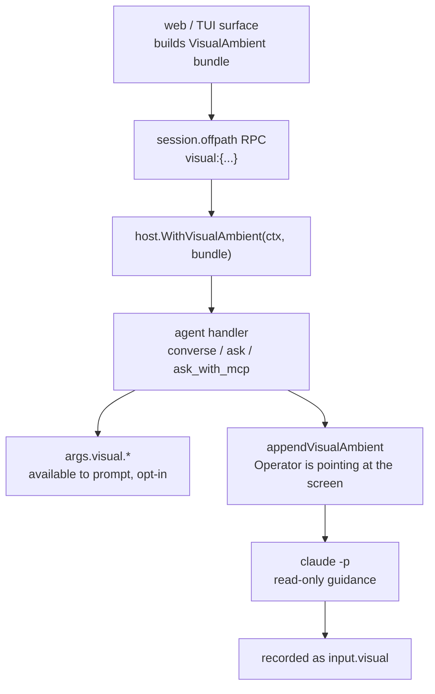

# Visual ambient — feeding a frame + point + element into an oracle

`VisualAmbient` is the screen-context seam, sibling to the editor-context
[`IDEAmbient`](../tui/README.md#editor-awareness-ide). Where `IDEAmbient`
carries *"what's selected in the editor"* (`{file, selection, range}`),
`VisualAmbient` carries *"what's on screen and where the operator is
pointing"*: a captured frame, a click point, and — when a web surface resolved
it — the DOM element under that point.

It is the substrate the **spatial oracle** stands on: pointing at a pixel in a
frame and having the read-only [`converse`/`ask`](hosts.md) oracle answer
*"the `intent-btn-run` you pointed at is disabled because `world.ready` is
false."* The capture surfaces are documented in
[`docs/tui/spatial-capture.md`](../tui/spatial-capture.md) (web) and
[`docs/tui/spatial-handoff.md`](../tui/spatial-handoff.md) (terminal); the
recorded trace shape is in
[`docs/tracing/trace-format.md`](../tracing/trace-format.md#inputvisual--the-spatial-attachment).

The authoritative source is [`internal/host/visual_ambient.go`](../../internal/host/visual_ambient.go).

## The shape

```go
type VisualAmbient struct {
    FrameHandle string          // the captured frame, by artifact handle or path
    Point       struct{ X, Y int } // click position, in frame pixels
    Element     *struct {       // DOM element under Point (nil ⇒ frame+point only)
        Selector string         // e.g. "[data-testid=intent-btn-run]"
        Role     string         // ARIA/semantic role, e.g. "button"
        Text     string         // visible text
        Bbox     [4]int         // [x, y, w, h] in frame pixels
    }
    TMs         int             // timestamp within the source media (0 = standalone shot)
    MediaHandle string          // the source video/recording (empty = standalone)
    Route       string          // the UI route the operator was on
}
```

Everything is optional. A bare point with no element still grounds *"the
operator is pointing here in the frame"*; an absent `Element` is the
forward-compatible seam for the deferred arbitrary-media path (epic non-goal).

## How it threads into an oracle



This mirrors `ide_ambient.go` **exactly** — the principle-of-least-surprise
goal: an author who knows IDE ambient already knows this. The same two surfaces
expose the bundle, both keyed off a context value installed by `WithVisualAmbient`:

| Surface | Function | Behavior |
|---|---|---|
| Template scope | `mergeVisualAmbient` | Adds the reserved `args.visual` key so a prompt may reference `{{ args.visual.element.selector }}` / `.text` / `.point` / `.frame`. An explicit author binding of `visual` wins. |
| Auto preamble | `appendVisualAmbient` / `VisualAmbientPreamble` | Appends the standardized `## Operator is pointing at the screen` block to every operator-facing prompt — no story-author opt-in. Lands on both the plugin (`Dispatch`) and subprocess paths. |

When no surface attached anything (CLI one-shots, flow fixtures, headless
replay, or a chat with no point) `WithVisualAmbient` is a no-op for an empty
bundle, so the template scope and the rendered prompt are **byte-identical** to
a run with no screen context. Pure addition; no migration.

## Frame by path, never bytes

v1 is **text-only** (epic shared decisions 3–4). The preamble describes the
element in words and appends the frame's artifact **path** for the agent to
`Read` on demand — it never inlines image bytes, so the engine never
base64-bloats a prompt with a still. The frame is grabbed by the shipped
[`internal/video.Frame`](hosts.md) extractor (`host.video.frame`) and recorded
through `host.artifacts_dir`; the bundle references it by handle. A future
opt-in flag can have the agent actually `Read` the still for visual grounding,
but no vision model is a dependency in v1.

## Dangling-frame guard

Because the recorded `input.visual` block is the auditable **input** to the
decision, a bundle whose `frame_handle` does not resolve to a recorded artifact
would make the trace un-replayable (*"guidance about what?"*). The oracle
handler consults an injected `FrameResolver` (`WithFrameResolver`, wired from
the orchestrator's journal reader — see
[`host_dispatch.go`](../../internal/orchestrator/host_dispatch.go)) before
stamping the block, and rejects a dangling reference. When no resolver is wired
(flow fixtures without an artifact substrate, headless replay) the check is
skipped and the bundle records as-is — the same posture every other
artifact-substrate seam takes when not wired.

## Read-only — the moat holds

The handler reads the ambient to build a prompt; it never writes world or
advances the machine. "Guidance" is a `converse`/`ask` answer on the existing
read-only [off-path](operator-ask.md) surface. The web tier never calls a
code-writing LLM off a click. The one interpretive step — the oracle's answer —
is recorded as a decision, with the ambient that shaped it recorded alongside
as `input.visual`.

## Beyond rrweb — the anchor union

This page describes the v1 rrweb/live-DOM seam. The flat bundle here is now the
v1 case of a discriminated **anchor union** that generalises annotation to png,
mp4, static HTML, and slidey decks (region drawing, time-ranges, semantic
elements) through one producer-agnostic contract — see
[artifact-annotation](artifact-annotation.md). The bundle stays forward-compatible:
a v1 payload (flat `point`/`element`) normalises into the union unchanged.

## Non-goals

- **A vision-model dependency** — element resolution is textual; the frame path
  is optional grounding. (A pixel/vision fallback for a DOM-less region remains
  bundle-data only — kitsoki records the region but runs no LLM hit-test.)
- **A web-tier write path** — guidance is read-only (shared decision 1).
