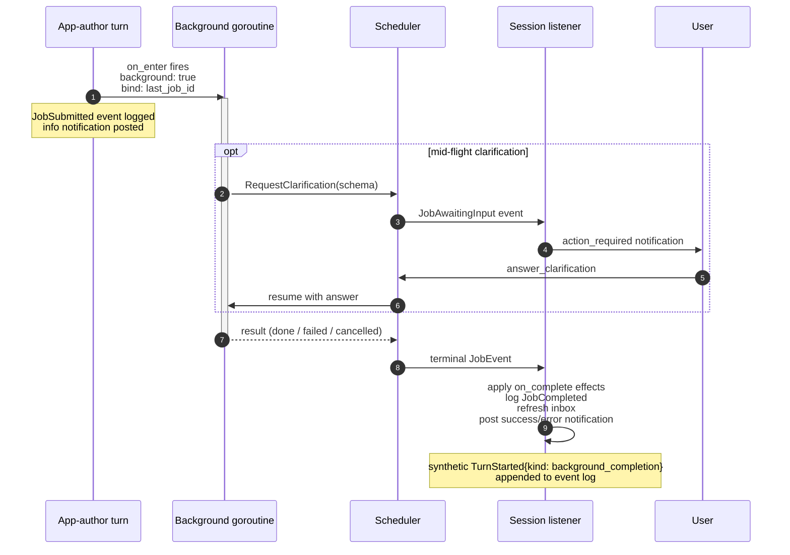

# Background Jobs

Background jobs let a kitsoki state machine invoke a long-running host handler
without blocking the turn loop. The handler runs in a goroutine; when it
finishes, a synthetic turn fires the `on_complete:` effect list in the
originating state's context and posts an inbox notification. The TUI surfaces
the notification immediately without any polling by the app author.

## Quick start

The runnable example lives at
[`testdata/apps/background_jobs/app.yaml`](../../testdata/apps/background_jobs/app.yaml).
Key excerpt:

```yaml
hosts:
  - host.run

world:
  result:     { type: string, default: "" }
  last_job_id: { type: string, default: "" }

states:
  running:
    on_enter:
      - invoke: host.run
        with:
          cmd: "sleep 1 && echo done"
        background: true
        bind:
          last_job_id: job_id
        on_complete:
          - set:
              result: "{{ world.last_job_result.stdout }}"
          - say: "Job complete. Output: {{ world.result }}"
```

Run the flow test that exercises the full lifecycle deterministically:

```sh
kitsoki test flows testdata/apps/background_jobs/app.yaml
```

## Glossary

| Term | Definition |
|------|------------|
| **scheduler** | The `jobs.Scheduler` interface (`internal/jobs/jobs.go`). Accepts a `JobSpec`, starts a goroutine, returns a `JobID`. |
| **JobStore** | SQLite-backed persistence for jobs and notifications (`internal/jobs/store.go`). Write-through: every state transition is persisted immediately. |
| **on_complete** | An ordered `Effect` list declared on a `background: true` effect. Fires once the job reaches a terminal state (done/failed/cancelled). |
| **inbox** | The in-app notification panel. Populated by `jobs.Notification` rows; surfaced in the TUI via a polling ticker. |
| **teleport** | `Orchestrator.Teleport` — a stackless jump to a target state with restored slot bag. Used to navigate from an inbox notification back to the originating state. |
| **clarification** | Mid-flight pause: a background handler calls `host.RequestClarification(ctx, schema)`, which blocks the handler goroutine and posts an `action_required` notification until the user submits an answer. |

## Lifecycle diagram



## Files in this folder

| File | Description |
|------|-------------|
| `README.md` | This file — entry point and quick start. |
| [`authoring.md`](authoring.md) | YAML reference for app authors: `background:`, `bind:`, `on_complete:`, world variables, forbidden patterns, clarification sub-states. |
| [`runtime.md`](runtime.md) | Architecture: component diagram, persistence model, goroutine lifecycle, replay determinism, cycle resolution. |
| [`testing.md`](testing.md) | Flow-fixture guide: `host_handlers:`, `advance_clock:`, `expect_inbox:`, patterns for happy path / error / clarification / notification tests. |
| [`troubleshooting.md`](troubleshooting.md) | Common pitfalls and their fixes. |
| [`recipes.md`](recipes.md) | Runnable patterns: shell commands with progress, mid-job approval, background test suites. |

## See also

- [`embedded/app-schema.md` §Background jobs](../embedded/app-schema.md#background-jobs) — inline summary and field table.
- [`internal/jobs/doc.go`](../../internal/jobs/doc.go) — package-level architecture overview.
- [`testdata/apps/background_jobs/flows/happy_path.yaml`](../../testdata/apps/background_jobs/flows/happy_path.yaml) — the canonical flow fixture.
