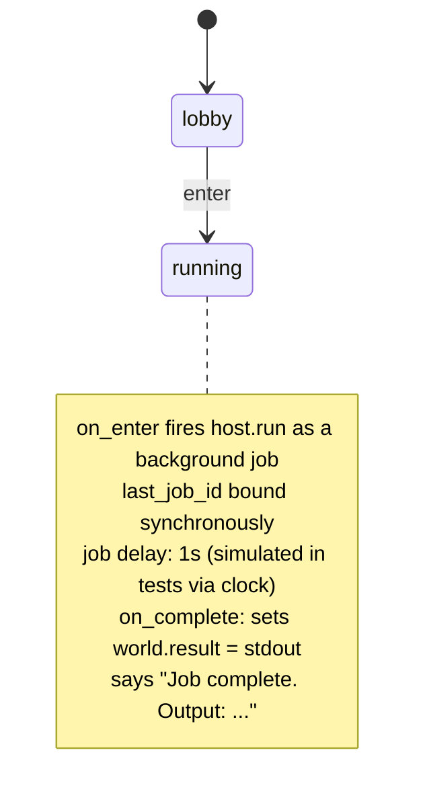

# Authoring Background Jobs

Reference for app authors writing YAML that uses `background: true`.

## The `background` and `on_complete` effect fields

```yaml
on_enter:
  - invoke:     host.my_handler     # required with background: true
    with:
      arg1: "{{ world.some_value }}"
    background:  true               # dispatch as goroutine; do not block the turn
    bind:
      last_job_id: job_id           # see "bind: semantics" below
    on_complete:                    # fires once the job terminates
      - set:   { result: "{{ world.last_job_result.output }}" }
      - say:   "Done. Output: {{ world.result }}"
```

**`background: true`**

Tells the orchestrator to submit this invocation to the scheduler rather than
calling the host handler synchronously. The current turn returns immediately;
the job runs in a separate goroutine.

- Requires `invoke:` to be non-empty (validated at load time).
- Available on `Effect` (in `on_enter:`, `effects:`) and on `ProposalExecute`.
- When `WithScheduler` is not wired into the orchestrator (e.g. bare-machine
  unit tests), `background: true` is silently ignored and the handler runs
  synchronously. See [`runtime.md`](runtime.md#goroutine-lifecycle).

**`on_complete`**

An ordered list of `Effect` values. Fired exactly once per job, in a synthetic
turn, after the job reaches `done`, `failed`, or `cancelled`.

- May not itself contain `background: true` — validated at load time.
- The `__on_complete` payload is serialised into the job's `Payload` map so
  it survives a process restart.

## `bind:` semantics for jobs

When `background: true`, the `bind:` map has one special meaning:

```yaml
bind:
  my_key: job_id   # copy the job's ID into world.my_key
```

- If **any** entry maps to the data key `job_id`, that world key receives the
  submitted `JobID`. The default world key is `last_job_id`.
- `last_job_id` is also set unconditionally, even when a custom key is used,
  so templates can always reference `{{ world.last_job_id }}`.

Example — custom key:

```yaml
bind:
  build_job: job_id   # world.build_job = <jobID>; world.last_job_id = <jobID> too
```

## Injected world variables in `on_complete:`

These variables are set by the orchestrator's synthetic turn and are available
inside `on_complete:` effect templates:

| Variable | Type | Value |
|---|---|---|
| `last_job_id` | string | Job ULID — same value bound at dispatch. |
| `last_job_status` | string | `"done"` / `"failed"` / `"cancelled"` |
| `last_job_result` | map | `host.Result.Data` returned by the handler — e.g. `{stdout, exit_code}` for `host.run`. |

> **Note:** `last_job_result` equals `handler.Result.Data` — the inner data
> map — not the wrapping `host.Result` struct. Access fields directly:
> `{{ world.last_job_result.stdout }}`.

These variables are injected only during the `on_complete:` synthetic turn.
They are not present in the app's `world:` schema and will be empty in a
regular state `view:` outside of that turn.

## Same-turn race

A `background: true` effect followed by another effect in the **same**
`on_enter:` or `effects:` block:

```yaml
on_enter:
  - invoke: host.run
    with: { cmd: "..." }
    background: true
    bind: { last_job_id: job_id }
  - say: "Launched job {{ world.last_job_id }}"   # ✓ last_job_id is set
  - set: { result: "{{ world.last_job_result }}" } # ✗ last_job_result is EMPTY here
```

The `bind:` for `job_id` is applied synchronously in the same turn. However,
`last_job_result` is only available in the `on_complete:` chain (a later
synthetic turn). Use `on_complete:` to act on the result.

## `target:` inside `on_complete:` — auto-advance after a job

By default an `on_complete:` chain only applies its mutations and posts an
inbox notification; the session stays in the state where the background job
was launched (typically a `*_executing` placeholder).  To auto-advance once
the job terminates, set `target:` on an effect in the chain:

```yaml
on_enter:
  - invoke: host.run
    with: { cmd: "long-task.sh" }
    background: true
    bind: { last_job_id: job_id }
    on_complete:
      - set: { last_run_ok: "{{ world.last_job_status == 'done' }}" }   # mutate
      - say: "phase complete"                                          # narrate
      - target: phase_done                                             # advance
```

**Semantics.**

- The orchestrator scans the chain top-to-bottom for the FIRST effect with
  `target:` set whose `when:` guard (if any) passes against the post-effects
  world.  That one wins — subsequent `target:` effects are warn-logged and
  ignored.
- The transition is synthetic: it emits
  `TransitionApplied → StateExited → StateEntered` and runs the target
  state's `on_enter:` effects, exactly like a foreground transition.
- The TUI observer (`OnBackgroundTurn`) fires with
  `outcome.NewState=<target>` once everything is committed, so the
  transcript auto-refreshes without the operator typing anything.
- The PR-refinement / bug-fix-style "executing → done" pattern is the main
  use case — see `stories/bugfix/app.yaml`.

**Restrictions** (rejected at load time):

- `target:` outside `on_complete:` is a hard error.  Use a normal
  transition's `target:` for in-turn transitions; `target:` on an
  `on_complete:` effect fires only at the END of a background job.
- `target:` combined with `set:` / `increment:` / `say:` / `invoke:` /
  `bind:` on the SAME effect is rejected.  Declare the mutation and the
  transition as separate effects (so the chain reads "mutate, then
  transition").  This avoids ambiguity about whether the new state's
  `on_enter:` runs before or after the mutation lands.

**Fail-fast.** If an EARLIER effect in the chain errors (bad template,
unresolved expression, etc.) the entire synthetic turn aborts and
`target:` is suppressed.  The session stays where it was — the
invariant is "no advance on partial application".  Authors get a loud
error log and can re-run.

**`on_error` precedence.** If a host call inside the on_complete chain
hits its `on_error:` redirect, the session lands on the error state and
the `target:` dispatch is suppressed.  `on_error` is itself a
state-change; `target:` defers to it.

## Forbidden patterns (loader rejects)

The loader (`internal/app/loader.go`) reports these as load errors:

1. **`background: true` without `invoke:`**

   ```yaml
   # BAD — background requires a handler to invoke
   - set: { x: 1 }
     background: true
   ```

2. **`background: true` inside `on_complete:`** (at any depth)

   ```yaml
   on_complete:
     - invoke: host.something
       background: true   # BAD — recursion forbidden
   ```

3. **Nested `on_complete:` inside `on_complete:`** — the validator recurses into
   child effects and rejects any `background: true` it finds, so deeply nested
   chains are also caught.

4. **`target:` outside `on_complete:`**

   ```yaml
   # BAD — target: on a regular on_enter effect is meaningless
   on_enter:
     - target: somewhere
   ```

5. **`target:` mixed with mutations on the same effect**

   ```yaml
   # BAD — split into two effects: one mutate, one transition
   on_complete:
     - set: { x: 1 }
       target: done
   ```

6. **`target:` pointing at a non-existent state** — the path is resolved
   against the declared state graph at load time.

## Clarifications: the `*_clarifying` sub-state pattern

A background handler can pause mid-execution and ask the user a question via
`host.RequestClarification`. On the YAML side, you need a sub-state that
handles the `answer_clarification` intent.

Add `host.jobs.answer_clarification` to your `hosts:` allow-list and declare a
clarifying sub-state adjacent to the originating state:

```yaml
hosts:
  - host.run
  - host.jobs.answer_clarification   # built-in; no extra Go registration needed

intents:
  answer_clarification:
    title: "Answer clarification"
    slots:
      job_id: { type: string, required: true }
      answer: { type: string, required: true }

states:
  processing:
    description: "Running the long task."
    view: "Running… job {{ world.last_job_id }}"
    on_enter:
      - invoke: host.my_task
        background: true
        bind: { last_job_id: job_id }
        on_complete:
          - say: "All done!"

  processing_clarifying:
    description: "Job needs your input."
    view: |
      Job {{ world.last_job_id }} needs a clarification.
    on:
      answer_clarification:
        - target: processing
          effects:
            - invoke: host.jobs.answer_clarification
              with:
                job_id: "{{ slots.job_id }}"
                answer: "{{ slots.answer }}"
```

**How the round-trip works:**

1. The handler goroutine calls `host.RequestClarification(ctx, schema)` and
   blocks.
2. The orchestrator's session listener receives `JobAwaitingInput` and posts an
   `action_required` notification. The notification's `TeleportState` is the
   job's origin state.
3. The TUI surfaces a banner; the user selects it and is teleported to
   `processing_clarifying` (or the TeleportState, which should have
   `answer_clarification` in its `on:` map).
4. The user fires `answer_clarification` with `{job_id, answer}`. The
   `host.jobs.answer_clarification` built-in handler writes the answer to the
   DB and flips the job back to `running`.
5. The handler's poll loop returns the raw JSON answer; the job resumes
   normally.
6. On completion, `on_complete:` fires as usual.

> **Important:** The `TeleportState` in the notification is the job's
> `OriginState` — the state where `background: true` was declared. Make sure
> that state (or a `*_clarifying` sub-state that is reachable from it) handles
> `answer_clarification`.

## Walk-through: `testdata/apps/background_jobs/app.yaml`



Full source: [`testdata/apps/background_jobs/app.yaml`](../../testdata/apps/background_jobs/app.yaml)

The corresponding flow test is at
[`testdata/apps/background_jobs/flows/happy_path.yaml`](../../testdata/apps/background_jobs/flows/happy_path.yaml).

## Chat-aware background turns

When a `host.oracle.converse` or `host.oracle.decide` invocation carries a
`chat_id:` arg and the orchestrator has been wired with a chat store
(`orchestrator.WithChatStore(...)`), the handler runs in chat-aware mode:
the user message and assistant reply are persisted to a transcript, the
Claude session ID is reused across turns, and a per-chat singleton lock
serialises concurrent drivers (TUI vs orchestrator vs `kitsoki chat
continue`). The `last_job_result` payload carries `chat_id`,
`claude_session_id`, `transcript_seq`, and `answer` (or `stdout`).

A complete recipe — including how to obtain a `chat_id` via
`host.chat.resolve` on `on_enter:` — is in
[`recipes.md` §Chat-aware background turn](recipes.md#chat-aware-background-turn).

The completionNotification path is chat-aware: a successful chat turn
produces "Reply ready — <60-char preview>" with the answer body,
distinguishing it from generic "Job done: <kind>" notifications.

## See also

- [`README.md`](README.md) — entry point and glossary.
- [`recipes.md`](recipes.md) — runnable patterns including the chat-aware turn.
- [`testing.md`](testing.md) — how to test background jobs in flow fixtures.
- [`runtime.md`](runtime.md) — how the orchestrator processes these fields at runtime.
- [`embedded/app-schema.md` §Background jobs](../embedded/app-schema.md#background-jobs) — field reference table.
