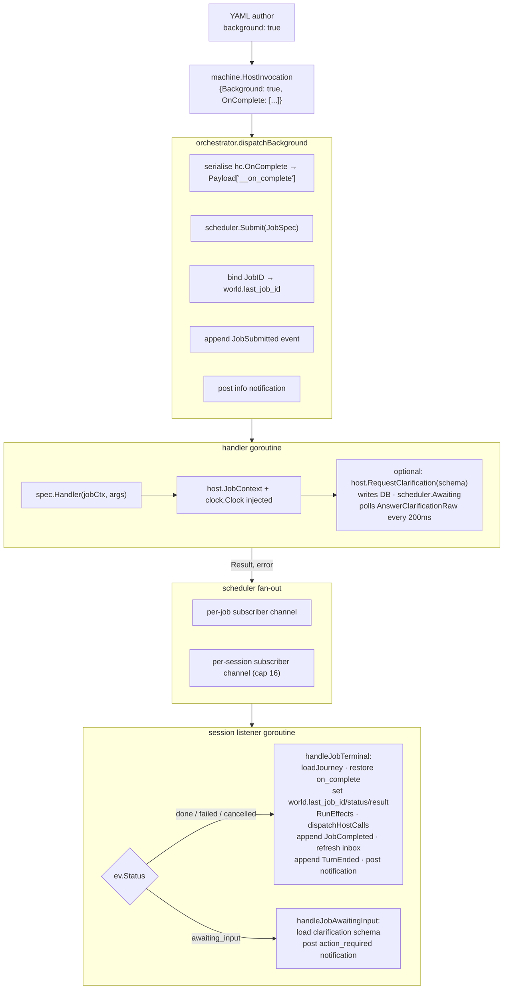

# Runtime Architecture

How the background-jobs subsystem is wired together.

## Component diagram



## Persistence model

Two SQLite tables are created by `jobs.NewJobStore` via an embedded migration:

**`jobs`** — one row per submitted job. Key columns:

| Column | Notes |
|--------|-------|
| `id` | ULID string |
| `session_id` | ties the row to a session |
| `kind` | handler namespace (e.g. `host.run`) |
| `status` | `running` / `awaiting_input` / `done` / `failed` / `cancelled` |
| `origin_state` | state where `background: true` was declared |
| `payload` | JSON — includes handler `with:` args plus `__on_complete` |
| `result` | JSON — `host.Result` on terminal transition |
| `clarification_schema` | JSON `ClarificationSchema` when `awaiting_input` |
| `clarification_answer` | raw JSON answer once submitted |

**`notifications`** — one row per inbox entry:

| Column | Notes |
|--------|-------|
| `severity` | `info` / `success` / `warn` / `error` / `action_required` |
| `teleport_state` | destination for `Orchestrator.Teleport` |
| `teleport_job_id` | job ID carried to the destination |
| `teleport_slots` | additional slots to merge into world |

The `__on_complete` payload key is the mechanism for surviving process restarts.
`dispatchBackground` serialises the `on_complete []app.Effect` slice to JSON and
stores it in `Payload["__on_complete"]`. `handleJobTerminal` recovers it with
`json.Unmarshal` — `app.Effect` uses only primitive/composite types with `json`
tags so the round-trip is lossless.

## Goroutine lifecycle

**Per-job goroutine** (in `inMemoryScheduler`):

- Spawned by `Submit`. Runs `spec.Handler(jobCtx, argsWithID)`.
- On return: updates in-memory status, writes final row via `UpdateJobStatus`,
  fans out to per-job and per-session channels, decrements `runningCount`.
- Cancelled when `scheduler.Cancel` is called or the context is cancelled.

**Per-session listener goroutine** (in `orchestrator`):

- Spawned by `NewSession` when a scheduler is wired.
- Reads from `SubscribeSession(sid)` — a buffered channel (capacity 16).
- Routes events to `handleJobTerminal` or `handleJobAwaitingInput`.
- Torn down when the session reaches a terminal state (in `Turn`) or when
  `stopSessionListener` is called explicitly.
- Tracks an in-flight counter (`dispatchCount`) for `WaitListenerIdle`.

**Idle detection** (required in tests):

```go
// Correct order: scheduler first, then listener.
if err := sched.WaitIdle(ctx); err != nil { ... }
// Brief yield so the buffered channel event reaches the listener goroutine.
if err := orch.WaitListenerIdle(ctx, sid); err != nil { ... }
```

`WaitIdle` blocks until `runningCount == 0` (all jobs are terminal or
`awaiting_input`). `WaitListenerIdle` blocks until `dispatchCount == 0` (all
events received from the channel have been fully processed).

> **Note:** `advanceAndWait` in `testrunner/flows.go` uses an entirely
> event-driven drain algorithm: it calls `WaitIdle` + `WaitListenerIdle`
> in a loop, then performs a non-blocking channel drain to detect cascading
> on_complete dispatches.  No real-time sleep is used; the outer context
> deadline (typically 5 s) is the hard cap.

## Replay determinism

The event log is the authoritative record. After a job completes, the log
contains the following events **in this order** (verified against
`internal/orchestrator/oncomplete.go`):

1. **`TurnStarted{kind: "background_completion"}`** — opens the synthetic turn.
2. **`EffectApplied`** events — one per world variable mutation inside `on_complete:`.
3. **`JobCompleted`** — records the terminal transition. Payload: `{job_id, status}`.
4. **`EffectApplied{set: {$inbox: ...}}`** — refreshes the unread badge (emitted by
   `inbox.RefreshSummary` when `jobStore` is configured).
5. **`TurnEnded`** — closes the synthetic turn.

In the submit turn (the turn that dispatched the background job), the log also
contains:

- **`EffectApplied{set: {<bind_key>: job_id}}`** — one event for the explicit
  `bind:` key (or `last_job_id` by default).
- **`EffectApplied{set: {last_job_id: job_id}}`** — a second event emitted
  unconditionally when a custom bind key was used (so `last_job_id` is always
  in the log regardless of `bind:` configuration).
- **`JobSubmitted`** — records the dispatch. Payload: `{namespace, job_id, state}`.

`store.BuildJourney` replays `EffectApplied` and `TransitionApplied` events to
reconstruct world state, so post-completion world values are deterministic
without a live DB call.

The `jobs` table holds current-state materialised views; the event log is
authoritative. Stale `running` rows after a process restart are not yet
automatically cleaned up (see `TODO(supervisor-scan)` in `internal/jobs/doc.go`).

## Cycle resolution

`internal/jobs` imports `internal/host` (for `host.Handler` and
`host.Result`). `internal/host` cannot import `internal/jobs` in return —
that would be a cycle.

The cycle is broken by two narrow interfaces declared in `internal/host`:

- **`host.ClarificationRequester`** — the subset of `*jobs.JobStore` that a
  handler needs to call mid-flight (`RequestClarificationAny`,
  `AnswerClarificationRaw`). `*jobs.JobStore` satisfies this via structural
  typing.

- **`host.ClarificationAnswerer`** — the subset needed by the built-in
  `host.jobs.answer_clarification` handler (`AnswerClarification`). Injected
  into the context by the orchestrator before dispatching foreground effects.

Neither interface names the `jobs` package. No import of `jobs` from `host`.

## See also

- [`README.md`](README.md) — entry point and lifecycle diagram.
- [`authoring.md`](authoring.md) — YAML reference.
- [`testing.md`](testing.md) — how to test with the fake clock and flow fixtures.
- [`internal/jobs/doc.go`](../../internal/jobs/doc.go) — package-level overview.
- [`internal/orchestrator/effects.go`](../../internal/orchestrator/effects.go) — `dispatchBackground`.
- [`internal/orchestrator/oncomplete.go`](../../internal/orchestrator/oncomplete.go) — `handleJobTerminal`.
