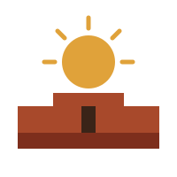
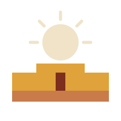
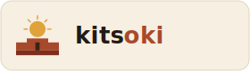
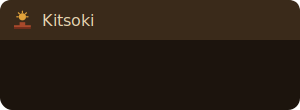
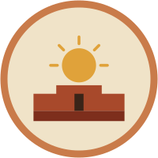

# Kitsoki logo — the Mesa Sun

## Name

**Kitsoki** (*kit-soh-kee*) is a Hopi word for a contemporary settlement — a
collection of houses, ceremonial chambers, and public plazas arranged into one
living whole. The metaphor fits a conversational workflow engine that hosts many
surfaces (TUI, daemon, Jira, Bitbucket) as connected rooms under one
architecture.

The Chacoan ancestors of today's Pueblo peoples practiced astronomy at a level
modern archaeologists still find striking:

- Great houses at Chaco Canyon are oriented to the cardinal directions and to
  the 18.6-year lunar standstill cycle.
- The Sun Dagger on Fajada Butte uses three rock slabs to cast light-and-shadow
  markers onto a spiral petroglyph at the solstices and equinoxes.
- The Great North Road runs almost exactly due north from Chaco for about sixty
  kilometers across broken terrain.

The name is a small acknowledgment of serious pre-Columbian scientific and
architectural work encoded into the built landscape.

Sources for the term and the architectural vocabulary it sits in:

- Whiteley, Peter. *[Chacoan Kinship](https://www.amnh.org/content/download/67776/1174292/file/chacoan-kinship.pdf)*. American Museum of Natural History.
- Kuwanwisiwma, Leigh J., T. J. Ferguson, and Chip Colwell, eds. (2018).
  *[Footprints of Hopi History: Hopihiniwtiput Kukveni'at](https://uapress.arizona.edu/book/footprints-of-hopi-history)*.
  University of Arizona Press.

## Mark

The Kitsoki mark is the **Mesa Sun**: a desert sun rising over a stepped, terraced
dwelling. It draws on the architecture of Hopi / Ancestral Puebloan cliff-dwelling
settlements — flat-topped mesas, terraced pueblos, and a single doorway — rendered as
abstract geometry rather than literal depiction.

> **On the theme.** The mark deliberately stays with *architecture and light* —
> terraces, a doorway, a sun with evenly-fanned rays. It does **not** use kachina
> figures, ceremonial symbols, or any sacred imagery, which carry real cultural weight
> and are not ours to genericize. Keep future variations on the same respectful side of
> that line.

---

## The mark

| | |
|---|---|
|  | **Full mark.** The primary logo. A sun with five rays evenly fanned at 45° across the upper half, above a two-tier terraced dwelling with a doorway. Use at **32 px and above**. |

### Anatomy

- **Five rays, even 45° spacing.** Rays sit at 0°, 45°, 90°, 135° and 180° around the
  sun's centre — perfectly symmetric, with the two outermost rays horizontal. All rays
  share one inner and outer radius, so they read as a clean fan, not a scatter.
- **Terraced dwelling.** A raised central block (the "second floor") steps down to lower
  wings, sitting on a darker ground band — the stepped silhouette of a cliff settlement.
- **Doorway.** A single dark opening centres the building (full mark only).
- **Clear gap.** Sun and building never touch; the negative space between them is part of
  the mark.

---

## Variations

### Simplified glyph — for ≤ 24 px

Below ~24 px the full mark's doorway and thin rays collapse into noise. The simplified
glyph is built for small sizes:

- **doorway dropped**, single-tier-to-wings building with a **taller central block**,
- **thicker rays and strokes** so the shapes survive downsampling,
- still the full **five-ray** fan for brand consistency.

Use it for favicons, small browser-tab icons, and anywhere the mark renders at 16–24 px.

### Monochrome — single-colour / template icon

A solid single-colour silhouette that inherits `currentColor`, with **no internal
cut-outs** so it never fills in at small sizes. Drop it in as a template/mask icon and let
the host tint it for theme colour and hover/selected states. Intended for:

- **VS Code activity-bar** icons (grey when idle, accent when active),
- **menu-bar / system-tray** template images,
- tool-window tabs and any monochrome chrome.

### Light variant — for dark / coloured tiles

A re-coloured full mark (sand sun, lighter building) for use on dark or clay-coloured
app-icon tiles where the default rust building would disappear.

---

## In context

The mark across the forms a logo actually ships in — a light app bar with the
wordmark, window / browser-tab chrome, and a circular avatar.

| | |
|---|---|
|  | **App bar / wordmark.** Full mark beside "kits<b>oki</b>" — lowercase humanist sans, the trailing *oki* set in Clay. For paper / sand surfaces. The [README](../../README.md) header uses the same lockup on transparent (`mesa-sun-wordmark.svg`). |
|  | **Window / tab chrome.** Simplified glyph + label on a dark title bar — the favicon-scale placement. |
|  | **Avatar.** Full mark centred on a paper disc inside an Adobe ring — for profile / identity spots. |

---

## Palette

| Role | Name | Hex |
|---|---|---|
| Sun | Gold | `#e0a23a` |
| Building | Clay | `#a8492b` |
| Building (light tier / accents) | Adobe | `#c97b4a` |
| Ground / shadow | Rust | `#7d2e1c` |
| Doorway / deep shadow | Mesa shadow | `#3a2418` |
| Light fields / reversed mark | Sand / Paper | `#e8d6b3` / `#f0e3c8` |
| Optional cool accent | Turquoise | `#3aa3a0` |

Backgrounds the mark is tuned for: **paper** `#f6efe2`, **sand** `#e8d6b3`, **dark**
`#1c140d`, **desert sky** `#2b4a6f`.

---

## Usage guidance

**Sizing**
- ≥ 32 px → full mark (`mesa-sun.svg`).
- ≤ 24 px → simplified glyph (`mesa-sun-simple.svg`).
- Any monochrome chrome → mono glyph (`mesa-sun-mono.svg`).

**Clear space.** Keep padding of at least the sun's radius around the mark. On rounded
app-icon tiles, ~10 % padding reads better than the platform-max safe area — don't shrink
the mark to float in the middle of the tile.

**Backgrounds.** Use the default mark on light/sand surfaces; use the **light variant** on
dark or clay tiles; use the **mono** glyph wherever the host supplies the colour.

**Wordmark.** Pair the mark with "kitsoki" set lowercase in a humanist sans, or small-caps
with extra letter-spacing — the trailing *oki* in Clay. The prebuilt lockup is
`mesa-sun-wordmark.svg` (transparent). The mark also stands alone.

### Don't

- Don't re-space the rays unevenly or drop them to fewer than five (use the prebuilt
  simplified glyph instead of hand-trimming).
- Don't let the sun touch or overlap the building.
- Don't recolour outside the palette or add gradients/shadows to the glyph itself.
- Don't add kachina, ceremonial, or other sacred Puebloan imagery.
- Don't stretch — scale uniformly.

---

## Files

All assets live in [`assets/`](assets/):

| File | Use |
|---|---|
| `mesa-sun.svg` | Primary full mark (≥ 32 px) |
| `mesa-sun-simple.svg` | Simplified glyph (≤ 24 px, favicons) |
| `mesa-sun-mono.svg` | Monochrome / template icon (`currentColor`) |
| `mesa-sun-light.svg` | Full mark recoloured for dark/clay tiles |
| `mesa-sun-avatar.svg` | Full mark on a paper disc with an Adobe ring (avatars / profile spots) |
| `mesa-sun-wordmark.svg` | Mark + "kitsoki" lockup, transparent (README header) |
| `context-appbar.svg` | Wordmark on a light app bar ("in context" mock) |
| `context-tab.svg` | "In context" mock — glyph + label in window / tab chrome |

The exploratory set — all ten original concepts and an interactive size/variation
preview — lives under `.artifacts/kitsoki-logos/` (not committed).
