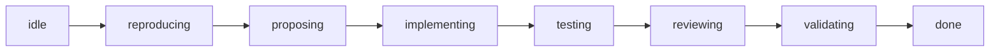

# Case study: bug-fix

This is the case study the rest of kitsoki was built around. It walks
a single workflow — "an engineer reports a bug; the system produces a
merged fix" — from its original shape (a Claude Code agent in a loop,
driven by one large prompt) to its current shape (a seven-room
deterministic pipeline that calls the LLM five times for narrow,
typed sub-tasks). The shipping implementation lives in
[`stories/bugfix/`](../../stories/bugfix/).

The point isn't the bug-fix domain. It's to show what
[progressive determinism](../architecture/concept.md#4-progressive-determinism)
*feels like* when you apply it to a workflow you already have running.

---

## 1. Where we started

The first version was the obvious one. A single Claude Code agent
loop, one large system prompt, and a few MCP tools (file edit, shell,
git). The prompt did the load-bearing work:

```
You are a bug-fixing agent. When the user gives you a bug:

  1. ALWAYS reproduce the bug first. Write a failing test that
     demonstrates the bug before you do anything else. YOU MUST NOT
     skip this step.
  2. Propose a fix. Describe the root cause and the change you're
     going to make. Wait for confirmation before editing code.
  3. Implement the fix. Edit only the files necessary for the fix.
  4. Run the full test suite. If it fails, iterate.
  5. Open a PR with a clear title and description.

Do NOT skip steps. Do NOT combine steps. Do NOT touch unrelated
files. Always summarise what you did at the end.
```

The loop ran. It even worked, often. But reading the trace across
twenty or so sessions, the same failure modes kept coming back.

### What the prompt couldn't enforce

| Prompt rule | What actually happened |
|---|---|
| "ALWAYS reproduce first." | On bugs that *looked* obvious, the agent skipped repro and jumped straight to a fix. The fix was sometimes right; when it was wrong, there was no failing test to catch the regression. |
| "Wait for confirmation before editing code." | The agent waited on the first turn, then on later iterations forgot and edited directly. The user only noticed when files showed up modified. |
| "Run the full test suite." | On bugs touching slow tests, the agent ran a narrower subset, declared "tests pass", and moved on. The CI run on the eventual PR caught it — sometimes. |
| "Do NOT touch unrelated files." | When the agent saw nearby code that "looked broken", it patched it. The PR diff doubled in size; review time tripled. |
| "Always summarise what you did at the end." | The summary often misrepresented what was actually done — what the agent *intended* to do, not what it did. |

None of these are fixable with more prompt engineering. We tried.
Adding "CRITICAL: NEVER skip step 1" promoted reproduction in some
cases but caused the agent to spend three turns writing a repro for
a one-line typo fix. Adding "If the bug is trivial, skip step 1"
brought the original failure mode back. The prompt could not hold a
contract; the LLM negotiated with it on every turn.

### Reading the trace

The real signal came from the trace. With the loop instrumented, we
could count the decisions the LLM was actually making:

- **Phase selection.** "Am I in reproduce, propose, implement, test,
  or review?" — asked, implicitly, on every turn. The LLM held this
  in conversational memory, which is to say it *also* held it nowhere.
- **Phase completion.** "Is the reproduction done? Is the fix
  complete? Are the tests sufficient?" — asked, implicitly, every
  turn. The same question rephrased a dozen ways across the run.
- **Reproduction shape.** "Does the bug repro? How do I know?" —
  answered sometimes by a failing test, sometimes by a paragraph of
  prose that said "yes the bug is real."
- **Acceptance.** "Did the user accept this fix?" — answered by
  scanning the last user message for words like "looks good" or
  "ship it."
- **Refinement scope.** "When the user asks for a change, do I redo
  the repro, or just the fix?" — answered by whatever felt right.

Every one of these is a decision the LLM was being asked to make,
repeatedly, in fundamentally the same form, across every session.
That is the signal that the decision should move into the state
machine. The trace was telling us where the prompt was leaning on
the LLM to do a job a few lines of YAML could do once.

---

## 2. The first conversion: rooms for the phases

The cheapest move was to make the phases *real*. Instead of a single
agent loop with a prompt that begged it to walk through five steps,
each phase became a room:



This is a literal directed graph. The runtime knows which room it is
in. Transitions between rooms happen along named edges (`accept`,
`refine`, `proceed`, `restart_from`, `jump_to`) that the author
declared in YAML — not by the LLM deciding "I think we're done with
step 1 now."

The immediate consequences:

- **The "what phase am I in?" question is no longer an LLM
  decision.** It's a room name in the world state. The view tells the
  user which room they are in. The trace records the transition.
- **Phase completion is no longer an LLM decision.** Each phase ends
  by emitting a typed artifact (see §3) and the operator (or a judge,
  see §5) fires `accept` or `refine` on that artifact. The LLM
  inside the phase does not get to declare itself done.
- **Skipping a phase is now an explicit operator action.** The
  `quick_fix` and `skip_to_pr` shortcut intents are declared edges
  from `idle`; they fire only on operator request and they leave a
  trace entry. There is no more "the agent thought this was trivial
  so it skipped."

Each room has one or two substates: `_executing` (the LLM is
producing the artifact for this phase) and `_awaiting_reply` (the
artifact is posted; the loop is waiting for `accept` / `refine`).
The substate boundary is also deterministic — the LLM does not get
to decide it is still working.

What did this cost? Roughly 200 lines of YAML for the seven rooms
and their `_executing` / `_awaiting_reply` substates. The prompt
shrank by an order of magnitude, because everything in the
"ALWAYS / NEVER / YOU MUST" register was now expressed in the graph.

---

## 3. The second conversion: typed artifacts at every boundary

The next move addressed the *output* of each phase. In the prompt-only
version, the LLM's output between phases was whatever it felt like
saying — usually a paragraph mixing summary, plan, and request for
confirmation. The user had to parse all three.

Each phase now produces a **typed artifact** — a JSON object with a
schema declared in [`stories/bugfix/schemas/`](../../stories/bugfix/schemas/):

| Phase | Artifact | Carried as |
|---|---|---|
| reproducing | `reproduction_artifact` | typed evidence — see §4 |
| proposing | `propose_fix_artifact` | root cause + plan + files-to-touch |
| testing | `implement_review_artifact` | test results + a structured review |
| validating | `validate_artifact` | full-env outcome (CI, integration) |
| done | `done_artifact` | postmortem-style close-out |

The artifact is what gets posted to the conversation transport. It
is what an LLM-judge reads when it decides `accept` / `refine`. It
is what `restart_from` rewinds to. It is what the parent story
(e.g. pr-refinement) consumes as `world_out`. The artifact is the
contract between phases.

This is the second part of progressive determinism. The prompt
register that says "summarise what you did at the end" is replaced
by a schema. There is no negotiation about format. The LLM either
produces a valid artifact or it doesn't, and if it doesn't, the
runtime catches it before the artifact reaches the operator.

---

## 4. The third conversion: a failing test, not a verdict

The reproduction phase is the most interesting one, and it's where
the case study earns its claim about progressive determinism.

In the prompt-only version, "reproduce the bug" meant *the LLM said
the bug was real*. Sometimes it wrote a failing test. Sometimes it
ran the existing test suite and observed a failure. Sometimes it
wrote a paragraph that said "I have verified this bug reproduces by
inspecting the code." All three were treated as completion.

In the current shape, the reproduction artifact is a **failing test
the runtime can re-run**. Not a JSON object with a boolean
`reproduces: true`. Not a paragraph of evidence. A test, checked
into the worktree, that exits non-zero against the unfixed code and
zero against the fixed code.

This is the difference [concept.md §3](../architecture/concept.md#interpretation-has-two-shapes--and-one-is-better)
calls out: schema-validated object vs. script-producing form. A
`reproducing_artifact: { reproduces: true, evidence: "..." }` would
have validated. It would have looked done. But it would have meant
exactly as much as the LLM said it did. A failing test means
something the runtime can verify, and keeps meaning it after the
fix lands — it's the regression guard.

The conversion looks small on paper (the prompt for `reproducing`
asks for a test rather than a verdict; the artifact schema points at
a test file rather than holding a boolean) but it changes what
"reproduced" *means* in the trace. The interpretation moved from a
one-shot LLM act to an artifact anyone — operator, judge, future
session, CI — can re-execute.

---

## 5. The fourth conversion: deterministic boundaries

The most surprising win was at the boundaries between phases. In
the prompt-only version, the agent loop *itself* decided when to
move on. "I think the user accepted, moving to implementation." It
got this wrong sometimes — accepting on a question, refining on an
approval, ignoring both and just continuing.

The current shape replaces this with a small, named intent
vocabulary at every `_awaiting_reply` substate:

| Intent | What it means | Who fires it |
|---|---|---|
| `accept` | Advance to the next phase. | Operator, or an LLM-judge in `judge_mode=llm`. |
| `refine` | Re-execute this phase with feedback. Increments `<phase>_cycle`. | Same. |
| `restart_from` | Rewind to an earlier phase. Resets that phase's cycle counter. | Operator. |
| `jump_to` | Skip forward (audited via `unsafe_jumps_made`). | Operator. |
| `quit` | Bail to `@exit:abandoned`. | Either. |

These are the only ways out of `_awaiting_reply`. There is no
implicit "the LLM senses agreement and moves on" path. The runtime
either receives one of these intents or holds the state.

The LLM can still drive the boundary — `judge_mode=llm` runs an
LLM-judge over the artifact and emits `accept` or `refine` if its
confidence clears `judge_confidence_threshold`. But the judge's
output is *the named intent*. It is not an open-ended
"yeah ship it" string. It is `{verdict: accept, intent: accept,
confidence: 0.91, reason: "..."}`, validated against
`schemas/judge_verdict.json`, and the runtime dispatches the intent
through the same edge an operator would have used.

This is what concept.md means by "the LLM's return arrow is what
matters." The judge contributes a named intent into the state
machine; it does not get to choose where the conversation goes next.

### The judge polymorphism

A single world flag, `judge_mode`, switches between three policies
at *every* checkpoint:

- `human` — wait for the operator. No LLM call.
- `llm` — run the judge; auto-fire its intent if confident enough.
- `llm_then_human` — same as `llm` for the auto-fire path; falls
  through to the human on uncertainty.

The seven `_awaiting_reply` states all have **identical** on-enter
shapes. The polymorphism is a single host call gated by `when:`, not
a fork in the graph. This is impossible to express cleanly in a
prompt — the same instructions would have to mean different things
in different modes. As deterministic YAML, it's three lines of
`when:` per checkpoint.

---

## 6. The fifth conversion: cycle budgets

The last move was the runtime taking responsibility for *not
looping forever*.

In the prompt-only version, the loop kept going as long as the
user kept replying. If the agent and the user got stuck — the user
asking for changes, the agent producing slightly-different versions
— there was no stopping condition except the user closing the tab.

Each checkpointed phase now has a per-phase refinement counter
(`<phase>_cycle`) and a per-phase budget (`<phase>_budget`, default
3). The `refine` edge increments the counter; when the counter hits
the budget, the next `refine` fires `@exit:abandoned` instead of
re-entering the phase. The runtime gives up so the LLM doesn't have
to learn to.

`restart_from` resets the target phase's counter to zero — the
operator can deliberately spend a fresh budget. `jump_to` increments
an audit counter (`unsafe_jumps_made`) so the trace flags fast-pathed
runs.

This is a small piece of YAML. It catches a failure mode no amount
of prompt engineering caught.

---

## 7. What survived in the LLM domain

After all five conversions, the LLM is still doing real work — in
five specific places:

| Where | What | Why it stayed |
|---|---|---|
| `reproducing_executing` | Write a failing test + short narrative. | The work is genuinely creative: turn prose into code that exercises the bug. The *output* is a deterministic artifact (the test). |
| `proposing_executing` | Identify the root cause; describe the fix; name the files. | Same shape: open-ended reasoning over the repo, narrowed output (a structured proposal). |
| `testing_executing` | Run the tests; interpret failures. | Interpretation of test output is genuinely interpretive — flaky tests, unrelated regressions, message wording. |
| `validating_executing` | Watch the full-env run; summarise outcome. | Same. |
| `done_executing` | Compose the close-out artifact. | Pure summarisation of structured inputs. |

And optionally, at each checkpoint:

- `judge_*` — emit a named intent (`accept` / `refine` / `quit`)
  with a confidence score, given the artifact and the world snapshot.

That's it. Phase selection, phase completion, intent dispatch, edge
firing, cycle budgeting, artifact validation, the conversation
transport, the audit trail — all deterministic. The LLM does what
LLMs are good at (open-ended reasoning inside a bounded sub-task) and
the runtime does what runtimes are good at (knowing what state we're
in and what comes next).

---

## 8. Side-by-side

| Concern | Prompt-only loop | bugfix pipeline |
|---|---|---|
| Phase selection | LLM holds in context; sometimes wrong. | Room name in world; trace-recorded. |
| "Did the user accept?" | LLM infers from last message. | `accept` intent or nothing. |
| "Is the bug reproduced?" | LLM says yes. | A failing test that the runtime can re-run. |
| Phase output format | Whatever the LLM wrote. | Schema-validated typed artifact. |
| Skipping a step | LLM judgement, often silent. | Explicit `quick_fix` / `skip_to_pr` / `jump_to` intent. |
| Infinite refinement | Loops until the user gives up. | `<phase>_cycle ≥ <phase>_budget` → `@exit:abandoned`. |
| Switching to autonomous | New prompt, hope for the best. | `judge_mode=llm` — same YAML, judge polymorphism. |
| What an operator sees | A chat log. | A chat log *plus* a ticket, *plus* a typed artifact at each phase, *plus* a re-runnable failing test, *plus* a structured audit trail. |
| Cost per session | One LLM call per turn, no upper bound. | ~5 artifact-producing LLM calls plus ≤7 judge calls. Bounded. |

The prompt-only version had to *say* every one of those things in
prose, in the system prompt, and hope the LLM read carefully on
every turn. The pipeline version *is* those things — as YAML,
loaded once, dispatched by the runtime, recorded in the trace.

---

## 9. The lesson

"YOU MUST" and "ALWAYS" are how you ask the LLM to enforce a contract
*for you*. They work some of the time. They fail the rest of the
time, and they fail silently — the run completes, the agent reports
success, the contract was quietly broken three turns ago.

Progressive determinism is the discipline of, every time you write a
"YOU MUST", asking: *can this be a transition?* Most of the time, it
can. The "MUST reproduce first" rule is a transition from `idle` into
`reproducing_executing` — no other edge out of `idle` reaches the
later phases. The "MUST wait for confirmation" rule is the
`_awaiting_reply` substate, which has no edges out except the named
intents. The "MUST run the full test suite" rule is a host call to
`iface.ci.run_tests` with `target: "all"` as a literal in the YAML.

What's left for the prompt to say is the parts that genuinely need
interpretation — and those parts get the full LLM, with maximum
context and a focused tool set, inside a single phase whose
boundaries the runtime owns.

The trace is what tells you which "YOU MUST" the LLM is currently
ignoring. The pipeline is what makes the next one structurally
impossible to ignore.

---

## See also

- [`docs/architecture/concept.md`](../architecture/concept.md) — the thesis behind progressive
  determinism.
- [`stories/bugfix/`](../../stories/bugfix/) — the shipping
  implementation.
- [`stories/bugfix/README.md`](../../stories/bugfix/README.md) — the
  authoring contract: rooms, intents, artifacts, judge modes, cycle
  budgets.
- [`docs/stories/state-machine.md`](../stories/state-machine.md) — the vocabulary
  (rooms, intents, transitions, effects, host calls) this case study
  uses.
