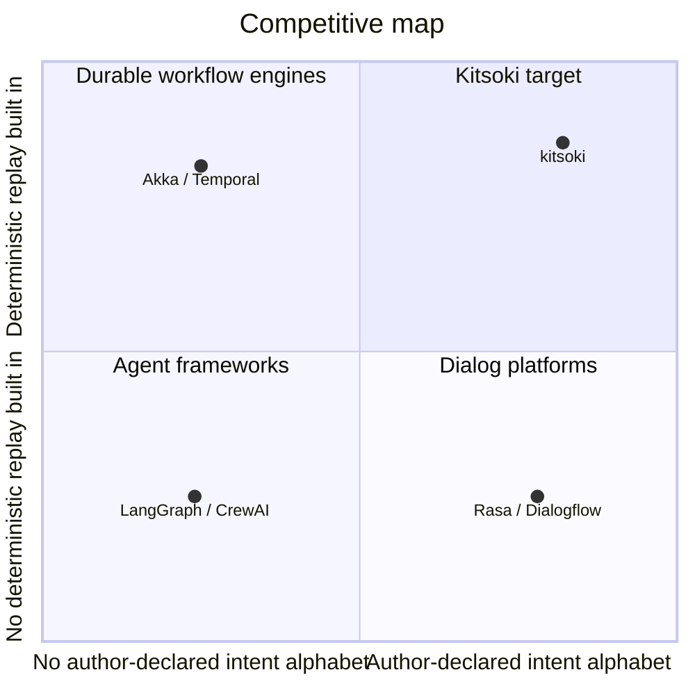

# Kitsoki — Competitive Analysis and Business Value Proposition

**Date:** 2026-05-19
**Author:** Brad Smith
**Purpose:** Synthesis of [`market-research.md`](market-research.md), [`domain-research.md`](domain-research.md), and [`technical-research.md`](technical-research.md) into a single competitive-analysis-style document. Source for the *Business Value Proposition* section of the kitsoki presentation.

---

## Executive Summary

### The slide-ready value proposition

> **Kitsoki is the deterministic conversational workflow engine for any LLM-driven workflow that needs predictable progression, clean introspection, and the option to get measurably better over time.**
>
> *Free-text input. An author-declared finite intent alphabet. Every transition replayable, every regression test runnable with zero LLM cost. One state machine drives your local terminal, your Jira ticket, and your Bitbucket PR comments — every checkpoint is on disk, every replay is byte-identical.*
>
> *Regulated industries (financial services, healthcare, government, cybersecurity) are the most acute segment of this audience. They are not the only segment — anyone building a production LLM-driven workflow benefits from the same separation of interpretive decisions from deterministic execution.*

### Four claims that hold up under scrutiny

1. **Architectural correctness.** Independent 2026 academic and OSS work — ESAA, DFAH, CompileAgent, StateFlow, Akka — has converged on the exact architecture kitsoki implemented and began dogfooding first. Kitsoki is an early working instance of an emerging design consensus, currently in PoC validation with real internal bugs and teams.
2. **Buyer-mental-model fit.** Every concept kitsoki exposes (intent, slot, guard, world, recording, harness) has a precedent in the dialogue-manager or workflow-engine literature. Regulated-industry engineers find familiar nouns when they read the docs.
3. **Measured economic claim.** The four-tier semantic-routing stack avoids the LLM on ~78% of recorded Oregon Trail turns. This is direct token-cost reduction in the same 47–80% band that the 2026 LLM-cost-optimization literature claims for routing+caching — with deterministic inspectability the literature does not provide.
4. **The moat is one architectural commitment: separate interpretive decisions from deterministic execution.** Each interpretive point is a typed decision with a pluggable operator (human, LLM, scripted — choice can transition over time); every decision is recorded; everything else is deterministic. Replay, audit-trail, cost-efficiency, and self-improvement all fall out of that separation — the 20-row matrix ([`market-research.md` §4.8][market-combination]) is evidence, not the moat. Competitors cannot match by adding features one at a time.

### Why the value proposition is defensible — shipped + roadmap

**Shipped today (PoC validation):**

| Differentiator | Why no major competitor can match it quickly |
|---|---|
| Free-text-in, declared-intent-alphabet-out | LangGraph / CrewAI architecturally cannot bound LLM latitude this way; Rasa / Dialogflow cannot bind the LLM without training data |
| Replayable in CI with zero LLM cost | No pure-agentic framework has a credible no-LLM regression-test story; this is structurally hard to retrofit |
| Audit-trail-as-bug-file (artifact = ticket = conversation log) | No competitor treats the artifact as the audit log; this is an architectural commitment, not a feature |
| One state machine, three transports (TUI, Jira, Bitbucket) | Customer-service stacks assume one channel per conversation; workflow engines don't model human-readable surfaces |
| Four-tier semantic-routing stack with measured 78% LLM-avoidance | The pattern is known; the *measurement* and the *deterministic inspectability* are not |
| `/meta` mode: pause FSM → LLM agent edits YAML → resume | No competitor lets the running app pause itself and hand the FSM to an LLM author. Persistent meta-mode chats keyed per state. |

**Roadmap (each composes natively with the shipped set):**

| Differentiator | Why it strengthens the proposition |
|---|---|
| 4-layer self-improvement model (adapted from Acronis-internal `loopy`) | "Learns without training data" — auditable improvement via hand-readable markdown knowledge base, not opaque model weights |
| Plugin marketplace fitting the YAML composition model | Network-effect ecosystem on top of `imports:`; vertical bundles (regulated-finsvc, healthcare, cybersec) become productisable SKUs without compromising the OSS core |
| Live dynamic stories (in-memory FSM mutation as recorded transition) | Closes the build-time / run-time gap; the LLM authors stories live under FSM and schema constraints, with every change in the audit log |

---

## 1. The Market and the Buyer

### 1.1 Market sizing (compressed)

The enterprise conversational-AI platform market is **$15.54B in 2026, growing at 33.9% CAGR** ([The Business Research Company][tbrc-enterprise-cai]). The narrower LLM-dialogue-system slice is **$2.46B at 20.7%** ([WhaTech][whatech-llm-dialogue]). Kitsoki's addressable market is wider than the regulated-industry subset alone — *any* team building a production LLM workflow has the same underlying need for predictability, introspection, and reproducibility. Regulated buyers (financial services, healthcare, government, cybersecurity — $300M–$800M SAM in 2026) are the most acute segment, with the easiest "build-vs-buy" trigger.

See [`market-research.md` §2`][market-2] for the full sizing detail.

### 1.2 The buyer kitsoki is built for

The buyer is **anyone shipping an LLM-driven workflow who wants predictable behaviour, introspectable history, and the option to improve the workflow over time** — and who is tired of the unbounded-latitude alternatives. Indicators:

- They want the workflow debuggable, replayable, and improvable — for reasons that range from regulatory audit to "we just want to know why it did what it did" to "we want CI tests that don't cost LLM tokens."
- They have bounced off pure-agentic frameworks (LangGraph / CrewAI) on replay determinism, or off traditional NLU frameworks (Rasa / Dialogflow) on training-data burden / vendor lock-in.
- They are at the "build-vs-buy" decision moment, defaulting to "we'll write the state machine ourselves and call the LLM only for intent extraction." Kitsoki is the productised version of what they were about to build by hand.

**Segments, from most acute to broadest:**

1. **Regulated enterprises** (financial services, healthcare, government, cybersecurity / data protection) — the trigger event is usually a compliance / audit / regression incident.
2. **Engineering-tooling teams** building internal LLM-driven workflows (bug-fix pipelines, PR review, on-call runbooks). The kitsoki-dev dogfood instance is exactly this use case.
3. **Product teams** shipping LLM features who need reproducible behaviour for testing and debugging.
4. **Research / experimentation teams** running LLM-driven processes that need to be replayable for reproducibility.
5. **Anyone building "agent + state-machine" by hand** — kitsoki replaces the boilerplate.

See [`market-research.md` §3`][market-3] and [`domain-research.md` §2][domain-2] for the full persona analysis.

---

## 2. Competitive Landscape

### 2.1 The four-quadrant map

Kitsoki is alone in the upper-left for *a running PoC with a complete authoring DSL, CI-grade flow-test runner, and multi-surface transport in one binary, validated against real internal bugs*. Academic and OSS systems (StateFlow, CompileAgent, R-LAM) validate the quadrant; none ship the same surface area.

### 2.2 Competitor-by-competitor read

**Pure-agentic LLM frameworks** — LLM is the planner.

| Player | Strength | Weakness vs kitsoki | Source |
|---|---|---|---|
| LangGraph | LLM-native, flexible, Python-first | Lacks replay determinism; unpredictable execution; no enterprise support | [Slashdot 2026][slashdot-dialogflow-langgraph] |
| CrewAI / AutoGen | Multi-agent orchestration | Same determinism gap; harder to audit | [Vellum 2026][vellum-agentic-workflows] |
| OpenAI Agents SDK | Tight GPT integration | Vendor lock-in; replay not first-class | [Akka 2026][akka-frameworks] |

**Traditional dialogue managers** — NLU + state machine, pre-LLM-native.

| Player | Strength | Weakness vs kitsoki | Source |
|---|---|---|---|
| Rasa | Mature, self-hostable, GDPR-friendly; pivoting to CALM | Heavy training-data burden | [Dasha 2026][dasha-rasa-alternatives] |
| Dialogflow CX | Visual state machine, regulated friendly | Google Cloud lock-in; expensive | [Dasha 2026][dasha-rasa-alternatives] |
| MS Bot Framework | Enterprise support, event-driven | MS ecosystem gravity; weaker LLM-native | [`prior-art.md` §3][prior-art] |

**Deterministic workflow engines** — generic, repurposed for LLM.

| Player | Strength | Weakness vs kitsoki | Source |
|---|---|---|---|
| Akka Workflow | Stateful, replayable, enterprise scale | Generic — buyer still has to build the dialogue layer | [Akka 2026][akka-frameworks] |
| Temporal | Event-sourced determinism, mature | Workers/activities overkill for one-conversation-per-session | [`prior-art.md` §2][prior-art] |

**The emerging "deterministic backbone + LLM-as-recognizer" category** — kitsoki's actual peer set.

| Player | Strength | Weakness vs kitsoki | Source |
|---|---|---|---|
| StateFlow | State-driven LLM workflows | Research artifact, not production framework | [arXiv 2403.11322][stateflow] |
| CompileAgent | Compiles LLM plans into replayable graphs | Newer, narrower scope; no multi-surface | [GitHub][compileagent] |
| R-LAM | Reproducibility-constrained Large Action Models | Research stage | [VoltAgent][r-lam] |
| DFAH | Determinism-faithfulness audit harness | Domain-specific (finance); audit tool not authoring tool | [arXiv 2601.15322][dfah] |

### 2.3 Competitive threats and timelines

| Threat | Likelihood | Time | Mitigation |
|---|---|---|---|
| Rasa CALM adds determinism guarantees | Medium | 12mo | Hold the line on "no training data, no NLU pipeline" |
| LangGraph adds replay primitives | High | 6–12mo | Multi-surface + audit-trail-as-bug-file are not in their roadmap |
| CompileAgent / OSS deterministic layers go mainstream | Medium-high | 6–12mo | Differentiate on multi-surface and authoring DSL |
| Hyperscaler ships first-party deterministic agent runtime | Low-medium (12mo); high (24mo) | 12–24mo | A runtime is not a framework — lean into authoring surface |

### 2.4 Competitive opportunities

**Shipped:**

1. **The "free text in, deterministic transitions out" positioning is unowned.** No competitor markets this phrase or the architectural commitment behind it.
2. **The dogfood story is unusual and credible.** Kitsoki being used to fix kitsoki bugs through its own UI, with the bug file as ticket + conversation log + audit trail, is unmatched.
3. **The four-tier semantic-routing efficiency claim is measured.** ~78% LLM-avoidance on real workloads is a CFO-grade economic argument no competitor has published.
4. **`/meta` mode is structurally unique.** A running app that can pause its own FSM, hand control to a named LLM author-agent that edits the app's YAML in place, then resume — with the meta-mode chat persisted per state for auditable history — is offered by no competitor. LangGraph requires a code edit + fresh process; Rasa requires retraining; Dialogflow CX requires a flow republish.

**Roadmap (each is a category-defining future opportunity, with internal precedent or natural architectural fit):**

5. **4-layer self-improvement model** — adapted from the Acronis-internal `loopy` tool. Per-phase error retry, cross-phase feedback, pipeline self-patching, cross-run knowledge extraction/injection into a hand-readable markdown knowledge base. "Learns without training data" is the framing no incumbent owns. See [`market-research.md` §4.5][market-self-improvement].
6. **Plugin marketplace.** Stories are already YAML-composable via `imports:`; a registry layer turns that into a distribution channel. Vertical bundles (regulated-finsvc, healthcare, cybersec) become productisable SKUs on an OSS core. Native fit: YAML is safe to plug in, intents are typed contracts at boundaries, event log captures plugin-version provenance. See [`market-research.md` §4.6][market-marketplace].
7. **Live dynamic stories.** In-memory FSM mutation as a recorded transition — `/meta` extended so the LLM can patch a running app's intent graph or slot schema without disk writes, with the patch recorded as `meta.patch` and optionally exported to YAML. Composes with (5) — knowledge-base entries become *executable* learning. Composes with (6) — installing a plugin becomes a live mutation. See [`market-research.md` §4.7][market-dynamic].

---

## 3. Technical Differentiation

Seven load-bearing technical choices, each individually validated against 2026 published work:

| Choice | Verdict | Anchor reference |
|---|---|---|
| Go, single static binary | Validated by 2026 production trend (Bifrost, Genkit, ADK Go) | [dasroot 2026][dasroot-go-python] |
| YAML DSL for authoring | Validated for any buyer who values declarative spec + introspection; trade-off vs Starlark acknowledged (Starlark is more flexible, less auditable) | [Zigflow 2026][zigflow]; [Uber Starlark][uber-starlark] |
| FSM + event-sourced history | **Strongly validated** — ESAA, DFAH, CompileAgent independent rediscovery | [arXiv 2602.23193][esaa]; [arXiv 2601.15322][dfah] |
| Single generic MCP `transition` tool | Validated with caveat; most contestable choice; rationale = caching + prompt stability + refactoring safety | [MCP 2026 roadmap][mcp-roadmap] |
| Four-tier semantic-routing stack | Validated and competitive; hits 47–80% LLM-cost-reduction band | [Mavik 2026][mavik-cost-optimization] |
| Harness abstraction (CLI / SDK / replay) | Validated; replay backend differentiating | [Maxim 2026][maxim-llm-routers] |
| One state machine, multiple transports | Validated as differentiator; no 2026 analogue | [`domain-research.md` §3.2][domain-3] |

Plus a shipped surface that's distinctive but not part of the core seven:

| Surface | What it is | Why it matters |
|---|---|---|
| `/meta` mode | Pause-FSM → named LLM agent edits the app's YAML in place → resume; meta-mode chats persisted per state | Collapses build-time / run-time gap; auditable changes inside the same event log as transitions. See [`meta-mode.md`][meta-mode]. |

**Roadmap technical extensions** (each is a natural extension of an existing primitive, not an architectural pivot):

| Roadmap | Existing primitive it extends | Status |
|---|---|---|
| 4-layer self-improvement model | Harness retry envelope (Layer 1); structured-error MCP envelope (Layer 2); subprocess transports (Layer 3); event log + recordings (Layer 4) | Internal precedent shipped in Acronis `loopy` — see [`SELF-IMPROVEMENT.md`][loopy-self-improvement] |
| Plugin marketplace | `imports:` block already composes across files/repos; YAML is validatable and safe to plug in | BMAD-method marketplace cited as proven pattern in adjacent ecosystem |
| Live dynamic stories | `/meta` mode (current) writes-to-disk; roadmap = in-memory FSM mutation as a recorded `meta.patch` transition | Substrate for self-improvement Layer 4 to apply *executable* learning |

**Aggregate technical verdict:** kitsoki's architecture is on the leading edge of a 2026 design consensus that several independent groups have arrived at separately. As a working PoC already dogfooded on real internal bugs across teams, kitsoki has a 6–12 month head-start on implementation over its closest direct competitors (CompileAgent, Zigflow, StateFlow). The roadmap extensions are not pivots — each is a small step from an existing kitsoki primitive into a category-defining capability.

See [`technical-research.md`][technical] for the full chain of evidence for each choice. For the adversarial engineering rebuttal to *"can't a code-first orchestrator like LangGraph offer the same guarantees with minimal effort?"* — the enforcement-vs-convention argument, and an honest accounting of where the objection partly lands — see [`enforcement-vs-convention.md`](enforcement-vs-convention.md). For the one-axis positioning lens against the *other* two incumbents — *agents* (Claude Code; LLM on top) and *workflow tools with a bolted-on LLM node* (n8n, Airtable; LLM at a dead-end leaf) — see [`control-inversion.md`](control-inversion.md).

---

## 4. Business Value Proposition — Slide-Ready Content

### 4.1 The one-line value proposition

> **Kitsoki is the deterministic conversational workflow engine for LLM-driven workflows that need predictable progression, clean introspection, and the option to improve over time.**

A tighter variant for the regulated-industry segment, when that's the audience:

> *Kitsoki is the deterministic conversational workflow engine for LLM-driven workflows that must pass an audit.*

### 4.2 The three-line elevator pitch

> **Free text in, deterministic transitions out.**
> **Author-declared intent alphabet, every transition replayable, every regression test runnable with zero LLM cost.**
> **One state machine across local terminal, Jira ticket, and Bitbucket PR — every checkpoint is on disk, every replay is byte-identical.**

### 4.3 Slide-shaped value-proposition section — Shipped Pillars

Suggested slide structure (three sub-bullets per pillar, each grounded in a research finding):

---

#### **Pillar 1 — Predictable progression, no unbounded latitude**

- Free-text input the LLM only translates; the LLM has no latitude to invent flags or out-of-state actions.
- Every transition, guard, and world mutation in declared YAML — the source of the workflow is also its specification.
- *Why it matters:* DFAH (arXiv 2601.15322) showed across 4,700+ agentic runs that **decision determinism and task accuracy are not correlated** — most LLM deployments cannot reproduce their own decisions. That's a problem whether you care about compliance, debugging, regression testing, or just *understanding what your app did last Tuesday*. Kitsoki was designed against this failure mode at the architecture level.

#### **Pillar 2 — Replayable in CI, free in test**

- Mode-2 flow tests replay recorded LLM responses; pass/fail is byte-identical and costs zero LLM tokens.
- Recordings are first-class: deterministic-replay is one of three interchangeable harnesses (CLI / SDK / replay).
- *Why it matters:* The event log + on-disk artifact is simultaneously the **audit trail, the debugging trace, the regression-test fixture, and the self-improvement dataset**. One artifact, many uses. Every team building LLM features needs at least one of these; kitsoki ships all four from the same primitive.

#### **Pillar 3 — Introspectable artifact, multi-surface conversation**

- The bug file (or Jira ticket) doubles as ticket + conversation log + introspectable history; checkpoints append `## Comment <iso> by <author>` blocks.
- One session-keyed state machine drives all three surfaces; teammates can hand off mid-conversation across surfaces with no state loss.
- *Why it matters:* No major competitor offers single-state-machine-across-surfaces. The "I want to see exactly what happened in this workflow run" question has a grep-able answer — whether you're an auditor, an on-call engineer, a product debugger, or a curious team-mate.

#### **Pillar 4 — Economically rational LLM usage**

- Four-tier semantic-routing stack: deterministic match → synonym → templated extraction → turncache → LLM.
- ~78% of recorded Oregon Trail turns route without an LLM call.
- *Why it matters:* The 2026 LLM-cost-optimization consensus claims 47–80% spend reduction via routing+caching ([Mavik Labs 2026][mavik-cost-optimization]). Kitsoki delivers it with *deterministic inspectability* — every routed turn names which tier resolved it. Cost discipline is a universal concern, not a regulated-industry one.

#### **Pillar 5 — Author at the speed of conversation (`/meta`)**

- The running app can pause its FSM, hand control to a named LLM author-agent that edits the app's YAML in place, then resume — with the meta-mode chat persisted per state ([`docs/stories/meta-mode.md`][meta-mode]).
- A non-YAML-fluent operator asks in natural language ("add `wade across` as a synonym for ford"); the meta-agent generates the diff and the schema validates before it applies.
- *Why it matters:* Build-time and run-time collapse into one workflow, with introspectable evidence of every change. The iteration loop closes inside the running process — useful for compliance audit, internal dev tooling, product debugging, and rapid prototyping alike. LangGraph requires a code edit and fresh process; Rasa requires retraining; Dialogflow CX requires a flow republish. No competitor offers this surface.

---

### 4.4 Slide-shaped value-proposition section — Roadmap Pillars

Each roadmap pillar is one feature ship away from a shipped kitsoki primitive — not an architectural pivot.

---

#### **Pillar A — Learns without training data (4-layer self-improvement)**

- Layer 1: per-phase error retry. Layer 2: cross-phase feedback envelope. Layer 3: pipeline self-patching with budget controls. Layer 4: cross-run knowledge extraction + injection into a hand-readable markdown knowledge base.
- The architecture is already validated inside Acronis by the `loopy` autonomous-bug-fix tool ([`SELF-IMPROVEMENT.md`][loopy-self-improvement]).
- *Why it matters:* "Improvement you can read, version-control, and review." The 2026 academic frontier (Reflexion, Memento, Experiential Reflective Learning, JIT-RL, Lifelong-Agent benchmarks) has codified self-improving agents as a recognised subfield. Kitsoki's roadmap closes the gap with one universal differentiator: the learned facts live in git, not in opaque model weights — which matters whether the consumer is a compliance auditor, an engineering manager doing a retro, or a developer trying to understand last week's regression.

#### **Pillar B — Composable + extensible (plugin marketplace)**

- Stories are already YAML-composable via `imports:`. A marketplace layer turns `imports:` into a registry with semver, lock files, and signed sources — the same model BMAD-method ships for Claude Code skills.
- Plugin types: provider plugins (GitHub, PagerDuty, Slack, Confluence), pipeline plugins (bug-fix / PR-refinement / retrospective rooms), vertical bundles (regulated-finsvc, healthcare, cybersec), synonym packs, theme packs, private/Acronis-internal plugins.
- *Why it matters:* Network effects on top of YAML. Vertical bundles become productisable SKUs on an OSS core (Rasa's commercial pattern). The "ecosystem maturity" gap against incumbents turns from a liability into a self-extending asset.

#### **Pillar C — Live dynamic stories (in-memory FSM mutation)**

- `/meta` extended so the LLM can patch a running app's intent graph or slot schema without writing to disk; the patch is recorded as a `meta.patch` event in the event log and is optionally exported to YAML.
- Composes with Pillar A: knowledge-base entries become *executable* learning, not just text the LLM reads. Composes with Pillar B: installing a plugin becomes a live mutation, no restart.
- *Why it matters:* The natural endpoint of the kitsoki design — stories that author themselves under human supervision, recorded as a sequence of FSM-validated patches. The most direct answer to the 2026 "AI productivity paradox" finding ([domain-research.md §4.5][domain-paradox]): the LLM gets authoring latitude only inside the FSM + schema + diff-review envelope.

---

### 4.5 The architectural argument (closer slide)

**The moat is one architectural commitment:**

> **Separate the interpretive points in a workflow from the deterministic points. Make each interpretive point a typed decision with a pluggable operator (human, LLM, scripted, or hybrid). Record every decision. Make everything else deterministic.**

That's the moat. Every other property of kitsoki is a consequence of this separation.

The commitment shows up in three load-bearing implementation choices:

1. **LLM-as-pluggable-operator over a declared intent alphabet.** The LLM is one *kind* of decision operator at one *kind* of decision point (free-text → intent). It has no latitude elsewhere. At a different decision point, the operator could be the user, a script, a cached prior decision, or — over time — an LLM fine-tuned on the prior human decisions.
2. **Event-sourced state.** The deterministic execution between decisions is the source of truth; replay is byte-identical because only decision *outputs* need to be replayed, not the flow.
3. **YAML-as-spec.** The decision points and the deterministic graph between them are declared, not coded.

Every capability in the 20-row comparison ([`market-research.md` §4.8][market-combination]) is a *property* of this separation, not a feature glued on top:

- **Replayability** — because the deterministic flow re-runs from recorded decision outputs.
- **Mode-2 flow tests at zero LLM cost** — because the flow is deterministic and only the decisions cost anything; the recordings are the decisions.
- **The four-tier routing stack with measured ~78% LLM-avoidance** — because the same architecture asks at every input: *how interpretive does this decision actually need to be?* Deterministic match handles "not at all"; synonyms handle "a little"; the LLM handles "fully." Operators are graded by how much interpretation they bring.
- **Audit-trail-as-bug-file** — because every decision has a typed input, a typed output, an operator identity, and a timestamp. The artifact is the log of decisions.
- **`/meta` mode** — because authoring is itself just another decision point, with its own pluggable operator (the `story-author` agent).
- **The 4-layer self-improvement roadmap** — because **every decision is a labeled datapoint**. Today's human decision becomes tomorrow's training input. The operator at a given decision point can transition from human → LLM-with-knowledge-base → fine-tuned LLM over the lifetime of the workflow, without changing the workflow itself.
- **One state machine across TUI + Jira + Bitbucket** — because transports are operator-input transports, decoupled from the FSM that orchestrates the decisions.
- **Plugin marketplace** — because plugins are libraries of decision points + deterministic flow, distributed as YAML.

> **Pick any three rows from the matrix. No competitor ticks all three. The reason is structural, not coincidental — each row is a consequence of the same separation.**
>
> **A competitor cannot match by adding features one at a time. To match the table they would have to adopt the separation — at which point they would no longer be the framework their existing users adopted.**

**For the slide:**

> *Workflows have two kinds of moments: those that require interpretive judgment, and those that can be made purely deterministically. Kitsoki isolates the interpretive ones to typed decision points with pluggable operators (human, LLM, scripted, hybrid — and the choice can change over time). Everything else is deterministic. The architecture is the moat. Every other property — replay, audit, cost-efficiency, self-improvement — falls out of that one separation.*

---

### 4.6 Anti-positioning — what kitsoki is not

Equal-weight clarity:

- **Not a chatbot framework.** The category is crowded; kitsoki is positioned against it, not within it.
- **Not a LangGraph competitor.** Different architecture, different buyer.
- **Not a general workflow engine.** Akka and Temporal own that.
- **Not a code-generation assistant.** Copilot/Cursor/Aider edit code; kitsoki drives a workflow.

### 4.7 Risk-acknowledgement slide (suggested companion)

For the technically-literate audience, an honest companion slide:

- **PoC stage.** Acronis-internal dogfood with real bugs flowing through real teams is the primary proof. External case studies do not yet exist. Roadmap pillars (A, B, C) are honestly roadmap, not shipped.
- **No commercial support tier yet.** Regulated buyers' procurement may stall without one. The plugin-marketplace roadmap (Pillar B) is part of the path to a commercial SKU on an OSS core.
- **YAML-as-spec is a known taste boundary.** Buyers from YAML-heavy backgrounds (Kubernetes, CI/CD, Actions) accept instantly; Python/TS-first buyers may push back.
- **`/meta` invites misuse.** A team that uses `/meta` to chase bugs through patches instead of through understanding will produce an unreadable YAML graveyard. Disqualify teams that view `/meta` as a substitute for design discipline.
- **Hyperscaler risk.** If Anthropic / Google / OpenAI ship native deterministic agent runtimes, the category compresses. Mitigation: lean into the authoring surface (YAML DSL, `/meta`, plugin marketplace) — a runtime is not a framework.

---

## 5. Recommended Positioning and Go-To-Market

### 5.1 Positioning hierarchy

1. **Lead with predictability and introspection** — the universal pain. Anyone shipping an LLM workflow wants to know what it did and why; kitsoki makes both grep-able from day one.
2. **Tailor the second beat to the audience.** Regulated buyers → audit & replay. Engineering tooling teams → CI flow tests with zero LLM cost. Product teams → reproducible behaviour for testing. CFO room → token-cost efficiency.
3. **Anchor on dogfood credibility** for technical audiences — kitsoki fixes kitsoki through its own UI.
4. **Differentiate against the four-quadrant map** — kitsoki is the only entry in the upper-left with a working implementation under internal validation.
5. **Demo `/meta` live** when the audience is technical. Watching the running app pause, an LLM author-agent edit the YAML, and the FSM resume is the single most viscerally differentiating moment in the deck — and it's shipped, not roadmap.
6. **Frame the roadmap as composable, not aspirational.** Self-improvement, plugin marketplace, and live dynamic stories are each one feature ship away from an existing kitsoki primitive. The roadmap is the architecture being extended, not new bets being made.
7. **Use the architecture-as-moat closer.** End the deck with the *separation* itself — workflows have interpretive moments and deterministic moments, and kitsoki cleanly isolates them. Land the line: *every capability — predictability, audit, cost-efficiency, self-improvement — falls out of that one separation; the architecture is the moat, the feature list is just the evidence*.

### 5.2 Channel and motion (recommended)

1. **Internal Acronis dogfood first.** Land production use cases inside Acronis — starting with the engineering-tooling segment (the dogfood `kitsoki-dev` story is already here) and the regulated-industry segment in parallel.
2. **OSS-first community release.** Conditional on (1). The buyer persona discovers tools via GitHub and arXiv, not sales decks; the broader-than-regulated audience compounds the case for OSS distribution.
3. **Citation-grade docs.** [`prior-art.md`][prior-art] already does this. Extend with a published benchmark against CompileAgent / LangGraph on replay determinism.
4. **Commercial tier (later):** support contracts for regulated buyers' procurement; private-marketplace tier for enterprise plugin distribution.

### 5.3 Disqualification criteria

It is faster and healthier to disqualify wrong-fit buyers up front:

- Buyer who wants a "chat experience" → not kitsoki, it is not a chat agent.
- Buyer whose primary need is multi-agent LLM planning → LangGraph / CrewAI fits better.
- Buyer who actively *wants* unbounded LLM latitude and treats predictability as a constraint to be relaxed → genuinely a different worldview; not a kitsoki fit.

Note: *"no compliance / audit requirement"* is **not** a disqualifier. The architecture's benefits — predictability, introspection, zero-cost CI tests, self-improvement — apply to any LLM-driven workflow, not just regulated ones.

---

## 6. Source Map

This synthesis draws from three research documents, each independently sourced:

- [`market-research.md`][market] — TAM/SAM/SOM, competitive landscape, buyer persona, market trends.
- [`domain-research.md`][domain] — practitioner profile, workflow anatomy, domain-specific pain points, terminology validation.
- [`technical-research.md`][technical] — architectural choices, 2026 academic + OSS validation, technical risks.

All claims in this synthesis are traceable to specific sections in those documents and the inline citations therein.

---

[market]: ./market-research.md
[domain]: ./domain-research.md
[technical]: ./technical-research.md
[prior-art]: ../prior-art.md
[meta-mode]: ../meta-mode.md
[market-2]: ./market-research.md#2-market-analysis-and-dynamics
[market-3]: ./market-research.md#3-customer-insights-and-behavior-analysis
[market-self-improvement]: ./market-research.md#45-the-planned-self-improvement-layer-roadmap-differentiator
[market-marketplace]: ./market-research.md#46-plugin-marketplace-roadmap-differentiator
[market-dynamic]: ./market-research.md#47-live-story-editing-shipped-and-dynamic-stories-roadmap
[market-combination]: ./market-research.md#48-the-moat-is-the-architecture-the-feature-list-is-the-evidence
[domain-2]: ./domain-research.md#2-the-domain-practitioner
[domain-3]: ./domain-research.md#3-workflow-anatomy-in-the-target-domain
[domain-paradox]: ./domain-research.md#45-trend-5-the-ai-productivity-paradox
[loopy-self-improvement]: /home/cloud-user/code/cyber-repo/tools/loopy/docs/SELF-IMPROVEMENT.md

[tbrc-enterprise-cai]: https://www.researchandmarkets.com/reports/6226735/enterprise-conversational-ai-platform-market
[whatech-llm-dialogue]: https://whatech.com/og/markets-research/it/1011349-2026-forecast-for-the-large-language-model-artificial-intelligence-ai-dialogue-system-industry-key-market-drivers-opportunities-and-growth-strategy.html
[slashdot-dialogflow-langgraph]: https://slashdot.org/software/comparison/Dialogflow-vs-LangGraph/
[vellum-agentic-workflows]: https://www.vellum.ai/blog/agentic-workflows-emerging-architectures-and-design-patterns
[akka-frameworks]: https://akka.io/blog/agentic-ai-frameworks
[dasha-rasa-alternatives]: https://dasha.ai/tips/rasa-alternatives
[stateflow]: https://arxiv.org/abs/2403.11322
[compileagent]: https://github.com/yuer-dsl/compileagent
[r-lam]: https://github.com/VoltAgent/awesome-ai-agent-papers
[dfah]: https://arxiv.org/abs/2601.15322
[esaa]: https://arxiv.org/abs/2602.23193
[mcp-roadmap]: https://blog.modelcontextprotocol.io/posts/2026-mcp-roadmap/
[mavik-cost-optimization]: https://www.maviklabs.com/blog/llm-cost-optimization-2026
[maxim-llm-routers]: https://www.getmaxim.ai/articles/top-5-llm-router-solutions-in-2026/
[dasroot-go-python]: https://dasroot.net/posts/2026/02/benchmarking-go-vs-python-llm-gateways/
[zigflow]: https://simonemms.com/blog/2026/02/02/zigflow-the-missing-temporal-dsl
[uber-starlark]: https://www.uber.com/us/en/blog/starlark/
[custodia-audit-trail-2026]: https://dev.to/custodiaadmin/implementing-visual-audit-trails-for-llm-agents-in-production-a-step-by-step-guide-3p83
