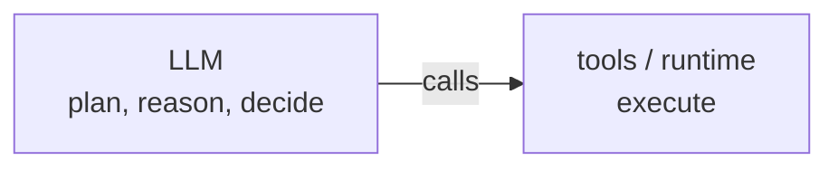
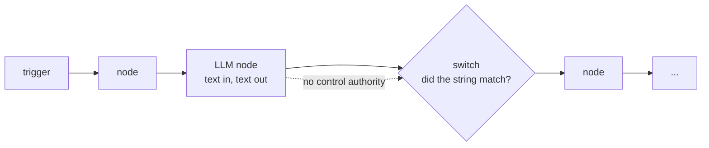
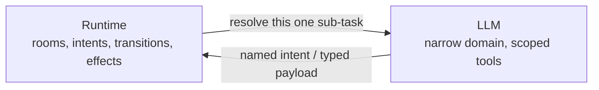

# Control Inversion: Where the LLM Sits

**Date:** 2026-06-05
**Author:** Brad Smith
**Purpose:** Position kitsoki against the two dominant ways the industry
wires an LLM into software — the *agent* (LLM on top, runtime as tool belt)
and the *workflow-tool-with-an-LLM-node* (deterministic pipeline, LLM as a
dead-end leaf). The thesis: both get the *placement* of the LLM wrong, in
opposite directions, and kitsoki's value is the third placement neither
reaches.

This is positioning material. The architectural *why* lives in
[`../architecture/concept.md`](../architecture/concept.md) (§2 "Control
inversion" is the spine this document builds on); the adversarial
engineering comparison against code-first orchestrators lives in
[`enforcement-vs-convention.md`](enforcement-vs-convention.md). This
document is the one-axis story you can put in front of someone who already
uses Claude Code *and* n8n and is asking "so what is this, exactly?"

---

## 1. The one axis: who is the caller?

Every system that mixes an LLM with deterministic code makes one structural
choice, usually without naming it: **is the LLM the caller, or the callee?**
Who holds the plan, picks the next step, and decides when the work is done?

There are only three answers, and the whole positioning falls out of them.

| | **Agent** (Claude Code, Cursor agent, AutoGPT-style) | **Workflow + LLM node** (n8n, Airtable AI, Zapier AI, Make) | **Kitsoki** |
|---|---|---|---|
| Who holds control | the **LLM** | the **pipeline** (a fixed DAG) | the **runtime** (a state machine) |
| Where the LLM sits | on top — the planner | at a leaf — a black-box transform | as a callee at named decision points |
| LLM's authority over flow | total — picks every next action | **none** — can only return a value | **bounded** — returns a named intent; the graph still owns the edge |
| Interaction shape | conversation (turn-based, forgiving) | trigger / batch (event → run → done) | conversation (turn-based, forgiving) |
| Entrance | "say anything" | "fill this field / fire this trigger" | "say anything" |
| Failure question | *"what was the agent thinking?"* | *"why did the downstream switch not match the string?"* | *"what did this one call receive and emit?"* |
| Audit | reasoning trace, if you can get one | per-node logs; the LLM step is opaque | every decision named and replayable |

The two incumbents sit at the extremes. The agent gives the LLM **too much**
control; the workflow tool gives it **too little** — and, critically, *the
wrong kind*. Kitsoki is the middle placement: conversational like the agent,
deterministic like the pipeline, with the LLM as a scoped subroutine rather
than either the boss or a dead-end leaf.

---

## 2. The agent: LLM on top

This is Claude Code, Cursor's agent mode, and the whole AutoGPT lineage. The
LLM holds the reasoning state, the tool-use plan, and the conversational
frame. The runtime is its tool belt: a set of capabilities the model picks
from, turn by turn.

**What it gets right** is the entrance. You say anything; the agent figures
it out. For open-ended exploratory work — "find why this test is flaky,"
"draft the migration" — that latitude is exactly the point, and kitsoki does
not try to replace it. (Inside a kitsoki room, a `host.agent.task` *is* a
relatively free agent; see [`concept.md` §5](../architecture/concept.md#5-the-spectrum-of-stories).)

**What it gets wrong** is that *every* decision becomes a moment of LLM
judgment — which tool, which arguments, which order, whether to ask first.
When something goes wrong it is usually unclear *where*. There is no edge to
point at, only a reasoning loop to re-read. You improve it by tweaking the
prompt and praying. The control lives in a place you cannot diff.

> The agent's problem is **unbounded authority**: the LLM is the caller of
> everything, so the blast radius of a misread is the whole session.

---

## 3. The workflow tool with an LLM node: LLM at a dead end

This is n8n's "AI" node, Airtable's AI field, Zapier's AI step, Make's
OpenAI module. The pipeline is a fixed, author-declared DAG — fully
deterministic, which is genuinely valuable — and the LLM is dropped in as
**one node among many**: a prompt goes in, a string comes out, and a
*downstream deterministic node must then parse that string and branch on
it*. The LLM is a leaf. It transforms a value; it cannot touch control flow.

That placement creates four specific awkwardnesses, and they are not
incidental — they are what you hit the moment you try to build anything
conversational on these tools:

1. **The LLM can name nothing the flow understands.** To route on the
   model's output you prompt it to emit a magic string ("reply with exactly
   `REFUND` or `ESCALATE`"), then wire a `switch` node that string-matches.
   The model's output is *not* constrained to the flow's vocabulary — you
   hope it stays in the alphabet, and a downstream `default` arm catches it
   when it drifts. This is kitsoki's per-state intent alphabet, hand-rolled
   and unenforced. (Contrast: [`concept.md` §3](../architecture/concept.md#3-narrow-llm-domains)
   — the LLM *returns a named intent*, validated against the intents legal
   in this room, before any edge fires.)

2. **Conversation is faked.** These are trigger/batch engines: an event
   fires, the DAG runs, it ends. Conversation is the opposite — stateful,
   turn-based, interruptible mid-flight. To get a chatbot you bolt a chat
   widget onto a webhook that fires a *fresh pipeline run per message*, and
   thread the "session" through an external store you manage by hand. You
   are reinventing rooms, a turn loop, and a world bag — badly, outside the
   tool. (Kitsoki is conversation-native; the turn loop, scoped `world`, and
   mid-flight clarification are the engine, not an add-on. See
   [`../stories/architecture.md` §12.1](../stories/architecture.md#121-vs-a-workflow-engine).)

3. **Human-in-the-loop is an afterthought.** A "wait for approval" node is a
   pause in a batch job, not a conversational turn. There is no notion of
   the user *saying something the system has to interpret* at that point —
   only a button. Kitsoki's gates are first-class turns resolved by a
   decider (human, LLM-judge, or default), swappable per decision.

4. **The LLM gets no narrow domain and no scoped toolbox.** It is "call the
   model with this prompt." There is no per-call contract — defined input
   shape, defined output shape, defined position in a trace. The node either
   returned plausible text or it didn't.

> The workflow tool's problem is the mirror image of the agent's:
> **no return authority**. The LLM can fill a blank but cannot influence
> where the flow goes, so every branch must be pre-wired deterministically
> and the model is reduced to a fancy string generator behind a brittle
> `switch`. You keep the determinism and lose the thing that made the LLM
> worth adding — its ability to map open-ended input onto the right path.

The tell: the moment you want "the user says something and the system
figures out which of N things they meant," you discover the LLM node *can't
do that here*, because doing it requires the model to **name the path**, and
naming the path is a control-flow act these tools structurally deny it. You
end up with a classifier node feeding a `switch`, string-matching your way
to a state machine you didn't get to declare.

---

## 4. Kitsoki: LLM as a callee with return authority over interpretation

Kitsoki inverts control the way dependency injection inverts construction:
the thing that used to be on top (the LLM) becomes a callee, and the thing
that used to be the tool belt (the runtime) becomes the caller. The runtime
— an author-declared state machine — knows every room the conversation can
be in, every intent valid in each room, every transition out, every effect
on each edge. When it cannot resolve something deterministically, it *calls
the LLM* for that narrow sub-task, takes the result, and **resumes
deterministic execution**.

The placement is precisely between the two incumbents, and the difference is
the **return arrow**:

- Unlike the **agent**, the LLM does *not* hold the plan. It does not pick
  the next room, write the world, fire effects, or call hosts. Those are the
  runtime's job and happen only along edges the author declared. Its
  authority is bounded.
- Unlike the **workflow LLM node**, the LLM's return is *not* an inert
  string a downstream node must parse and hope about. It returns a **named
  intent from the finite set legal in this room** (or a schema-validated
  payload, or a finished artifact). It has genuine **return authority over
  interpretation** — it gets to say *which declared path the user meant* —
  without ever owning the path itself.

That is the sweet spot the other two miss: the LLM influences control flow
*by naming an option the graph already owns*, never by inventing an action
(the agent's overreach) and never by being walled off from flow entirely
(the workflow node's underreach).

What falls out — auditability, zero-cost replay tests, cost/latency control
(~78% of recorded turns route without an LLM call), incremental
improvement — is documented in [`concept.md` §6](../architecture/concept.md#6-what-this-buys)
and is not re-argued here. The point for *this* document is narrower: those
consequences are only reachable because the LLM sits where it sits.

---

## 5. The same task in all three

A concrete shape makes the placement legible. Task: a user, mid-flow, types
*"actually scale the frontend to three and then ship it."*

| | How it resolves | Where it can go wrong |
|---|---|---|
| **Agent** | The LLM decides this means two tool calls (`scale`, then `deploy`), picks arguments, decides ordering, decides whether to confirm. | Anywhere in that chain, silently. Re-running may choose a different plan. The "ordering" decision is invisible. |
| **Workflow + LLM node** | Either it doesn't fit the trigger model at all, or: an LLM node classifies the message to a string, a `switch` routes on it, and you pre-built every branch. "And then ship it" (a *second* intent in one utterance) breaks the single-classification node. | The string drifts out of the `switch`'s cases; the compound request has no node shaped for it; "mid-flow" state lives in an external store you stitched together. |
| **Kitsoki** | The router maps the utterance onto `scale{service:frontend, replicas:3}` — an intent legal in this room — fires its declared transition + `host` effect, and the `emit_intent` chain hands control to the `deploy` edge. Each hop is a named decision in the trace. | If `scale` weren't legal here, the trace shows the LLM was asked and the human-escape fired — a signal to widen the alphabet ([`concept.md` §4](../architecture/concept.md#4-progressive-determinism)). The failure is *locatable*. |

---

## 6. Why this isn't "just LangGraph with extra steps"

A sharp reader will object that a code-first orchestrator (LangGraph,
Temporal-plus-an-LLM) can be wired into exactly this callee shape. **Yes —
and that is the right comparison, not n8n.** The agent and the workflow-node
tools get the *placement* wrong by construction; LangGraph lets you build
the correct placement but does not *enforce* it. That argument — capability
vs. enforcement, and why "LangGraph + a convention" is not the same product
— is the whole of
[`enforcement-vs-convention.md`](enforcement-vs-convention.md) and is not
repeated here. The short version: LangGraph hands you the box; nothing stops
a node from collapsing back into an agent (one fat LLM node that decides,
calls tools, and writes state) or degrading into a workflow leaf. Kitsoki
makes both collapses *unexpressible* — host calls are queued and dispatched
*after* the pure transition returns, so the LLM physically cannot grab the
caller's seat.

So the honest market map is two axes, not one:

- **Placement** (this document): agent = LLM on top; workflow node = LLM at a
  dead end; kitsoki/LangGraph = LLM as a scoped callee.
- **Enforcement** ([`enforcement-vs-convention.md`](enforcement-vs-convention.md)):
  LangGraph lets the correct placement decay to convention; kitsoki imposes
  it mechanically.

n8n and Claude Code lose on placement. LangGraph loses on enforcement.
Kitsoki's claim is the conjunction.

---

## 7. The surface features are faces of the inversion, not a checklist

Kitsoki ships things that read like a feature list: a ready-to-go TUI and
web chat, a rich typed-view UI kit, an in-session meta-mode edit loop, and a
trace viewer. **Pitched as a list, every one of them is matchable** — n8n's
whole value *is* a polished UI; CopilotKit/AG-UI render rich generative UI on
LangGraph; "an AI that improves your workflow" is a 2026 checkbox; and LLM
observability (LangSmith, Langfuse, Phoenix) is the most saturated tooling
category there is. Sold flat, these *weaken* the pitch — they walk straight
into the feature-checklist trap that
[`enforcement-vs-convention.md` §1](enforcement-vs-convention.md) says always
loses.

The reframe: three of the four are not features *beside* the moat — they are
the moat viewed from a different side. The fourth is an adoption lever, not a
moat. Each is differentiated only by the property §4 established (the LLM is
a scoped callee, never the caller), and is a checkbox the moment it's
decoupled from it.

| Surface | Side of the inversion | Why it's a consequence, not a bolt-on | Decoupled, it's just… |
|---|---|---|---|
| Rich typed-view UI kit | **output** | The view is a pure function of `world` at a recorded checkpoint (typed elements + pongo2), so one declarative story renders to TUI, web, Jira, and PR thread — *replayably*. An agent's view is LLM exhaust; a workflow tool has no turn to render. | a nice frontend (AG-UI does rich too — the edge is *reproducible*, not *rich*) |
| Trace viewer | **introspection** | The trace **is** the authoritative state — the running app is a projection of it ([`../tracing/README.md`](../tracing/README.md)) — so the viewer shows *named, declared* decisions (tier, intent, guard, host, LLM I/O) and replays byte-for-byte. | observability — forensics on an opaque loop you can't reproduce |
| Meta-mode edit loop | **self-modification** | The agent edits schema-bounded YAML the loader re-validates; the edit *cannot escape the alphabet*. Safe only because the source is bounded — same property as the moat ([`enforcement-vs-convention.md` §6](enforcement-vs-convention.md)). | an AI rewriting arbitrary prompts/code (unbounded blast radius) |
| Ready-to-go TUI + web | *(not a side — adoption)* | Lets an evaluator *experience* the architectural bet in minutes instead of building the loop, persistence, and frontend first. | DX — lowers the cost to *evaluate* the bet, not the odds it pays |

Two distinctions carry the weight here, because they are where the saturated
categories (UI, observability) actually diverge from kitsoki:

- **Authoritative trace, not observability.** LangSmith-on-an-agent gives you
  a gorgeous view of a run you *cannot reproduce* — the decision boundaries
  are inferred from spans after the fact. Kitsoki's trace **is** the
  execution, structured as declared decisions, which is *why* replay is
  byte-identical and flow tests cost zero LLM dollars
  ([`../tracing/testing.md`](../tracing/testing.md)). Same UI category,
  opposite epistemics.
- **Read-to-eliminate, not observe-to-tune.** Observability tells you cost
  and latency so you can tune a prompt. Kitsoki's trace tells you *which
  recurring LLM decision to promote out of the LLM entirely* — the engine of
  progressive determinism ([`../architecture/concept.md` §4](../architecture/concept.md#4-progressive-determinism)).
  A LangSmith-on-LangGraph stack structurally can't offer this: there is no
  declared decision to promote, because it lives inside the fat LLM node.

The unifying sentence — and the only honest way to pitch any of these:
**because interpretive decisions are separated from deterministic execution,
the conversation renders to every surface, the source is safely
self-editable, and the execution is an authoritative replayable record.**
Four consequences of one constraint. Lead with that property; never with the
screenshots.

---

## 8. Where the framing is honest about its limits

This document is a *positioning* lens, and lenses flatter. Three caveats a
serious evaluator reaches on their own:

1. **The agent is not a strawman for its own use case.** For genuinely
   open-ended, one-off exploration, LLM-on-top is the *right* shape, and
   kitsoki embeds exactly that inside a room rather than claiming to replace
   it. The pitch is not "agents are bad"; it is "agents are the wrong
   default for a *workflow you run more than once*."

2. **The workflow tools win on breadth of integrations.** n8n/Zapier/Make
   have hundreds of pre-built connectors; kitsoki has `host.*` calls you
   declare. For a "when a row changes, summarize and Slack it" automation,
   the bolted-on LLM node is genuinely faster to ship and the awkwardness in
   §3 never bites — because there is no conversation. The §3 critique lands
   only when the workflow is *conversational and multi-turn*. Scope the
   claim to that.

3. **The §7 surfaces are PoC tools, and the argument is architectural, not
   maturity.** The runstatus trace viewer is not a LangSmith-maturity
   product, and the UI kit is not a Retool. The claim in §7 is that the
   trace is *authoritative and replayable* and the views are *reproducible
   functions of `world`* — properties of the architecture, not "our viewer
   is better built." Lead with the epistemics; a more-polished observability
   UI on an opaque loop is still an opaque loop.

4. **Kitsoki is a PoC, not shipping software.** The placement argument is an
   architectural commitment that holds; the surface area around it is still
   moving and has real bugs under internal validation. "Better placement"
   is not "more finished."

---

## See also

- [`../architecture/concept.md`](../architecture/concept.md) — §2 control
  inversion (the spine), §3 narrow LLM domains, §4 progressive determinism,
  §6 what it buys.
- [`enforcement-vs-convention.md`](enforcement-vs-convention.md) — the
  enforcement axis: why LangGraph having the *capability* is not the same as
  kitsoki imposing the *constraint*.
- [`../architecture/prior-art.md`](../architecture/prior-art.md) — §3
  dialogue managers (Rasa CALM, Dialogflow CX), §4 LangGraph and
  structured-output libraries: what kitsoki steals and rejects from each.
- [`../stories/architecture.md`](../stories/architecture.md) — §12.1 vs. a
  workflow engine; §12.2 vs. a lead-agent loop.
- [`README.md`](README.md) — the competitive-analysis synthesis and
  slide-ready value proposition.
