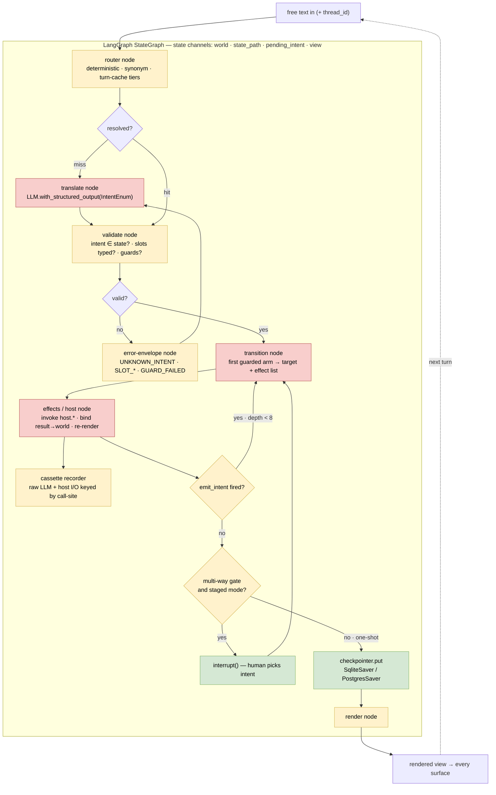

# Enforcement vs. Convention: The "Minimal Effort" Question

**Date:** 2026-06-05
**Author:** Brad Smith
**Purpose:** Answer the sharpest version of the "kitsoki offers nothing
unique" objection — *"can't LangGraph (or any competent code-first
orchestrator) offer the same guarantees with minimal effort?"* — at the
engineering level, honestly, including where the objection lands.

This document is deliberately adversarial against kitsoki. Where the
broader [`README.md`](README.md) synthesises market positioning, this one
stress-tests a single claim until it either breaks or survives. It assumes
the reader knows the architecture; the authoritative description of the
mechanism is [`../stories/architecture.md`](../stories/architecture.md)
(especially §1 "the one idea" and §12 "how a story relates to workflows
and agents"), and the tradition-by-tradition comparison is
[`../architecture/prior-art.md`](../architecture/prior-art.md).

---

## 1. The objection, steelmanned

> Kitsoki's differentiators are a feature checklist — a state graph,
> guards, replay, tool-calling, human-in-the-loop gates, declarative
> source, hot reload, an agent that edits the running app. LangGraph,
> Temporal-plus-an-LLM, or a competent engineer with a `switch` and an
> event log already has every one of these. So kitsoki offers nothing
> unique, and any guarantee it claims can be reproduced on existing tools
> with minimal effort.

**The first half is correct, and we should concede it loudly.** There is
no single primitive in kitsoki that does not already exist somewhere.
Pitched as a feature list, kitsoki loses. The objection only fails on the
word **minimal**, and on a confusion between *capability* and
*enforcement*. The rest of this document is about exactly those two words.

---

## 2. Two claims that get bundled — and must be separated

Almost every version of this objection silently merges two very different
claims. Separate them and they get opposite answers.

| | Claim A: declarative serialized source | Claim B: the *enforced* guarantee |
|---|---|---|
| Statement | "The workflow is a data file you can diff, review, regenerate" | "The LLM can *only* translate free text into a declared, finite intent alphabet; it can never write state or invent an action; the machine is pure; replay is byte-for-byte" |
| Is it novel? | **No** — commodity outside code-first tools | The capability, no. The **mechanical enforcement**, and what falls out of it, yes |
| Effort to match | Low (or zero, if you already use Step Functions / Argo) | High, and it stops being "your tool + a convention" |

The honest answer is: **A is not a moat; B is — and B is a moat made of
enforcement, not capability.**

---

## 3. Claim A is commodity (concede it)

A serialized, declarative workflow definition is the *norm* outside the
deliberately code-first tools:

- **AWS Step Functions** — Amazon States Language (JSON).
- **Argo Workflows** — YAML.
- **Serverless Workflow spec**, **n8n** — YAML / JSON.

"The graph is a data file" is table stakes. The only real wrinkle is
**versus LangGraph specifically**, which is intentionally code-first: a
graph is a live Python `StateGraph` object with no canonical serialized
form. To get declarative LangGraph you would first *build* a serialization
format and an interpreter for it — at which point you have built kitsoki's
loader. But if the baseline is Step Functions, declarative YAML buys
nothing.

So we do not pitch "YAML" or "declarative source" as the differentiator.
They will be matched in an afternoon.

---

## 4. Claim B — what "minimal effort" quietly omits

The kitsoki guarantee is not "one node behaves." It is the whole envelope,
enforced *everywhere*, by the framework rather than by the author. The
LLM-picks-from-a-finite-set part is genuinely easy on existing tools
(LangGraph's `with_structured_output()` + a Pydantic enum gets you a
single well-behaved node). The rest is not. To reach parity you build, by
hand:

1. **A per-state allowed-intent alphabet**, injected into the
   structured-output schema *dynamically each turn* (valid intents change
   with location), plus the validation envelope with self-correcting error
   codes (`INTENT_NOT_ALLOWED_IN_STATE`, `SLOT_TYPE_MISMATCH`, …) and slot
   validation *before* guards. (kitsoki: `internal/machine`,
   `internal/intent`; see [`../stories/architecture.md` §6][arch6].)
2. **A pure-transition discipline that is actually enforced.** This is the
   load-bearing gap. A LangGraph node is arbitrary code — nothing rejects
   one that does I/O, reads a clock, calls `random`, mutates state
   directly, or invokes a tool the model chose. You can *write* pure nodes;
   the framework will not *reject* impure ones. Enforcement is code review
   and hope. (kitsoki: the machine is pure by construction — host calls are
   *queued* and dispatched by the orchestrator after `machine.Turn`
   returns; see [`../stories/architecture.md` §4, §7][arch7].)
3. **A cassette layer for byte-for-byte mock replay.** Checkpointing saves
   *state after each node*; it does not record the LLM's raw I/O keyed by
   call-site so a run replays against a zero-cost mock. That recorder is a
   thing you build. (kitsoki: [`../tracing/testing.md`](../tracing/testing.md).)
4. **A pluggable-per-decision operator** abstraction (LLM → local model →
   human → cache, swappable *per decision*) and an **execution-mode flip**
   (one-shot ↔ staged) that changes who resolves every gate without
   rewriting the graph. (kitsoki: `internal/orchestrator/decider.go`,
   `ExecutionMode`; [`../stories/architecture.md` §11][arch11].)
5. **Decision-as-labeled-datapoint** extraction — which only works *if* you
   already did #2 and isolated every interpretive decision into a typed,
   recorded call.

That is not minimal. **That is a framework.** And the punchline: once it is
built, you have not "used LangGraph *instead of* kitsoki" — you have used
LangGraph as the execution substrate and written kitsoki's discipline layer
on top of it. The part that would be yours is exactly the part kitsoki
claims as its moat. **LangGraph is the engine; the guarantee is the layer
above it.**

### 4.1 The same loop as a LangGraph `StateGraph`, color-coded by enforcement burden

Here is kitsoki's turn loop ([`../stories/architecture.md` §7][arch7])
implemented as a LangGraph `StateGraph`. Every box is buildable. The point
of the diagram is *not* "can you draw it" — of course you can — it is **who
enforces each box**: green = LangGraph hands it to you; yellow = you build
it once, mechanically; red = you build it *and* must continuously
self-police it, because LangGraph will not reject a violation.

**Reading the colors:**

- **Green — LangGraph gives it to you.** Checkpoint/resume (`SqliteSaver`/
  `PostgresSaver`) and the human gate (`interrupt()`) are native. Genuinely
  free.
- **Yellow — you build it once, then it just works.** The routing tiers
  (Aho-Corasick synonyms, the turn-cache keyed by a lexical signature), the
  validation envelope and its self-correcting error codes, the
  depth-capped `emit_intent` loop, the gate decider + execution-mode
  switch, multi-surface render, and the **cassette recorder** — which
  LangGraph's checkpointer is *not* (it saves state-after-node, not raw
  call-site I/O for zero-cost mock replay; see §4 item 3). Mechanical, but
  none of it ships in the box.
- **Red — you build it *and* police it forever, because the framework
  cannot reject a violation.** These three nodes are the entire ballgame,
  and they are exactly the boxes a *framework* can impose but a *library*
  cannot:
  - **translate** — the structured-output enum must be the *current
    state's* allowed intents, injected per turn (not a fixed enum). And
    nothing stops this node from *also* doing I/O or writing `world`. The
    "LLM only translates" guarantee is your convention here.
  - **transition** — must be *pure*: same `world` + same intent → same arm,
    no clock, no randomness, no I/O. LangGraph runs an arbitrary Python
    function in this slot; purity is asserted by code review and checked by
    nobody.
  - **effects / host** — the *only* legal write to `world` is a declared
    `bind:`, and the node must not invent an action. Unenforced — and the
    path of least resistance is to collapse all three red boxes into **one
    fat node** that translates, decides, and mutates at once. That collapse
    is exactly the tangle that destroys byte-for-byte replay and the
    decision corpus (§5).

The yellow boxes are a weekend of work. The red boxes are the product — and
they do not come *from* LangGraph; they come from **refusing to let a node
be arbitrary code.** kitsoki gets that refusal mechanically: host calls are
*queued* and dispatched by the orchestrator *after* the pure `machine.Turn`
returns ([`../stories/architecture.md` §4, §7][arch7]), so the red boxes
*cannot* be collapsed. Add that same refusal on top of LangGraph and you
have rebuilt kitsoki's loader and pure machine on its scheduler — which is
§4's conclusion, now visible as three red boxes.

---

## 5. The real moat is enforcement, not capability

The argument is structurally identical to **types in Python**. You *can*
maintain a fully sound type discipline in untyped Python by convention.
Nobody accepts that as equivalent to a checker, for two reasons that
transfer exactly:

- **A guarantee maintained by convention across a team is not a
  guarantee.** It is a hope that decays at the first deadline. The product
  is the *rejection* of violations, not the *possibility* of avoiding them.
  kitsoki's loader rejects an undeclared verb, an unresolvable target, a
  non-allow-listed host, a missing `relevant_world:` key — at load time,
  mechanically. "The model usually won't invent an action" and "the model
  *can't*" are different products.
- **A framework is defined by what it makes impossible, not by what it
  makes achievable.** LangGraph's affordances pull toward one fat LLM node
  that decides, calls tools, and writes state — the path of least
  resistance, and exactly the tangle that destroys replayability and the
  decision corpus. kitsoki's affordances make that tangle *unexpressible*.

This is why the moat cannot be matched feature-by-feature: every kitsoki
capability — replay, audit trail, cost-routing, self-improvement,
safe agent-editing — *falls out of* the one constraint (separate
interpretive decisions from deterministic execution). A competitor adding
the features one at a time is re-deriving the constraint the hard way.

---

## 6. Live editing of a running story — the one part that is genuinely hard

The "declarative source + hot reload" pitch hides a second bundling.
"Declarative YAML" (Claim A, §3) is commodity. **Live editing of a
*running, stateful* session is not** — it is one of the acknowledged hard
problems of the whole workflow-engine category.

The hard core: a session is parked mid-run with a persisted, typed world,
and you change the graph definition *underneath it*. The engine must
reconcile the in-flight run against a structurally different graph. The
mainstream tools mostly refuse:

| Tool | How it handles editing a running workflow |
|---|---|
| **Temporal** | The famous footgun. Workflows replay history against code, so editing in-flight logic causes non-determinism errors. Sanctioned answer: `GetVersion()` / patching — *every* change explicitly version-guarded so old runs replay the old path. |
| **AWS Step Functions** | Definitions are versioned; in-flight executions run against the definition they *started* with. No hot edit. |
| **Airflow** | Editing a DAG mid-run is a known mess; the scheduler picks up the new DAG and task instances desync. |
| **LangGraph** | Recompile the Python and resume a checkpoint — but no built-in reconciliation when node/edge names change, and the "edit" is editing arbitrary Python. |

kitsoki attempts the thing they avoid: the meta controller diffs the story
tree before/after, the loader re-validates *every* invariant on reload, and
the session rehydrates state + world from the event log against the new
definition ([`../stories/meta-mode.md`](../stories/meta-mode.md)).

### 6.1 The integrated edit loop is the novel motion

The novelty is not "YAML" and not "hot reload" in isolation — it is the
**conversational, in-session, agent-driven edit loop**: `/meta story edit`
opens an agent with full live context (current state, rendered view, a live
trace file, the world bag); the agent edits the running story *in place*;
`/onpath` resumes and the running session picks up the change after
re-validation. Nobody ships that as one motion. But it is a **developer-
experience integration, not a new primitive.**

### 6.2 Why that loop is only *safe* — and the tie back to §5

The loop is only safe because the source is declarative and bounded. When
the agent "edits the story," it edits schema-constrained YAML the loader
re-validates — edits cannot escape the alphabet. If the graph were code
(LangGraph), "let an agent live-edit the running story" means "let an agent
rewrite arbitrary Python in your running process" — reintroducing the exact
blast-radius problem the constraint exists to remove. **Declarative-bounded-
source and safe-agent-editing are the same property seen from two angles.**
The editing story is a *consequence* of the moat (§5), not a second
independent moat — which is why it should be pitched that way, not as a
standalone feature.

---

## 7. Keeping ourselves honest — where the objection partly lands

This document is worthless if it only flatters kitsoki. Three concessions
that a serious evaluator will reach on their own, so we should reach them
first:

1. **kitsoki's own enforcement is not yet complete.** The clearest case:
   `host.agent.task` granted `Write`/`Edit` will YOLO-implement beyond its
   remit — today restrained by *prompt wording*, not a mechanical
   write-path allow-list (the engine fix is proposed, not built:
   [`../proposals/task-fs-sandbox.md`](../proposals/task-fs-sandbox.md)). So
   in precisely the place where "blast radius is enforced, not hoped" is
   most load-bearing, kitsoki is *currently* also relying on convention. The
   §5 gap between kitsoki and "LangGraph + a good template + a linter" is
   narrower **today** than the finished-engine thesis implies.

2. **kitsoki solves only the easy half of live editing.** It handles the
   **author-iteration loop** (you edit your own story while testing it;
   reload re-validates, re-runs `on_enter`, continues) — and even that
   used to leak: `/reload` re-fires `on_enter`, which could re-run `on_enter`
   LLM calls. That narrow idempotency wart is now covered by `once: true`
   (with `/reload --force` for authoring); see
   [`state-machine.md`](../stories/state-machine.md#on_enter-must-be-idempotent).
   The broader `on_first_enter` / auto-advance idea is still proposed in
   [`../proposals/auto-advance-states-proposal.md`](../proposals/auto-advance-states-proposal.md).
   The *hard* half — state migration across structural change in a
   long-lived production session (world schema changed, current room renamed
   three weeks in) — kitsoki has **not** touched. Temporal's whole
   versioning apparatus exists for exactly that.

3. **The steelman of the skeptic.** Maybe mechanical enforcement is not
   worth a separate engine. A solid LangGraph project template + a lint rule
   banning I/O in non-agent nodes + a recorder hook might capture ~80% of
   the value at ~10% of the cost. If true, kitsoki is a research bet that
   the last 20% — *total* enforcement, the decision corpus, per-decision
   operator swap — actually pays. That bet is **unproven**; the PoC exists
   to settle it. (Positioning consequence: kitsoki is a PoC under internal
   validation with real bugs — never "production-ready" or "shipping.")

   The batteries kitsoki ships — a ready-to-go TUI and web chat, a typed-view
   UI kit, a trace viewer — bear on *this* concession specifically: they
   lower the cost to **evaluate** the bet (an assessor experiences the
   enforced envelope in minutes rather than building the loop, persistence,
   and frontend first). That is an **adoption lever, not a second moat** —
   it changes the odds the bet gets *tried*, not the odds it *pays*. Do not
   let a polished surface re-smuggle the feature-checklist pitch §1 rejects;
   the UI kit and trace viewer are differentiated only as *faces of the one
   constraint* (replayable typed views; an authoritative, not observed,
   trace), argued in
   [`control-inversion.md` §7](control-inversion.md#7-the-surface-features-are-faces-of-the-inversion-not-a-checklist).

- **"Declarative YAML source"** — commodity. Not an edge on its own (the
  LangGraph-is-code-first caveat aside). Do not pitch it.
- **"Live editing of a running session"** — genuinely hard; the mainstream
  forbids or version-guards it. But kitsoki does only the author-iteration
  half, with a known `on_enter` idempotency wart, and has not touched
  production state-migration.
- **The defensible claim is narrow and survives scrutiny:** the moat is
  *one architectural constraint, enforced mechanically* — separate
  interpretive decisions from deterministic execution — and everything
  else (replay, audit, cost-routing, self-improvement, and the safe
  agent-driven edit loop) is a *consequence* of it. Existing tools have the
  capabilities; they do not impose the constraint. Whatever LangGraph does
  here, the guarantee lives in code you write and police yourself, not in
  the framework — and once you build and enforce all of it, you have rebuilt
  kitsoki on top of LangGraph.

The trap to avoid in every pitch: do **not** defend a feature checklist —
it will be matched. Defend the fact that the graph being a *bounded,
validated artifact* is what lets a model safely rewrite a live workflow at
all, and that the enforcement — not the capability — is the product.

---

## See also

- [`README.md`](README.md) — competitive-analysis synthesis and the
  slide-ready value proposition.
- [`technical-research.md`](technical-research.md) — the seven load-bearing
  technical choices and their 2026-landscape validation.
- [`../stories/architecture.md`](../stories/architecture.md) — §1 the one
  idea; §12 a story vs. a workflow engine and vs. a lead-agent loop.
- [`../architecture/prior-art.md`](../architecture/prior-art.md) — what
  kitsoki steals from and rejects in each neighbouring tradition.
- [`../architecture/concept.md`](../architecture/concept.md) — the *why*
  behind the interpretive/deterministic split.

[arch6]: ../stories/architecture.md#6-intents-and-slots-the-alphabet
[arch7]: ../stories/architecture.md#7-the-turn-one-round-trip-end-to-end
[arch11]: ../stories/architecture.md#11-driving-the-graph-without-input
