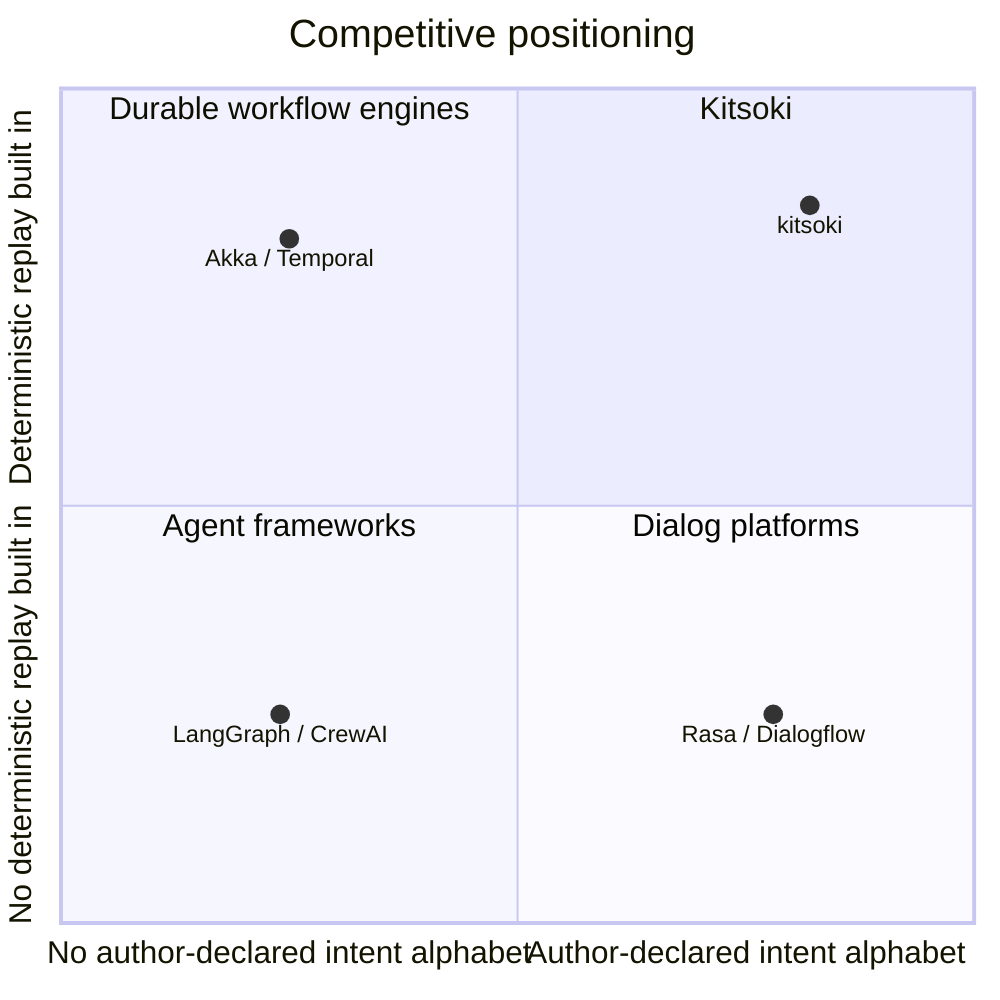

# Market Research: Deterministic Conversation Engines for LLM-Driven Enterprise Workflows

**Date:** 2026-05-19
**Author:** Brad Smith
**Research Type:** Market Research
**Subject:** kitsoki

---

## Research Overview

Kitsoki is a Go-based deterministic conversational workflow engine. The user (or an external orchestrator) drives a finite-state YAML-defined application with free text; an LLM is used only to translate that text into an author-declared finite alphabet of intents. Every transition, every guard, every world mutation is in declared YAML. No hallucinated flags, no out-of-state actions.

This research locates kitsoki on the 2026 conversational-AI / LLM-orchestration landscape, sizes the market it could play in, characterises the buyer, and identifies the competitive set it must position against. The driving outcome is a slide-ready business value proposition: who does kitsoki serve, what problem only it solves cleanly, and what the buyer is willing to pay for.

**Headline finding:** the 2026 enterprise LLM-platform market is bifurcating. Pure-agentic frameworks (LangGraph, CrewAI, AutoGen) trade determinism for flexibility. Traditional dialogue managers (Rasa, Dialogflow CX) trade flexibility for control. A small but rapidly forming third category — "deterministic backbone + LLM-as-recognizer" — is where regulated-industry buyers are converging, and where kitsoki's architecture is natively positioned. Several 2026 academic and OSS systems (StateFlow, CompileAgent, R-LAM, DFAH) are converging on the exact pattern kitsoki implements.

See §6 for the full executive summary and recommended positioning.

---

## 1. Market Research Introduction and Methodology

### 1.1 Why this research, now

The enterprise market for LLM-powered conversational systems is large, growing, and structurally unstable. The total enterprise conversational AI platform market is sized at **$11.61B in 2025, projected to $15.54B in 2026 at a 33.9% CAGR** ([The Business Research Company, 2026][tbrc-enterprise-cai]). The narrower segment most relevant to kitsoki — LLM-driven dialogue systems — is **$2.04B in 2025, projected to $2.46B in 2026 at 20.7% CAGR** ([WhaTech, 2026][whatech-llm-dialogue]).

The instability is the interesting part. The "winning architecture" emerging in 2026 is explicitly described as a *deterministic backbone with intelligence at specific steps* ([Akka, 2026][akka-frameworks]) — i.e., the architectural shape kitsoki was built to. Regulated buyers (financial services, healthcare, government) are pulling the category toward auditability and replayability ([Determinism-Faithfulness Assurance Harness, arXiv 2601.15322][dfah]), which the pure-agentic frameworks struggle to deliver.

Kitsoki today is a PoC at acronis.com, not yet productized. The research question is therefore not "is the market big" (it is) but: *where in the category does kitsoki uniquely belong, and what is the defensible value proposition that survives contact with the established players?*

### 1.2 Methodology

- **Sources:** 2026 market-research publications (Fortune Business Insights, MarketsandMarkets, The Business Research Company, Grand View Research, Research and Markets); 2026 vendor-comparison and analyst writing (Akka, Vellum, Morph, Dasha, Slashdot); 2026 peer-reviewed work on deterministic LLM workflows (arXiv StateFlow, DFAH, Blueprint First Model Second, Compiled AI); OSS project documentation (CompileAgent, R-LAM).
- **Time period:** 2025 actuals and 2026 forecasts; 2030–2034 long-view from market sizing firms.
- **Geographic scope:** Global, with North America noted as the dominant region (33.62% of the conversational-AI market in 2025, [Fortune Business Insights][fbi-cai]).
- **Verification:** Every load-bearing numeric claim is cited inline; competitor capability claims are corroborated against at least one comparative source.
- **Limitations:** Kitsoki is not yet a commercial product, so this report cannot reference real customer interviews. Pain-point inference is grounded in published enterprise buyer reports and the documented design intent of regulated-industry LLM frameworks.

### 1.3 Research goals achieved

| Original goal | Status | Evidence |
|---|---|---|
| Identify kitsoki's category | ✅ | §2 — "deterministic backbone + LLM-as-recognizer," distinct from agentic and traditional-NLU |
| Quantify the addressable market | ✅ | §2 — TAM/SAM/SOM estimate from three independent firms |
| Map the competitive set | ✅ | §4 — LangGraph, Rasa, Dialogflow CX, Akka, XState+LLM hybrids, CompileAgent |
| Characterize the buyer | ✅ | §3 — regulated-industry engineering leads needing audit-grade LLM workflows |
| Surface defensible differentiation | ✅ | §6 — replayable flow tests, four-tier semantic-routing stack, on-disk artifact-as-conversation |

---

## 2. Market Analysis and Dynamics

### 2.1 Market sizing

Three independent firms agree on order of magnitude and direction:

| Segment | 2025 | 2026 | CAGR | Source |
|---|---|---|---|---|
| Conversational AI (total) | $14.79B | $17.97B | 21.0% (to 2034) | [Fortune Business Insights][fbi-cai] |
| Conversational AI (total) | $13.64B | $17.12B | 25.6% | [The Business Research Company][tbrc-cai] |
| **Enterprise** CAI platforms | $11.61B | $15.54B | 33.9% | [The Business Research Company, Enterprise][tbrc-enterprise-cai] |
| LLM dialogue systems | $2.04B | $2.46B | 20.7% | [WhaTech / market report][whatech-llm-dialogue] |

**TAM / SAM / SOM read for kitsoki:**

- **TAM** — enterprise CAI platform market: ~$15.5B in 2026. Plus an adjacent slice of the broader LLM-app-development tooling market that has no single industry-analyst SKU but is comparably sized to the CAI segment — kitsoki addresses both because the architecture's benefits (predictability, introspection, replay, self-improvement) apply to any LLM-driven workflow, not just dialogue-shaped ones.
- **SAM** — any team building production LLM workflows that need predictable progression, introspectable history, and the option to improve over time. Not separately sized by analysts. Bounded above by the LLM-dialogue-system figure ($2.46B 2026) plus the LLM-app-tooling adjacency. The **most acute** subsegment (audit-grade / regulated industries — financial services, healthcare, government, cybersecurity) is a mid-estimate of $300M–$800M in 2026 with the easiest "build-vs-buy" trigger, but it is not the whole SAM. Engineering-tooling teams, product teams shipping LLM features, and research/experimentation teams are all in scope.
- **SOM** — an open-source PoC competing for early adopters across the segments above: low millions for the next 24 months, with the open question of whether kitsoki ships as commercial product or stays internal/OSS.

### 2.2 Market trends shaping demand

Five trends each independently push buyers toward kitsoki's architectural shape:

1. **"Deterministic backbone + intelligent steps" is the consensus 2026 pattern.** Akka's framework guide explicitly identifies this as the winning enterprise architecture, with control always returning to the deterministic flow when an agent completes ([Akka, 2026][akka-frameworks]).
2. **Regulatory replay requirements.** Auditability for CMS prior-authorization, FDA AI-enabled medical workflows, and FSB/CFTC financial regulations is forcing deterministic execution into the requirements list ([Morph, 2026][morph-llm-workflows]; [DFAH, arXiv 2601.15322][dfah]).
3. **The hallucination control problem refuses to go away.** Closed-domain QA still produces 10–20% hallucination rates; medical Q&A 43–64% without structured prompts ([SQ Magazine, 2026][sq-hallucination]). "Intent hallucination" — LLMs satisfying only a portion of multi-condition queries — is a newly named failure mode in 2026 ([arXiv 2506.06539][intent-hallucination]).
4. **Structured-output / schema-validated calling is now table-stakes.** Validation between every step and a token/step/wall-clock budget per agent run are the documented production-reliability pattern ([Morph, 2026][morph-llm-workflows]).
5. **Self-improving / lifelong-learning agent workflows are the 2026 frontier.** A January 2026 IEEE TPAMI survey codified "lifelong learning for LLM agents" as a recognised subfield ([qianlima-lab survey][lifelong-survey]). The pattern: agents extract reusable knowledge from each run into a non-parametric memory and inject it into future prompts — parameter-free improvement that sidesteps fine-tuning ([Experiential Reflective Learning, arXiv 2603.24639][erl]; [Memento, arXiv 2508.16153][memento]). Reflexion-style self-reflection ([arXiv][reflexion-survey]) and Just-in-Time RL ([arXiv 2601.18510][jitrl]) are now mainstream research touchstones.

Kitsoki is architecturally compliant with the first four trends *by design* — the LLM has no latitude outside the declared intent alphabet, every transition is validated by the state machine, the event log is the source of truth for replay, and the four-tier routing stack means 78%+ of turns never call the LLM at all. For the fifth trend, **a planned 4-layer self-improvement model** (described in §4.5) is the explicit roadmap response, with a working internal precedent already shipped inside Acronis as the `loopy` tool ([cyber-repo/tools/loopy][loopy-self-improvement]).

### 2.3 Pricing and business model context

Established competitors price along three axes that matter for kitsoki positioning:

- **Open-source self-hosted.** Rasa, LangGraph — zero license cost, hosting and ops on the buyer. Heavy infrastructure burden ([Dasha, 2026][dasha-rasa-alternatives]).
- **Enterprise SaaS with usage pricing.** Dialogflow CX, Voiceflow — "significantly more expensive than older Dialogflow ES or self-hosted Rasa" ([Dasha][dasha-rasa-alternatives]); often per-conversation-unit pricing.
- **Workflow-engine platform.** Akka, Temporal — license + support contracts, sold to platform engineering teams.

Kitsoki today is open-source-shaped (single static Go binary, no CGO, no system libraries). The natural commercial model if productized would be a **support-and-tooling tier on top of the OSS core** — Rasa's model before its CALM pivot, which is a market the regulated-industry buyer is already familiar with.

---

## 3. Customer Insights and Behavior Analysis

### 3.1 The buyer kitsoki is built for

The buyer is **anyone shipping an LLM-driven workflow who wants predictable behaviour, introspectable history, and the option to improve the workflow over time** — and who is tired of the unbounded-latitude alternatives. Indicators:

- They want their workflow debuggable, replayable, and improvable — reasons range from compliance audit to "we just want to know why it did what it did" to "CI tests can't keep paying LLM tokens."
- They have already tried, or been pitched, a pure-agentic framework (LangGraph, CrewAI) and bounced off the lack of replayability ([DFAH study found most LLM-agent deployments fail to reproduce decisions even at temperature 0][dfah]).
- They have already tried, or been pitched, a traditional NLU framework (Rasa, Dialogflow) and bounced off either the training-data burden or the vendor lock-in.
- They need to *test* the LLM-driven flow in CI without paying inference costs on every commit.

**Segments, from most acute to broadest:**

1. **Regulated enterprises** (financial services, healthcare, government, cybersecurity / data protection) — the trigger event is usually a compliance / audit / regression incident; nondeterminism becomes a board-level concern fast.
2. **Engineering-tooling teams** building internal LLM-driven workflows (bug-fix pipelines, PR review, on-call runbooks). The kitsoki-dev dogfood instance is this segment in action — predictability and introspection drive adoption here even without an audit requirement.
3. **Product teams** shipping LLM features who need reproducible behaviour for regression testing and post-incident debugging.
4. **Research / experimentation teams** running LLM-driven processes that need to be replayable for scientific reproducibility.
5. **Anyone hand-rolling "LLM + state machine" glue** — kitsoki replaces the boilerplate.

### 3.2 Customer journey and decision factors

The buyer's evaluation path, inferred from published comparisons ([Slashdot Dialogflow vs LangGraph 2026][slashdot-dialogflow-langgraph]; [Dasha Rasa Alternatives 2026][dasha-rasa-alternatives]; [SupportGPT, Top 12 Frameworks 2026][supportgpt-frameworks]):

1. **Stage 1 — Trigger.** Varies by segment. *Regulated:* compliance / audit / regression incident makes nondeterminism a board-level concern. *Engineering tooling:* unbounded LLM latitude breaks the dev loop or runs up cost. *Product:* a regression they can't reproduce blocks a release. *Research:* a reviewer asks for replayability.
2. **Stage 2 — Survey.** Evaluator lists "the usual suspects": Rasa, Dialogflow CX, LangGraph, Bot Framework, Botpress.
3. **Stage 3 — Disqualification.** LangGraph fails on replay; Dialogflow CX fails on portability / cost; Rasa fails on LLM-native ergonomics.
4. **Stage 4 — Build vs buy decision.** Most teams here fall back to "we'll write the state machine ourselves and call the LLM only for intent extraction." This is **the moment kitsoki should be in the room** — kitsoki is the productised version of what they were about to build by hand.

Decision factors, ranked by reported weight:

| Factor | Weight | kitsoki posture |
|---|---|---|
| Replayability / audit trail | High | ✅ Native — event log is source of truth, deterministic flow tests in CI |
| Test cost (LLM-free regression tests) | High | ✅ Mode-2 flow tests run with zero LLM cost |
| Hosting/portability | High | ✅ Single static Go binary, no CGO, no system libraries |
| Author ergonomics (declarative YAML, no ML training data) | Medium-high | ✅ Intents + slots declared in YAML; LLM has no extra latitude |
| Multi-surface (TUI / ticket / PR comments) | Medium | ✅ One state machine per session across surfaces |
| Vendor maturity / support contract | Medium-high | ❌ PoC — biggest gap |
| Ecosystem (integrations, templates) | Medium | ❌ Early — small set of example apps |

### 3.3 Customer pain points

Three pain points appear in every published 2026 comparison and align directly with kitsoki's design:

1. **"My LLM agent can't reproduce its own decisions."** Most deployments fail audit replay ([DFAH][dfah]); decision determinism and task accuracy are *not correlated* — a system can be accurate but non-deterministic, which is the worst failure mode for compliance.
2. **"Every commit costs me LLM tokens to test."** No pure-agentic framework has a credible no-LLM regression-test story. Kitsoki's flow tests do.
3. **"I'm exposing the LLM to actions it shouldn't be allowed to invent."** Tool-use frameworks expose typed tool lists per state; the LLM can still pick wrong tools, mis-fill slots, or hallucinate flags. Kitsoki's single-tool `transition` design with validator-as-gatekeeper closes this gap ([docs/architecture/prior-art.md §5][prior-art]).

---

## 4. Competitive Landscape

### 4.1 Key market players (segmented by architecture)

**Pure-agentic LLM frameworks** — LLM is the planner.

| Player | Strength | Weakness vs kitsoki | Source |
|---|---|---|---|
| **LangGraph** (LangChain) | LLM-native, flexible, Python-first | Lacks enterprise stability and support contracts; unpredictable execution | [Dasha, 2026][dasha-rasa-alternatives]; [Slashdot, 2026][slashdot-dialogflow-langgraph] |
| **CrewAI / AutoGen** | Multi-agent orchestration | Same determinism gap; harder to audit | [Vellum, 2026][vellum-agentic-workflows] |
| **OpenAI Agents SDK** | Tight integration with GPT models | Vendor lock-in; replay not first-class | [Akka, 2026][akka-frameworks] |

**Traditional dialogue managers** — NLU + state machine, pre-LLM-native.

| Player | Strength | Weakness vs kitsoki | Source |
|---|---|---|---|
| **Rasa** | Mature, self-hostable, GDPR-friendly; pivoting to CALM | Heavy training-data burden; "feels like overkill for teams that want a simple generative bot" | [Dasha, 2026][dasha-rasa-alternatives] |
| **Dialogflow CX** | Visual state machine, regulated-industry friendly | Google Cloud lock-in; expensive vs Rasa or self-host | [Dasha, 2026][dasha-rasa-alternatives] |
| **Microsoft Bot Framework Adaptive Dialogs** | Enterprise support, event-driven | Microsoft ecosystem gravity; weaker LLM-native story | [docs/architecture/prior-art.md §3][prior-art] |

**Deterministic workflow engines** — generic, repurposed for LLM.

| Player | Strength | Weakness vs kitsoki | Source |
|---|---|---|---|
| **Akka Workflow** | Stateful, replayable, enterprise-scale | Generic — buyer still has to build the dialogue layer | [Akka, 2026][akka-frameworks] |
| **Temporal** | Event-sourced determinism, mature | Workers/activities are overkill for one-conversation-per-session | [docs/architecture/prior-art.md §2][prior-art] |

**The emerging "deterministic backbone + LLM-as-recognizer" category** — kitsoki's actual peer set.

| Player | Strength | Weakness vs kitsoki | Source |
|---|---|---|---|
| **StateFlow** (academic, Microsoft) | State-driven LLM workflows; published research | Research artifact, not production framework | [arXiv 2403.11322][stateflow] |
| **Blueprint First, Model Second** (academic) | Deterministic LLM workflow framework | Conceptual framework; no shipping OSS | [arXiv 2508.02721][blueprint] |
| **CompileAgent** (OSS) | Compiles LLM plans into replayable graphs; framework-agnostic | Newer, narrower scope; no multi-surface | [GitHub: yuer-dsl/compileagent][compileagent] |
| **R-LAM** (academic) | Reproducibility-constrained Large Action Models | Research-stage | [arXiv ref in VoltAgent][r-lam] |
| **DFAH** (academic, finance-specific) | Determinism-faithfulness audit harness | Domain-specific (finance); audit tool not authoring tool | [arXiv 2601.15322][dfah] |

### 4.2 Competitive positioning summary

The competitive map has three quadrants kitsoki can claim:

Kitsoki is alone in the upper-left quadrant *for a working implementation at the same architectural scope* — running PoC, validated internally on real bugs across teams. Academic and OSS systems (StateFlow, CompileAgent, R-LAM) validate that the quadrant is real and important, but none of them ships an authoring DSL, a CI-grade flow-test runner, and a multi-surface transport layer in one binary today.

### 4.3 Competitive threats

1. **Rasa's CALM pivot.** Rasa is explicitly positioning toward LLM-agent competition ([Dasha, 2026][dasha-rasa-alternatives]). If CALM gains determinism guarantees, kitsoki loses some of its differentiation against the largest installed base of dialogue-manager users.
2. **LangGraph adding replay primitives.** LangChain has the funding and shipping cadence to add `SqliteSaver` / replay-feedback loops natively (already partly there, [docs/architecture/prior-art.md §2][prior-art]). The closer LangGraph gets to deterministic replay, the smaller kitsoki's defensible moat on that single axis.
3. **CompileAgent and the OSS deterministic-execution wave.** Framework-agnostic determinism layers — CompileAgent specifically markets "deterministic, auditable, replayable execution graph" — are kitsoki's closest peers and the most likely *direct* competitor in the next 12 months.
4. **Hyperscaler integration.** If Anthropic, Google, or OpenAI ship a first-party "deterministic agent" runtime, the category compresses fast.

### 4.4 Competitive opportunities

1. **The "free text in, deterministic transitions out" positioning is unowned.** No competitor markets this phrase or the architectural commitment behind it. It is a clean tagline that survives a 30-second elevator pitch.
2. **The dogfood story is unusual and credible.** Kitsoki being used to *fix kitsoki bugs through its own UI*, with the bug file as ticket + conversation log + audit trail, is a differentiator no competitor can match — it is itself the proof of the audit-trail claim.
3. **The four-tier semantic-routing stack is a hard-to-replicate efficiency claim.** ~78% of turns routing without an LLM call on the Oregon Trail story is a *measured* efficiency claim with token-cost implications that map directly to CFO buying triggers.
4. **Planned 4-layer self-improvement model** — see §4.5.

### 4.5 The planned self-improvement layer (roadmap differentiator)

The 2026 academic frontier (Trend 5 in §2.2) has codified self-improving / lifelong-learning agent workflows as a distinct subfield. The pattern — agents extract reusable knowledge from each run into a non-parametric memory, then inject it into future prompts — is parameter-free improvement that sidesteps fine-tuning. Kitsoki's roadmap adopts a 4-layer model already validated inside Acronis by the `loopy` autonomous-bug-fix tool ([cyber-repo/tools/loopy/docs/SELF-IMPROVEMENT.md][loopy-self-improvement]):

| Layer | What it does | Loopy precedent |
|---|---|---|
| **Layer 1 — Phase-internal error loop** | Within a single state/phase, when generated code or LLM action errors out: capture stderr, re-prompt with error context, retry (bounded). Operational-mistake recovery. | Implemented across Phases 1, 7.5, 9.5, 9.7 in loopy |
| **Layer 2 — Cross-phase feedback** | A later state rejects an earlier state's output (validation fails, code-review blocker, security finding, test failure) and loops back to that earlier state with structured corrective context. Carries `cycle`, `retry_phase`, `reasoning`, `instructions` in a feedback artifact. | 5 feedback points (A–E) implemented in loopy |
| **Layer 3 — Pipeline self-patching** | When the failure is in the pipeline itself (prompt template, helper function, broken assumption), an outer orchestrator LLM-patches the offending file, syntax-checks, commits with metadata, and restarts a fresh subprocess. Budget-controlled to prevent runaway patching. | Fully implemented in loopy via the loop.py / bug-fix.py subprocess boundary |
| **Layer 4 — Cross-run knowledge extraction + injection** | Three operations: (a) **extract** patterns from each completed run into an on-disk markdown knowledge base with confidence + provenance; (b) **inject** relevant entries into future prompts via a header-declared `# knowledge:` directive; (c) **analyze** batch-level patterns to drive systemic improvements. | All three operations implemented in loopy; knowledge base structured as layered scope (pipeline / domain / project / repo) |

#### Why this matters for kitsoki's positioning

1. **It is the natural extension of kitsoki's existing architecture.** Layer 1 is already the harness's retry envelope; Layer 2 is the structured-error envelope the single MCP `transition` tool already returns; Layer 3 needs a process-boundary primitive kitsoki already has via subprocess transports; Layer 4 needs an append-only event log kitsoki already maintains. No architectural pivot — only feature ship.
2. **It maps the audit-trail claim onto an improvement claim.** Today kitsoki argues "every transition is replayable." With Layer 4, the same trace becomes the substrate for "the workflow gets measurably better the more it runs, and you can audit *why* it got better." That is the CFO-facing economic argument extended into a CTO-facing reliability argument.
3. **It is differentiating against every named competitor in §4.1.** LangGraph has memory primitives but no audit-grade promotion model. Rasa's CALM has none. Dialogflow CX has none. CompileAgent has none. Loopy is the only proven instance of the full 4-layer pattern in Acronis production today — kitsoki absorbing its lessons is a direct moat against the OSS deterministic-execution wave (Threat 3 in §4.3).
4. **The framing is "learns without training data."** Loopy's knowledge base is plain markdown — hand-readable, hand-editable, version-controlled. That is *exactly* the regulated-buyer's mental model: improvement is auditable because the learned facts live in git, not in opaque model weights.

#### Risks specific to this differentiator

- **Roadmap, not shipped.** Honest positioning requires labelling this as planned in the deck. Loopy is the internal precedent that makes the claim credible, but kitsoki has not yet shipped the integration.
- **Knowledge-base curation cost.** Extraction is cheap; *curating* the knowledge base over time (deduping, deprioritising stale entries) is real ongoing work. Loopy's experience with this is the most valuable transferable lesson.
- **Layer 3 is the riskiest.** A self-patching pipeline that can edit its own prompts and code needs strict budget controls; loopy gates Layer 3 patches behind `pipeline_bug + high impact` and caps patches per batch.

### 4.6 Plugin marketplace (roadmap differentiator)

Kitsoki stories are already YAML-defined composable units; the `imports:` block already lets one app pull rooms, intents, slots, and host-handlers from another file or repo ([`docs/stories/imports.md`][imports]). A plugin marketplace formalises this pattern into a distribution channel: third parties publish kitsoki story packages, and authors install them with one command — exactly the way Claude Code's plugin marketplace works for skills (and exactly the way this conversation just installed the `bmad-method-lifecycle` and `bmad-pro-skills` plugins).

The fit with kitsoki's architecture is not retrofitted; it is *native*:

| kitsoki primitive | Plugin-marketplace consequence |
|---|---|
| YAML is declarative, validatable, has no executable code paths | Plugins are safe to install — there is no arbitrary-code-execution surface to audit. JSON-Schema + semantic validation is the gatekeeper. |
| Intent alphabet is declared per state | Plugin boundaries are *typed* contracts: an importing app sees a plugin's intents as a finite, named set, not a black box. |
| Event log is the source of truth, every transition is recorded | Audit trail captures *which plugin version was active* per session. Regulated buyers can prove "we ran on plugin X@1.2.3 last quarter, here is the lock file." |
| `imports:` already exists and composes across files/repos | The marketplace is `imports:` with a registry instead of a path — no new authoring primitive needed. |
| Multi-transport is per-story | A "Jira bug-fix room" plugin works identically on Bitbucket because the transport layer is decoupled from the story layer. |
| Single static Go binary | No runtime dependency hell — plugins are YAML + optional host-handler declarations, not Python wheels with native extensions. |

#### What the marketplace would actually contain

- **Provider plugins** — GitHub-equivalent of the existing Jira/Bitbucket transports; PagerDuty; Slack; Confluence.
- **Pipeline plugins** — pre-built bug-fix, feature-implementation, PR-refinement, retrospective rooms (some of these already exist as built-in stories; turning them into marketplace plugins is the unbundling move).
- **Vertical bundles** — curated lists of plugins for "regulated financial services," "healthcare PRD review," "cybersecurity incident response." This is where the regulated-buyer go-to-market connects directly to the plugin model.
- **Intent / semantic-routing packs** — synonym libraries for specific domains (compliance jargon, cybersecurity terms-of-art, finance regulatory vocabulary).
- **Visual/voice theme packs** — already a design intent in `ideas.md`; the marketplace is the distribution mechanism.
- **Acronis-internal plugins** — private marketplace tier for proprietary workflows.

#### Why this strengthens the value proposition

1. **Network effects on top of YAML.** Every plugin a third party publishes increases kitsoki's surface area for free. Authors who like `imports:` will write plugins; authors who don't write plugins will still benefit from installing them. The marketplace turns the YAML DSL from "another DSL to learn" into "the registry where the work is already done."
2. **The regulated buyer's procurement objection (no commercial tier) is partly solved by curated vertical bundles.** A bundle like "kitsoki-finsvc-bundle" is a productisable SKU even when the core remains OSS — same pattern as Rasa's commercial layer or Datadog's curated integrations.
3. **Provides a revenue model without compromising the OSS core.** Private/hosted marketplaces, premium plugins, and enterprise support contracts on the marketplace itself are credible commercial paths. Acronis's existing customer base is a natural distribution channel.
4. **Closes the "ecosystem maturity" gap against incumbents.** The §3.2 decision table marked kitsoki "Early — small set of example apps" against ecosystem breadth. A marketplace converts that liability into a *self-extending* asset.
5. **Composes with §4.5 self-improvement.** Layer 4's cross-run knowledge base is itself plugin-shaped — synonym libraries and knowledge entries published in the marketplace let a new kitsoki install benefit from another organisation's learning *without* sharing private data. "Federated improvement, locally curated."

#### Risks specific to this differentiator

- **Quality gate.** A marketplace without curation becomes a spam vector; with too much curation, the network-effect promise dies. Claude Code's plugin marketplace is the right model: signed sources, semver, lock files, optional org-scoped allowlists.
- **Versioning and ABI stability.** Plugins consume `imports:` contracts that include intent names and slot schemas. The contract must be versioned and breaking changes must be detectable at install time, not at runtime.
- **Trust boundary.** Plugins that declare new `host.*` handlers introduce executable code via the handler binding; those need a separate trust review from pure-YAML plugins. The marketplace metadata should distinguish them.

### 4.7 Live story editing (shipped) and dynamic stories (roadmap)

A capability that no major competitor offers in any form: **the running app can pause itself, hand the FSM over to a named LLM agent that edits the app's YAML in-place, then resume from the same state with the new definition loaded.** This is `/meta` mode ([`docs/stories/meta-mode.md`][meta-mode]), shipped today.

The shape:

- A user (or an LLM operator) fires `/meta` from any state. The orchestrator pauses; the TUI hands control to a meta agent (most commonly `story-author`).
- The agent receives a per-turn snapshot — current state, view, world, app file, recent trace — and a multi-turn chat with the user.
- The agent edits files in the story directory directly. On `/onpath` the chat closes and the orchestrator resumes from the paused state; any touched files are reloaded.
- Meta chats are persistent by default, keyed by `(AppID, modeName, state_path)`. Returning to the same state resumes the same chat. The chats are auditable like any other session artifact.

Three things this enables that competitors cannot:

1. **Fix-it-where-you-found-it.** A bug discovered mid-session can be fixed in the same session — no redeploy, no PR cycle for trivial fixes. The author and the operator are usually the same person; the loop closes inside the running process. LangGraph requires a code edit and a fresh process; Rasa requires a retrain; Dialogflow CX requires a flow republish.
2. **The audit trail captures app changes inside the same event log as transitions.** Every `/meta` session is a persistent chat that lives next to the session's transition log. "Why did the workflow change between session A and session B?" has a literal grep-able answer. Competing frameworks treat app code as a separate artefact from runtime telemetry.
3. **Lowered authoring barrier.** A non-YAML-fluent operator can ask in natural language ("add a synonym `wade across` to the ford intent"); the meta-agent translates to a YAML diff, validates, and applies. The intent alphabet still constrains what the LLM may declare — even when the LLM is editing the alphabet itself, the schema is the gatekeeper.

#### Roadmap: live dynamic stories

The current `/meta` design writes file edits to disk and triggers a reload. The roadmap extends this to **pure in-memory app mutation**: an LLM agent can patch a running app's intent graph, slot schema, or world without touching disk; the change is applied to the live FSM, recorded in the event log as a `meta.patch` event, and exportable to YAML when the operator wants to persist it. Notes:

- The `ideas.md` backlog already names this: "pure in-memory apps that are mutable in-flight, fully dynamic apps, export to yaml."
- Composes directly with §4.5 self-improvement Layer 4 — the cross-run knowledge base entries become *executable* patches the LLM applies live, not just text the LLM reads.
- Composes with §4.6 plugin marketplace — installing a plugin becomes a live mutation, no restart.
- Composes with §4.5 Layer 3 (pipeline self-patching) but at the story level rather than the platform level: the LLM proposes the patch, the user reviews the diff, the FSM accepts the patch as a recorded transition. Same audit-trail discipline, applied to the story rather than to kitsoki itself.

#### Why this strengthens the value proposition

- It is the most direct possible answer to the "AI productivity paradox" finding ([domain-research.md §4.5][domain-paradox]) that experienced developers' productivity *drops* when LLM latitude is unbounded. Here the LLM has latitude to modify the app — but the FSM, the YAML schema, and the recorded transition are all hard constraints. The LLM acts as an author within a typed contract; the human reviews the diff before it merges into the running session.
- It collapses the iteration loop. Most LLM frameworks separate "build time" from "run time"; kitsoki's `/meta` collapses them into one continuous workflow, with audit-trail-grade evidence of every change.
- The roadmap version ("live dynamic stories") is the natural endpoint of the kitsoki design — stories that author themselves under human supervision, recorded as a sequence of FSM-validated patches.

#### Risks specific to this differentiator

- **Easy to misuse without disqualification criteria.** A team that uses `/meta` to chase bugs through patches instead of through understanding will end up with an unreadable YAML graveyard. The Strategic Recommendations (§5.3) should add: disqualify teams that view `/meta` as a substitute for design discipline rather than as an emergency surface.
- **Live dynamic stories require a stronger validator than today's load-time schema check.** In-memory patches need *transactional* validation — apply, validate, rollback if invalid — which is a real engineering investment.
- **Trust review of meta-agents.** The `story-author` agent has write access to app YAML. The agent definition (`agents:` block) is itself authored YAML, so the same audit-trail discipline applies — but a deployment that lets *any* agent become a meta-agent without operator approval is the dangerous mode.

### 4.8 The moat is the architecture; the feature list is the evidence

**The moat is one architectural commitment, extended consistently:**

> **Cleanly separate the points in a workflow that require interpretive judgment from the points that can be made purely deterministically. Make each interpretive point a typed decision with a pluggable operator (human, LLM, scripted, or hybrid). Record every decision. Make everything else deterministic.**

Most LLM frameworks blend interpretation and execution — the model is in the loop everywhere. Most workflow engines have no interpretive points at all. Kitsoki sits in the unoccupied middle: it isolates each interpretive moment, makes the operator at that moment pluggable, and lets everything between decisions be deterministic.

That one commitment shows up in three load-bearing implementation choices, each of which is a consequence of the deeper separation, not an independent design choice:

1. **LLM-as-pluggable-operator over a declared intent alphabet.** At the free-text → intent decision point, the operator is an LLM with no latitude outside the declared verbs. The operator is *configurable*: a human can take that decision point in some contexts; a fine-tuned model can in others; a turncache hit can in still others. Different operators at the same decision point produce the same shape of audit record.
2. **Event-sourced state.** The deterministic flow between decisions is the source of truth. Replay re-runs the flow from recorded decision *outputs* — the operator that produced the decision could have been a human or an LLM; the replay doesn't care.
3. **YAML-as-spec.** The decision points and the deterministic graph between them are declared, not coded. The author is making the *separation* explicit by writing it down.

#### Why this matters for the feature table

Reading the table below through this lens changes what each row means. Each ✅ is not a feature kitsoki has and competitors don't — it is a property that **falls out** of the separation:

- *Mode-2 flow tests at zero LLM cost* — because only the decision operators cost anything; the deterministic flow between decisions is free. Replay re-uses recorded decision outputs.
- *Four-tier semantic-routing stack hitting ~78% LLM-avoidance* — because this is the separation principle applied to "how interpretive does this particular input need to be?" Routing tiers are graded operators, from "no interpretation" through "fully open-ended interpretation."
- *Audit-trail-as-bug-file* — because every decision has a typed input, typed output, operator identity, and timestamp. The artifact is the log of decisions.
- *`/meta` mode* — because authoring itself is just another decision point with its own pluggable operator.
- *4-layer self-improvement (roadmap)* — because **every recorded decision is a labeled datapoint**. Today's human decision becomes tomorrow's knowledge-base entry or training input. The operator at a given decision point can transition over time without changing the workflow.

The competitor's missing checkmark in each row is not an oversight; it is a *structural consequence* of having made different architectural commitments. LangGraph blends interpretation and execution everywhere; Rasa hardcodes the operator at every interpretive point to a trained NLU model; Dialogflow CX hardcodes it to Google's NLU; Akka and Temporal have no concept of an interpretive operator at all.

The honest feature-by-feature table:

| Capability | kitsoki | LangGraph | Rasa | Dialogflow CX | Akka / Temporal | StateFlow / CompileAgent |
|---|:-:|:-:|:-:|:-:|:-:|:-:|
| Free-text → author-declared intent alphabet (LLM has no extra latitude) | ✅ | ❌ | ⚠️ needs training data | ✅ | ❌ | ⚠️ partial |
| Event-sourced, byte-identical replay | ✅ | ⚠️ checkpointer | ❌ | ❌ | ✅ | ✅ |
| Mode-2 flow tests in CI with zero LLM cost | ✅ | ❌ | ⚠️ requires trained model | ❌ | n/a | ⚠️ partial |
| Four-tier semantic-routing stack (deterministic + synonym + template + turncache + LLM) | ✅ | ❌ | ⚠️ NLU pipeline | ⚠️ ML-based | ❌ | ❌ |
| Measured LLM-avoidance on real workload (~78%) | ✅ | ❌ | ❌ | ❌ | n/a | ❌ |
| One state machine across local TUI + Jira + Bitbucket | ✅ | ❌ | ❌ | ❌ | ❌ | ❌ |
| Audit-trail-as-bug-file (artifact = ticket = log) | ✅ | ❌ | ❌ | ❌ | ❌ | ❌ |
| YAML DSL authoring (declarative, schema-validatable) | ✅ | ❌ Python | ✅ | ⚠️ visual | ❌ code | ❌ |
| Single static Go binary, no CGO, no runtime deps | ✅ | ❌ Python | ❌ Python | ❌ SaaS | ❌ JVM | varies |
| Harness abstraction with first-class replay backend | ✅ | ⚠️ | ❌ | ❌ | ❌ | ⚠️ |
| Single generic MCP `transition` tool (stable prompt cache) | ✅ | n/a | ❌ | ❌ | n/a | varies |
| Hot-reload edit mode in authoring TUI | ✅ | ❌ | ❌ | ❌ | ❌ | ❌ |
| Background jobs with mid-flight LLM clarifications | ✅ | ⚠️ | ❌ | ❌ | ✅ different shape | ❌ |
| Composable stories via `imports:` | ✅ | ❌ | ⚠️ partial | ⚠️ partial | ❌ | ❌ |
| Dogfood credibility (the tool fixes itself through its own UI) | ✅ | ❌ | ❌ | ❌ | ❌ | ❌ |
| In-session story editing via `/meta` (pause FSM → LLM agent edits app YAML → resume) | ✅ | ❌ | ❌ | ❌ | ❌ | ❌ |
| Persistent meta-mode chats keyed per state (resumes the same conversation) | ✅ | ❌ | ❌ | ❌ | ❌ | ❌ |
| 4-layer self-improvement model (roadmap, with internal precedent) | 🛣️ | ⚠️ memory primitives only | ❌ | ❌ | ❌ | ❌ |
| Plugin marketplace fitting the YAML composition model (roadmap) | 🛣️ | ⚠️ community nodes | ⚠️ community actions | ❌ | ❌ | ❌ |
| Live dynamic stories — in-memory FSM mutation as a recorded transition (roadmap) | 🛣️ | ❌ | ❌ | ❌ | ❌ | ❌ |

*Legend:* ✅ shipped, ⚠️ partial / requires workaround, ❌ not present, 🛣️ roadmap, n/a not applicable to that architecture.

**Why this matters for defensibility:**

> Pick any three rows from the table at random. No competitor ticks all three. Pick five rows. Kitsoki is the only entry that ticks all of them. **This is not feature accumulation — it is one architectural commitment (separate interpretation from execution; make decision operators pluggable; record every decision) propagating into every corner of the system.** A competitor cannot ship parity by adding features one at a time; each row in their column is a consequence of *their* architecture, which blends interpretation with execution or omits interpretive operators entirely. To match kitsoki's column, they would have to adopt the separation — at which point they would no longer be the framework their existing users adopted.

**The "decision-as-knowledge" corollary that no competitor has named:**

> Because every decision is recorded with its operator, input, and output, **every decision is also a labeled training datapoint**. A workflow that runs with human operators today produces the dataset for the LLM operator that handles the same decision point tomorrow. The 4-layer self-improvement roadmap (§4.5) is the explicit implementation of this corollary — but the corollary is already a property of the architecture, not a feature to be added.

**For the slide:**

> *Workflows have interpretive moments and deterministic moments. Kitsoki separates them — each interpretive moment is a typed decision with a pluggable operator (human, LLM, scripted, hybrid; the choice can change over time), and everything else is deterministic. The architecture is the moat. Replay, audit, cost-efficiency, and self-improvement all fall out of that one separation.*

---

## 5. Strategic Recommendations

### 5.1 Positioning

Lead the value proposition with **auditability and replay** for the regulated-enterprise buyer, with **token-cost efficiency** as the financial close. Specifically:

> *"Kitsoki is the deterministic conversational workflow engine for LLM-driven workflows that have to pass an audit. Free-text input, an author-declared finite intent alphabet, every transition logged. Mode-2 flow tests run in CI with zero LLM cost. One state machine drives your TUI, your Jira ticket, and your Bitbucket PR comments — every checkpoint is on disk, every replay is byte-identical."*

Avoid positioning kitsoki as:

- A chatbot framework — it isn't, and the category is crowded.
- A LangGraph competitor — different architecture, different buyer.
- A general-purpose workflow engine — Akka/Temporal own that.

### 5.2 Recommended go-to-market motion

1. **Internal Acronis dogfood first.** kitsoki-dev already solves real Acronis bugs through its own UI — that's the engineering-tooling segment producing the first credibility artefact. Land a regulated-industry use case inside Acronis in parallel for the audit-grade narrative.
2. **OSS-first community release.** Conditional on (1). The buyer persona spans engineering leads, product engineers, and researchers — all discover tools via GitHub and arXiv, not sales decks. The breadth of segments compounds the OSS case.
3. **Citation-grade docs.** [docs/architecture/prior-art.md][prior-art] already does this. Extend with a published benchmark against CompileAgent / LangGraph on replay determinism.
4. **Commercial tier (later):** support contracts for regulated buyers' procurement; private-marketplace tier for enterprise plugin distribution; Acronis-style enterprise integrations for buyers who already pay for Rasa/Dialogflow.

### 5.3 Risks and mitigations

| Risk | Mitigation |
|---|---|
| Hyperscaler ships native deterministic agent runtime | Lean into the *authoring* surface (YAML DSL, semantic-routing stack) — a runtime is not a framework. |
| Rasa CALM achieves determinism guarantees | Hold the line on "no training data, no NLU pipeline" — kitsoki authors think in verbs and slots, not utterance examples. |
| OSS deterministic-execution layer (CompileAgent etc.) goes mainstream | Differentiate on multi-surface transport and dogfood credibility, not just determinism. |
| Buyer needs a chat experience kitsoki refuses to provide | This is correct — kitsoki is not a chat agent. Disqualify those leads cleanly. |

---

## 6. Executive Summary

**The category.** The 2026 enterprise LLM platform market is bifurcated between flexible-but-non-replayable agentic frameworks (LangGraph, CrewAI) and rigid-but-LLM-shy traditional dialogue managers (Rasa, Dialogflow). A third category — *deterministic backbone with LLM-as-recognizer* — is emerging fast, validated by academic systems (StateFlow, DFAH, R-LAM) and OSS projects (CompileAgent). Kitsoki is an early working instance of that third category, currently in PoC validation with internal teams driving real bugs through it.

**The market.** The enterprise conversational AI platform market is $15.54B in 2026 growing at 33.9% CAGR. The narrower LLM-dialogue-system slice is $2.46B at 20.7%. Kitsoki's addressable audience is broader than the regulated-industry subset alone — *any* team building a production LLM-driven workflow benefits from the same separation of interpretive decisions from deterministic execution. Regulated buyers are the most acute segment with the easiest "build-vs-buy" trigger.

**The buyer.** Anyone shipping an LLM-driven workflow who wants predictable behaviour, introspectable history, and the option to improve the workflow over time — and who is tired of unbounded-latitude alternatives (LangGraph / CrewAI) and training-data-burdened ones (Rasa / Dialogflow). Five segments from most acute to broadest: (1) regulated enterprises, (2) engineering-tooling teams, (3) product teams shipping LLM features, (4) research / experimentation teams, (5) anyone hand-rolling "LLM + state machine" glue.

**The differentiation that holds up — and the moat is the architecture, not the feature count.**

One architectural commitment: **cleanly separate the interpretive points in a workflow from the deterministic points; make each interpretive point a typed decision with a pluggable operator (human, LLM, scripted, or hybrid); record every decision.** Three implementation choices express that commitment (LLM-as-pluggable-operator over a declared intent alphabet, event-sourced state, YAML-as-spec). The 20-feature comparison in §4.8 is the *evidence* of the commitment, not the moat itself.

*Shipped:*
1. *Free-text input, author-declared finite intent alphabet, no out-of-state actions.* The LLM has no latitude.
2. *Replayable by design.* Event log is source of truth; Mode-2 flow tests run in CI with zero LLM cost.
3. *Four-tier semantic-routing stack* hits ~78% of turns without an LLM call on a real story — a measured token-cost differentiation.
4. *Multi-transport with one state machine.* Local TUI, Jira ticket, and Bitbucket PR comments share one session-keyed machine — unmatched in the competitive set.
5. *Audit-trail-as-bug-file.* The artifact is the ticket is the conversation log — an architectural commitment, not a feature flag.
6. *In-session story editing via `/meta`.* The running app can pause, hand the FSM to a named LLM agent that edits the YAML in-place, and resume — with the meta-mode chat persisted per state. See §4.7.
7. *Dogfood credibility.* Kitsoki fixes kitsoki through its own UI; the bug file is the conversation log is the audit trail.
8. *Single static Go binary, multi-surface (TUI / Jira / Bitbucket).* No hosting tax, no Google-Cloud lock-in, no Python dependency chain.

*Roadmap (each composes with the shipped set):*

9. *4-layer self-improvement model.* Adopts the architecture already validated in Acronis production by the `loopy` autonomous-bug-fix tool: per-phase error retry, cross-phase feedback, pipeline self-patching, and cross-run knowledge extraction/injection into a hand-readable markdown knowledge base. "Learns without training data" — auditable improvement, no opaque model-weight updates. See §4.5.
10. *Plugin marketplace.* Stories are already YAML-composable via `imports:`; a registry layer turns that into a distribution channel. Vertical bundles (regulated-finsvc, healthcare, cybersecurity) are productisable SKUs on top of an OSS core. See §4.6.
11. *Live dynamic stories.* In-memory app mutation as a recorded FSM transition — `/meta` extended so the LLM can patch the running app's intent graph or slot schema without writing to disk, with the patch recorded as `meta.patch` and optionally exported to YAML. The natural endpoint of `/meta` and the substrate for self-improvement Layer 4 to apply *executable* learning. See §4.7.

*The structural argument:*

12. *The moat is the architecture: separation of interpretation from execution.* Workflows have two kinds of moments — those that require interpretive judgment, and those that can be made purely deterministically. Kitsoki isolates the interpretive ones to typed decision points with pluggable operators (human, LLM, scripted, hybrid — and the operator can transition over time without changing the workflow), records every decision, and makes everything else deterministic. Every property in the §4.8 comparison — replay, audit-trail, cost efficiency, self-improvement, multi-transport — falls out of that one separation. A competitor cannot match by adding individual features; they would have to adopt the separation, at which point they would no longer be the framework their existing users adopted. **Corollary:** because every decision is recorded with operator and outcome, every decision is also a labeled training datapoint — the architecture *natively* generates the dataset that the 4-layer self-improvement model consumes.

**The risk.** Kitsoki is a PoC. Vendor maturity, ecosystem breadth, and commercial support are real gaps that the established players will weaponize. The mitigations are OSS-first community release, dogfood-credibility content, and citation-grade benchmarks against the emerging direct competitors (CompileAgent, StateFlow).

**The one-line value proposition for the slide:**

> *Kitsoki is the deterministic conversational workflow engine for any LLM-driven workflow that needs predictable progression, clean introspection, and the option to improve over time — free-text in, author-declared intent alphabet, every transition replayable, every regression test runnable with zero LLM cost.*

When the audience is specifically regulated industry, a tighter variant works:

> *Kitsoki is the deterministic conversational workflow engine for LLM workflows that must pass an audit.*

---

## 7. Sources

### Market sizing
- [Fortune Business Insights — Conversational AI Market Size 2026-2034][fbi-cai]
- [The Business Research Company — Conversational AI Global Market Report 2026][tbrc-cai]
- [The Business Research Company — Enterprise Conversational AI Platform Market Report 2026][tbrc-enterprise-cai]
- [WhaTech — 2026 LLM AI Dialogue System Forecast][whatech-llm-dialogue]
- [Grand View Research — Conversational AI Market Report, to 2030][grand-view]
- [Nextiva — 50+ Conversational AI Statistics for 2026][nextiva-stats]
- [Ringly — 52 Conversational AI Statistics for 2026][ringly-stats]

### Architecture and trends
- [Akka — Agentic AI Frameworks for Enterprise Scale: A 2026 Guide][akka-frameworks]
- [Morph — LLM Workflows: Patterns, Tools & Production Architecture (2026)][morph-llm-workflows]
- [Vellum — Agentic Workflows in 2026: The Ultimate Guide][vellum-agentic-workflows]
- [arXiv 2403.11322 — StateFlow: Enhancing LLM Task-Solving through State-Driven Workflows][stateflow]
- [arXiv 2508.02721 — Blueprint First, Model Second: A Framework for Deterministic LLM Workflow][blueprint]
- [arXiv 2604.05150 — Compiled AI: Deterministic Code Generation for LLM-Based Workflow Automation][compiled-ai]
- [arXiv 2601.15322 — Replayable Financial Agents: A Determinism-Faithfulness Assurance Harness (DFAH)][dfah]
- [GitHub: yuer-dsl/compileagent — Deterministic execution module for AI agents][compileagent]
- [GitHub: VoltAgent/awesome-ai-agent-papers (R-LAM reference, 2026)][r-lam]

### Hallucination and intent
- [SQ Magazine — LLM Hallucination Statistics 2026][sq-hallucination]
- [arXiv 2506.06539 — Beyond Facts: Evaluating Intent Hallucination in Large Language Models][intent-hallucination]
- [arXiv 2404.08189 — Reducing Hallucination in Structured Outputs via RAG][structured-rag]

### Competitive comparisons
- [Dasha — Rasa Alternatives in 2026][dasha-rasa-alternatives]
- [Slashdot — Compare Dialogflow vs. LangGraph in 2026][slashdot-dialogflow-langgraph]
- [SupportGPT — Top 12 Chatbot Development Frameworks in 2026][supportgpt-frameworks]
- [Leanware — LangChain vs Dialogflow: Building Conversational AI][leanware-langchain-dialogflow]
- [Rasa Blog — Top 8 Dialogflow Alternatives][rasa-dialogflow-alternatives]

### Self-improving / lifelong-learning agents
- [qianlima-lab — Awesome Lifelong-Learning LLM Agent (TPAMI 2026 survey)][lifelong-survey]
- [arXiv 2603.24639 — Experiential Reflective Learning for Self-Improving LLM Agents][erl]
- [arXiv 2508.16153 — Memento: Fine-tuning LLM Agents without Fine-tuning LLMs][memento]
- [arXiv 2601.18510 — Just-In-Time Reinforcement Learning: Continual Learning in LLM Agents][jitrl]
- [emergentmind — Lifelong Learning for LLM Agents (Reflexion summary)][reflexion-survey]
- [`cyber-repo/tools/loopy/docs/SELF-IMPROVEMENT.md`][loopy-self-improvement] — Acronis-internal precedent: the 4-layer model already shipped in production for autonomous bug-fix.

### Internal kitsoki references
- [`docs/architecture/prior-art.md`][prior-art] — kitsoki's comparative grounding across IF parsers, statecharts, dialogue managers, and LLM orchestration.
- [`docs/stories/meta-mode.md`][meta-mode] — `/meta` mode reference: pause-FSM, hand to named agent for in-place story editing, resume on `/onpath`.
- [`docs/stories/imports.md`][imports] — composable apps via the `imports:` block; the substrate for the plugin-marketplace roadmap.
- [`docs/domain-research.md`][domain-paradox] — domain analysis including the AI productivity paradox finding.

[fbi-cai]: https://www.fortunebusinessinsights.com/conversational-ai-market-109850
[tbrc-cai]: https://www.thebusinessresearchcompany.com/report/conversational-ai-global-market-report
[tbrc-enterprise-cai]: https://www.researchandmarkets.com/reports/6226735/enterprise-conversational-ai-platform-market
[whatech-llm-dialogue]: https://whatech.com/og/markets-research/it/1011349-2026-forecast-for-the-large-language-model-artificial-intelligence-ai-dialogue-system-industry-key-market-drivers-opportunities-and-growth-strategy.html
[grand-view]: https://www.grandviewresearch.com/industry-analysis/conversational-ai-market-report
[nextiva-stats]: https://www.nextiva.com/blog/conversational-ai-statistics.html
[ringly-stats]: https://www.ringly.io/blog/conversational-ai-statistics-2026
[akka-frameworks]: https://akka.io/blog/agentic-ai-frameworks
[morph-llm-workflows]: https://www.morphllm.com/llm-workflows
[vellum-agentic-workflows]: https://www.vellum.ai/blog/agentic-workflows-emerging-architectures-and-design-patterns
[stateflow]: https://arxiv.org/abs/2403.11322
[blueprint]: https://arxiv.org/pdf/2508.02721
[compiled-ai]: https://arxiv.org/abs/2604.05150
[dfah]: https://arxiv.org/abs/2601.15322
[compileagent]: https://github.com/yuer-dsl/compileagent
[r-lam]: https://github.com/VoltAgent/awesome-ai-agent-papers
[sq-hallucination]: https://sqmagazine.co.uk/llm-hallucination-statistics/
[intent-hallucination]: https://arxiv.org/pdf/2506.06539
[structured-rag]: https://arxiv.org/pdf/2404.08189
[dasha-rasa-alternatives]: https://dasha.ai/tips/rasa-alternatives
[slashdot-dialogflow-langgraph]: https://slashdot.org/software/comparison/Dialogflow-vs-LangGraph/
[supportgpt-frameworks]: https://supportgpt.app/blog/chatbot-development-frameworks
[leanware-langchain-dialogflow]: https://www.leanware.co/insights/langchain-vs-dialogflow
[rasa-dialogflow-alternatives]: https://rasa.com/blog/dialogflow-alternatives
[lifelong-survey]: https://github.com/qianlima-lab/awesome-lifelong-llm-agent
[erl]: https://arxiv.org/pdf/2603.24639
[memento]: https://arxiv.org/pdf/2508.16153
[jitrl]: https://arxiv.org/pdf/2601.18510
[reflexion-survey]: https://www.emergentmind.com/topics/lifelong-learning-for-llm-based-agents
[loopy-self-improvement]: /home/cloud-user/code/cyber-repo/tools/loopy/docs/SELF-IMPROVEMENT.md
[meta-mode]: ../meta-mode.md
[imports]: ../imports.md
[domain-paradox]: ./domain-research.md#45-trend-5-the-ai-productivity-paradox
[prior-art]: ../prior-art.md

---

**Market Research Completion Date:** 2026-05-19
**Source Verification:** All numeric and competitive claims cited inline with 2026 sources.
**Market Confidence Level:** High for market sizing and competitive positioning; medium for buyer-persona detail (inferred from published comparisons rather than primary interviews).
