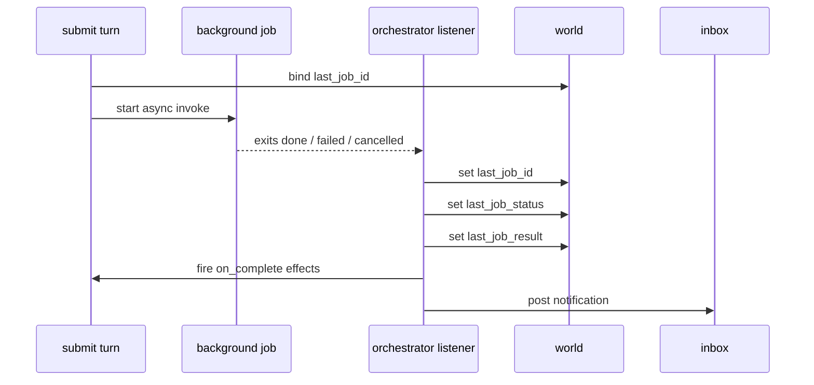

# `app.yaml` Schema Reference

The authoritative reference for a kitsoki application definition. Generated
from the Go types in `internal/app/types.go` — if something here disagrees
with that file, the Go types win.

YAML parsing is **strict**: unknown fields cause a load error. All field
names below are the literal `yaml:"..."` tag names.

## Top level: `AppDef`

```yaml
app:             <AppMeta>                       # required
world:           { <name>: <VarDef>, ... }       # optional
intents:         { <name>: <Intent>, ... }       # optional (global intent library)
root:            <string> | <State>              # required — initial state name or inline state
states:          { <name>: <State>, ... }        # optional
off_path:        <OffPathDef>                    # optional
hosts:           [ <string>, ... ]               # optional allow-list of host handler names
proposals:       { <name>: <ProposalKind> }      # optional
include:         [ <glob>, ... ]                 # optional — merge other YAMLs relative to this file
imports:         { <alias>: <ImportDef>, ... }   # optional — aliased sub-story composition
exits:           { <name>: <ExitDef>, ... }      # optional — child-side exit contract (only meaningful when this app is imported)
exports:         <ExportsBlock>                  # optional — what an imported child surfaces (intents:)
host_interfaces: { <name>: <HostInterfaceDef> }  # optional — named capability surfaces
```

- `root` may be a string (name of a state in `states:`) or an inline `State`
  for a compound/parallel root.
- `include` globs are expanded relative to the directory of the main YAML.
  Duplicate state/intent names across includes error out; the `hosts` list
  is unioned.
- `imports:`, `exits:`, `exports:`, `host_interfaces:` together implement
  the story-imports surface — aliased composition with private worlds,
  projected world_in/world_out, named exits, intent re-export, and
  rebindable host_interfaces. Full reference and worked examples in
  [`docs/stories/imports.md`](../stories/imports.md).

## `AppMeta`

```yaml
app:
  id:       <string>           # required — must be non-empty
  version:  <string>           # optional, recommended (semver)
  title:    <string>
  author:   <string>
  license:  <string>
```

## `VarDef` (world variable)

```yaml
world:
  counter:       { type: int,    default: 0 }
  name:          { type: string, default: "" }
  status:        { type: enum,   values: [idle, running, done], default: idle }
  wearing_cloak: { type: bool,   default: true }
```

Fields:

| Field     | Required | Notes                                               |
|-----------|----------|-----------------------------------------------------|
| `type`    | yes      | `string` / `int` / `bool` / `enum` / other          |
| `default` | no       | Zero value for the type when omitted                |
| `values`  | no       | Enum values; only meaningful when `type: enum`      |

## `State`

```yaml
states:
  foyer:
    type:            atomic | compound | parallel    # default: atomic
    mode:            <string>                        # e.g. "conversational" → Agent Room
    description:     <string>                        # shown in location indicator
    view:            |-                              # Go template over {{ world.* }}
      You are in the foyer. Counter = {{ world.counter }}.
    terminal:        false
    initial:         <child-name>                    # required for compound; supports {{...}}
    states:          { ... nested States ... }       # compound/parallel only
    on:                                              # intent → transition list
      go:
        - <Transition>
        - <Transition>
    on_enter:        [ <Effect>, ... ]               # fires on entry
    intents:         { ... local Intent overrides ... }
    menu:            [ <intent>, ... ]               # override default menu ordering
    relevant_world:  [ <world-key>, ... ]            # pinned in TUI location indicator
    relevant_slots:  [ <slot-name>, ... ]
    timeout:         <TimeoutDef>                    # optional auto-transition
    agent_off_ramp: <OffRampDef>                    # optional no-match door (see below)
```

Rules:

- State names are case-sensitive. Nested paths use dot notation internally
  (`bar.dark`); in YAML you may write `../../foyer` (slash form) for relative
  references — the loader resolves them.
- `on: { <intent>: [...] }` tries transitions in order; the first whose
  `when:` evaluates true (or which has `default: true`) wins.
- `relevant_world` entries must exist in the top-level `world:` schema.
- Intent names in `on:` must be declared globally (`intents:`), locally
  (`states.X.intents:`), or be the wildcard `"*"`.

## `view:` — string form vs typed elements

A state's `view:` accepts two shapes. Loader normalises both into the
same `[]ViewElement` slice; the runtime renders them through the same
pipeline.

```yaml
# String form — single pongo2 template body.
view: |
  You are in the foyer. Counter = {{ world.counter }}.

# Typed form — a sequence of typed elements.
view:
  - prose: "You are in the foyer."
  - kv:
      pairs:
        Counter: "{{ world.counter }}"
```

The typed form is preferred (story-style guidance:
[`docs/stories/story-style.md`](../stories/story-style.md)) because each element
renders in isolation — a single broken `{{ ... }}` cannot zero the
whole view.

> **Expressions vs. templates.** `when:` guards take a **bare** expr-lang
> expression; `view:`, `say:`, and every string-valued effect/arg (`set:`,
> `with:` / `inputs:` / `args:`) take a `{{ … }}` **template**. A bare expression
> in a template position is passed verbatim as a *literal string*, not evaluated —
> the most common authoring footgun. A *sole* `{{ expr }}` preserves the typed
> value. The authoritative rule (and which positions are which) is
> [state-machine.md §7.1](../stories/state-machine.md#71-expressions-vs-templates--which-syntax-goes-where).

A typed view may also reference a shared chrome:

```yaml
view:
  extends: "base"            # views/base.pongo
  blocks:
    body:    [ <ViewElement>, ... ]
    choices: [ <ViewElement>, ... ]
```

### View element kinds

| Kind        | Body shape                                                | Use for                                                  |
|-------------|-----------------------------------------------------------|----------------------------------------------------------|
| `prose:`    | `<string>` (pongo2 body)                                  | One paragraph of narration. Reflows.                     |
| `heading:`  | `<string>`                                                | Section break. No trailing colon.                        |
| `list:`     | `{ items: [<ListItem>, ...] }`                            | Bulleted actions / enumerations. Optional `hint:` column.|
| `kv:`       | `{ pairs: { <key>: <value>, ... } }`                      | Short key/value status. Key column auto-aligns.          |
| `code:`     | `<string>`                                                | Layout-preserved content (tables, ASCII art, includes).  |
| `template:` | `<string>` (pongo2 body)                                  | Raw pongo escape hatch.                                  |
| `choice:`   | `{ mode, prompt, items / fields, ... }` (see below)       | Interactive picker / multi-select / mad-lib form.        |
| `media:`    | `{ handle, caption?, kind? }` (see below)                 | Display a recorded media artifact; TUI pointer / web inline. |

Every element accepts an optional element-level `when:` guard (expr-lang)
evaluated against `world.*` / `slots.*`. Items in a `list:` accept their
own `when:`. Examples: see [`docs/stories/story-style.md`](../stories/story-style.md) §2.

## `media:` — media artifact display

A `media:` element references a media artifact recorded by a prior step.
It is display-only (no input, no dispatch). The TUI renders a labeled
pointer block showing the artifact kind icon, handle, and resolved path.
The web UI renders it inline (`<video>`, ``, PDF/HTML embed) via the
`GET /artifact/{id}` route.

```yaml
view:
  - media:
      handle:  "{{ world.walkthrough_handle }}"   # required — artifact id from host.artifacts_dir
      caption: "Walkthrough recording"             # optional one-line label
      kind:    video                               # optional hint: video/image/pdf/html/slideshow
```

| Field     | Required | Notes                                                                                        |
|-----------|----------|----------------------------------------------------------------------------------------------|
| `handle`  | yes      | Artifact id/handle bound into world by `host.artifacts_dir` (`bind: { my_handle: handle }`). May be a pongo2 template. |
| `caption` | no       | One-line label shown beneath the artifact. Defaults to `handle` when absent.                 |
| `kind`    | no       | Selects the pointer icon in the TUI and the embed strategy in the web UI. Values: `video`, `image`, `pdf`, `html`, `slideshow`. Unknown/absent kinds use a generic attachment icon. |

The optional element-level `when:` guard (expr-lang) suppresses the element
when false, e.g. `when: "world.walkthrough_handle != ''"`.

**How to emit an artifact and reference it:**

1. Run a render step (e.g. `host.slidey.render` or `host.run` calling ffmpeg).
2. Register the output file with `host.artifacts_dir` using the `src_path` /
   `kind` fields — this records an `artifact.emitted` trace event and returns a
   stable `handle`. Bind the handle into world:

   ```yaml
   - invoke: host.artifacts_dir
     with:
       src_path: "{{ world.output_path }}"
       kind:     video
       label:    "Session walkthrough"
       thread:   walkthrough
     bind: { walkthrough_handle: handle }
   ```

3. Reference the handle in a `media:` element (see example above).

For the `artifact.emitted` trace event shape see
[`docs/tracing/trace-format.md` §Artifact event kind](../tracing/trace-format.md).
For the full `host.artifacts_dir` media-emit arg reference see
[`docs/architecture/hosts.md` §host.artifacts_dir](../architecture/hosts.md#hostartifacts_dir).

## `choice:` — interactive picker / multi / form

A `choice:` element is an interactive transcript widget that dispatches
an intent + slots through the same `SubmitDirect` path the right-pane
action menu and `kitsoki turn --intent ... --slots ...` use. Three
modes share one envelope:

| Mode             | Interaction                                          | Dispatches                                                    |
|------------------|------------------------------------------------------|---------------------------------------------------------------|
| `single` (default)| ▸ cursor; Enter picks ONE item.                     | One intent (per item) with item's `slots:` ∪ `{param: <buf>}`.|
| `multi`          | `[ ]` / `[x]` checkboxes; Space toggles.              | One intent with one list-valued slot of selected `value:`s.   |
| `form`           | Mad-lib `template:` with `{field}` blanks; Tab cycles.| One intent with one slot per editable field.                  |

A `choice` element is always interactive in the TUI and renders as a
static numbered-list / template-echo fallback under `kitsoki render`
and the Jira / Bitbucket transports — flow fixtures (`intent:` blocks)
bypass the widget and submit the intent directly, so the same `app.yaml`
runs across every transport.

Worked, runnable reference: [`testdata/apps/choice_smoke/app.yaml`](../../testdata/apps/choice_smoke/app.yaml)
covers every feature combo across 23 demo spokes. See its
[README](../../testdata/apps/choice_smoke/README.md) for the per-spoke
walkthrough; specific line refs appear in the field tables below.

### `single` mode

```yaml
view:
  - choice:
      prompt: "Choose a profession"        # optional heading line
      when:   "world.party_size > 0"       # optional element-level guard
      items:
        - label:  "Banker"
          hint:   "$1,600 starting cash — easy"     # optional right-column
          intent: pick_profession                   # required
          slots:  { profession: banker }            # optional pre-bound slots
        - label:  "Generate names from a theme"
          intent: generate_names
          param:                                    # optional one-shot slot capture
            slot:        theme
            type:        string                     # string | int | enum
            placeholder: "e.g. norse mythology"
            required:    true
            # values: [...]   # required when type: enum
        - label: "✗ start_journey — {{ blocked_reason('start_journey') }}"
          intent: start_journey
          when:   "!available('start_journey')"     # per-item guard (renderer-side)
```

| Field                  | Required          | Notes                                                   |
|------------------------|-------------------|---------------------------------------------------------|
| `mode`                 | no (default single)| Discriminator. Omit for single mode.                    |
| `prompt`               | no                | Heading line shown above the picker.                    |
| `when`                 | no                | Element-level guard (expr-lang).                        |
| `items`                | yes               | ≥1 item.                                                |
| `items[].label`        | yes               | Display text.                                           |
| `items[].intent`       | yes               | Intent dispatched on Enter. Must be in `on:` / `intents:`.|
| `items[].hint`         | no                | Right-aligned auxiliary text (cost / consequence).      |
| `items[].slots`        | no                | Pre-bound slot map. Keys must be declared slots of `intent`.|
| `items[].param`        | no                | One-shot free-form slot capture. One slot only.         |
| `items[].param.slot`   | yes (if `param`)  | Slot name; must be a declared slot of `intent`.         |
| `items[].param.type`   | yes (if `param`)  | `string` / `int` / `enum`.                              |
| `items[].param.values` | yes (if `enum`)   | Cycle list for `Space`.                                 |
| `items[].param.placeholder`| no            | Shown when buffer is empty.                             |
| `items[].param.required`| no               | Refuse commit on empty buffer.                          |
| `items[].when`         | no                | Renderer-side guard — hide the row when false. **NOT behavioural**: also gate the `on:` arc if you need to block dispatch. |

Single-mode keymap:

| Key           | Behavior                                                             |
|---------------|----------------------------------------------------------------------|
| `↑` / `↓`     | Move cursor.                                                         |
| `Enter`       | Pick current item → dispatch intent. On an item with `param:`, enter param mode if the buffer is empty; commit if non-empty. |
| `Tab`         | Off-ramp to chat — close the widget and restore the prompt textarea. `/input` recalls any draft you typed before the widget opened. |
| `Esc`         | Cancel; focus prompt textarea.                                       |
| `Backspace`   | In param mode: edit buffer.                                          |
| `Space`       | In param mode with `type: enum`: cycle to next value. Bool field: toggle. |
| Printable     | Ignored at the picker level. In param mode (text/int): edit buffer. On enum/bool fields: ignored. |

Reference spokes: `single_basic` (`testdata/apps/choice_smoke/app.yaml:323`),
`single_per_item_when` (line 394), `single_templated_slots` (line 485),
`single_param_string` (line 529), `single_param_enum` (line 605).

### `multi` mode

```yaml
view:
  - choice:
      mode:   multi
      prompt: "Select symptoms"
      intent: report_symptoms       # required
      slot:   symptoms              # required — list-valued slot name
      min:    1                     # optional (default 0)
      max:    5                     # optional (default len(visible items))
      items:
        - { value: fever,    label: "Fever",    hint: ">100.4°F" }
        - { value: cough,    label: "Cough" }
        - { value: rash,     label: "Rash", when: "world.day > 3" }
```

| Field            | Required | Notes                                                     |
|------------------|----------|-----------------------------------------------------------|
| `mode`           | yes      | `multi`.                                                  |
| `intent`         | yes      | Dispatched once on commit.                                |
| `slot`           | yes      | Receives the list of selected `value:`s.                  |
| `min` / `max`    | no       | Selection bounds. Widget enforces; flow fixtures bypass.  |
| `items[].value`  | yes      | Literal string. **Templated values are rejected at load.**|
| `items[].label`  | no       | Defaults to `value`.                                      |
| `items[].hint`   | no       | Right-column hint.                                        |
| `items[].when`   | no       | Renderer-side guard.                                      |

Multi-mode keymap:

| Key       | Behavior                                       |
|-----------|------------------------------------------------|
| `↑` / `↓` | Move cursor.                                   |
| `Space`   | Toggle current item.                           |
| `Enter`   | Submit the whole selection.                    |
| `Tab`     | Off-ramp to chat — close the widget and restore the prompt textarea. |
| `Esc`     | Cancel; focus prompt textarea.                 |
| Printable | Ignored — the widget owns focus.               |

Reference spokes: `multi_basic` (`testdata/apps/choice_smoke/app.yaml:647`),
`multi_min_zero` (line 685), `multi_no_max` (line 722),
`multi_per_item_when` (line 762).

### `form` mode

```yaml
view:
  - choice:
      mode:     form
      prompt:   "Compose your purchase"
      intent:   propose_purchase
      template: "Buy {items} for ${total_cost}, leaving ${remaining}."
      fields:
        items:
          type:        string
          placeholder: "oxen=4, food=1500"
          required:    true
        total_cost:
          type:    int
          min:     1
          max:     "{{ world.money }}"     # templated bounds are OK
          default: 0
        remaining:
          type:     int
          expr:     "world.money - world.total_cost"   # required when readonly
          readonly: true                                # not editable; see note
```

| Field                | Required           | Notes                                                                                |
|----------------------|--------------------|--------------------------------------------------------------------------------------|
| `mode`               | yes                | `form`.                                                                              |
| `intent`             | yes                | Dispatched once on Enter.                                                            |
| `template`           | yes                | Mad-lib body. Every `{name}` placeholder must have a matching `fields:` entry.       |
| `fields`             | yes                | ≥1 field. Author order is preserved.                                                 |
| `fields.<n>.type`    | yes                | `string` / `int` / `float` / `bool` / `enum`.                                        |
| `fields.<n>.values`  | yes (if `enum`)    | Cycle list for `Space`.                                                              |
| `fields.<n>.hint`    | no                 | One-line description.                                                                |
| `fields.<n>.placeholder` | no             | Shown when buffer is empty.                                                          |
| `fields.<n>.default` | no                 | Initial buffer. May be templated.                                                    |
| `fields.<n>.min` / `max`| no             | Numeric bounds. May be templated.                                                    |
| `fields.<n>.required`| no                 | Widget refuses commit on empty buffer.                                               |
| `fields.<n>.readonly`| no                 | Display-only. Requires `expr:`. Submitted as a slot when the intent declares it.     |
| `fields.<n>.expr`    | yes (if `readonly`)| expr-lang expression over `world.*` / `slots.*` (NOT live over sibling form fields). |
| `fields.<n>.when`    | no                 | Renderer-side guard — hidden fields are not submitted.                               |

Form-mode keymap:

| Key            | Behavior                                                       |
|----------------|----------------------------------------------------------------|
| `Tab` / `S-Tab`| Next / previous editable field.                                |
| `Space`        | Enum field: cycle next value. Bool field: toggle. Text field: insert space. |
| `Printable`    | Edit current text field.                                       |
| `Backspace`    | Edit current text field.                                       |
| `Enter`        | Submit the form.                                               |
| `Esc`          | Cancel; focus prompt textarea.                                 |

Reference spokes: `form_basic` (`testdata/apps/choice_smoke/app.yaml:850`),
`form_bool` (line 901), `form_enum` (line 970),
`form_required` (line 1037), `form_per_field_when` (line 1107),
`form_readonly_expr` (line 1146).

### Static rendering fallback

Non-TUI transports (`kitsoki render`, Jira, Bitbucket) and flow-test
output get the same view but with the widget rendered statically — a
numbered list with intent name in parentheses for `single` / `multi`,
and a plain template echo with placeholders for `form`. Flow fixtures
dispatch `intent: { name, slots }` directly and never traverse the
widget; the same `app.yaml` works across every surface.

### Validation

Layered at load time:

1. **JSON Schema** — structural shape and per-mode required fields.
   Source: [`docs/embedded/schemas/choice.schema.json`](schemas/choice.schema.json)
   (mirror of `internal/app/schemas/choice.schema.json`). Consumable
   by yaml-language-server for inline IDE validation.
2. **expr-lang compile-pass** — every `when:` (element / per-item /
   per-field) is compiled via `expr.CompileBool`. Every `expr:` on a
   readonly form field is compiled via `expr.Compile`. Undefined
   identifiers, AST violations, and typos surface as load errors.
3. **pongo2 compile-pass** — templated leaves (slot values,
   placeholders, defaults, min/max, the form template body) are
   compile-checked for syntax. Undefined-identifier errors are NOT
   surfaced (they're runtime concerns).
4. **Loader cross-references** — `items[].intent` resolves against
   the surrounding state/global `intents:`; `slots:` keys, `param.slot`,
   `slot` (multi), and `fields.<name>` (form, non-readonly) must be
   declared slots of the chosen intent; every `{name}` in a form
   `template:` must have a matching `fields:` entry; multi-mode
   `items[].value` must be a literal (not templated).

Errors surface with the same `state → view → element index` path
prefix the loader uses for other view-element errors.

### Limitations

- **One `choice` per view.** Loader-enforced.
- **No `choice` inside `blocks:` (extends-form views).** Typed
  metadata is lost through `AppRenderer.RenderExtended`. Workaround:
  put the `extends:` at the wrapping view and the `choice:` as a
  sibling element in the same `view:`, not inside a block.
- **Mode is fixed per element.** No blending. Use two states.
- **`param:` captures exactly one slot.** Use `form` mode for ≥2.
- **`form` fields are flat scalars only.** Lists and maps need
  `multi` mode or post-dispatch clarify.
- **Multi dispatches a single intent.** Not a shorthand for "fire
  one intent per selected item."
- **`form.<other_field>` is NOT live in `expr:`.** Readonly fields
  see `world.*` / `slots.*` at widget-open time only — sibling buffer
  changes don't re-trigger the eval. See [`docs/stories/choice-widget.md`](../stories/choice-widget.md)
  §3.3 for the worked example and precompute-into-world workaround.
- **`when:` on items / fields is renderer-side, not behavioural.**
  A guard-false item is hidden but the underlying `on:` arc still
  fires if the intent is dispatched some other way (flow test, menu).
  For true gating, also guard the transition `when:`.

Author-facing cookbook: [`docs/stories/choice-widget.md`](../stories/choice-widget.md).
Story-style guidance: [`docs/stories/story-style.md`](../stories/story-style.md) §3.6.

## `Transition`

```yaml
on:
  go:
    - target:      bar                 # required — dest state path, "." = self
      when:        "slots.direction == 'south'"
      effects:     [ <Effect>, ... ]
      guard_hint:  "Head outside first."   # shown when guard fails
      view:        "You slip past the usher..." # overrides target's view for this turn
      emit:        [ lights_dimmed ]     # events broadcast to parallel regions
      push_history: true                 # default true; false for stackless transitions
    - default: true                      # catch-all
      target: foyer
      effects:
        - say: "You can't go that way."
```

- `target` must resolve to an existing state unless it contains a template
  expression (`{{ world.dynamic_room }}`), in which case validation is
  deferred to runtime.
- `when:` is an expr-lang expression; variables: `world.*`, `slots.*`,
  `$host_error` (when inside an `on_error` target).
- `default: true` is the catch-all. Put it **last** in the list.

## `Effect`

```yaml
effects:
  - set:        { counter: "{{ world.counter + 1 }}", last_dir: "{{ slots.direction }}" }
  - increment:  { counter: 1 }
  - say:        "You head {{ slots.direction }}."
  - invoke:     host.run
    with:       { cmd: "git status", cwd: "{{ world.workspace_root }}" }
    bind:       { last_output: stdout, last_code: exit_code }
    on_error:   error_room
  - emit:       lights_dimmed
```

Fields (any subset):

| Field         | Purpose                                                              |
|---------------|----------------------------------------------------------------------|
| `set`         | Assign world variables (value may be expr, literal, or templated)    |
| `increment`   | Integer delta on numeric world variables                             |
| `say`         | Append narrative line (Go template over world/slots)                 |
| `invoke`      | Call a host handler; must appear in top-level `hosts:` list          |
| `id`          | Author-assigned call-site address; threaded into args as `call` so flow stubs (`by_call:`) and cassettes (`match: { call: … }`) can tell two same-handler invokes apart |
| `with`        | Arguments for `invoke`                                               |
| `bind`        | `{ world_key: result_key }` — copy host result into world            |
| `on_error`    | Transition target if host invoke errors; sets `$host_error`          |
| `once`        | `true` → skip the `invoke` on re-entry when every `bind:` target is already set (non-empty); makes on_enter host calls idempotent across `/reload`, self-transitions, and `on_error:`. Requires a non-empty `bind:`. Clear the bind target to re-run. |
| `emit`        | Broadcast named event to parallel regions                            |
| `background`  | `true` → dispatch `invoke` as a background job (see §Background jobs) |
| `on_complete` | Effect list fired when the background job terminates (see §Background jobs) |

Conventional order within a single effect: `set` → `increment` → `say` →
`invoke` → `emit`.

## Background jobs

> Detailed reference: [docs/stories/background-jobs/](../stories/background-jobs/README.md)

Background jobs let a state machine fire a long-running shell command or LLM
call without blocking the current turn. The job runs in a goroutine; when it
finishes a synthetic turn fires `on_complete:` effects in the originating
state's context and posts an inbox notification.

### Lifecycle



### Effect fields for background dispatch

| Field         | Purpose                                                                     |
|---------------|-----------------------------------------------------------------------------|
| `background`  | `true` → dispatch the `invoke:` handler as a background job. Requires `invoke:` (validated at load time). |
| `bind`        | `{ world_key: job_id }` — captures the job ID synchronously into world. Omit to use the default key `last_job_id`. |
| `on_complete` | Ordered `Effect` list fired once the job terminates. May not itself contain `background: true` (validated at load time). |

### World variables injected on_complete

These are set by the orchestrator's synthetic turn and available inside
`on_complete:` effects (and the state's view template on the next render):

| Variable            | Type              | Value                                        |
|---------------------|-------------------|----------------------------------------------|
| `last_job_id`       | string            | Job ULID (same value bound at dispatch)      |
| `last_job_status`   | string            | `"done"` / `"failed"` / `"cancelled"`        |
| `last_job_result`   | map (any)         | `Result.Data` from the handler — e.g. `{stdout, exit_code, ok}` for `host.run` |

`last_job_result` is not declared in the app's `world:` schema; it is injected
dynamically and accessible only inside `on_complete:` templates. Do not
reference it in a regular state `view:` — it will be empty outside of the
synthetic turn.

### Same-turn race

A `background: true` effect followed by another effect in the same
`on_enter:` or `effects:` block executes in the **same turn** and sees
`world.last_job_id` (bound synchronously when the job is submitted), but does
**not** see `world.last_job_result` — the result is only available in the
`on_complete:` chain, which runs in a later synthetic turn once the job
terminates.

### Minimal runnable example

```yaml
# See also: testdata/apps/background_jobs/app.yaml
on_enter:
  - invoke:     host.run
    with:       { cmd: "sleep 1 && echo done" }
    background: true
    bind:       { last_job_id: job_id }
    on_complete:
      - set:    { result: "{{ world.last_job_result.stdout }}" }
      - say:    "Job complete. Output: {{ world.result }}"
```

A full three-state example (lobby → running → done) lives at
`testdata/apps/background_jobs/app.yaml`.

### Mid-flight clarifications

A background handler can pause mid-execution to ask the user a question
before resuming. The machinery is transparent to the room YAML author once
the clarifying sub-state is wired.

#### Handler side (Go)

```go
// Inside a host.Handler running as a background job:
rawJSON, err := host.RequestClarification(ctx, jobs.ClarificationSchema{
    Prompt: "Which branch should I use?",
    Fields: map[string]string{"branch": "string"},
})
// rawJSON is the JSON-encoded answer submitted by the user, e.g. `"main"`.
```

`host.RequestClarification` is a blocking call that:
1. Writes the schema to the DB and flips the job row to `awaiting_input`.
2. Signals the scheduler to fan out a `JobAwaitingInput` event.
3. Polls every 200 ms until the answer is stored, then returns the raw JSON.

#### Orchestrator side (automatic)

When the orchestrator's session listener receives `JobAwaitingInput` it calls
`handleJobAwaitingInput`, which fetches the schema and posts an
`action_required` notification. The notification's `TeleportJobID` and
`TeleportState` carry the job ID and origin state so the TUI can surface a
banner and teleport the user back.

#### YAML side (app author)

Add a `*_clarifying` sub-state to the originating room with an
`answer_clarification` intent:

```yaml
hosts:
  - host.jobs.answer_clarification   # built-in; no extra registration needed

intents:
  answer_clarification:
    title: "Answer clarification"
    slots:
      job_id: { type: string, required: true }
      answer: { type: string, required: true }

states:
  lobby_running:
    view: "Running…"
    on_enter:
      - invoke: host.my_long_task
        background: true
        bind: { last_job_id: job_id }
        on_complete:
          - say: "Done!"

  lobby_clarifying:
    view: |
      Job {{ world.last_job_id }} needs your input.
      {{ world.clarification_prompt }}
    on:
      answer_clarification:
        - target: lobby_running
          effects:
            - invoke: host.jobs.answer_clarification
              with:
                job_id: "{{ slots.job_id }}"
                answer: "{{ slots.answer }}"
```

#### Round-trip summary

1. Handler calls `host.RequestClarification(ctx, schema)` and blocks.
2. User sees an `action_required` banner in the inbox.
3. Selecting it teleports to `lobby_clarifying` (the `TeleportState`).
4. User submits `answer_clarification` with `{job_id, answer}`.
5. `host.jobs.answer_clarification` calls `AnswerClarification(jobID, value)`.
6. The handler's poll loop returns the answer; the job resumes.
7. On completion, `on_complete` effects fire normally.

**Important:** the `*_clarifying` state must be reachable from the origin
state or be a distinct state with the `answer_clarification` intent. The
TeleportState in the notification is set to the job's `OriginState` — the
state where the job was submitted — so make sure that state (or a teleport
alias) handles `answer_clarification`.

### Flow tests with background jobs

Flow fixtures can test the full background-job lifecycle deterministically
using `host_handlers:`, `advance_clock:`, and `expect_inbox:`.

#### How it works

When a fixture declares `host_handlers:` (or any turn uses `advance_clock:` or
`expect_inbox:`), the flow runner automatically switches to the
**orchestrator-backed path**:

- An in-memory SQLite store and fake clock are created.
- The scheduler and session listener are wired together.
- Each `host_handlers:` entry becomes a stub closure (no real I/O).
- `advance_clock: "2s"` moves the fake clock forward and then drains the
  scheduler + listener, so `on_complete` effects are applied before assertions
  run.

The legacy path (no `host_handlers`, no `advance_clock`) is unchanged.

#### Fixture fields

```yaml
# Declare stub handlers. Keys are the handler name declared in `hosts:`.
host_handlers:
  host.run:
    data: { stdout: "hello", exit: 0 }   # host.Result.Data returned on success
    delay: "1s"                           # optional: block for this virtual duration
    error: "something_went_wrong"         # optional: domain-level error (Result.Error)
    infra_error: "connection refused"     # optional: infrastructure error (Go error)
```

On a turn:

```yaml
turns:
  - intent: { name: start }
    advance_clock: "2s"        # move fake time forward; waits for scheduler+listener
    expect_state: running
    expect_world:              # assertions run AFTER advance_clock drains
      result: "hello"
    expect_inbox:
      unread: 2                # total unread count
      needs_attention: 0       # action_required severity count
      severities: ["info", "success"]  # sorted severity list for all unread items
```

#### `host_handlers` fields

| Field         | Purpose                                                                       |
|---------------|-------------------------------------------------------------------------------|
| `data`        | Map returned in `host.Result.Data` on a successful invocation.               |
| `error`       | Non-empty → `host.Result.Error` set (domain error; job terminates as failed). |
| `infra_error` | Non-empty → `(Result{}, error)` returned (infrastructure failure).           |
| `delay`       | Duration string (e.g. `"1s"`) — the stub blocks for this virtual time.        |

`delay` and `infra_error`/`error` are independent: you can combine delay with
an error to simulate a slow then failing handler.

#### `advance_clock` + notification counts

The stub's `delay:` field simulates a long-running handler. To make it
complete in the test, set `advance_clock:` to a duration ≥ the handler delay
on the same turn (or a subsequent turn). After advancing the clock:

- The scheduler drains (all job goroutines reach terminal state).
- The session listener drains (`on_complete` effects are applied).
- The inbox receives a notification with severity `info` (job submitted) and
  `success`/`error`/`warn` (job terminal state). Both are counted in
  `expect_inbox.unread`.

#### Minimal example

```yaml
test_kind: flow
app: ../app.yaml
initial_state: lobby
initial_world:
  result: ""
  last_job_id: ""

host_handlers:
  host.run:
    data: { stdout: "hello" }
    delay: "1s"

turns:
  - intent: { name: start }
    advance_clock: "2s"
    expect_world:
      result: "hello"
    expect_inbox:
      unread: 2
      severities: ["info", "success"]

expect_no_errors: true
```

A full working example lives at
`testdata/apps/background_jobs/flows/happy_path.yaml`.

## `Intent`

```yaml
intents:
  go:
    title:        "Go"
    description:  "Move in a compass direction."
    examples:     ["go south", "head north", "n"]
    priority:     100                     # higher → more prominent in menu
    hidden:       false                   # if true, usable but not listed
    synonyms:                             # optional — see note below
      - "head out"                        # bare-string synonym
      - "set off in {direction}"          # template synonym
    slots:
      direction: <Slot>
```

`synonyms` is a list of alternate phrasings declared by the author.
Each entry is either:

1. A bare phrase — matched bag-style by stem-set containment. The
   matcher resolves it at confidence 0.90 when the synonym's stems
   are a subset of the input's stems.
2. A `{slot_name}` template — a positional phrase where each
   `{slot_name}` captures a contiguous run of input tokens to be
   parsed by the slot's typed parser. The slot must exist in the
   intent's `slots:` map; the compiler refuses unknown references
   and rejects adjacent captures (`{a}{b}` — authors must put a
   literal token between captures). Templates resolve at confidence
   0.80 when every capture parses, 0.65 when a capture is named
   but unparseable.

Both shapes feed the same `*semroute.Matcher` and emit a `Verdict`
the orchestrator routes via `TrySemantic`. See
[`../../docs/architecture/semantic-routing.md`](../architecture/semantic-routing.md)
for the full reference (slot parser types, calibration workflow,
cache behaviour).

## `Slot`

```yaml
slots:
  direction:
    type:         enum                    # required
    required:     true
    default:      ""
    values:       [north, south, east, west]
    description:  "Which direction to move."
    examples:     ["south", "n"]
    format_hint:  "One of n/s/e/w."
    prompt:       "Which direction?"
    validator:    "value != 'down'"       # expr — value is the slot value
    synonyms:                             # optional, type: enum only
      north: ["north", "n", "up"]
      south: ["south", "s", "down"]
      east:  ["east",  "e"]
      west:  ["west",  "w"]
```

`synonyms` on a slot is a map from each enum value to alternate
phrasings. Each key must appear in `values`. The enum parser tries
three tiers in order — direct stem match, synonym word-bag
containment, then Damerau-Levenshtein-1 fuzzy — so `"banker"`,
`"rich guy"`, `"money man"`, and the typo `"bankr"` all resolve to
`banker`. See [`../../docs/architecture/semantic-routing.md`](../architecture/semantic-routing.md)
for the slot-parser tier order.

## `OffPathDef`

Global escape hatch from any state back to a named one.

```yaml
off_path:
  trigger:  "help"            # intent name / pattern that activates off-path
  banner:   "(help mode)"
  return:   main              # state to re-enter after exiting off-path
```

## `OffRampDef` (`agent_off_ramp:`)

Per-state **no-match door**. When a free-text utterance routes to no declared
intent in a room that sets `agent_off_ramp`, the orchestrator hands the
original text to an agent converse turn (the same voice `off_path:` reaches)
instead of bouncing it back as a rejection — **without advancing the state
machine or mutating world**. The menu still renders; the resting state is
unchanged. The TurnResult `mode` is `offpath`. Contrast with `off_path:`: that
is an automatic room-scoped door triggered by a *typed string* that *does*
change state; the off-ramp fires on a *no-match* and *never* changes state.

Opt-in per room; two author forms (the struct mirrors the subset of
`OffPathDef` that styles the voice — `trigger`/`return` are off-path-only and
have no analogue here):

```yaml
agent_off_ramp: true                                          # bare scalar — use the off-path voice
agent_off_ramp: { agent: discovery-guide, banner: "(thinking)" }  # struct form
```

| Field     | Required | Notes                                                                                       |
|-----------|----------|---------------------------------------------------------------------------------------------|
| `agent`   | no       | Names an entry in top-level `agents:` whose system prompt + model style the converse call. Validated at load against the `agents:` map (mirrors `off_path.agent`). |
| `persona` | no       | Inline system-prompt-style instruction for the off-ramp voice. When both `persona` and `agent` are set, `persona` wins. |
| `banner`  | no       | One-line label shown when the off-ramp engages.                                             |

Load-time invariants (a violating `agent_off_ramp` fails the load):

- **Rejected on `terminal: true`** — a terminal state has no resting menu to return to.
- **Rejected on `mode: conversational`** — an Agent Room already routes all free text; an off-ramp would be redundant.
- A named `agent:` must exist in the top-level `agents:` map.
- The struct is strict — off-path-only keys (e.g. `trigger:`, `return:`) are rejected.

A nil/absent `agent_off_ramp` (or `agent_off_ramp: false`) means no off-ramp —
the default — and rejections behave exactly as before. See
[`docs/stories/architecture.md`](../stories/architecture.md) §9 and
[`docs/stories/state-machine.md`](../stories/state-machine.md) §11 for the full
design, and [`stories/off-ramp-demo/`](../../stories/off-ramp-demo/) for a
runnable example.

> **Rendering note (web):** for the free-text floor to render on a menu room,
> the off-ramp room's `view:` must be a **flat** typed-element list, not the
> `extends:` + `blocks:` chrome form — the inheritance pipeline strips the
> typed-view choice metadata the web `InputBar` needs to show the always-present
> text box. See `stories/off-ramp-demo/rooms/desk.yaml`.

## `TimeoutDef`

```yaml
states:
  waiting:
    timeout:
      after:  "30s"           # Go duration string: 500ms, 5m, 2h
      target: timeout_room
```

## `ProposalKind` (advanced — proposal pattern)

A three-step draft → review → execute pattern.

```yaml
proposals:
  git_commit:
    schema: { message: string, files: string }   # typed draft fields
    draft:   { prompt: "prompts/commit_draft.tmpl" }
    refine:  { prompt: "prompts/commit_refine.tmpl" }
    execute:
      invoke:      host.run
      with:        { cmd: "git commit -m {{ draft.message }}" }
      repeatable:  false
      on_success:  stay                 # "stay" | "back" | <state-name>
      background:  false
      on_complete: [ <Effect>, ... ]
    views:
      drafting:   "Proposed commit:\n{{ draft.message }}"
      reviewing:  "Accept?"
    policy:
      auto_accept_if:  "draft.files.length < 3"
      require_confirm: false
```

`ProposalStep`:

| Field    | Purpose                          |
|----------|----------------------------------|
| `prompt` | Path to prompt template file     |

`ProposalExecute`:

| Field         | Purpose                                                |
|---------------|--------------------------------------------------------|
| `invoke`      | Host handler name                                      |
| `with`        | Templated args (see Effect.with)                       |
| `repeatable`  | Allow rerun/modify_and_rerun after success             |
| `on_success`  | `stay` / `back` / named state                          |
| `background`  | Run as background job (`internal/jobs`)                |
| `on_complete` | Effects fired when background job finishes             |

`ProposalPolicy`:

| Field             | Purpose                                                          |
|-------------------|------------------------------------------------------------------|
| `auto_accept_if`  | Expr over `{$proposal, $world, $slots}`; skips review when true  |
| `require_confirm` | Always require explicit user confirmation before execute         |

## `ImportDef` (story-imports composition)

```yaml
imports:
  <alias>:
    source:   <string>                    # required: ./path | @kitsoki/<name> | /abs
    version:  <string>                    # optional metadata (v1: not enforced)
    entry:    <child-state>               # required: where the child starts when invoked
    world_in: { <child-key>: <expr> }     # parent → child projection (eval'd in parent scope)
    exits:                                # child-exit → parent-state mapping
      <child-exit>:
        to: <parent-state>
        set: { <parent-key>: <child-expr> }  # per-exit world_out projection
    hosts: inherit | declared             # default: inherit
    host_bindings: { <iface>: <handler> } # rebind a child or grandchild iface
    intents:
      export: [<parent-intent>, ...]      # parent → child intent re-export
      import: [<child-intent>, ...]       # child → parent intent re-export
    overrides:
      states:  { <child-state>: <State> }   # whole-state replacement
      intents: { <child-intent>: <Intent> } # whole-intent replacement
      prompts: { <child-rel-path>: <parent-rel-path> }  # prompt-file substitution
```

## `ExitDef`

```yaml
exits:
  <name>:
    description: <string>          # optional
    requires:    [<world-key>, ...] # optional, statically checked at load
```

Only meaningful when this app is imported by another. Standalone load
synthesises `__exit__<name>` terminal states for any `@exit:<name>`
target the app uses.

## `HostInterfaceDef`

```yaml
host_interfaces:
  <name>:
    description: <string>
    operations:
      <op>:
        input:  <shape>      # metadata; not validated against handler v1
        output: <shape>
    default: <handler>       # default binding when no importer overrides
```

Invoked from state effects via `invoke: iface.<name>.<op>`. At
top-level Load, every `iface.<name>.<op>` is rewritten to
`<binding>.<op>`; the runtime host registry's prefix-fallback maps
`<binding>.<op>` → `<binding>` when no per-op handler is registered.

Full reference, including the multi-layer composition surface, is in
[`docs/stories/imports.md`](../stories/imports.md).

## Validation (what the loader enforces)

The loader (`internal/app/loader.go`) performs these checks and collects all
errors with `errors.Join` so you see the complete problem set on first load:

- `app.id` must be non-empty.
- Strict YAML: unknown fields are errors.
- Every `target:` that is not a template and not `.` must resolve to an
  existing state (relative-path resolution happens first).
- Every `invoke:` value must appear in the top-level `hosts:` list.
- Every `relevant_world:` key must exist in `world:`.
- Every intent referenced in `on:` must be declared globally, locally, or be
  `"*"`.
- For `type: compound` states with a literal `initial:`, the named child
  must exist. (Template `initial:` values skip the check.)
- `include` globs cannot produce duplicate state/intent names (the `hosts`
  list is the only mergeable list).
- For each `imports.<alias>`:
  - the alias must not collide with an existing parent state name;
  - every `@exit:<name>` in the child must be mapped in
    `exits:`, unless the app is loaded standalone (where they
    materialise as `__exit__<name>` terminals);
  - `overrides.states.<X>` / `.intents.<X>` / `.prompts.<X>` keys must
    name existing child elements;
  - `intents.export` references must exist in the parent's `intents:`;
  - `intents.import` references must be listed in the child's
    `exports.intents`;
  - `host_bindings.<name>` must match either an iface the immediate
    child declares or one accessible by alias-prefix from a grandchild;
  - `hosts: declared` mode requires every child host to be in the
    parent's own `hosts:` list;
  - every transition into `@exit:<name>` must set every key in the
    child's `exits.<name>.requires`;
  - `..` relative targets inside the child cannot walk above the
    alias wrapper (cross-boundary parent targets are forbidden);
  - import cycles (any number of layers) are detected and rejected.

## What the loader does **not** check (runtime only)

- `when:` and `validator:` expression correctness — bad expr fails at
  runtime.
- World-variable type coercion — a `default: "0"` on `type: int` passes
  the loader.
- `target:` values containing `{{ ... }}` — resolved at runtime.
- Host handler availability — only the allow-list is checked; missing
  handlers error at invoke time.

## Minimal runnable app

```yaml
app:
  id: tiny
  version: 0.1.0
  title: "Tiny App"

world:
  counter: { type: int, default: 0 }

intents:
  increment:
    description: "Add one to the counter."
    examples: ["add one", "++", "bump"]
  show:
    description: "Show the counter."
    examples: ["show", "what's the count?"]

root: main

states:
  main:
    view: |
      counter = {{ world.counter }}
    on:
      increment:
        - target: main
          effects:
            - increment: { counter: 1 }
      show:
        - target: main
```

## Bigger examples in-tree

- `testdata/apps/cloak/app.yaml`     — classic IF game; guards, enums, default branches
- `testdata/apps/dev-story/app.yaml` — multi-room dev workflow; hosts, proposals, Agent Room, background jobs
- `testdata/apps/proposal_smoke/app.yaml` — minimal proposal-pattern example
