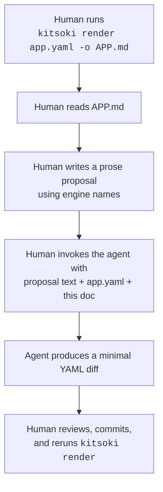

# Kitsoki — Apply-Proposal Workflow (LLM Guide)

This doc is written for an LLM (e.g., Claude via Claude Code) that has been
handed a **proposal** for changing a kitsoki app. Your job is to translate the
human's prose into a minimal, correct edit to `app.yaml` without breaking
the engine's schema or the app's semantics.

Pair this doc with:

- `app-schema` — authoritative YAML field reference
- `llm-guide`  — top-level engine model and invariants
- `render-format` — shape of the rendered Markdown the human was reading

---

## 1. The workflow (you are step 3)



You do **not** modify `APP.md`. It is a derived artifact; regeneration is
the human's job (or a pre-commit hook's).

---

## 2. What a proposal looks like

Proposals are free-form English, but they typically reference engine names
in backticks. Examples:

> In room `foyer`, the `go` intent for direction `north` should say "The
> chandeliers tinkle as you reach for the door" instead of the current
> message. Leave the `guard_hint` alone.

> Add a new room `library` off `foyer` (west exit). It should have a
> single `read_book` intent that transitions to `ended` and sets
> `message_rumpled: false`.

> The `wear_cloak` intent in `cloakroom` is hidden; it shouldn't be.
> Unhide it and give it priority 75.

Good proposals name the artifact (`room`, `intent`, `world var`) and its
engine-facing id. Ambiguous proposals ("fix the bug in the foyer") should
be clarified back to the human before editing.

---

## 3. How to locate what to edit

Use **engine names** (the strings the human used) as grep targets against
`app.yaml`:

| Proposal mentions | Grep for                        |
|-------------------|---------------------------------|
| room `foo`        | `^  foo:` under `states:` or under `states:` of a parent |
| intent `bar`      | `^  bar:` under `intents:` (or under a state's `intents:`) |
| world var `baz`   | `^  baz:` under `world:`        |
| host `host.x`     | `- host.x` in the top-level `hosts:` list |

Nested rooms use dotted paths in the rendered doc (`bar.dark`) but are
written as nested YAML maps (`states.bar.states.dark`). Descend the tree
by segments.

---

## 4. Minimal-edit rules

1. **Touch only the fields implied by the proposal.** Leave unrelated
   fields, ordering, and comments alone.
2. **Do not rename things unless the proposal says to.** A proposal to
   "change the message in `foyer`" edits a `say:` string, not the state id.
3. **Preserve the YAML style already in use** (flow vs. block; quoted vs.
   bare strings). `goccy/go-yaml` parses both but the author's style is a
   signal.
4. **Do not reorder transitions** unless the proposal explicitly says to.
   Transition order matters: the first matching guard wins, and `default:
   true` branches must remain last.

---

## 5. Schema gotchas (common errors)

These cause loader failures; avoid them:

- **Every `invoke:` host must be in the top-level `hosts:` allow-list.**
  Adding a new `invoke: host.x` requires adding `host.x` to `hosts:`.
- **World-variable references in views / effects / guards must exist in
  the top-level `world:` schema.** Creating a new state that reads
  `world.new_var` requires adding `new_var` to `world:` with a type and
  default.
- **`relevant_world:` entries must be declared world keys.**
- **Transition targets must resolve** to a declared state. Dotted paths
  are absolute (`bar.dark`); slash paths are relative (`../../foyer`,
  `.` = self).
- **Guard expressions are expr-lang.** Valid tokens: `world.*`, `slots.*`,
  `$host_error` (only inside an `on_error:` transition). No arbitrary Go.
- **`default: true` is catch-all; it must be the last transition for its
  intent.** The first matching guard wins.
- **Intent names are stable identifiers**, not display labels. The
  display label is the intent's `title:`.

When in doubt, run the loader after editing and fix reported errors.

---

## 6. Effect-vocabulary cheat sheet

The engine only accepts this small vocabulary inside `effects:` lists:

```yaml
effects:
  - set:       {k: v, ...}      # templated values ok: "{{ slots.direction }}"
  - increment: {k: int, ...}
  - say:       "text"           # templating ok
  - emit:      event_name       # to parallel regions
  - invoke:    host.name        # + optional with / bind / on_error siblings
    with:      {k: v}
    bind:      {world_key: result_key}
    on_error:  error_state      # transition target if the invoke fails
```

Don't invent new effect keys. If a proposal asks for behaviour no effect
covers, either (a) compose existing effects, (b) model it as a new state
with `on_enter:` and transitions, or (c) clarify with the human before
shoehorning.

---

## 7. Validation after editing

After writing the diff, ask the human to run:

```sh
kitsoki viz app.yaml            # parses + validates; errors printed
kitsoki render app.yaml -o APP.md   # re-render the docs
kitsoki test flows app.yaml     # if Mode-2 flows exist, run them
```

`kitsoki viz` is the fastest way to verify the YAML still parses. It's
effectively a "does this load cleanly?" check.

---

## 8. Change patterns (recipes)

### 8.1 Change a `say:` message

Find the effect in the transition, replace the string literal. No other
changes needed.

### 8.2 Add a new transition on an existing intent

Append to the appropriate `on.<intent>` list. If the list already has a
`default: true` branch, insert *before* it. Put the guard first, target
next, then effects.

### 8.3 Add a new intent

If the new intent is reusable across rooms, add it under the top-level
`intents:` block. If it's state-scoped, add it under `states.<room>.intents:`
(see `app-schema` §State for local intents). Then bind it on the room via
`on.<intent>:` to give it effect.

### 8.4 Add a new room

Create the state under `states:` with `description:`, `view:`, and `on:`.
Add transitions from existing rooms that should reach it. If the new room
reads world variables, ensure they exist. If it invokes a host, ensure the
host is in `hosts:`.

### 8.5 Add a new world variable

Add to top-level `world:` with a `type:` and `default:`. Then update any
state's `relevant_world:` lists that should show it, and any `view:`
templates that reference it.

### 8.6 Hide / unhide an intent

Flip the intent's `hidden:` field. No structural changes.

---

## 9. When to push back instead of editing

Do not silently implement a proposal that:

- **Changes engine semantics** (e.g., "make `go` reject uppercase") — these
  belong in the harness or runtime, not in YAML.
- **Contradicts the schema** (e.g., "add an async transition") — explain
  the limitation and ask for an alternate shape.
- **Is irreversibly destructive** (e.g., "delete all terminal states") —
  confirm scope with the human first.
- **Requires adding new host invocations without the human declaring the
  handler** — flag that a new `host.x` has no registered handler.

Ambiguity is a reason to clarify, not guess.

---

## 10. Output format

When you're done editing, hand back:

1. The YAML diff (or the edited file, as the human prefers).
2. A one-paragraph summary of what you changed and why.
3. Any follow-ups the human needs to do (e.g., "add `host.x` to
   registrations in `internal/host/`" if a new host was introduced).

Do not commit or push. The human reviews and decides.
