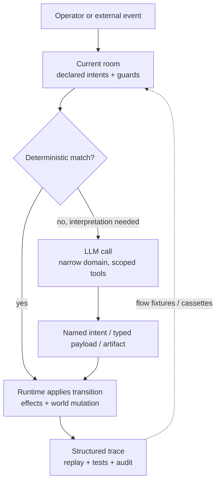

# Evaluate Kitsoki

If you are skeptical, start here. Kitsoki is not trying to be a better chat
box, a thinner structured-output wrapper, or a friendlier CI script. It is a
workflow engine where the **runtime owns the process** and the LLM is called
only at named, traceable decision points.

That distinction matters because most agent systems put the model in the
driver's seat. The model holds the plan, picks tools, decides when to ask a
human, mutates state through tool calls, and leaves you with logs after the
fact. Kitsoki flips that relationship: the story graph is the driver, and the
model is a bounded worker called by the graph.

## The case in one page

Kitsoki's advantage is control inversion:

- **The workflow is explicit.** Rooms, intents, guards, transitions, and effects
  live in YAML. A reviewer can inspect the process without reverse-engineering a
  prompt.
- **The model is not the dispatcher.** Deterministic turns can route without a
  model call; ambiguous turns call a model only to resolve one declared choice.
- **State belongs to the runtime.** The model returns an intent, typed payload,
  or artifact. It does not directly decide the next room or silently rewrite the
  world.
- **Host calls are contracts.** The runtime can reject malformed model output,
  nudge the model, retry inside the same bounded call, and record the whole arc.
- **Every important act is replayable.** Flow fixtures and host cassettes replay
  whole conversations with no live LLM cost, so demos and tests exercise the same
  machinery.

The result is not "the agent is smarter." The result is that fewer things need
to be agent judgment in the first place.

## What to watch first

1. **Agent action transcripts.** Watch the runtime reject a model submission,
   inject a nudge, and accept the corrected result. That is the control boundary
   a generic coding agent cannot provide by itself.
2. **Trace introspection.** Look for the turn that routes directly with no agent
   call. That proves the model is a callee, not the universal dispatcher.
3. **Operator ask.** A live agent question parks the run and blocks until the
   operator answers. No silent default, no guessed consent.
4. **Meta mode.** A running story can explain and edit its own YAML, then
   hot-reload the changed behavior while preserving the trace.
5. **Bug-fix case studies.** The most valuable proof is a real repo run:
   reproduce, patch, test, review, validate, and close out as a deterministic
   graph.

The product-site videos are generated from deterministic feature fixtures.
Some are recorded from real LLM runs and then replayed from cassettes; others
are synthetic no-LLM fixtures. In both cases, the published render does not ask
a live model to improvise.

## What Kitsoki beats

The current agent market is converging on "give an agent a task, a repo, and
tools." Kitsoki's bet is different: keep the repeatable workflow outside the
agent, and call agents only where the state machine says interpretation or
implementation is needed.

| Product | Primary job | Control flow owner | Replay / tests | Kitsoki edge |
|---|---|---|---|---|
| **Kitsoki** | Repeatable conversational workflows. | Authored story graph: rooms, intents, guards, transitions, effects. | First-class flow fixtures and host cassettes; replay without live model spend. | One story drives runtime, web, TUI, MCP, traces, demos, and tests. |
| [OpenClaw](https://openclaw.ai/) | Personal/team assistant across chat apps, integrations, memory, and a controlled machine. | Assistant loop. | Not the core product promise. | Kitsoki is narrower but more falsifiable: prove the workflow, not just the assistant outcome. |
| [OpenCode](https://opencode.ai/) | Open-source coding agent for terminal, IDE, and desktop sessions. | Coding-agent loop. | Not the core product promise. | Kitsoki can wrap coding agents as bounded workers inside a deterministic process. |
| [Devin](https://docs.devin.ai/get-started/devin-intro) | Autonomous software engineer for tickets, bugs, features, and parallel agent fleets. | Devin task plan and execution loop. | Not the core product promise. | Kitsoki separates process from worker: reproduce, propose, implement, test, review, validate. |
| [GitHub Copilot cloud agent](https://docs.github.com/en/copilot/concepts/agents/cloud-agent/about-cloud-agent) | GitHub-native issue-to-branch-to-PR automation. | Copilot cloud coding session, scoped by repo and org settings. | GitHub logs and commits are reviewable; conversational workflow replay is not the main abstraction. | Kitsoki crosses GitHub boundaries and replays the same state machine across custom surfaces. |

| Alternative | What it is good at | Where Kitsoki is different |
|---|---|---|
| A coding agent | Open-ended implementation work in a repo | Kitsoki keeps the workflow, gates, host contracts, operator pauses, and audit trail outside the model. |
| Structured output around an LLM | Validating one response shape | Kitsoki validates the process around many turns, not just the JSON returned by one call. |
| LangGraph-style orchestration | Programmatic agent graphs | Kitsoki makes the operator-facing story, the UI, the replay fixture, and the docs-driven demo all come from the same state-machine source. |
| Temporal or a job workflow engine | Durable background execution | Kitsoki is built for conversational state, free-text intent routing, traceable model calls, and human handoff inside the workflow. |
| Hand-written scripts | Deterministic automation | Kitsoki keeps the forgiving conversational entrance while progressively moving repeated judgments into deterministic rooms and host calls. |

The moat is not a single feature. It is the combination: one story definition
drives the runtime, web UI, TUI, MCP surface, traces, demos, and tests. Every new
story compounds the same substrate instead of creating another bespoke agent
prompt.

## The adoption path

Start with a workflow that already needs human judgment: triage a bug, collect a
deployment decision, draft a proposal, run a review, or coordinate a multi-step
repo change. Write the loose process as a story. Let the LLM handle the parts
that still need interpretation. Then read the trace and move recurring choices
out of prompt prose and into rooms, intents, guards, and host calls.

That loop is progressive determinism: use the model to get moving, then make the
stable parts boring, auditable, and cheap.

## The honest boundary

Kitsoki does not remove model risk. It gives model risk a smaller surface area
and a better paper trail. If the whole task is a one-off open-ended creative
conversation, a chat agent may be enough. Kitsoki is worth the structure when
the workflow will repeat, has expensive failure modes, needs operator handoff,
or has to be tested and defended after the run.

For the architecture behind this claim, read [Concept](architecture/concept.md).
For hands-on usage, go to [Getting Started](getting-started.md). For evidence,
start with the [bug-fix case study](case-studies/bug-fix.md) and the
[bugfix bake-off](case-studies/bugfix-bakeoff.md).
