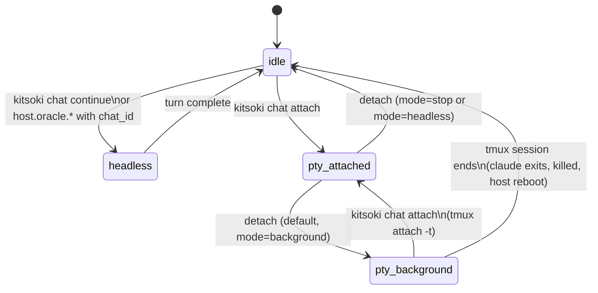

# Proposal — Chats: PTY mode, input queue, and multi-transport drive

**Status:** Phases 0/A/B/C shipped; D/E/F/G partial or deferred; H
not started. The §0 spike notes
([`notes/claude-code-sessions-spike.md`](notes/claude-code-sessions-spike.md))
validated every assumption against claude 2.1.140. The shipped
surface — `kitsoki chat queue …`, `kitsoki chat attach/detach/gc`,
`/attach` and `/sessions` inside the TUI, `host.chat.drive` —
extends `internal/chats/` exactly as this draft describes. User-
facing docs for the shipped pieces live in
[`docs/meta-mode.md`](../meta-mode.md) (§5 covers `/attach` and
`/sessions`) and [`docs/hosts.md`](../hosts.md) (covers
`host.chat.drive`). See the **"Shipped surface"** table below for
the per-section status; the **"Future work"** section near the
bottom (§§13–17) is now the actionable agenda.

---

## Shipped surface

What each proposal section maps to in code, and what's left to do.

| Section | Status | Where it lives |
|---|---|---|
| §0 validation spike | **shipped** | [`notes/claude-code-sessions-spike.md`](notes/claude-code-sessions-spike.md) |
| §2 concepts | **shipped** | `internal/chats/pty.go`, `internal/chats/queue.go` |
| §3 chat-mode FSM (idle ↔ headless ↔ pty_attached ↔ pty_background) | **shipped** | `internal/chats/pty.go` types |
| §4.1 headless envelope | **shipped** unchanged | `internal/host/oracle.go` |
| §4.2 PTY envelope | **shipped** | `internal/chatattach/attach.go` |
| §5 mode-switching via `claude --resume` | **shipped** with the §0/A3 split — first attach uses `--session-id`, subsequent uses `--resume` | `internal/chatattach/attach.go:buildClaudeCommand` |
| §6.1 reuse `chat_locks` | **shipped** unchanged | `internal/chats/lock.go` (pre-existing) |
| §6.2 `chat_pty_sessions` table | **shipped** | `internal/chats/schema.sql` v2; `internal/chats/pty.go` |
| §6.3 `chat_input_queue` table | **shipped** + `on_complete_json` / `origin_session_id` / `origin_state` columns (storage only; firing is Phase G) | `internal/chats/schema.sql` v3; `internal/chats/queue.go` |
| §6.4 schema migration | **shipped** | `internal/chats/store.go:NewStore` + `migrateChatInputQueueColumns` |
| §6.5 inner-tmux conf | **partial** — `kitsoki-tmux.conf` ships with the status bar (left = chat label, right = inbox watcher pushes count). The proposal's `prefix+d/D/k/q` keybindings are NOT installed — Phase E | `internal/chatattach/kitsoki-tmux.conf` |
| §6.6 CLI verbs | **shipped**: `kitsoki chat attach`, `detach`, `queue {add,list,dispatch,dismiss}`, `gc` | `cmd/kitsoki/chat_attach.go`, `cmd/kitsoki/chat_queue.go`, `cmd/kitsoki/chat_gc.go` |
| §7 queue arbitration | **partial** — single-chat lock arbitration shipped (drives queue when lock is busy). The `defer` / `auto-after-idle` / `always-inject` policies and a periodic drainer are not built | `internal/host/chat_dispatch.go` |
| §8 kitsoki chrome around tmux | **deferred** — Phase D. v1 hands the terminal directly to tmux (`tmux attach`); the vt-emulated frame is not built. Tmux's own status bar carries the kitsoki identity + inbox count, covering the "always-visible escape hatch" goal at lower fidelity | — |
| §9.1 inbox idle notifications | **partial** — the watcher in `/attach` pushes the existing inbox count into the tmux status bar. The JSONL-tailing "this chat just went idle" notification producer is not built — Phase G | `internal/tui/meta_attach.go:runStatusBarWatcher` |
| §9.2 `host.chat.drive` | **shipped** with `chat_id`/`chat_ref`, `await:true|false`, `timeout_seconds` lock-retry. `on_complete` is **persisted** on the drive row but **not fired** — orchestrator integration is Phase G+ follow-up (documented in the handler's docstring) | `internal/host/chat_handlers.go:ChatDriveHandler`, `internal/host/chat_dispatch.go` |
| §9.3 chat container rooms | **deferred** — Phase F. `/attach` inside `/meta` is the slash-command equivalent: the TUI hands the terminal to `claude --resume` via `tea.Exec` and resumes on detach. The manifest `chat_container:` state hasn't shipped | `internal/tui/meta_attach.go` (the `/attach` path) |
| §9.4 changed vs new artifacts | **accurate** — every "Unchanged" stayed unchanged; every "New" line landed | — |
| §10 persistence and recovery | **shipped** | `internal/chats/pty.go:GCDeadTmux`, `internal/chatattach/attach.go` stale-row + cross-host handling |
| §11.1 general security | **shipped** | Same posture as today |
| §11.2 per-chat permission level | **deferred** — Phase H. Every `/attach` runs `--permission-mode default` (interactive prompts); every headless drive runs `bypassPermissions` (today's `host.oracle.ask_with_mcp` posture). The `interactive-only` / `bypass-when-headless` / `bypass-always` policy and `kitsoki chat allow-bypass` verb are not built | — |
| §12 open questions | mostly addressed by shipping; remaining ones flagged inline | — |
| §13 what this does NOT do | **honoured** — still no daemon, still local-only | — |
| §15 future work | the deferred phases above are the actionable items; §15.1–15.9 entries that haven't landed are still future work | — |
| §16 phased delivery | per the rows above | — |

**Outstanding work, prioritised:**

1. **Phase G — `on_complete` firing.** Drive rows already carry the
   serialized effect chain plus `origin_session_id` / `origin_state`.
   The remaining work is the orchestrator-side consumer: subscribe
   to drive-terminal events (mirroring `oncomplete.go:handleJobTerminal`),
   pre-bind `world.last_drive_result`, and run
   `machine.RunEffects(origin_state, world, chain)`. The capture-side
   wiring (orchestrator pre-injecting `__on_complete` into the
   `host.chat.drive` args from a state's `on_complete:`) is the second
   half. ~1 week.
2. **Phase H — indirect transport routing + `allow-bypass`.** Jira /
   Bitbucket pollers route via `kitsoki chat queue add` /
   `host.chat.drive`; per-chat permission level encoded as a chat-row
   setting; `kitsoki chat allow-bypass <chat-id> [--always]`. ~1 week.
3. **Phase F — chat container rooms.** Manifest `chat_container:`
   state declaration; orchestrator handles entry/exit and binds
   `pty.transcript_seq` into the follow-on state. The TUI plumbing
   already exists via `metaAttachExec`; this is mostly loader +
   orchestrator work. ~1 week.
4. **Phase E — inner-tmux key bindings.** `kitsoki-tmux.conf` gains
   the `prefix+d` (background) / `prefix+D` (headless drain) /
   `prefix+k` (stop) / `prefix+q` (queue popup) bindings. Each runs
   a `kitsoki chat detach --mode …` shell-out. ~3-4 days.
5. **Phase D — kitsoki-rendered chrome.** Vt-emulator embed,
   framed `(cols, rows-2)` middle region, kitsoki status + instruction
   rows. Real engineering work (~2 weeks per the original estimate);
   delivers the visual identity the tmux-only v1 only approximates.

---

## Original draft (preserved for design context)

**Goal.** Add two capabilities to the existing chats subsystem:

1. **PTY mode** — interactive claude code hosted inside a tmux
   session, with kitsoki chrome wrapping tmux. The user can
   attach with `kitsoki chat attach`, detach, leave claude
   working, and reattach later. Same `claude_session_id` as
   headless drives, bridged by `claude --resume`.
2. **Input queue** — a per-chat FIFO of pending turn requests
   originating from any transport (TUI, Jira, Bitbucket, MCP,
   background job, state-machine effect). Arbitration policy
   decides when each is dispatched against the existing
   `chats.Store.WithLock`.

Plus a new state-machine host (`host.chat.drive`) and an inbox
notification when a chat goes idle while the user is detached.

**TL;DR.**

- **No new lock primitive.** Reuse `chats.Store.WithLock` and the
  existing `chat_locks` table. The lock already encodes
  pid+host+heartbeat with cross-host-safe semantics
  ([`internal/chats/lock.go`](../../internal/chats/lock.go)).
- **Two small adjunct tables.** `chat_pty_sessions` tracks
  `(chat_id, tmux_session, mode, …)` for the persistent-PTY
  cases. `chat_input_queue` holds pending drives. Both are
  applied through the existing chats schema-migration
  machinery.
- **`claude_session_id` is the bridge.** Already on `chats`; both
  `claude -p --resume <id>` (headless, today's path in
  `host.oracle.ask_with_mcp`) and `claude --resume <id>`
  (interactive, in tmux) use it. Mode-switching is
  kill-and-respawn against the same id.
- **Primary UX: chat container rooms** (§9.3). An app-manifest
  state declares itself a `chat_container:` and the running
  kitsoki TUI seamlessly hands the terminal to the PTY frame
  on entry, returning to the TUI on detach with a wired
  follow-on state. Users never see a shell, never type a chat
  id, never know tmux exists. The escape sequence is always
  visible in the bottom instructions row — the antidote to
  "how do I exit vim."
- **New CLI verbs join `kitsoki chat …`:** `attach`, `detach`,
  `queue {view|list|dispatch|dismiss}`, `status`. These are
  the power-user / scripting surface — the primary UX is
  manifest-driven container rooms (above). The existing
  `kitsoki chat continue` continues to drive one turn
  synchronously.
- **Chrome wraps tmux from outside.** `kitsoki chat attach` is a
  TUI that owns the terminal, embeds tmux in a `(cols, rows-2)`
  child PTY, vt-emulates the bytes into the framed region, and
  renders a status row + an instructions row with distinct
  background color. v1 chrome is intentionally minimal.
- **`host.chat.drive`** — new host effect that enqueues a drive
  on a chat. Async by default (returns drive id immediately);
  state machine awaits completion via a synthetic event when
  the resulting turn lands (mirrors the background-jobs
  pattern).
- **No kitsoki daemon in v1.** SQLite + tmux + short-lived
  `kitsoki` invocations. Every primitive is daemon-ready when
  `kitsoki serve` lands (§15.5).
- **Critical assumptions need validating before phase A.** See
  §0.

This proposal honours
[`bugfix-room-proposal.md` §9](bugfix-room-proposal.md#9-explicit-non-goals)
— it ships *without* `kitsoki serve` — and slots into the
chats roadmap rather than alongside it.

---

## 0. Validated assumptions (spike required before phase A)

This proposal hinges on a small set of empirical claims about
how the `claude` CLI behaves. v2 asserted these without
evidence; the review (correctly) called that out. Before phase A
starts we need a ~1-day spike that confirms each claim or
forces a redesign.

| # | Claim | How to verify | If false |
|---|---|---|---|
| A1 | `claude --resume <id>` (interactive) and `claude -p --resume <id> --output-format stream-json` (headless) can be used **alternately** against the same on-disk session file (`~/.claude/projects/<workspace>/<id>.jsonl`) without corrupting it. | Spike: drive a session through `host.oracle.ask_with_mcp` (existing headless path), then `claude --resume <id>` interactively, type a turn, exit, then drive another headless turn. Inspect the JSONL between each step. | Mode-switching design (§5) collapses; fall back to "PTY-only sessions" or "headless-only sessions" with no cross-over. |
| A2 | The headless stream-json output contains a recognisable end-of-turn marker (likely a `type: "result"` event or `message_stop`). | Spike: run a headless turn, capture the NDJSON, identify the terminal event(s). | §9.1 idle-detection needs a different mechanism (heuristic timeout — much worse UX). |
| A3 | `claude --session-id <uuid>` is only required for the *first* invocation of a brand-new session id; `--resume <id>` works on subsequent invocations without re-passing `--session-id`. (This is the pattern `host.oracle.ask_with_mcp` already uses; just confirm.) | Inspection of existing `internal/host/oracle_ask_with_mcp.go` retry loop + spike. | Schema changes (chats already stores `claude_session_id`); only the spawn paths need adjusting. |
| A4 | Interactive `claude --resume` exits cleanly when tmux kills its containing pane (`tmux kill-session`), leaving the JSONL in a resumable state — not a half-written turn that breaks subsequent `--resume`. | Spike: kill the tmux session mid-turn, then `claude --resume <id>` afterward and check whether the session opens cleanly or errors. | `kitsoki chat detach --mode stop` becomes much harsher (we have to wait for claude to finish a turn before killing). |
| A5 | `--permission-mode bypassPermissions` (or whatever flag the headless path passes today) yields the same permission behaviour across consecutive `--resume` invocations — permission state is per-invocation, not persisted into the session file. | Spike: confirm by reading claude docs + behavioural check. | Security analysis (§11.2) needs revisiting; per-session permission may require explicit grant tables. |

Spike output is a single page in `docs/proposals/notes/` linking
the experiment commands, the captured JSONL fragments, and a
pass/fail line per row above. **Phase A does not start until
this page exists.**

---

## 1. What's missing today (relative to chats)

The chats subsystem
([`internal/chats/doc.go`](../../internal/chats/doc.go)) already
provides:

- Persistent per-room conversation threads, keyed by
  `(app_id, room, scope_key)`, with global lifetime decoupled
  from kitsoki sessions.
- A `claude_session_id` column on each chat — already used by
  `host.oracle.ask_with_mcp` to invoke `claude -p --session-id`
  and `--resume`.
- Singleton serialization via
  [`chat_locks`](../../internal/chats/schema.sql) +
  `chats.Store.WithLock`, with cross-host-safe semantics
  (cross-host = busy; same-host = PID-liveness + heartbeat
  reaping).
- A full CLI surface: `kitsoki chat new|list|show|continue|fork
  |archive|unlock`.
- A host suite: `host.chat.resolve|list|transcript|create|fork|
  archive|rename|suggest_title|resolve_ref`, plus chat-aware
  variants of `host.oracle.talk` and `host.oracle.ask_with_mcp`.

What chats *doesn't* do yet — the gaps this proposal fills:

- **No interactive mode.** A chat can only be driven turn-by-turn
  through `host.oracle.*` or `kitsoki chat continue`. There's no
  way for a developer to drop into the **native claude code TUI**
  against a chat's `claude_session_id` — they'd have to copy the
  id and run `claude --resume <id>` in a separate terminal,
  losing all the kitsoki context.
- **No persistent live session.** A chat between turns is "no
  process running, claude_session_id stored." There's no
  primitive for "claude is running in the background, waiting
  for the user to come back."
- **No inbound queue.** Today each driver competes for the
  chat lock immediately when it wants to push a turn. A loser
  gets `ErrChatBusy` (CLI exit 75). There's no FIFO that says
  "you go first, then you, then you," and no way for the human
  to inspect what's waiting.
- **No multi-transport arbitration policy.** The lock is binary;
  there's no notion of "human attached → indirect drives
  defer."
- **The kitsoki inbox doesn't know about chat-turn
  completion.** The existing inbox
  ([`architecture.md` §6](../architecture.md#6-long-running-work-and-notifications))
  surfaces background-job results. It has no event for "chat X
  just generated a reply and is awaiting input" — which is
  exactly the signal the human needs when they've detached
  from a long-running claude conversation.
- **No seamless TUI ↔ interactive-claude handoff.** Even with
  `kitsoki chat continue` available, a user running the
  kitsoki TUI who wants to drop into the native claude UI has
  to (a) figure out the chat id, (b) leave kitsoki, (c) open
  a shell, (d) run a separate command, (e) eventually wander
  back. Authors can't declare "this room is a live chat —
  the user just enters it." This is the most visible gap and
  the one this proposal makes central (§9.3).

The state-machine philosophy from
[`state-machine.md` §10](../state-machine.md#10-controlled-navigation-back-jumps-restart-and-feedback-arcs)
already gives us the right model: every incoming event is a
typed arc, not a free-form interrupt. This proposal applies
that to chat I/O.

---

## 2. Concepts

**Chat** (existing). Per
[`internal/chats/doc.go`](../../internal/chats/doc.go). One per
`(app_id, room, scope_key)`. Carries `claude_session_id`. The
unit of singleton state this proposal builds on.

**Mode.** The I/O envelope a chat is currently running under at
any instant. New for this proposal; tracked on the
`chat_pty_sessions` row when applicable:

- **`headless`** — A short-lived `claude -p --resume <id>` is
  running, driven by `host.oracle.ask_with_mcp` or
  `kitsoki chat continue`. Already exists. Transient — held
  only while the call is in flight, gated by `chat_locks`.
- **`pty_attached`** — A `claude --resume <id>` process is
  running inside a tmux session, and a `kitsoki chat attach`
  process is forwarding bytes from a vt-emulated tmux into
  the user's terminal frame. Holds the chat lock for the
  duration. New.
- **`pty_background`** — Same tmux + claude process, but no
  `kitsoki chat attach` is attached. The chat lock is
  released, but `chat_pty_sessions` records that a tmux
  session owns the chat's I/O. New.
- **`idle`** — None of the above. The chat exists; no claude
  process is running for it. Today's between-turns state.

**Drive.** A turn request against a chat. Carries provenance
(transport id, thread, actor, correlation id) and payload (the
user-message text). Direct keystrokes from an attached human
*do not* go through the drive system — they're typed straight
into the PTY. Drives are for cross-process, multi-transport
submission.

**Input queue.** The new `chat_input_queue` table — per-chat
FIFO of pending drives. Enqueue is unsynchronized (plain
INSERT); dispatch is performed by the holder of the chat lock,
or by a future `kitsoki chat drain` invocation.

**Tmux session.** The persistence host for PTY-mode claudes.
Named `kitsoki-chat-<chat-id>` by convention. Lives in the
per-user tmux server.

**Attach.** A `kitsoki chat attach <chat-id>` invocation. The
process acquires the chat lock, ensures a tmux session exists
with `claude --resume <claude-session-id>` inside, runs `tmux
attach` inside a kitsoki-rendered frame, and heartbeats the
chat lock while attached.

**Detach.** The user leaves tmux. Three policies (chosen by
keybinding):

- **`background`** (default) — tmux stays alive; chat lock
  released; `chat_pty_sessions` row marked `pty_background`.
  Indirect drives queue; turn completion emits an inbox
  notification.
- **`headless`** — tmux killed; chat lock released;
  `chat_pty_sessions` row removed. Queued indirect drives can
  drain via the existing `kitsoki chat continue` path.
- **`stop`** — tmux killed; queued drives stay until the user
  explicitly resumes.

---

## 3. The chat mode FSM



Invariants enforced by code:

- **At most one claude process per `claude_session_id` at any
  instant.** Today's headless path already enforces this via
  `chats.Store.WithLock`. PTY-mode acquires the same lock for
  the duration of attachment. `pty_background` releases the
  lock but reserves the chat via `chat_pty_sessions` (a would-
  be driver must check both).
- **State lives in SQLite, not in a process.** Every
  short-lived `kitsoki` invocation reads the relevant rows
  under lock, decides, writes.
- **`pty_*` blocks `headless`.** A drive that arrives while
  the chat is in `pty_attached` or `pty_background` lands in
  `chat_input_queue` and waits. The arbitrator never injects
  payloads into the PTY input automatically (see §7).
- **`idle` after `pty_background` requires explicit
  transition.** Either user-initiated (`kitsoki chat detach
  --mode headless`), GC-detected (tmux session dead), or
  manual (`kitsoki chat unlock --force` and `tmux kill-
  session`).

---

## 4. The two I/O envelopes

### 4.1 Headless (existing)

This is what kitsoki does today. The only change is **extending
the same call pattern to be driven by the input queue** rather
than only by direct synchronous callers.

```
kitsoki chat continue ─▶ chats.Store.WithLock ─▶ claude -p --resume <id> --output-format stream-json
                                              ◀ NDJSON: message_start, content_block_delta, …, result
```

Reference impl:
[`internal/host/oracle_ask_with_mcp.go`](../../internal/host/oracle_ask_with_mcp.go)
already handles the spawn, `--session-id`, abandonment-recovery
retry on `--resume`, and the stream parser. We do not duplicate
this code; the queue dispatcher calls into the same path.

### 4.2 PTY (new; tmux-hosted)

```
kitsoki chat attach ─▶ chat_locks acquire ─▶ tmux attach -t kitsoki-chat-<id>
                                                  │
                                                  └─▶ tmux ◀PTY▶ claude --resume <id>
```

Steps the attach process performs:

1. Acquire the chat lock (`chats.Store.WithLock`-style).
2. Look up the chat to get `claude_session_id` and working
   directory.
3. Check `chat_pty_sessions` — if there's an existing
   `pty_background` row, the tmux session is alive; skip to
   step 5.
4. Otherwise: `tmux new-session -d -s kitsoki-chat-<id>
   -f kitsoki-tmux.conf -e CLAUDE_PERMISSION_MODE=<...>
   'claude --resume <claude-session-id>'`. Insert the
   `chat_pty_sessions` row.
5. Drop the terminal into the kitsoki frame (§8); run
   `tmux attach -t kitsoki-chat-<id>` inside the framed
   middle region. Start the heartbeat goroutine.
6. On detach (user runs `prefix + d` etc.): update the
   `chat_pty_sessions` row to the chosen mode (or delete
   it), update tmux as needed, release the lock, exit.

Tmux owns the PTY master fd across detach. The `kitsoki chat
attach` process can exit cleanly; tmux's server keeps claude
alive in `pty_background` until next attach or until the
tmux session ends.

---

## 5. Mode-switching: the `claude --resume` bridge

Same claude session id, two envelopes. Switching is kill-and-
respawn:

1. Hold or acquire the chat lock.
2. Tear down the current envelope (wait for headless to
   finish, or `tmux kill-session` for PTY).
3. Spawn the target envelope with `--resume <claude-session-id>`.
4. Update `chat_pty_sessions` accordingly.

Mode-switch triggers:

| Trigger | From | To |
|---|---|---|
| `kitsoki chat attach <id>` | `idle` | `pty_attached` (spawn tmux + claude) |
| `kitsoki chat attach <id>` | `pty_background` | `pty_attached` (tmux already alive) |
| `kitsoki chat attach <id>` | `headless` | wait for headless to finish, then `pty_attached` |
| `prefix + d` in tmux | `pty_attached` | `pty_background` |
| `prefix + D` in tmux | `pty_attached` | `idle` (tmux killed; drain queue) |
| `prefix + k` in tmux | `pty_attached` | `idle` (tmux killed; queue retained) |
| `kitsoki chat continue` / drive dispatch, lock free | `idle` | `headless` |
| Headless turn completes | `headless` | `idle` |
| Tmux session dies | `pty_background` | `idle` (GC-detected on next `kitsoki` invocation) |

All transitions assume **assumption A1** holds (§0). If it
doesn't — i.e., if interactive `--resume` leaves the JSONL in a
state incompatible with headless `--resume` — the design
restricts to "either always PTY or always headless per chat."

---

## 6. Schema extensions

This is a small addition on top of the existing chats schema.
The migration is one bumped `expectedSchemaVersion` in
`internal/chats/store.go` and two `CREATE TABLE IF NOT EXISTS`
statements appended to `internal/chats/schema.sql`.

### 6.1 Reuse: `chat_locks`

No changes. `chats.Store.WithLock` is the only lock primitive
this proposal uses. Same semantics, same cross-host-safe
treatment, same heartbeat cadence. Lock-related findings in the
review (M1: PID reuse, CAS subtleties) are already addressed by
the existing implementation
([`lock.go`](../../internal/chats/lock.go)).

### 6.2 New table: `chat_pty_sessions`

Persistent record of a tmux-hosted claude. One row per chat
that's in `pty_attached` or `pty_background`; deleted when the
chat returns to `idle`.

```sql
CREATE TABLE IF NOT EXISTS chat_pty_sessions (
    chat_id        TEXT    NOT NULL PRIMARY KEY,
    tmux_session   TEXT    NOT NULL,           -- 'kitsoki-chat-<chat-id>'
    tmux_host      TEXT    NOT NULL,           -- hostname; tmux is per-host
    mode           TEXT    NOT NULL,           -- 'pty_attached' | 'pty_background'
    permission_mode TEXT,                      -- claude --permission-mode passed at spawn
    workspace_path TEXT,                       -- cwd passed to claude
    created_at     INTEGER NOT NULL,
    updated_at     INTEGER NOT NULL,
    last_idle_at   INTEGER                     -- last detected "turn complete" (§9.1)
) STRICT;
```

Why a separate table rather than columns on `chats`: most chats
will never enter PTY mode. Keeping the new state in an adjunct
table avoids bloating the hot `chats` row and keeps the chats
schema focused on the lifecycle it owned before this change.

`tmux_host` is required because tmux is per-host. A row from
one host is treated as "not available" from another — same
defensive posture as `chat_locks.owner_host`.

### 6.3 New table: `chat_input_queue`

Pending turn requests against a chat.

```sql
CREATE TABLE IF NOT EXISTS chat_input_queue (
    drive_id       TEXT    NOT NULL PRIMARY KEY,    -- ULID
    chat_id        TEXT    NOT NULL,
    transport      TEXT    NOT NULL,                -- 'tui'|'jira'|'bitbucket'|'mcp'|'job'|'state_machine'
    thread         TEXT,
    actor          TEXT,
    correlation_id TEXT,
    payload        TEXT    NOT NULL,
    status         TEXT    NOT NULL,                -- 'pending'|'dispatching'|'done'|'failed'|'dismissed'
    received_at    INTEGER NOT NULL,
    dispatched_at  INTEGER,
    completed_at   INTEGER,
    result_seq     INTEGER                          -- chat_messages.seq of the resulting assistant message
) STRICT;
CREATE INDEX IF NOT EXISTS chat_input_queue_by_chat
    ON chat_input_queue(chat_id, status, received_at);
```

The dispatcher:

1. Reads the oldest `status='pending'` row for the chat.
2. UPDATEs it to `'dispatching'` with `RowsAffected() = 1` as
   the CAS check.
3. Runs the headless turn (same path `kitsoki chat continue`
   uses today).
4. UPDATEs to `'done'` with `result_seq` set, or `'failed'`
   with the error message in `payload` metadata.

The queue is **not** the kitsoki user-facing inbox (§9.1) — it
is internal plumbing. Failed rows stay visible so the human
can re-dispatch from the queue popup.

### 6.4 Schema migration

Bump `expectedSchemaVersion` in
[`internal/chats/store.go`](../../internal/chats/store.go) from
`1` to `2`. Add an explicit migration in `chats.NewStore` that
runs the two `CREATE TABLE IF NOT EXISTS` statements when the
version is `1`. The existing
[`schema.sql`](../../internal/chats/schema.sql) gets the new
DDL appended for fresh installs.

### 6.5 Tmux session naming and conf

Tmux session name: `kitsoki-chat-<chat-id>`. The chat id is a
ULID (26 chars, alphanumeric — tmux-safe). One tmux session per
PTY-mode chat.

Inner-tmux config (kitsoki ships this file, passes `-f` to
`tmux new-session` so the user's `~/.tmux.conf` is untouched):

```tmux
# kitsoki-tmux.conf (inner — lives inside the kitsoki frame)
set -g prefix C-a
set -g status on
set -g status-interval 5
set -g status-left  '#[bold]chat #S#[default] '
set -g status-right ''           # outer kitsoki frame owns kitsoki-side status
set -g remain-on-exit on         # if claude exits, leave the pane so the user sees it

bind d detach-client                                # background
bind D run-shell 'kitsoki chat detach --mode headless #{session_name}; tmux kill-session -t #{session_name}'
bind k confirm-before -p "kill chat? (y/n)" 'kitsoki chat detach --mode stop #{session_name}; tmux kill-session -t #{session_name}'
bind q display-popup -E -w 80% -h 70% 'kitsoki chat queue view #{session_name}'
bind r run-shell 'kitsoki chat queue refresh #{session_name}'
bind ? display-popup -E -w 60% -h 60% 'kitsoki chat keybindings'
```

The `#{session_name}` substitutions yield `kitsoki-chat-<id>`;
the kitsoki sub-commands need to either accept that form or
strip the `kitsoki-chat-` prefix (§17 decision).

The queue popup is tmux's `display-popup`, bounded by the
framed region. Future kitsoki-native popups (§15.1) can replace
this with a full-terminal overlay.

### 6.6 New CLI verbs

Joining the existing `kitsoki chat new|list|show|continue|fork
|archive|unlock`:

| Verb | Purpose |
|---|---|
| `kitsoki chat attach <chat-id>` | Acquire lock; ensure tmux + claude in PTY mode; run kitsoki frame + `tmux attach`. Heartbeats while running. |
| `kitsoki chat detach <chat-id> [--mode background|headless|stop]` | Called from inside tmux bindings; updates `chat_pty_sessions`/`chat_locks`. The actual tmux exit is `tmux detach-client` or `tmux kill-session` invoked separately. |
| `kitsoki chat status <chat-id>` | One-line status (for the kitsoki frame's status row). |
| `kitsoki chat queue add <chat-id> --transport <id> [--thread <t>] --payload <p>` | Enqueue a drive. (Alias: `kitsoki chat drive` for symmetry with `host.chat.drive`.) |
| `kitsoki chat queue view <chat-id>` | Interactive popup (the tmux `display-popup` target). |
| `kitsoki chat queue list <chat-id> [--json]` | Print queue; for scripting / non-attached use. |
| `kitsoki chat queue dispatch <drive-id>` | Promote a queued drive — runs it headless against the chat. |
| `kitsoki chat queue dismiss <drive-id>` | Mark dismissed. |
| `kitsoki chat gc` | Sweep dead tmux sessions and stale `chat_pty_sessions` rows. Idempotent; called from existing `kitsoki chat unlock --force` and from every CLI invocation as a cheap startup step. |

The existing `kitsoki chat continue <chat-id> --raw "..."`
becomes "drive a single turn synchronously, bypassing the
queue." Equivalent to `kitsoki chat queue add … && kitsoki
chat queue dispatch <id>` but in one process.

---

## 7. Arbitration: the input queue

Drives land in `chat_input_queue` regardless of lock state.
After enqueue, the originator (or whichever process is running
the arbitrator pass) reconsiders the queue head:

| Chat mode | Head drive transport = `tui` | Head drive transport ≠ `tui` |
|---|---|---|
| `idle` | acquire lock, dispatch headless | acquire lock, dispatch headless |
| `headless` | queue; wait for completion | queue; wait |
| `pty_attached` | n/a (human types directly into claude) | **policy** (see below) |
| `pty_background` | n/a | **policy** (see below) |

Policies for indirect drives while a chat is in `pty_*`:

- **`defer` (default).** Drive stays `pending`. Kitsoki frame's
  status row ticks up the badge (`queue: 2●`). On re-attach,
  the human sees the queue popup and dispatches manually. On
  `prefix + D` detach (mode=headless), the queue auto-drains.
- **`auto-after-idle`.** If claude in PTY mode has been
  idle (last `chat_pty_sessions.last_idle_at` older than N
  seconds) and the lock is free, the arbitrator may `tmux
  send-keys` the payload into the pane. **Risk:** input
  targeting — if claude is in a modal (file edit prompt,
  /command picker), the keystrokes go to the wrong place.
  Disabled by default.
- **`always-inject`.** Drives go in via `tmux send-keys` the
  moment they arrive. **Strongly discouraged.**

The default keeps indirect drives strictly out of the PTY's
input stream. The human is the proxy.

Who drains while `pty_background` and no human is around?
Nobody, by default. If you want backgrounded drainage, a
periodic `kitsoki chat queue drain <chat-id> --mode headless`
can be cron-driven; it kills the tmux session, runs queued
drives headless, and the next `kitsoki chat attach` respawns
tmux fresh.

---

## 8. Chrome (kitsoki frame around tmux)

Unchanged in architecture from v2 §8. Kitsoki owns the user's
terminal; tmux runs in a `(cols, rows - 2)` child PTY; a vt
emulator translates tmux's output into the framed region.

```
┌──────────────────────────────────────────────────────────┐
│ kitsoki status  (distinct bg)                            │ ← top chrome (1 row)
├──────────────────────────────────────────────────────────┤
│                                                          │
│   ┌─────────────────────────────────────────────────┐    │
│   │  claude --resume <id>  (native TUI)             │    │
│   │                                                  │    │ ← tmux's view,
│   │                                                  │    │   rendered into
│   │                                                  │    │   the middle by
│   │                                                  │    │   kitsoki via vt
│   │                                                  │    │   translation
│   └─────────────────────────────────────────────────┘    │
│   tmux status bar (inner — chat label, prefix hint)      │
│                                                          │
├──────────────────────────────────────────────────────────┤
│ kitsoki instructions  (distinct bg)                      │ ← bottom chrome (1 row)
└──────────────────────────────────────────────────────────┘
```

**v1 chrome content (minimum viable demo).**

- Top status row, distinct bg color (e.g. `\033[48;5;24m`):
  ```
  kitsoki  chat bugfix/PROJ-1842  mode: pty  queue: 2●  claude: alive
  ```
- Bottom instructions row, same distinct bg:
  ```
  ^A d  detach    ^A D  detach + drain    ^A q  queue    ^A ?  help
  ```

That's it. No animated indicators, no multi-line panels, no
kitsoki-rendered popups. Two rows that look obviously
kitsoki-owned, surrounding everything tmux renders.

**Implementation.** `kitsoki chat attach` is a Go TUI:

1. Read terminal size; raw mode; alt screen (`\033[?1049h`).
2. Allocate a child PTY of size `(cols, rows - 2)`.
3. Spawn `tmux attach -t kitsoki-chat-<id>` connected to the
   PTY.
4. Render loop: read child PTY → vt-emulate → blit screen
   buffer to rows `2..rows-1`; redraw chrome at rows `1` and
   `rows`. Forward stdin to the child PTY master (v1 = no
   interception).
5. `SIGWINCH`: recompute, `TIOCSWINSZ`, redraw.
6. On detach: restore terminal, leave tmux running (or kill
   per mode).

The vt emulator is the only nontrivial piece. **Pin to a
specific Go library** (decision §17.8) — `vt10x` is the
common reference but its maintenance status needs verifying
before phase D commits.

**v1 key handling: all keys flow through to tmux.** Tmux
bindings (§6.5) invoke kitsoki sub-commands. Kitsoki-side key
interception, native popups, multi-line status — all are §15.1
future work.

**Distinct visual identity** comes from (a) bg colour different
from the terminal default, (b) a leading `kitsoki` prefix, (c)
position (top + bottom rows, fixed) clearly separated from
tmux's status bar (inside the middle region).

**The instructions row is the always-visible escape hatch.** It
cannot be scrolled away, hidden behind a modal, or clobbered by
claude's output — kitsoki redraws it on every render pass. This
is the deliberate antidote to the "how do I exit vim?" problem:
a user who has never used kitsoki, tmux, or claude before can
read the bottom row and know how to leave. Combined with the
chat-container-room pattern (§9.3) where the user never typed a
chat id or attached to anything explicitly, this is what
"seamless" actually means: the user can always get in (by
entering the room) and always get out (by reading the ribbon).

---

## 9. Integration with kitsoki primitives

### 9.1 The kitsoki inbox is the notification surface

The inbox primitive
([`architecture.md` §6](../architecture.md#6-long-running-work-and-notifications),
`internal/inbox/`) is unchanged. This proposal adds **chats** as
a new producer.

User workflow:

1. User runs `kitsoki chat attach bugfix/PROJ-1842`, types a
   turn into the native claude UI, watches generation start.
2. Claude will take a while. User presses `prefix + d`. Tmux
   + claude stay alive; chat state → `pty_background`; chat
   lock released; `chat_pty_sessions` row marked
   `pty_background`.
3. User navigates elsewhere in kitsoki.
4. Claude finishes the turn. A small watcher (in `kitsoki
   chat gc`, in the next CLI invocation, or in a periodic
   cron) tails the chat's claude session file
   (`~/.claude/projects/.../<claude-session-id>.jsonl`),
   sees a `type: "result"` event (assumption A2), and:
   - Updates `chat_pty_sessions.last_idle_at`.
   - Writes an inbox notification (using the existing
     `internal/inbox` API).
5. The user sees a badge on whatever kitsoki surface
   they're in. Selecting the notification invokes
   `kitsoki chat attach bugfix/PROJ-1842`, which reattaches
   the still-alive tmux session — landing the user in the
   native claude UI with the new output already rendered.

Notification triggers and what they do:

| Trigger | Inbox text | Action on select |
|---|---|---|
| `pty_background` chat goes idle (turn complete) | `[chat bugfix/PROJ-1842] claude awaiting input — 2 messages since detach` | `kitsoki chat attach <id>` |
| Indirect drive arrives while `pty_background` | `[chat bugfix/PROJ-1842] Jira event queued — 1 pending` | `kitsoki chat attach <id>` (lands in queue popup) |
| Headless drive completes for indirect transport | `[chat bugfix/PROJ-1842] Jira-driven turn finished` | View the new message in chat |
| Claude crashed mid-turn (headless) | `[chat bugfix/PROJ-1842] turn failed — see trace` | Open trace |

The chat input queue (§6.3) is *incoming* turn requests
kitsoki must dispatch. The kitsoki inbox is *outgoing*
notifications to the human. Keep them straight.

How idle is actually detected is **assumption A2** from §0 —
the design assumes a recognisable end-of-turn marker exists in
claude's stream-json output. If it doesn't, this section needs
a different mechanism and the UX degrades.

### 9.2 The `host.chat.drive` host contract

(Addresses review finding H3.)

A new host effect that enqueues a drive against a chat. The
contract is **async-with-completion-event** to match the
[`background-jobs`](background-jobs-proposal.md) pattern.

**Inputs:**

| Field | Type | Required | Notes |
|---|---|---|---|
| `chat_id` | string | yes | The chat to drive. |
| `payload` | string | yes | User-message text. |
| `transport` | string | no | Defaults to `'state_machine'`. |
| `thread` | string | no | Optional correlation thread. |
| `correlation_id` | string | no | If set, joined to the resulting trace events. |
| `await` | bool | no | If `true`, the effect blocks until the drive completes (or fails). Default `false` (async, return after enqueue). |
| `timeout_seconds` | int | no | Only honored with `await: true`. Default 300. |

**Returns (immediately):**

| Field | Type | Notes |
|---|---|---|
| `drive_id` | string | ULID of the queued row. |
| `chat_id` | string | Echoes input. |
| `enqueued_at` | int | UnixMicro timestamp. |

**With `await: true`, also returns (on completion):**

| Field | Type | Notes |
|---|---|---|
| `status` | string | `'done'` or `'failed'`. |
| `result_seq` | int | `chat_messages.seq` of the assistant reply (if `done`). |
| `result_text` | string | The assistant's reply text (if `done`). |
| `error` | string | Error message (if `failed`). |

**Completion signal in async mode.** When `await: false`, the
calling phase needs to know when the turn completed without
blocking. We mirror the existing
[`background-jobs/authoring.md`](../background-jobs/authoring.md)
pattern: each drive optionally has an `on_complete:` effect set
declared in the calling state, which fires as a synthetic
turn when the drive completes. The drive carries the
`on_complete` reference in its row; the dispatcher invokes
the effect after marking `'done'`.

```yaml
# In a state's effects:
- invoke: host.chat.drive
  with:
    chat_id: "{{ world.bugfix_chat }}"
    payload: "Please summarize phase 7."
  on_complete:
    set:
      phase_7_summary: "{{ drive.result_text }}"
    next: phase_8
```

**Errors:**

- `chat_not_found` — `chat_id` doesn't exist.
- `chat_busy` (only if `await: true` and lock contended past
  the timeout) — caller chooses retry/fallback.
- `drive_failed` (only if `await: true` and the run errored) —
  payload includes the underlying error.

**Why async-by-default.** A turn can take seconds to many
minutes. Sync drives would block the state-machine effect
chain. The async pattern is already familiar in this codebase
(`host.RequestClarification` resumes after the user answers).

This host wraps the existing chats-aware oracle path; it does
not duplicate it.

### 9.3 Chat container rooms — the seamless TUI ↔ PTY handoff

This is the **primary UX** for interactive claude work. The CLI
verb `kitsoki chat attach` exists for power users and scripts;
the chat-container-room pattern is what regular users actually
experience.

#### 9.3.1 The user's mental model

A user running `kitsoki run bugfix.yaml` navigates between
rooms. They enter a room called "Live coding with claude." The
kitsoki TUI fades; the native claude TUI appears, framed by a
thin coloured band top and bottom with one clear line of
instructions at the bottom. They converse with claude, edit
files, run tools — claude's full UI works. They press the key
shown on the instructions ribbon (`Ctrl-A d`); the frame fades,
and they're back in kitsoki at the room the author wired up to
follow.

What the user never does:

- Type a chat id.
- Type `tmux attach`.
- Open a shell.
- Read documentation about how PTY mode works.
- Wonder "how do I get out of this" — the instructions ribbon
  is always on screen.

The word "tmux" appears nowhere in any user-facing surface.

#### 9.3.2 Manifest declaration

A state in an app manifest declares itself a chat container:

```yaml
states:
  bugfix.live_coding:
    title: Live coding with claude
    chat_container:
      chat_ref: "{{ world.bugfix_chat }}"        # which chat to attach
      # optional — get-or-create if not found:
      ensure:
        app: bugfix
        room: live_coding
        scope_key: "{{ world.ticket_id }}"
        title: "Bug fix for {{ world.ticket_id }}"
      # which permission posture (§11.2):
      permission_level: bypass-when-headless
      # follow-on state when the user detaches:
      on_detach:
        next: bugfix.review
        set:
          last_seen_seq: "{{ pty.transcript_seq }}"
      # follow-on state when claude exits or the chat is killed:
      on_chat_end:
        next: bugfix.review
        set:
          chat_ended: true
```

A `chat_container:` state has no `effects:` or normal
`transitions:` — *the state is the attachment*. The runtime
enters it by attaching, leaves it by detaching, and follows the
`on_detach:` / `on_chat_end:` arcs.

`chat_ref` accepts a literal chat id, a templated reference
against world state, or an alias resolved via the existing
`host.chat.resolve_ref`. Same flexibility every other
chat-aware effect has.

#### 9.3.3 Runtime flow

When the kitsoki TUI enters a `chat_container:` state:

1. **Resolve.** Evaluate `chat_ref`. If unset and `ensure:` is
   present, `host.chat.resolve`-style get-or-create against
   the `ensure:` block. Otherwise: validation error at load
   time, or runtime error + stay on the prior state.
2. **Acquire.** `chats.Store.WithLock` on the resolved chat
   id. On `ErrChatBusy`, surface a clear message ("This chat
   is currently attached on another host/process. Wait, or
   run `kitsoki chat unlock --force <id>` to take over.") and
   stay on the entering state.
3. **Hand off the terminal.** The TUI framework (today
   `bubbletea`) yields the terminal via `tea.ExecProcess` /
   `tea.Suspend`. The kitsoki TUI's render loop pauses; alt
   screen state is preserved.
4. **Run the PTY frame.** Same code path as
   `kitsoki chat attach` (§8) — vt-emulator, chrome rows,
   tmux in `(cols, rows-2)` child PTY, `claude --resume <id>`
   inside.
5. **Detach.** User presses `prefix + d` (or `D` / `k`). The
   frame's main loop exits with a small result struct:
   ```go
   type PtyDetachResult struct {
       Mode             string  // 'background' | 'headless' | 'stop'
       ExitReason       string  // 'user_detach' | 'claude_exit' | 'killed' | 'sigwinch_loss'
       LastTranscriptSeq int
   }
   ```
6. **TUI resumes.** Terminal restored; alt-screen flipped back;
   render loop re-engaged. The state machine fires `on_detach:`
   (if `ExitReason == 'user_detach'`) or `on_chat_end:` (if
   `'claude_exit'` / `'killed'`), with `pty.*` bindings
   populated from the result struct.

The TUI is the *only* part of the codebase that needs to know
the PTY frame and the state machine are different layers — and
even there, only by invoking one helper function.

#### 9.3.4 Edge cases

- **Chat doesn't exist and no `ensure:` block.** Manifest
  validation error if `chat_ref` is a literal; runtime error
  + stay on the prior state if it's templated.
- **Chat is `pty_attached` on another process (this host or
  cross-host).** Lock-contention message. v1: refuse and offer
  the unlock escape hatch. Future: a "spectator mode"
  read-only attach that doesn't compete for the lock.
- **Claude exits cleanly inside the frame.** Tmux's
  `remain-on-exit on` (§6.5) leaves the pane visible with a
  `[exited]` marker. The instructions ribbon still shows the
  same keys; the user can `Ctrl-A k` to confirm-kill (transitions
  via `on_chat_end:`) or `Ctrl-A d` to leave the dead pane in
  `pty_background` (the next attach respawns claude via
  `--resume`).
- **User's terminal disconnects (SSH drop, window closed).** The
  kitsoki TUI process dies; tmux survives (separate per-user
  process); chat transitions to `pty_background` via GC on the
  next CLI invocation. When the user reconnects and re-enters
  the room, they re-attach to the live tmux — same `chat_ref`
  resolves to the same `chat_id`, the `chat_pty_sessions` row
  shows `pty_background`, the attach picks up where they left
  off. From the user's perspective: kitsoki remembered.
- **User wants to use `kitsoki chat continue` against this
  chat from another shell mid-attachment.** Blocked by the
  lock with a clear error. They can detach first, or run with
  `--wait` to queue behind the lock.
- **Indirect drive arrives while the chat is `pty_attached`
  via a container room.** Goes into the queue (§7). The
  status row's `queue: N●` badge ticks. The user can
  `Ctrl-A q` to see it without leaving the conversation.

#### 9.3.5 What the author writes vs. what the user sees

**Author (one state in `app.yaml`):**

```yaml
states:
  bugfix.live_coding:
    chat_container:
      chat_ref: "{{ world.bugfix_chat }}"
      ensure: { app: bugfix, room: live_coding, scope_key: "{{ world.ticket_id }}" }
      on_detach: { next: bugfix.review }
```

**User journey:**

1. `kitsoki run bugfix.yaml` — TUI opens at the entry room.
2. Navigate (via intents / menu / however the app is shaped)
   to `bugfix.live_coding`.
3. Screen flips: the kitsoki TUI fades, native claude TUI
   appears, blue band top/bottom, ribbon at the bottom
   reading `^A d  detach    ^A D  detach + drain    ^A q  queue    ^A ?  help`.
4. Conversation, edits, tools — full claude experience.
5. Press `Ctrl-A d`. Frame fades; kitsoki TUI is back, now at
   `bugfix.review`.
6. Two hours later: same `kitsoki run bugfix.yaml`. Navigate
   back to `bugfix.live_coding` — or click the inbox
   notification "[bugfix chat] awaiting input — 3 messages
   since detach." Either way, the same conversation resumes
   with claude's latest replies already on screen.

#### 9.3.6 Why this dominates the design

Three principles, in order:

1. **No tmux in the user's mental model.** Authors declare
   chat containers; the runtime handles tmux. Users who have
   never heard of tmux can use this room, leave, come back,
   and pick up the conversation. Tmux is an implementation
   detail.
2. **The escape sequence is always visible.** The instructions
   row (§8) cannot be hidden, scrolled past, or clobbered.
   This is the deliberate antidote to the "how do I exit
   vim?" trap — every user, on every render, can read how to
   leave.
3. **No CLI surface for the common case.** The default driver
   of a kitsoki-using developer is `kitsoki run app.yaml`,
   not a sequence of `kitsoki chat …` invocations. The
   container-room pattern keeps the user's flow inside one
   long-running TUI; the CLI verbs exist for scripting,
   automation, and unstuck-the-stuck cases.

### 9.4 What this changes vs. what it doesn't

| Existing primitive | Change in this proposal |
|---|---|
| `chats` table | **No schema change**; same row lifecycle. |
| `chat_locks` + `chats.Store.WithLock` | **Reused unchanged.** PTY mode acquires the same lock. |
| `chat_messages` | **Unchanged.** Drives append messages the same way `kitsoki chat continue` does today. |
| `host.oracle.ask_with_mcp` / `talk` | **Unchanged.** Continue to drive turns when invoked directly. |
| `host.chat.*` hosts | **Unchanged.** New `host.chat.drive` joins them. |
| `kitsoki chat continue` | **Unchanged behaviour;** internally may share code with the queue dispatcher. |
| Inbox (`internal/inbox/`) | **New producer:** chat-idle and drive-complete events. No API change. |
| Trace events | **New event types:** `drive.enqueued`, `drive.dispatched`, `drive.complete`, `drive.failed`, `pty.attached`, `pty.detached`, `pty.mode_changed`. |
| `host.chat.fork` | **Unchanged**, but fork-while-PTY-active gets a §17 decision. |

New artifacts (everything in `internal/chats/`):

- `chat_pty_sessions` table (§6.2).
- `chat_input_queue` table (§6.3).
- `Store.AttachPTY`, `DetachPTY`, `Enqueue`, `Dequeue`,
  `MarkDriveDone`, `MarkDriveFailed`, `GCDeadTmux` methods.
- New host: `host.chat.drive` (§9.2).
- New CLI verbs (§6.6).
- New cmd: `kitsoki chat attach` (the TUI frame, §8).

---

## 10. Persistence and recovery

Three stores cooperate:

| Store | Holds | Survives |
|---|---|---|
| Claude session file (`~/.claude/projects/.../<id>.jsonl`) | Conversation history | Anything; on-disk append-only (subject to assumption A1/A4). |
| Kitsoki SQLite (chats + new tables) | Chat row, lock, PTY metadata, input queue, messages | Anything; on-disk. |
| Tmux server | Live PTYs (`pty_attached` and `pty_background` claudes) | Survives `kitsoki` invocations and terminal disconnects on the same host. **Does not** survive host reboot, `tmux kill-server`, tmux version upgrade, or systemd-managed user-session teardown (`RemoveIPC=yes` wipes `/tmp/tmux-<uid>/`). |

Recovery cases:

- **`kitsoki chat attach` dies unexpectedly.** Chat lock is
  stale. Next acquire reaps it (existing `acquireChatLock`
  same-host PID-dead branch). If `chat_pty_sessions` shows the
  tmux session was alive: state stays `pty_background` —
  re-attach picks up where the user left off.
- **Tmux server dies.** All `pty_*` rows in
  `chat_pty_sessions` become referenceable but unreachable.
  `kitsoki chat gc` runs `tmux has-session -t <name>` per row
  on each host; dead entries are deleted. Conversation state
  is intact in the claude session file.
- **Host reboot.** Tmux server is gone. Same recovery as
  "tmux server dies." In-flight UI state is lost; conversation
  state survives.
- **Cross-host hazard.** A `chat_pty_sessions` row records
  `tmux_host`. From a different host, the row is treated as
  unreachable (same posture as `chat_locks.owner_host`). A
  human attaching from a different host than where tmux runs
  will fail with a clear error; they need to SSH to the right
  host first. Cross-host attach is §15.7 future work.
- **Headless `claude -p` crashes mid-turn.** The existing
  retry loop in `host.oracle.ask_with_mcp` handles this for
  direct callers. For drive-dispatched turns, the dispatcher
  marks the row `'failed'` after retries are exhausted; the
  row stays visible in `kitsoki chat queue view` for
  re-dispatch.
- **systemd `RemoveIPC` teardown on user logout.** Tmux dies.
  The `chat_pty_sessions` rows become stale. GC cleans them
  up. Discussed in §17 — operational decision: do we ship a
  kitsoki-owned tmux socket under
  `~/.local/state/kitsoki/tmux.sock` to insulate from `/tmp`
  cleanup? See §17.

---

## 11. Security and isolation

### 11.1 General

Subagent processes run as children of the kitsoki user, in the
same security context as `claude` invoked directly today.

- **Workspace boundary.** Each PTY-mode claude is spawned with
  `--cwd <workspace>` matching the chat's room
  configuration. Claude's permission model controls file
  access within that workspace.
- **Tmux server.** Uses the user's per-user tmux server (with
  the §17 socket-path decision). Sessions named `kitsoki-chat-*`
  are kitsoki-owned by convention; the user can attach
  outside kitsoki (`tmux attach -t kitsoki-chat-<id>`) — a
  feature for power users.
- **SQLite file.** Existing kitsoki state file; same
  permissions (user-owned, 0600 by default).
- **No listening socket in v1.** Inter-process coordination
  via SQLite + tmux commands. A future daemon (§15.5) would
  introduce a socket; auth would be added then.
- **Audit log.** Every drive, mode change, attach, detach,
  and queue dispatch is a trace event with full provenance.
  Reuses the existing trace pipeline.

### 11.2 Permission modes across envelopes

(Addresses review finding M5.)

Claude exposes a `--permission-mode` flag with values like
`default` (prompts the user), `acceptEdits`, and
`bypassPermissions`. The existing
[`host.oracle.ask_with_mcp`](../../internal/host/oracle_ask_with_mcp.go)
already passes `bypassPermissions` for one-shot headless calls
— there's no human to answer prompts. **PTY mode runs claude
interactively, where the human can answer prompts.** A drive
that comes in via Jira and runs headless against a chat that
the human had previously used interactively will run in a
different permission posture than the human did. This is a
real design choice and a security-relevant one.

Proposal: encode permission posture as a **chat-level setting**
(stored in `chat_pty_sessions.permission_mode` when in PTY
mode, in an analogous chat-config when not). Specifically:

| Chat permission level | PTY mode | Headless mode | Notes |
|---|---|---|---|
| **`interactive-only`** | `--permission-mode default` (prompts user) | drives via this chat are **rejected** — error returned to enqueuer | Default for new chats. Indirect transports cannot drive. |
| **`bypass-when-headless`** | `--permission-mode default` | `--permission-mode bypassPermissions` | Today's `host.oracle.ask_with_mcp` posture. **Explicitly user-granted per chat** before any indirect transport can drive. |
| **`bypass-always`** | `--permission-mode bypassPermissions` | `--permission-mode bypassPermissions` | For trusted automation; user opt-in. |

The granting verb is `kitsoki chat allow-bypass <chat-id>
[--always]`, mirroring the deliberate-grant style of
`kitsoki chat unlock --force`. Without an explicit grant, a
Jira webhook cannot make a chat drive tools under bypass.

This is **opt-in per chat**, with the default being safe
(indirect drives rejected unless explicitly enabled).

---

## 12. Open questions

1. **Detach policy on accidental disconnect.** `prefix + d`
   is explicit `background`. But what about an SSH tunnel
   dying mid-attach? The lock heartbeat goes stale; GC sees
   tmux is alive — should it transition to `pty_background`
   automatically (sticky, tmux-like), or to `idle` (drain
   the queue)? Proposal: `pty_background`.
2. **Prefix key.** `Ctrl-A` clashes with bash beginning-of-
   line. Configurable. Proposal: `Ctrl-A` default,
   configurable in `kitsoki-tmux.conf`.
3. **Tmux socket path.** Use the default
   `/tmp/tmux-<uid>/default` or a kitsoki-owned
   `~/.local/state/kitsoki/tmux.sock`. The latter survives
   systemd `RemoveIPC` and avoids stomping on the user's
   other tmux sessions. Tradeoff: harder to attach to
   kitsoki-chat sessions from a stock `tmux attach`.
   Proposal: kitsoki-owned socket; document the
   `TMUX_TMPDIR` override for power users.
4. **`kitsoki chat fork` while in PTY mode.** The existing
   fork copies messages and clears `claude_session_id`. If
   the source chat is `pty_attached`, the fork's first turn
   will spawn a *new* claude session — but the source's tmux
   is still alive. Probably fine (forks are independent
   chats), but verify there's no interaction with the queue.
5. **Idle-detection mechanism.** Depends on assumption A2
   (§0). If `type: "result"` works, great; if not, fall back
   to a heuristic timeout (and write off the detached-and-
   notified UX as best-effort, not reliable).
6. **`auto-after-idle` policy opt-in.** Per-chat config or
   global? Proposal: per-chat, defaults off.
7. **Vt-emulator library.** §17.8.
8. **Where the kitsoki frame draws its content.** Calls
   `kitsoki chat status <id>` every 2s? Reads SQLite
   directly (we're in the same process — cheaper)? Proposal:
   direct SQLite reads; reuse the `kitsoki chat status`
   binary surface for tmux's `display-message` use cases.
9. **Stale-lock timeout for the PTY-attach long-running
   case.** PTY attach holds the lock for hours. Heartbeat
   every 5s, stale after 30s without heartbeat — same as
   the existing chats convention. Proposal: keep current
   defaults.

---

## 13. What this does NOT do

- **Does not introduce a daemon.** No `kitsoki serve` in v1.
- **Does not poll indirect transports in-process.** Jira /
  Bitbucket polling stays external; pollers submit drives via
  `kitsoki chat queue add` or `host.chat.drive`.
- **Does not support multiple concurrent claudes per chat.**
  One PTY claude per chat. Multi-pane / split-claude is §15.3.
- **Does not generalize to other agent CLIs.** v1 hard-codes
  claude. §15.6.
- **Does not change the existing chats CLI semantics.**
  `kitsoki chat continue` keeps its meaning; new verbs join
  it.
- **Does not implement remote attach.** Local-only. §15.7.
- **Does not snapshot or replay PTY screens.** PTY bytes are
  transient. (Note that `host.chat.fork` already exists for
  conversation-level forking.)
- **Does not configure the user's global tmux.** Always
  passes `-f kitsoki-tmux.conf`.
- **Does not introduce a separate "subagent" concept.** v2's
  framing is gone; everything is a chat.

---

## 14. Relationship to other proposals and code

- **Extends
  [`internal/chats/`](../../internal/chats/).** No parallel
  schema, no parallel lock. Two adjunct tables, several new
  CLI verbs, one new host.
- **Honours
  [`bugfix-room-proposal.md` §9](bugfix-room-proposal.md#9-explicit-non-goals).**
  No daemon in v1. The bug-fix flow adopts PTY mode
  incrementally once chats v2 features are useful to it.
- **Complements
  [`background-jobs-proposal.md`](background-jobs-proposal.md).**
  Background jobs are kitsoki goroutines; drives are
  chat-level requests. `host.chat.drive` with `await: false`
  follows the same async + on-complete pattern.
- **Complements
  [`ai-collaboration-proposal.md`](ai-collaboration-proposal.md).**
  That proposal makes kitsoki more inspectable; this one
  makes claude more controllable.
- **Independent of story imports (shipped; see
  [`docs/imports.md`](../imports.md)).** Story composition is
  load-time; this is runtime.

---

## 15. Future work (explicit)

### 15.1 Richer kitsoki chrome (v2 chrome)

Building on the v1 frame:

- Multi-line status panel with sub-sections.
- Kitsoki-native popups (overlay the entire terminal, not just
  the tmux region).
- Kitsoki-side key interception (a kitsoki prefix distinct from
  tmux's).
- `tmux -CC` control mode for structured event awareness
  (`%client-detached`, `%exit`, `%output`-pause heuristics).
- Notification toasts for inbox events.

### 15.2 Native kitsoki multiplexer

Long-term, replace tmux with a kitsoki-owned multiplexer.
Justifications: kitsoki-shaped tiling, no tmux dependency,
richer keymaps. Real work — months. Only when tmux is the
bottleneck.

### 15.3 Tiling and multi-pane

Multiple PTY-mode chats side-by-side in one kitsoki frame
(implementer chat + reviewer chat + test runner). With tmux
as host this is "windows/panes inside the
`kitsoki-chat-*` sessions"; with a native multiplexer it's
more design work.

### 15.4 Multi-chat orchestration

Already partially served by `host.chat.fork` and the existing
chat-per-room model. The new piece is **structured
hand-off** — phase 7 finishes, dispatch a drive to a sibling
chat ("reviewer") for sign-off, await its reply, then
advance. The async `host.chat.drive` (§9.2) is the seam.

### 15.5 `kitsoki serve` daemon

The eventual daemon. Primary purpose: in-process polling of
indirect transports (Jira REST polls, Bitbucket webhook
receiver, scheduled-job runner) so polling lives in kitsoki
core instead of `loop.py`. The daemon participates in the
same `chat_locks` and `chat_input_queue` semantics — no new
arbitration model needed. Probably arrives once kitsoki is
running more than two production polling transports.

### 15.6 Generalize to other agent CLIs

`ChatRunner` interface with `Headless()`, `PTY()`, `Resume(id)`,
`Drive(payload)`. Claude is one impl; codex / gemini-cli /
aider join later. The two-envelope model is generic.

### 15.7 Remote attach

Laptop client → daemon (or tmux-via-SSH) on a dev VM. Tmux
already supports `tmux -L <socket> attach` over SSH; the
kitsoki side needs to know which host a chat's tmux lives on
(already encoded in `chat_pty_sessions.tmux_host`). Ties to
the "remote job mode" entry in `ideas.md`.

### 15.8 Chat as MCP server

Each chat advertises itself as an MCP endpoint so other agents
(including other kitsoki chats) can address it through
standard tool-use. Tempting; creates a circular dependency;
defer.

### 15.9 Cross-mode permission UI

`kitsoki chat allow-bypass` (§11.2) is a CLI grant. A future
TUI prompt at attach time ("this chat has indirect drives in
the queue — allow bypass for them?") closes the loop without
leaving the attached view.

---

## 16. Phased delivery

Total: **~5-6 weeks** for A-I. Phase F (chat container rooms +
TUI handoff) is the **critical-path feature** — the primary UX
the proposal exists to deliver — and is sequenced as early as
the frame and bindings allow.

| Phase | Scope | Effort |
|---|---|---|
| **0. Validation spike** | The §0 assumption checks. One page of notes in `docs/proposals/notes/`. **Gate to phase A.** | ~1 day |
| **A. Schema + queue primitives** | Bump `chats` schema version; add `chat_pty_sessions` and `chat_input_queue` tables; new `Store` methods (`AttachPTY`, `DetachPTY`, `Enqueue`, `Dequeue`, `MarkDrive*`, `GCDeadTmux`). Pure storage layer; no claude integration yet. | ~2-3 days |
| **B. Drive dispatcher + `host.chat.drive`** | Headless dispatch path: pull pending drives, run through the existing oracle-ask path, record results. New host with sync/async/`on_complete` semantics. `kitsoki chat queue {add,list,dispatch,dismiss}` CLI. No PTY yet. | ~1 week |
| **C. Tmux PTY spawn + bare `kitsoki chat attach`** | `tmux new-session` + `tmux attach` with no kitsoki frame yet. Heartbeats the chat lock. Validates the persistence story (detach, reattach, GC stale tmux). Internally shippable interim. | ~3-4 days |
| **D. Kitsoki frame (chrome v1)** | The TUI frame: vt-emulator embed, status + instructions rows with distinct bg, SIGWINCH handling. ~2 weeks even with a vendored vt library; budget accordingly per review M3. | ~2 weeks |
| **E. Tmux key bindings + queue popup** | `kitsoki-tmux.conf` ships; `display-popup` invocations; queue popup interaction (j/k/Enter/e/x). | ~3-4 days |
| **F. Chat container rooms + TUI handoff** *(critical-path)* | Manifest schema extension for `chat_container:`; loader/validator changes; kitsoki TUI's state-entry handler suspends bubbletea, invokes the PTY frame helper, and resumes with the detach result bound into `on_detach:` / `on_chat_end:` arcs. Nested-tmux behaviour (§17.9) finalized here. **The user-facing payoff lands in this phase.** | ~1 week |
| **G. Inbox notification producer** | Tail claude session JSONL (or whatever §0 A2 validates), detect idle, write inbox entries. Selecting a notification opens the chat container room (if the entering app exposes one) or invokes `kitsoki chat attach`. | ~3-4 days |
| **H. Indirect transport integration + permission UX** | Jira/Bitbucket pollers route via `kitsoki chat queue add` / `host.chat.drive` instead of running the existing harness directly. `kitsoki chat allow-bypass` and the per-chat permission level. End-to-end: ticket comment → drive → headless turn → reply posted. | ~1 week |
| **I. Docs + polish** | `docs/chats-pty.md` (or extend `docs/hosts.md` and the chats package doc); CLI help; recovery scenarios; the `chat_container:` authoring guide; consumer-repo example wiring. | ~3-4 days |

Phase 0 is a hard gate. Phases A-C are unblocked by 0; phases
D-E build the frame and bindings; **phase F is where the
proposal's core promise lands** (a kitsoki user navigates to a
room and is *in* claude). Phases G-H complete the
multi-transport and notification story; phase I is polish.

---

## 17. Decision points the user should weigh in on

1. **CLI naming.** `kitsoki chat attach/detach/queue` (proposal)
   vs. shorter aliases (`kitsoki attach <chat>`,
   `kitsoki queue <chat>`). The chat-namespaced form is
   consistent with `kitsoki chat continue/fork/unlock`; the
   shorter form reads better for the common case. Proposal:
   chat-namespaced.
2. **Tmux session name format.** `kitsoki-chat-<chat-id>`
   (ULID) is opaque. `kitsoki-chat-<app>-<room>-<scope>` would
   be readable but possibly too long / contain invalid chars
   for tmux. Proposal: ULID form; print the readable label in
   chrome.
3. **Tmux socket path.** Default `/tmp/tmux-<uid>/default` vs.
   kitsoki-owned `~/.local/state/kitsoki/tmux.sock`. Proposal:
   kitsoki-owned to survive systemd `RemoveIPC`.
4. **Detach policy on accidental disconnect.** `background`
   (sticky) vs. `headless` (drain). Proposal: `background`.
5. **Default per-chat permission level.** `interactive-only`
   (safe; indirect drives rejected without explicit grant) vs.
   `bypass-when-headless` (today's de-facto behaviour through
   `host.oracle.ask_with_mcp` minus the gate). Proposal:
   `interactive-only` — explicit grant required.
6. **`host.chat.drive` default `await:`** `false` (async,
   on_complete callback) vs. `true` (sync, blocks). Proposal:
   `false`.
7. **Prefix key.** `Ctrl-A` default; configurable.
8. **Vt-emulator library choice.** Vendor `vt10x`? `tcell`'s
   internal parser? A minimal in-house cursor-rewriter? The
   review's M3 finding flags real risk here. Proposal: vendor
   `vt10x` (pin SHA and license) as the working assumption;
   validate scope (OSC, mouse, alt-screen toggle, true color)
   in phase D week 1; bail to a smaller solution if vt10x
   chokes on modern tmux output.
9. **Nested tmux** (when user is already in tmux when running
   `kitsoki chat attach`). Open in a new outer-tmux window?
   Refuse? Switch? Proposal: prototype in phase C; pick before
   phase D.
10. **v1 chrome bg colour.** Steel-blue (`\033[48;5;24m`)?
    Theme-aware? Proposal: hard-coded for the demo; defer
    theming.
11. **`chat_container:` vs. effect-based attach.** The
    proposal models the attachment as a *state declaration*
    (§9.3.2) — the state IS the attachment. An alternative is
    an `invoke: host.chat.attach` effect on `on_enter:`. The
    state-declaration form is cleaner because it can be
    validated at load time (no `effects:` allowed alongside
    `chat_container:`, both `on_detach:` and `on_chat_end:`
    arcs required) and because it makes the state's purpose
    immediately readable. Proposal: state declaration.
12. **`on_chat_end:` required or optional?** If claude exits
    and no `on_chat_end:` is declared, where does the user
    land? Proposal: required. (Authors can always set
    `on_chat_end: { next: <same as on_detach> }` if they
    don't want to distinguish.)
13. **Spectator mode for cross-host / lock-busy attachment.**
    A read-only view onto a chat already attached elsewhere
    would solve the "someone else is in this chat right now"
    case more gracefully than the unlock-force escape hatch.
    Worth a future-work bullet (§15) — flag it as a
    decision-deferred for v1.
14. **Inbox notification → container-room re-entry.** When a
    user clicks an inbox notification for a chat that has a
    container room in some app, the action could either
    `kitsoki chat attach` (shell-style) or transition the
    running TUI to the container room (if the user is in
    `kitsoki run`). Proposal: prefer the latter when there's
    a running TUI; fall back to the former otherwise.
