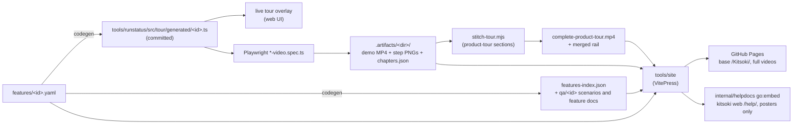

# The promo site, help docs, and feature catalog

One pipeline turns the feature catalog into every public-facing surface:

## The feature catalog (`features/`)

One YAML per feature: title/tagline/summary (promo + docs copy), the tour
steps (drive both the live overlay and the recorded demo), the demo's
recording binding, optional gated ui-qa scenarios, doc links. Authoring guide:
[`features/CLAUDE.md`](../../features/CLAUDE.md). The committed manifests under
`tools/runstatus/src/tour/generated/` are code-generated — `make features`
regenerates, `make features-check` (inside `make build` and `make test`) fails
on stale output, schema violations, or spec↔feature drift. Chained into it,
`pnpm demos:lint` (`scripts/features/lint-demos.ts`) fails any demo spec that
bypasses the camera helper, omits its chapter sidecar, or drives a live model —
the no-LLM invariant, in CI. The chain
YAML → generated TS → live popover is closed end-to-end by the existing video
specs' title assertions.

## Demo recording (`make demos`)

`scripts/record-demos.sh` records every recordable demo at watch-speed
(`WEB_CHAT_PACE=1`), deterministically (no LLM — `--flow`/`--host-cassette`).
Incremental by per-demo content stamps (feature YAML + spec + story inputs +
binary) in `.artifacts/<dir>/.stamp`; `make demos-force` ignores them. One
demo: `make demo-feature FEATURE=<id>`. Videos are **never committed**.
Each spec also emits a `<video>.mp4.chapters.json` sidecar (one chapter per
tour step) the site uses for its clickable chapter rail.

Every recording context comes from one device-profile registry
(`tests/playwright/_helpers/camera.ts`): `cameraContext()` sources the viewport,
scale, and `recordVideo.size`, so every section shares the 1600×900 canvas the
stitch composes on (drift there silently letterboxes the master). `demo.profiles`
(default `[desktop]`) is the device-matrix dimension — `desktop` is the only
enabled profile until a demo's UI is responsive; `mobile`/`tablet` are a
per-demo opt-in, recorded under `KITSOKI_DEMO_PROFILE` with a `--<profile>`
filename suffix (desktop stays `<base>.mp4`, so its whole pipeline is unchanged).
Ports come from `demoAddr(basePort)`: `basePort + KITSOKI_DEMO_PORT_BASE`
(a concurrent session/worktree sets the env to claim a free range) plus the
profile's offset — so concurrent sessions and parallel profile passes never
collide on a port. (The matrix is threaded through record + index today; the
site-side variant serving — per-profile `stage-media` outputs + `ChapteredVideo`
runtime switching on viewport — lands when the first demo actually goes
responsive, so nothing ships a shrunken-desktop "mobile" cut in the meantime.)

## The master product tour (`make render-tour`)

`features/complete-product-tour.yaml` (`kind: product-tour`) is **stitched, not
recorded**: it declares ordered `sections`, each with `clips` referencing a
demo-bound feature (optionally trimmed to a `[startChapterId, endChapterId]`
window of that feature's sidecar). Because its video is composed, the master's
`demo` has no `spec` (`demo.spec` is optional only for a sectioned product-tour;
record-demos skips it). `scripts/features/stitch-tour.mjs` resolves each clip's
per-profile MP4 + sidecar, ffmpeg-trims to the window, renders a title card per
section, composes via the shared `concat-videos.sh`, and **merges** the
per-section sidecars into one master rail — section-prefixed ids, a
`group`/`group_label` per section, cumulative offsets (each card included,
probed for exact duration), and a preserved `source_ref` for deep-linking.
`ChapteredVideo.vue` renders that into one collapsible block per section (the
8-group rail); a plain per-feature sidecar still renders flat. `make render-tour`
records any stale sources then stitches; the stitch is incremental (skips when
the master is newer than every input — `KITSOKI_STITCH_FORCE=1` rebuilds) and
pure no-LLM post-processing.

## The site (`tools/site`, VitePress)

- **Promo landing** (`src/index.md`) is a thin layer: hero + `<HeroDemo/>` +
  `<FeatureGrid/>` over the same data/components as the docs pages — zero
  duplicated content.
- **Feature pages** are dynamic routes (`src/features/[id].md` +
  `[id].paths.ts`) over the generated `features-index.json`: chaptered video,
  step cards (click → seek), narrative markdown, doc links.
- **Guide docs** are an **allowlist copy** of `docs/` (`docs-manifest.json` +
  `scripts/stage-docs.mjs`): internal trees (proposals, competitive-analysis,
  skills, …) can never leak; links escaping the allowlist are rewritten to
  GitHub URLs; dead links fail the build; `scripts/check-leaks.mjs` re-checks
  the dist.
- **Localization** publishes English at `/`, Thai at `/th/`, and Japanese at
  `/ja/`. Static locale pages live under `tools/site/src/<locale>/`; generated
  feature pages read optional JSON overlays from `tools/site/i18n/<locale>/`.
  Missing fields fall back to English, so translation can move feature by
  feature. Use `stories/product-site-localization/` to draft or refresh those
  overlays, then accept only after the deterministic site build passes.
- Missing media never fails a build — pages degrade to poster + placeholder,
  so docs-only iteration works with an empty `.artifacts/`.
- The media organization contract is documented in
  [`docs/media/README.md`](../media/README.md) and checked by `make media-check`
  (also part of `make test` when Node/pnpm dependencies are installed). It
  verifies feature demo paths, staged `public/media/<feature>/` shape, and
  Slidey rrweb deck embeds without recording videos or invoking an LLM.

Targets: `make site` (build, base `/Kitsoki/`), `make site-dev` (HMR),
`make site-full` (demos + site), `make site-clean`.

## Publishing

- **GitHub Pages**: `.github/workflows/site.yml` builds the binary, records
  stale demos (two-level cache: `actions/cache` over `.artifacts` + the
  per-demo stamps), stitches the master product tour, builds, deploys. Docs-only pushes deploy in minutes with 0
  recordings; a cold run records ~14 demos (30–50 min). Manual dispatch has a
  `rerecord` input. One-time setup: repo Settings → Pages → Source: GitHub
  Actions.
- **In the binary**: `make site-embed` builds the embedded variant
  (base `/help/`, posters only — never MP4s, ~5MB) into
  `internal/helpdocs/assets/`; the next `make build` embeds it and
  `kitsoki web` serves it at `/help/`. Unstaged help yields an actionable
  placeholder page, never an error (`internal/helpdocs`).

## QA (gated — real LLM, never automatic)

`make feature-qa FEATURE=<id>` records the demo then judges it against the
catalog-generated scenarios + feature spec
(`.artifacts/features/qa/<id>.{scenarios.yaml,feature.md}`) via the
[kitsoki-ui-qa](../../.agents/skills/kitsoki-ui-qa/SKILL.md) pipeline. `make demo-tour-qa`
is the onboarding-tour instance of the same flow. For the stitched master (which
has no recording spec), `make tour-qa` renders it via `render-tour` then judges
the master video against its generated scenarios the same way.
