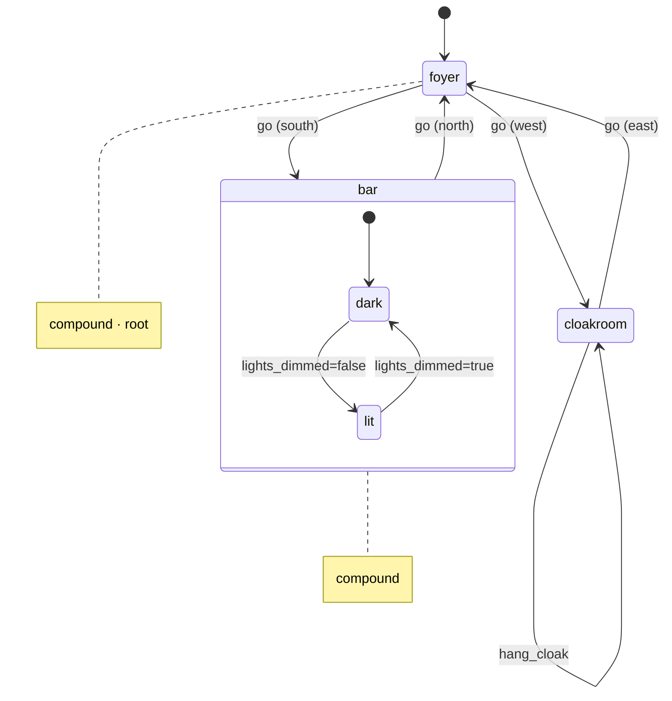
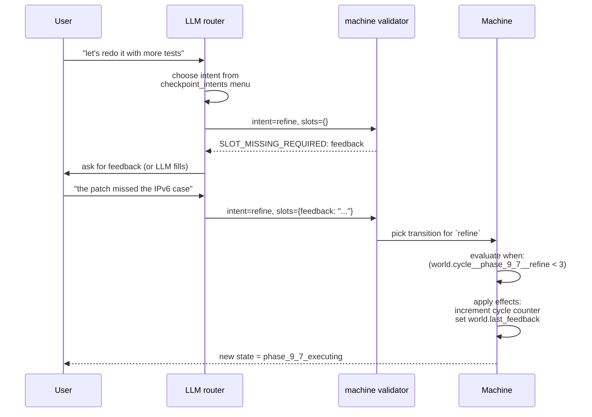

# The State Machine — Rooms, Phases, and the Directed Cyclic Graph

A kitsoki application is a **state machine** with a deliberately small
vocabulary. This document walks the vocabulary end-to-end: the **graph**
of states, the **intents** that drive transitions, the **slots** they
carry, the **world** they read and write, and the **phase templates**
that compress repeated pipelines.

If you have not already, skim [`architecture.md`](architecture.md) first
to see where the machine sits in the larger picture.

For the bytes-on-disk authoritative schema, run `kitsoki docs app-schema`
or open
[`embedded/app-schema.md`](embedded/app-schema.md).

---

## 1. Vocabulary in one breath

| Term | Meaning |
|---|---|
| **App** | One YAML manifest plus optional includes. The unit kitsoki loads. |
| **State** | A node in the graph. Has an optional `view:` template, an `on:` map of intents → transitions, and an `on_enter:` effect list. |
| **Room** | A user-facing name for a state — usually a compound (parent) state grouping a few atomic children. The TUI's location indicator displays the room name. |
| **Phase** | A repeated room. The same template instantiated multiple times in a pipeline (e.g. `phase_a`, `phase_b`, `phase_c`). |
| **Compound state** | A state whose `type: compound` and whose `states:` map defines children. Has an `initial:` child. |
| **Parallel state** | A compound whose children all run concurrently (`type: parallel`). |
| **Intent** | A named action the user can take. The atom of free-text translation. |
| **Slot** | A typed parameter on an intent. |
| **Transition** | An edge: `{intent, when, target, effects}`. The first guarded edge for an intent that matches wins. |
| **Effect** | A small declarative mutation: `set`, `increment`, `say`, `invoke`, `emit`. |
| **World** | The persisted, typed key-value bag. Read by guards and templates; written by effects. |
| **Guard** | The `when:` expression on a transition. Pure, evaluated against `world` and `slots`. |
| **Off-path** | A global escape hatch that suspends the current state, runs a free-form sub-conversation, and returns. |

Three things that are not in the vocabulary, deliberately:

- **No imperative scripting.** Effects are declarative and ordered.
  Anything more complex flows through a host handler.
- **No implicit state.** Everything that survives a turn lives in
  `world` (declared at the top level) or in slot bindings (typed on the
  intent).
- **No hidden transitions.** Every edge is in `on:`. The catch-all is
  spelled `default: true`.

Why this shape — three older idioms collapse into the same vocabulary:

- A **text-adventure room** maps to a state; the exits are transitions;
  the inventory is the world; the verbs the room understands are its
  intent set; the objects are slot enums.
- A **wizard** is a linear chain of compound states; the slots on each
  step are the form parameters; the "back" button is a cyclic
  transition.
- A **command palette** is exactly the runtime menu primitive — the
  set of currently-valid intents derived from the active state's
  bindings and guards.

A statechart's *parallel region* falls out the same way: a file-editor
state runs alongside a background-validator state that emits
`saved`/`error` events the editor consumes. The borrowings from each
of these traditions are catalogued in [`prior-art.md`](prior-art.md).

---

## 2. The directed cyclic graph

States are the nodes; transitions are the edges. Cycles are not just
allowed, they are the *typical shape* — a "main room" intent menu, a
proposal lifecycle that loops between draft and review, a phase
pipeline that retries on failure.



(Cloak of Darkness — full source at
[`testdata/apps/cloak/app.yaml`](../testdata/apps/cloak/app.yaml). To
generate this graph for any app, run `kitsoki viz app.yaml` and pipe to
`dot`, or `kitsoki viz --mermaid` for the same shape as above.)

A few invariants the loader enforces (`internal/app/loader.go`):

- Every `target:` resolves to an existing state or contains a runtime
  template (`{{ world.dynamic_room }}`).
- Every intent referenced in `on:` is declared globally (`intents:`),
  locally (`states.X.intents:`), or is the wildcard `"*"`.
- Every host invoked (`invoke: host.X`) is in the top-level `hosts:`
  allow-list.
- Every key in `relevant_world:` exists in the global `world:` schema.

Cycles, dead ends, multiple roots inside a compound — all fine. The
machine never inspects "shape" beyond what it needs to evaluate the
next transition.

---

## 3. States and transitions

### Atomic state

```yaml
states:
  foyer:
    description: "The entrance hall."
    view: |
      You are in a spacious hall, with doorways south and west.
    on:
      go:
        - when: "slots.direction == 'south'"
          target: bar
        - when: "slots.direction == 'west'"
          target: cloakroom
        - default: true
          target: foyer
          effects:
            - say: "You can't go that way."
```

Order matters inside an intent's transition list:

1. The first transition whose `when:` evaluates true wins.
2. A transition with `default: true` is the catch-all. Always last.
3. If neither matches, the machine emits `GUARD_FAILED` (an in-band
   error envelope; the harness can surface a hint to the user).

### Compound state

```yaml
states:
  bar:
    type: compound
    initial: dark             # required for compound; supports {{ … }} templating
    description: "A pitch-black bar."
    states:
      dark:
        view: "It's pitch dark. You can't see a thing."
        on:
          "*":                       # wildcard — applies to any non-go intent here
            - target: .              # stay in this state
              effects:
                - increment: { disturbance: 1 }
      lit:
        view: "The bar is dimly lit."
        on:
          read_message:
            - target: bar.lit        # dot-path; no slash-form needed in target
              effects:
                - set: { message_rumpled: true }
```

Children inherit the parent's `on:` bindings unless they override the
intent locally. `target: .` means "stay in the same atomic state".

### Parallel state

```yaml
states:
  game:
    type: parallel
    states:
      lighting:
        type: compound
        initial: bright
        # … states ‚ {bright, dim} with `on: lights_dimmed` transitions
      narrator:
        type: compound
        initial: idle
        # … receives `emit: lights_dimmed` events from sibling region
```

`emit: foo` from one region is observed as an event in every parallel
sibling. Parallel regions are useful when two orthogonal axes evolve
independently — game lighting and narration cadence, for example.

### View templates

`view:` is a Go-flavoured template parsed by `internal/expr`:

```yaml
view: |
  Counter is {{ world.counter }}.
  {{ if world.wearing_cloak }}You are wearing a velvet cloak.{{ end }}
```

Variables: `world.*`, `slots.*`, plus a few orchestrator-injected
context keys (`run.session_id`, `run.turn`).

Block constructs: `{{ if }}…{{ else }}…{{ end }}` and
`{{ range list-expr }}…{{ end }}`. Inside a `range` body the current
element is bound to `.` — write `.display`, `.reason`, etc., to read
fields off the iteration value.

`menu.*` and the menu-helper functions surface the computed §7.2
menu (primary + blocked intents with reasons) inside view bodies,
so authors can render the "what can I do right now" surface inline
with prose — not only in the right-side actions pane.

```yaml
view: |
  Choose:
  {{ range menu.primary }}- {{ .display }}
  {{ end }}{{ range menu.blocked }}- ✗ {{ .display }} — {{ .reason }}
  {{ end }}
```

Or, for a single intent, the helper functions are usually clearer:

* `available(name)` → bool — `name` is in `menu.primary`.
* `blocked(name)` → bool — `name` is in `menu.blocked`.
* `blocked_reason(name)` → string — the failing arm's `guard_hint`,
  or `""` when not blocked.
* `intent_status(name)` → `"available"` / `"blocked"` / `"unknown"`
  (`"unknown"` covers global intents that aren't bound to the
  current state).

```yaml
view: |
  {{ if available("start_journey") }}- start the journey
  {{ else }}- ✗ start_journey — {{ blocked_reason("start_journey") }}
  {{ end }}
```

`menu.primary[i]` and `menu.blocked[i]` are plain map entries with
keys `intent`, `display`, `reason`, `destination_hint`, and
`primary` — JSON-serializable, so the same shape is what the TUI's
right-side panel and the in-view templates read.

The result is rendered by the surface — the TUI runs it through
Glamour; transports send it as Markdown or convert to wiki markup.

#### View renders run AFTER `on_enter` `bind:` settles

When a state's `on_enter:` chain invokes a `host.*` (or `iface.*`)
call with a `bind:` directive, the view is rendered against the
*post*-bind world. Concretely:

1. `machine.Turn` walks effects, queues host calls, and — if any
   queued call declares `bind:` — skips its own view render.
2. The orchestrator dispatches the host calls. Each `bind:` lands
   into world.
3. The orchestrator's `dispatchHostCalls` re-renders the view via
   `machine.RenderState` against the post-bind world.

What this means for authors: a view template that reads
`world.<bound_key>.<field>` on a state whose `on_enter:` binds
`<bound_key>` does NOT need a `?? "(pending)"` fallback for that
field — the value is present by the time the operator sees the
render. `??` fallbacks are still required when the binding is
*conditional* (gated by `when:` on the invoke), since the field
remains absent on the not-taken branch. Worked example —
`stories/bugfix/rooms/proposing.yaml::proposing_executing`:
unconditionally binds `propose_fix_artifact`, so the view reads
`{{ world.propose_fix_artifact.summary_title }}` directly. The
sibling `..._awaiting_reply` state binds `llm_verdict` only when
`judge_mode in ('llm','llm_then_human')` — so its view keeps
`{{ world.llm_verdict.verdict ?? "(no LLM verdict)" }}`.

(See `internal/machine/machine.go::Turn` step 7 and
`internal/orchestrator/orchestrator.go::dispatchHostCalls` for the
exact handoff.)

---

## 4. Intents and slots

```yaml
intents:
  go:
    title: "Go"
    description: "Move in a compass direction."
    examples: ["go south", "head north", "n"]
    priority: 100
    slots:
      direction:
        type: enum
        values: [north, south, east, west, up, down]
        required: true
        prompt: "Which direction?"
        format_hint: "One of n/s/e/w/up/down."
```

Slot `type:` is one of `string`, `int`, `bool`, `enum`. Validation runs
inside the machine before any guard is evaluated; bad slots return
`SLOT_TYPE_MISMATCH` or `SLOT_NOT_IN_ENUM` to the harness so it can
self-correct.

### How an intent reaches the machine

1. The harness sees the user's input plus the **current allowed
   intents** (computed from the active state's `on:` map plus inherited
   parent bindings) and their slot schemas.
2. The harness emits a single `transition` MCP tool call:
   ```json
   {
     "intent": "go",
     "slots": { "direction": "south" },
     "confidence": 0.94
   }
   ```
3. The machine validates, picks the matching transition, applies
   effects, and returns the new state. If validation fails, the error
   envelope (`{ code, hint, allowed_intents, missing_slots }`) goes
   back to the harness for one or more retries.

#### Why one generic `transition` tool instead of per-intent tools

The MCP server registers exactly **one** tool — `transition` — and
relies on the validator to police the `intent` field. The alternative
(one MCP tool per intent, or per state) was considered and rejected:

- **Tool-list churn defeats prompt caching.** A per-state tool catalog
  would change every turn. LLM providers cache the tool list per
  session; reshuffling it per turn defeats that cache and adds
  latency.
- **Per-intent tools leak author internals.** The intent names
  (`hang_cloak`, `restart_from`) would appear in the tool schema the
  LLM sees. That couples the LLM prompt to authoring decisions that
  ought to be free to change.

With one generic tool the harness's job is uniform across apps and
across states: call `transition` with one of the intents listed in the
system prompt for the current state. The validator turns the resulting
`{intent, slots}` into the appropriate structured error envelope when
the LLM picks something invalid — see [`prior-art.md` §5](prior-art.md#5-why-one-generic-mcp-tool-not-per-state-typed-tools)
for the full comparison.

Error codes the machine emits — full list in `internal/intent`:

| Code | When |
|---|---|
| `UNKNOWN_INTENT` | The name is not in the app's intent library. |
| `INTENT_NOT_ALLOWED_IN_STATE` | The name exists but the current state does not bind it. |
| `SLOT_MISSING_REQUIRED` | A `required: true` slot was absent. |
| `SLOT_TYPE_MISMATCH` | The value does not coerce to the declared type. |
| `SLOT_NOT_IN_ENUM` | The value is outside `values:`. |
| `GUARD_FAILED` | No `when:` matched and no `default:` was provided. |
| `HOST_NOT_ALLOWED` | An invoked host is not in `hosts:`. |
| `HOST_ERROR` | A host handler returned a non-nil error. |

---

## 5. Effects

Effects are the only mutators the machine knows. They run in declaration
order inside one transition; conventional shape inside one effect block:

```yaml
effects:
  - set:        { last_dir: "{{ slots.direction }}" }
  - increment:  { disturbance: 1 }
  - say:        "You head {{ slots.direction }}."
  - invoke:     host.run
    with:       { cmd: "git status", cwd: "{{ world.workspace_root }}" }
    bind:       { last_output: stdout, last_code: exit_code }
    on_error:   error_room
  - emit:       lights_dimmed
```

| Field | Meaning |
|---|---|
| `set` | Assign one or more world variables. Values are templates. |
| `increment` | Integer delta (positive or negative) on a numeric world variable. |
| `say` | Append a narrative line to the rendered view. |
| `invoke` | Call a registered `host.*` handler. See [`hosts.md`](hosts.md). |
| `with` | Templated arguments passed to the host. |
| `bind` | `{world_key: result_key}` — copy fields out of `host.Result.Data` into world. |
| `on_error` | Transition target if `invoke` returns an error. Sets `$host_error` for the next guard. |
| `background` | `true` → dispatch the invoke as a background job. See [`background-jobs/`](background-jobs/README.md). |
| `on_complete` | Effects fired when the background job terminates. |
| `emit` | Broadcast a named event to parallel siblings. |
| `emit_intent` | Dispatch a synthetic intent against the current state as part of the same turn. Used to auto-advance from `on_enter` (e.g. an LLM judge → `accept` shape). Optional `slots:` map carries values into the dispatched intent. Depth-capped at `machine.EmitIntentMaxDepth` (= 8). Mutually exclusive with `target:` on the same effect. |

Templates inside effects use the same `{{ … }}` syntax as views. Inside
`with:` and `bind:`, **arguments and results are typed** —
`stdout`, `exit_code`, `ok` for `host.run`; `answer`, `chat_id`, etc.
for `host.oracle.converse`.

---

## 6. The world

`world:` is the typed schema for everything that survives a turn:

```yaml
world:
  wearing_cloak:    { type: bool,   default: true }
  disturbance:      { type: int,    default: 0 }
  last_workspace:   { type: string, default: "" }
  status:           { type: enum,   values: [idle, running, done], default: idle }
```

The default determines the zero value when a session starts. The schema
is also what `relevant_world:` keys reference for the TUI's location
indicator.

The world is **immutable per turn**. Effects produce a new snapshot;
guards see only the post-effect snapshot of *prior* effects in the same
transition list. This makes templates inside `say:` and downstream
`with:` predictable — by the time they render, every preceding `set:`
and `increment:` has already landed.

Two scopes live alongside `world`:

- **slots** — the typed bag from the intent that triggered this
  transition. Read-only inside guards and effects, scoped to the turn.
- **`$host_error`** — set by the orchestrator when an `on_error:`
  transition fires; readable in the *target* state's first guard.

---

## 7. Guards (the `expr` language)

Guards are bare expressions evaluated by `internal/expr` (an
`expr-lang/expr` wrapper with a conservative AST whitelist).

Common shapes:

```yaml
when: "slots.direction == 'south'"
when: "world.wearing_cloak && world.disturbance < 3"
when: "world.status in ['idle', 'done']"
when: "$host_error.code == 'TIMEOUT'"
when: "len(world.queue) > 0"
```

What you **cannot** do:

- No lambdas, function literals, or user-defined functions.
- No mutation. Guards are pure.
- No shell-out, file I/O, time-of-day. Inject those via host handlers
  and reflect them into world.

Templates (inside `view:`, `say:`, and string-valued fields like
`with:`) accept `{{ … }}` expressions plus the `{{ if }}…{{ end }}`,
`{{ if }}…{{ else }}…{{ end }}`, and `{{ range }}…{{ end }}` blocks.

---

## 8. The turn loop (state machine of the orchestrator)

The application's state machine is one half. The other half is the
orchestrator's *own* state machine, which runs every turn:

```mermaid
stateDiagram-v2
    [*] --> idle
    idle --> acquire: inbound event
    acquire --> translate: lock held, journey loaded
    translate --> decide: IntentCall produced
    translate --> translate: ValidationError, retry
    decide --> apply: nextState, effects, events
    apply --> persist: effects applied
    persist --> render: events appended
    render --> idle: view posted, lock released

    state idle
    state acquire: acquire writer lock and load journey
    state translate: Harness.Turn — LLM call
    state decide: Machine.Turn — pure
    state apply: set, increment, say, invoke, emit; background spawns a job
    state persist: Store.AppendEvents
    state render: render view; post to transports
```



Asynchronous off-ramps — also run by the orchestrator, also serialized
through the same lock:

- **Background-job completion.** When a `background: true` invocation
  finishes, the scheduler fans a `JobCompleted` event in. The
  orchestrator wakes, fires the matching `on_complete:` effect list as
  a synthetic turn, and posts an inbox notification. Full lifecycle in
  [`background-jobs/`](background-jobs/README.md).
- **Mid-flight clarification.** A handler may call
  `host.RequestClarification(ctx, schema)` while running as a job.
  This blocks the handler and posts an `action_required` notification.
  When the user submits an `answer_clarification` intent, the answer is
  written to the job row and the handler resumes.
- **Off-path.** A global trigger (default: `help`) suspends the current
  state and pushes the user into a free-form Oracle-style sub-room. On
  exit, the previous state is rehydrated.
- **Teleport.** `Orchestrator.Teleport` jumps to a target state without
  going through a transition — used by inbox notifications and the
  Oracle Room banner. Pushes the source state onto the history stack.
- **Hot reload.** When the watched `app.yaml` changes mid-session, the
  orchestrator re-validates, swaps in the new `AppDef`, and rebinds the
  current state if it still exists.

---

## 9. Phase templates (compressing repeated rooms)

Many real applications repeat the same shape — "execute a step, post
the result, await a reply, possibly retry on failure." Phase templates
let you declare the shape once and instantiate it once per phase.

```yaml
phase_templates:
  reviewed_phase:
    parameters:
      id:    { type: string,  required: true }
      title: { type: string,  required: true }
      checkpoint: { type: boolean, default: false }
    states:
      "{id}_executing":
        view: "Phase {{ tpl.title }} running"
        on:
          done:
            - target: "{{ tpl.id }}_awaiting_reply"
              when:   "tpl.checkpoint == true"
              effects:
                - invoke: host.transport.post
                  with:
                    transport: "{{ world.transport }}"
                    thread:    "{{ world.thread }}"
                    phase_id:  "{{ tpl.id }}"
                    title:     "{{ tpl.title }}"
                    body:      "phase {{ tpl.id }} done"
            - target: "{{ phase.next.continue }}"
              default: true
      "{id}_awaiting_reply":
        view: "Awaiting reply on {{ tpl.title }}"
      "{id}_error":
        view: "Phase {{ tpl.title }} failed"
        on:
          retry:
            - target: "{{ tpl.id }}_executing"

phases:
  template: reviewed_phase
  graph:
    phase_a:
      title: "Phase A"
      next: { continue: phase_b }
    phase_b:
      title: "Phase B"
      checkpoint: true
      next: { continue: phase_c }
    phase_c:
      title: "Phase C"
      checkpoint: true
      next:
        continue:   terminated
        on_failure: phase_a
      cycle_budgets:
        on_failure: 2     # synthesized: increment+guard+fall-through to phase_c_error
```

Substitution rules:

| Where | Marker | Resolves to |
|---|---|---|
| State key | `{name}` | the parameter value |
| String body | `{{ tpl.X }}` | the parameter value |
| `target:` | `{{ phase.next.<arc> }}` | `<next-phase-id>_executing` |
| `target:` | a literal like `terminated` | passes through unchanged |

`cycle_budgets:` is sugar. For each declared arc, the loader synthesises:

1. An `Effect.Increment` on the arc's transition (counter
   `cycle__<phase>__<arc>` in world).
2. A `when:` guard `world.cycle__<phase>__<arc> < N` on the arc.
3. A trailing `default: true` → `<phase>_error` with the guard hint.

The fixture at
[`internal/app/testdata/phases/three-phase.yaml`](../internal/app/testdata/phases/three-phase.yaml)
exercises every variant and is the regression baseline.

`checkpoint_intents:` (a top-level map) is merged into every
`*_awaiting_reply` state — it's where you declare the user-facing
verbs (`continue`, `refine`, …) that resume a paused phase.

---

## 10. Controlled navigation: back-jumps, restart, and feedback arcs

A common question once phases are in play: **"From phase 9, how do
I let the user go back to phase 3 — but only with a reason, and only
if certain conditions hold?"** This section explains the mechanism.
The short version: kitsoki has no "jump anywhere" primitive. Every
back-jump is the intersection of four declarations the author
already wrote.

### 10.1 The four mechanisms

Working example — the validation phase from the bug-fix pipeline:

```yaml
phases:
  template: reviewed_phase
  graph:
    phase_9_7:
      title:      "Validation"
      checkpoint: true
      next:
        continue:                 phase_12      # forward
        on_validation_fail:       phase_3       # back to earlier phase
        on_validation_fail_short: phase_6_5     # cheaper back-arc
      cycle_budgets:
        on_validation_fail:       3
        on_validation_fail_short: 3
```

```yaml
checkpoint_intents:
  continue:
    description: Approve this phase and advance.
    examples: [continue, approve, lgtm, ok, yes]
  quit:
    description: Abandon this session.
    examples: [quit, abandon, cancel]
  refine:
    description: Re-run this phase with feedback applied.
    slots:
      feedback: { type: text, required: true }
    examples: ["please retry with X", "feedback: ..."]
  restart_from:
    description: Restart from an earlier stage.
    slots:
      stage:
        type: enum
        values: [reproduction, propose_fix, implement_review, validate]
    examples: ["restart from propose_fix", "redo reproduction"]
```

Four mechanisms cooperate to make this safe:

#### 1. `next:` enumerates every legal destination

The phase template substitutes `{{ phase.next.<arc> }}` into every
transition `target:`. The set of arcs a phase declares is the set of
states reachable from it — full stop. From `phase_9_7` you can only
land in `phase_12`, `phase_3`, or `phase_6_5`. There is no syntactic
way to write a transition that goes elsewhere; an arc not in `next:`
doesn't exist.

This is the structural backbone. Every back-edge the author wants is
declared as a named arc; arcs not declared are not possible.

#### 2. `checkpoint_intents:` is the user-facing menu

When a phase enters `<id>_awaiting_reply`, the **only** intents the
LLM router is shown are the ones merged in from the top-level
`checkpoint_intents:` block. The router can't invent a new verb
because the harness's allowed-intents list literally does not contain
one. A comment that doesn't match any declared intent triggers a
retry (with a structured error), and ultimately a clarify prompt to
the human.

Translation from English to verb happens through `examples:`. The
LLM sees `"please redo the implementation"` and maps it to
`refine` — not because of hardcoded synonyms, but because `refine`'s
`examples:` cover that phrasing.

#### 3. Slot schemas force the context

The "back" verbs each carry a required slot:

| Intent | Required slot | What it does |
|---|---|---|
| `refine` | `feedback: text` | The retry can't fire without a written justification. |
| `restart_from` | `stage: enum[...]` | The user can pick only one of the declared stages. |
| `block_on` | `reason: text` | Pausing the session requires a reason in the log. |

A request like `"refine"` with no feedback fails validation with
`SLOT_MISSING_REQUIRED`. The harness sees that error, asks the LLM to
fill the gap (or surfaces a slot-fill dialog to the human), and only
re-submits once `feedback` is supplied. Same for `restart_from` — the
enum constrains the destination set to four valid stages, and the
transition for each stage maps to a specific phase entry point.

This is why "you must provide context to go back" is enforced
mechanically, not by author discipline. The intent simply does not
validate without it.

#### 4. Guards and cycle budgets cap who and how many times

A `when:` guard can require a world condition before accepting a
back-arc:

```yaml
phase_8_awaiting_reply:
  on:
    continue:
      - target: phase_9
        when:   "world.last_reply_author in world.allowed_authors"
        guard_hint: "Only authorized reviewers may approve this phase."
```

And `cycle_budgets:` caps the number of times an arc can be taken:

```yaml
cycle_budgets:
  on_validation_fail: 3       # after 3 retries, this arc fails out
```

The phase-template expander turns each budget entry into three things:

1. an `increment:` effect on the arc's transition, against a
   world counter `cycle__<phase>__<arc>`,
2. a `when:` guard on the arc: `world.cycle__<phase>__<arc> < N`,
3. a trailing `default: true` → `<phase>_error` carrying a
   `guard_hint` of "cycle budget exceeded for {arc}".

So the back-arc *works* the first N times and *fails into the error
state* afterwards. No infinite loops.

### 10.2 How one back-jump fires, end to end



Every step is declared by the author, validated by the machine, and
written to the event log. Replay reconstructs it exactly.

### 10.3 The same shape for non-phase rooms

The mechanism isn't phase-specific. Any room can constrain its
back-edges the same way:

- Declare a `back` intent with an enum slot for the destination.
- Bind it in `on:` with one transition per destination, each gated
  by a `when:` over the world.
- Add a cycle budget if you don't want a tight loop.

The room-history stack (`internal/history`) is the *implicit* form
of this — it tracks where the user came from for `back` to pop a
single frame. For multi-level decisions you usually want the
explicit phase-style declaration instead, because it makes both the
graph and the context requirements visible to the author.

### 10.4 What you cannot do

These are the deliberate omissions — they would let the LLM (or the
user) escape the controlled graph:

- **No "jump to any state."** There is no `target:` value that
  resolves at runtime to "wherever the LLM wants". Targets are
  declared paths or `{{ phase.next.<arc> }}` substitutions; both are
  enumerated at load time. Even the `jump_to` intent in bug-fix has
  a `phase` slot whose values the transition maps explicitly.
- **No state mutation without a declared intent.** The LLM cannot
  write to `world` directly. Every change goes through an effect on
  a transition the author bound.
- **No guard bypass.** A `when:` that fails causes the next
  transition (or `default:`) to be tried; the LLM cannot demand
  that a guard be skipped. If every arm fails, the machine emits
  `GUARD_FAILED` to the harness for a retry.

The result is that "controlled jumps" are not a feature added on top
of the state machine — they fall out of the machine's existing
constraints. The author's job is to pick the right *combination* of
`next:`, `checkpoint_intents:`, slot schemas, guards, and cycle
budgets for the conversation they want to host.

---

## 11. Off-path: the global escape hatch

```yaml
off_path:
  trigger: help
  banner:  "(help mode)"
  return:  main
```

Triggering the off-path intent saves the current state, switches to a
free-form Oracle-style sub-conversation, and renders the banner. When
the user types `/back` (or whatever the off-path's exit intent is),
the previous state is rehydrated and play resumes.

Off-path traffic still flows through the harness and the store — every
event has the off-path session ID and is replayable — but the inner
graph is intentionally *not* declared as states. This is the only place
where free-form chat is allowed.

For the richer surface that replaces edit mode and supports persistent
named sidebar conversations with their own agents — `meta_modes:` plus
the declarative `agents:` block — see [`meta-mode.md`](meta-mode.md).
Meta mode is what most authors should reach for today; off-path remains
the simple banner-only escape hatch.

---

## 12. Worked example: one turn through Cloak of Darkness

**Initial state.** `foyer`, world `{wearing_cloak: true, disturbance: 0,
message_rumpled: false}`.

**User input.** `"go south"`

1. The orchestrator acquires the session lock and loads the journey.
2. The harness translates "go south" against the foyer's allowed
   intents (`go`, `look`) and emits `transition({intent: "go",
   slots: {direction: "south"}, confidence: 0.97})`.
3. `Machine.Turn(foyer, world, IntentCall{"go", {direction: south}})`
   - validates the slot (enum match → ok),
   - matches the first guarded transition (`when: slots.direction == 'south'`),
   - returns `nextState: bar`, `effects: []`, events
     `[StateExited(foyer), StateEntered(bar.dark)]`.
4. The orchestrator persists the events, computes the new view from
   `bar.dark` (`"It's pitch dark…"`), and posts it to the TUI transport.
5. The lock is released. The harness retains the new allowed intents
   (`go`, `look`, the wildcard `*`) for the next turn.

If the input had been `"go skywards"` instead, step 2 would either
return `SLOT_NOT_IN_ENUM` (and the machine would surface a hint), or
the harness would already have refused to emit the call and prompted
for clarification.

---

## 13. Where the implementation lives

| Concept | Code |
|---|---|
| Loader, types, schema validation | `internal/app/` |
| Pure machine (Turn, Validate) | `internal/machine/` |
| Intent + ValidationError | `internal/intent/` |
| World snapshot | `internal/world/` |
| Expr evaluator | `internal/expr/` |
| Phase template expansion | `internal/app/phases.go` |
| Orchestrator turn loop | `internal/orchestrator/` |
| Off-path | `internal/orchestrator/teleport.go` and `internal/inbox/` |
| MCP transition tool | `internal/mcp/` |
| Visualisation | `internal/viz/` |
| YAML schema reference | `docs/embedded/app-schema.md` |

Read those packages in that order if you want to see the machine
end-to-end, top-down.
