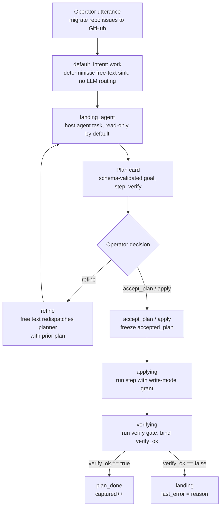

# The ad-hoc structured plan — propose → accept/refine → apply → verify

Inside the dev-story [`landing`](../../stories/dev-story/README.md#the-free-form-workbench-landing)
workbench, when the operator describes a concrete piece of work, the planner
emits a **validated, executable `plan` artifact** instead of prose. The operator
**Accepts** it (or **refines** it through the free-text work sink with prior-plan
continuity); `apply` runs the plan's single step under the write-mode grant, then
runs the plan's **Starlark verify gate** and routes on a **real pass/fail
verdict**. This is red-after-green for ad-hoc work: prove the step landed, don't
assume it.

It fixes the sharp UX hole in the bare workbench: a free-text plan ("would
migrate `issues/` to GitHub…") followed by a free-text "ok go ahead" runs the
agent *again, freshly* — `next_state` advancing proves nothing about whether the
work happened, and there is no acceptance handle and no verification. The plan
turns that round-trip into a machine-executable contract with a falsifiable gate.

## The model

The plan validation, accept/apply routing, the verify-script run (sandboxed, no
LLM, replayable) and the pass/fail branch are all **deterministic**. Only the
planner's draft and the operator's accept/refine verdict are interpretive.

## The plan artifact

[`stories/dev-story/schemas/plan.json`](../../stories/dev-story/schemas/plan.json):
one `goal`, exactly one executable `step` (`kind` ∈ `run|agent`, `description`,
`mutating`), and one `verify` gate (`mode` ∈ `script|agent|hybrid`, `script`,
`inputs`, `reason`). `step` is an **object, not an array** on purpose — multi-step
is a non-goal.

It is a **strict subset of cherny-loop's
[`gate_plan.json`](../../stories/cherny-loop/schemas/gate_plan.json)** (single
step, single verify), so an accepted plan can be handed straight to cherny-loop
when iteration is wanted. The optional `plan` object on the landing agent's
close-out note ([`schemas/landing-note.json`](../../stories/dev-story/schemas/landing-note.json))
mirrors this schema exactly; the planner is taught to emit it (or `route`, never
both) by [`prompts/landing.md`](../../stories/dev-story/prompts/landing.md).

## The rooms

Three rooms carry the flow; see the dev-story
[Rooms table](../../stories/dev-story/README.md#rooms) for where they sit.

**[`landing`](../../stories/dev-story/rooms/landing.yaml)** — when the close-out
note carried a plan, renders a reviewable **plan card** (Goal / Step / Verify)
plus an "Accept & apply" quick action, **mirroring the on-path `route` bail
block** above it (only one `choice:` per view, so both buttons fold into the
single Quick actions menu). A free-text adjustment refines it: the `work` arc
preserves the prior plan into `landing_plan_prior` (a separate, guarded `set:` so
a note *without* a plan doesn't null the whole block) and re-dispatches the
planner with it as context. `accept_plan` (and its strict alias `apply_plan`)
freezes `accepted_plan`, sets `plan_decision`, and enters `applying`.

**[`applying`](../../stories/dev-story/rooms/applying.yaml)** — re-uses the
`landing_agent` (one persona, correct write-mode posture) but prompts it with the
**accepted plan as instruction** ([`prompts/apply.md`](../../stories/dev-story/prompts/apply.md)),
not a fresh re-prose. It binds a **distinct key, `apply_note`** — *not*
`landing_note`. `landing_note` already holds the proposed plan from the work
turn, so binding it here with `once: true` would see the target already-set and
**skip the dispatch** — the step would never run. After the bind settles it emits
`run_verify` to enter `verifying`.

**[`verifying`](../../stories/dev-story/rooms/verifying.yaml)** — runs the verify
gate and binds a tri-state `verify_ok` (`""` until bound). The pass/fail emits
(`verify_done` / `apply_failed`) read `verify_ok` and so **defer to a post-bind
pass** (the cherny decision-emit discipline) — neither fires until the gate
settles, then exactly one does. PASS → `plan_done` (`captured++`); FAIL → back to
`landing` with the gate's reason in `last_error` and `landing_note.plan` kept for
refine. The room is pinned **`decider: llm`** — the `isStagedGate` "mix override"
(`internal/machine/machine.go`): the verdict is deterministic, but because the
room exposes the globally-available nav intents it *looks* like a decision gate,
so in `kitsoki web`'s STAGED mode the synthetic emit chain would otherwise stop
awaiting a human. The pin forces the deterministic guarded emit to auto-fire (an
LLM decider is only a fallback if no guard matches — impossible once `verify_ok`
is bound).

## The verify gate and the read-only inspection capability

`mode: script` (the default and focus) runs `host.starlark.run` on the plan's
`.star` gate, returning `{ok, reason}`. `agent`/`hybrid` reuse cherny-loop's
`gate_reviewer` persona for goals no script can encode. The gate asserts against
reality through the Starlark sandbox's **read-only inspection surface**
(`ctx.fs.read/exists/glob` + `ctx.probe` with a global allow-list —
`gh.issue.list`, `git.status`, `git.ls_files`). That surface mirrors the
`ctx.http` record/replay seam exactly: one `Inspector` interface injected via
`WithInspector`, defaulting deny-all, with a `ReplayInspector` served from an
inspect cassette under flow tests. The authoritative engine detail lives in
[docs/architecture/hosts.md → host.starlark.run](../architecture/hosts.md#host-starlark-run)
and [`internal/host/starlark`](../../internal/host/starlark/inspect.go) — not
duplicated here.

The worked gate is
[`verify/issues_migrated.star`](../../stories/dev-story/verify/issues_migrated.star):
a single `gh.issue.list` probe + deterministic reshaping, passing iff GitHub
lists ≥ `expected_min` issues for the resolved repo. Its
[`.star.yaml` sidecar](../../stories/dev-story/verify/issues_migrated.star.yaml)
is the authoritative typed I/O contract.

## Configurable issue source

The verify gate probes a repo chosen by `issue_source` ∈ `origin | upstream |
combined`, resolving to the concrete `origin_repo` / `upstream_repo` (world keys
in [`app.yaml`](../../stories/dev-story/app.yaml), so an instance retargets the
fork/upstream without touching a room). `verifying` resolves the concrete
owner/repo and passes it as the script's `repo` input; `combined` falls back to
`origin_repo` for the single-probe v1 script. `prompts/apply.md` honours the same
scope when carrying out the step.

## The clean split from cherny-loop

cherny-loop is the heavyweight, **launched** loop story: an operator picks it,
configures a goal, and watches maker→checker iterate to convergence under a
budget. This is the **inline, single-shot** case inside the *already-running*
workbench: one step, one verify, no loop. They share the same spine (a structured
plan + a deterministic gate), so this plan schema is a deliberate subset of
`gate_plan`, and "this ad-hoc plan wants to iterate" is a **one-intent bail** into
cherny-loop — the same on-path-bail pattern landing uses for pipelines. We do not
rebuild cherny-loop in the workbench.

## Verification

Six no-LLM flow fixtures
([`stories/dev-story/flows/plan_*.yaml`](../../stories/dev-story/flows/)) cover
the slice; all run under `kitsoki test flows stories/dev-story/app.yaml`:

| Fixture | Proves |
|---|---|
| `plan_propose_render` | A stubbed planner returns a note *with* a plan → the plan card + Accept & apply quick action render; `look` re-renders without re-dispatching. |
| `plan_refine` | A free-text adjustment re-uses the `work` sink: the prior plan is preserved into `landing_plan_prior` (fed into the re-dispatched prompt) and a revised plan binds — asserting the *dispatched prompt* carries the prior plan, not just the verb result. |
| `plan_apply_verify_green` | accept → apply → the **real** verify script runs against an inspect cassette (3 issues ≥ 3) → `{ok:true}` → `plan_done`, `captured++`. Exercises `ctx.probe` on the happy path. |
| `plan_apply_verify_red` | Same path, cassette yields 1 issue (< 3) → real `{ok:false}` → back to `landing`, `last_error` carries the script's reason, `captured` unchanged, plan kept for refine. The don't-false-pass case. |
| `plan_mutation_gate` | A red-path flow pinned tightly to the bound verdict: **breaking the `verify_ok: ok` bind** in `verifying.yaml` makes it fail (the room rests in `verifying` instead of routing to `landing`). Proves the gate is load-bearing, not decorative. |
| `plan_apply_staged_livepath` | The live-shape regression: STAGED mode + a repo-relative `verify.script` path. **Fails if `decider: llm` is removed** from `verifying` (the emit chain stalls awaiting a human) or if the raw-path fallback is reverted (the script read misses). |

## Dogfood findings

A real-backend run — real Claude proposing the plan, the operator accepting, the
apply step creating **16 GitHub issues** on the fork, and the verify gate
confirming them — exposed three live-only bugs (since fixed and guarded by the
fixtures above). This is the dogfood story validating itself:

1. **Apply step silently skipped** — `applying` bound `landing_note` with
   `once: true`, but `landing_note` already held the proposed plan, so `once:`
   saw it set and skipped the dispatch (the migration never ran). Fixed by
   binding a distinct `apply_note`. Guarded by the green fixture.
2. **Staged-mode verify stall** — under `kitsoki web` (STAGED), `verifying`
   looked like a decision gate, so the post-bind verdict emit didn't auto-fire
   and the run waited for a human that never came. Fixed by the `decider: llm`
   mix override. Guarded by `plan_apply_staged_livepath`.
3. **Repo-relative `verify.script` path doubling** — an LLM-proposed plan named
   the script repo-root-relative; `resolvePromptPath` doubled the app-dir prefix
   and the read missed. Fixed by a raw-path fallback in
   `host.starlark.run` (`internal/host/starlark_run.go`). Guarded by
   `plan_apply_staged_livepath`.

## Non-goals

- **Multi-step plans / DAGs.** Single step, single verify. If it needs steps, it
  needs cherny-loop or a pipeline.
- **An iterate-until-green loop in the workbench.** That *is* cherny-loop; we bail
  into it, we don't rebuild it.
- **A general `ctx.run` shell in Starlark.** The probe allow-list is the boundary;
  arbitrary shell would undo the reason we prefer Starlark over Bash.
- **Mutating Starlark.** Verify is read-only; mutation stays with the
  write-mode-gated step agent.
