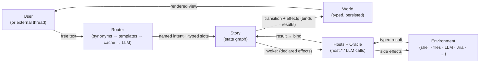
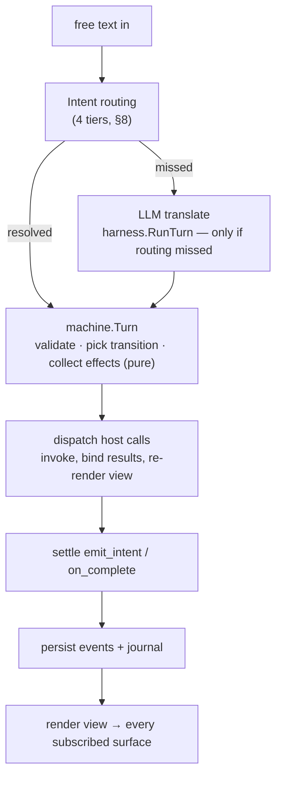

# The Architecture of a Story

This is the **front door** to how a kitsoki story is built and how it
runs. It walks the whole shape end-to-end — **rooms**, **phases**,
**intents**, **turns**, **room hooks**, **views**, and how the
**oracle** plugs into **intent routing** and the **oracle rooms** like
`/meta` — and points at the deeper reference for each piece.

A story is a **deterministic directed cyclic graph** with a scoped,
typed context (the *world*). YAML is only the authoring surface; the
runtime drives the graph and the LLM is called for narrow interpretive
sub-tasks only. If you want the *why* behind that split, read
[`../architecture/concept.md`](../architecture/concept.md) first; this
document is the *what and how*.

Where this doc summarises, the deep dives are authoritative:

| Topic | Deep dive |
|---|---|
| Rooms, states, phases, effects, guards, world | [`state-machine.md`](state-machine.md) |
| System design, the turn loop, the LLM boundary | [`../architecture/overview.md`](../architecture/overview.md) |
| The four-tier intent router | [`../architecture/semantic-routing.md`](../architecture/semantic-routing.md) |
| Oracle verbs and `host.*` | [`../architecture/hosts.md`](../architecture/hosts.md), [`../architecture/oracle-plugin.md`](../architecture/oracle-plugin.md) |
| Oracle rooms (`/meta`, named agents) | [`meta-mode.md`](meta-mode.md) |
| The authoritative YAML schema | `kitsoki docs app-schema` ([`../embedded/app-schema.md`](../embedded/app-schema.md)) |

---

## 1. The one idea



The arrow that matters is the second one. Free text comes in, but a
**declared, finite alphabet of intents** decides what can happen next.
The LLM (and the cheaper routing tiers in front of it) only *translate*
free text into one of the intents the current room exposes — it never
decides what to do, never writes the world, never invents an action.
Everything downstream of that translation is pure and replayable.

The one controlled crack in that purity is the side-channel on the
right: the story's declared `invoke:` effects are the *only* path to the
**environment** — the shell, files, an LLM, an external tracker. They
run through **hosts and the oracle**, return a *typed* result that
`bind:`s back into the world, and record their inputs and outputs so the
turn replays exactly. The author chooses where those calls happen; the
machine never reaches outside on its own.

Three consequences fall out, and the whole rest of the architecture is
just these enforced mechanically:

- **The LLM can't invent actions.** If the room doesn't declare a verb,
  the user gets told "no".
- **The machine is pure.** Same world + same intent → same transition,
  always. No clocks, no randomness, no I/O inside the machine.
- **The author is in charge.** What can happen, in what room, with what
  guards and effects — all of it is reviewable YAML.

---

## 2. Rooms and states (the nodes)

The two words are not synonyms, and the difference matters once a story
grows beyond flat rooms.

**State** is the primitive. `type State` is *"a node in the directed
graph"* (`internal/app/types.go`), and it **nests** — a compound or
parallel state holds child states in its own `states:` map. So "state"
names a node at *any* level of the tree.

**Room** is the operator-facing name for a **top-level** state — the unit
the TUI's location indicator shows as "where you are", and the one that
owns the per-location chrome. The struct says so directly: `Footer`,
`Theme`, and `Transcript` are each *"only meaningful on top-level (room)
states; nested states must leave it empty"*. So:

> **Every room is a state; not every state is a room.** A room is a
> top-level state. The atomic children inside a compound/parallel room
> are states the operator never lands on as a distinct location — they
> share the room's chrome and (unless overridden) its `on:` bindings.

In most stories every state is atomic *and* top-level, so room ≡ state
and the words get used interchangeably — the five `prd` rooms are five
atomic states. The distinction only bites when you reach for nesting:
then the compound parent is the room and its children are sub-states.
**Phase** is a third, related word: a *repeated* room (§10) — one
template instantiated several times in a pipeline.

A state comes in three flavours (`State.Type`, `internal/app/types.go`):

- **Atomic** — a leaf. Has a `view:`, an `on:` intent map, and an
  `on_enter:` effect list.
- **Compound** (`type: compound`) — groups children under a `states:`
  map with a required `initial:` child. Children inherit the parent's
  `on:` bindings unless they override an intent. `target: .` means "stay
  in this atomic state"; `target: bar.lit` is a dot-path into a child.
- **Parallel** (`type: parallel`) — all children run concurrently; an
  `emit:`ted event from one region is observed in every sibling. Use it
  for orthogonal axes (e.g. lighting and narration cadence).

```yaml
states:
  # Atomic — a leaf: view + intent map + entry effects.
  street:
    view: "A dusty street. {{ world.gold }} gold in your poke."
    on: { enter_saloon: [{ target: saloon }] }

  # Compound — child states under `states:`, with a required `initial:`.
  vault:
    type: compound
    initial: locked
    on: { inspect: [{ target: . }] }              # children inherit this arc
    states:
      locked:
        view: "The vault is shut."
        on: { crack: [{ target: vault.open }] }   # dot-path into a child
      open:
        view: "The vault swings wide."

  # Parallel — regions run at once; an `emit:` crosses to every sibling.
  world_clock:
    type: parallel
    states:
      weather:
        type: compound
        initial: dry
        states:
          dry:  { on: { advance: [{ target: weather.rain, effects: [{ emit: precip }] }] } }
          rain: { view: "Rain." }
      calendar:                                   # observes the sibling's emit
        type: compound
        initial: day
        on: { precip: [{ target: calendar.day, effects: [{ set: { wet: true } }] }] }
        states:
          day: { view: "Day {{ world.day }}." }
```

States are nodes; transitions are edges. **Cycles are the typical
shape** — a main-menu room that loops to itself, a proposal lifecycle
that bounces draft↔review, a phase pipeline that retries on failure.
The loader enforces a handful of invariants (every `target:` resolves,
every intent is declared, every host is allow-listed, every
`relevant_world:` key exists) but never inspects "shape" beyond what it
needs for the next transition.

Full vocabulary and worked YAML: [`state-machine.md` §2–3](state-machine.md#2-the-directed-cyclic-graph).

---

## 3. Room hooks (the lifecycle)

A room reacts at three moments. There is deliberately **no `on_exit`**
hook — exit side effects belong on the *transition* leaving the room, so
they're visible on the edge that causes them.

| Hook | YAML | Fires when | Struct |
|---|---|---|---|
| **Entry** | `on_enter:` | the room is (re-)entered | `State.OnEnter []Effect` |
| **Intent** | `on: { <intent>: [transitions] }` | the user takes an action bound here | `State.On map[string][]Transition` |
| **Transition** | `effects:` on a transition arm | that specific edge is taken | `Transition.Effects []Effect` |

Two more hooks live on an *effect* (an `invoke:` specifically), not on
the room:

| Hook | YAML | Fires when | Struct |
|---|---|---|---|
| **Error redirect** | `on_error: <room>` | the `invoke:` returns an error | `Effect.OnError string` |
| **Job completion** | `on_complete:` | a `background: true` invoke terminates | `Effect.OnComplete []Effect` |

All four foreground hooks on one room:

```yaml
states:
  apply_patch:
    on_enter:                       # Entry — runs on every (re-)entry
      - say: "Applying the patch…"
      - invoke: host.run
        id: apply                   # call-site address (flow fixtures stub by id)
        with: { cmd: "git apply {{ world.patch }}" }
        bind: { apply_exit: exit_code }
        on_error: apply_failed      # Error redirect — enter this room on error
    on:
      retry:                        # Intent — a bound action
        - target: .
          effects:                  # Transition — fires only on this edge
            - increment: { attempts: 1 }
```

### `on_enter` must be idempotent

`on_enter` is **not** a once-per-lifetime hook. The same chain re-fires
on `/reload` / hot-reload (`RerunOnEnter`), on explicit self-re-entry
(`target: <thisRoom>`, distinct from `target: .`), and on `on_error:`
sibling redirects. So any side-effecting `invoke:` in `on_enter` runs
two-or-more times per session. Make it idempotent — prefer get-or-create
host verbs (`host.chat.resolve` over `host.chat.create`), guard the
invoke on its own absence (`when: "world.idea_chat_id == ''"`), or keep
content-producing LLM calls out of `on_enter` entirely. The canonical
failure is a chat room whose `on_enter` unconditionally creates a chat:
a mid-conversation `/reload` orphans the thread. Full rules and the
fix patterns: [`state-machine.md` §8](state-machine.md#on_enter-must-be-idempotent).

### `on_error` redirects and the recursion cap

When an `invoke:` errors and `on_error:` names a room, the orchestrator
*enters* that room — re-running its `on_enter` chain. A self-redirect is
short-circuited; a sibling redirect that re-invokes the same failing
call would loop, so redirect entry is depth-capped
(`EnterRedirectMaxDepth = 4`). When the cap trips, the engine appends a
`HarnessError` and ends the turn cleanly. Prefer hosts that return
success idempotently over erroring so the redirect never forms.
([`state-machine.md` §5](state-machine.md#on_error-redirects-and-the-recursion-cap).)

### Background completion

An `invoke:` marked `background: true` spawns a job; the conversation
continues immediately. When the job finishes, the orchestrator fires the
matching `on_complete:` effects as a synthetic turn, updates the world,
and posts an inbox notification. Mid-flight, a handler can call
`host.RequestClarification` to pause and ask the user a question. Full
lifecycle: [`background-jobs/`](background-jobs/README.md).

```yaml
on_enter:
  - invoke: host.run
    background: true                # spawn a job; the turn continues now
    with: { cmd: "make test" }
    bind: { test_exit: exit_code }
    on_complete:                    # later, as a synthetic turn, when it ends
      - emit_intent: tests_finished
```

---

## 4. Effects (the only mutators)

Effects are the enumerated alphabet of mutations a transition or hook
can perform — the LLM never writes the world directly, only effects the
*author* declared do. They run in declaration order over an immutable
per-turn world snapshot (each effect sees the result of prior effects in
the same list).

| Verb | YAML | Meaning |
|---|---|---|
| `set` | `set: { k: "{{ tpl }}" }` | assign world variables |
| `increment` | `increment: { k: 1 }` | integer delta on a numeric var |
| `say` | `say: "line"` | append a narration line to the view |
| `invoke` | `invoke: host.X` | call a registered `host.*` handler |
| `emit` | `emit: evt` | broadcast an event to parallel siblings |
| `emit_intent` | `emit_intent: name` | dispatch a synthetic intent this turn (auto-advance); depth-capped at 8 |

`invoke:` carries sub-fields: `with:` (templated args), `bind:`
(`{world_key: result_key}` to copy fields out of the result),
`on_error:`, `background:`, `on_complete:`, and `id:` (a call-site
address that flow fixtures stub by). Args and results are **typed** per
host (`stdout`/`exit_code` for `host.run`; `answer`/`chat_id` for
`host.oracle.converse`). Full table:
[`state-machine.md` §5](state-machine.md#5-effects); the host catalogue
is [`../architecture/hosts.md`](../architecture/hosts.md).

A chain reads top-to-bottom, each verb seeing the prior verbs' writes:

```yaml
effects:
  - set: { greeting: "Hello, {{ slots.name }}" }   # assign a world var
  - say: "{{ world.greeting }}"                     # narrate a line
  - invoke: host.oracle.decide                      # call a host…
    with:
      question: "Does this patch fix the bug?"
      options: [accept, refine, reject]
    bind: { verdict: choice }                       # …copy result.choice → world.verdict
  - emit_intent: "{{ world.verdict }}"              # route on the bound result
```

**How a host result lands in the world.** A handler returns a *typed
result* — a small map of named fields (`host.run` → `stdout` /
`exit_code`; `host.oracle.decide` → `choice` (plus `confidence`,
`reason`); `host.oracle.converse` → `answer` / `chat_id`). A bare
`invoke:` runs the call for its side effects and throws the result away;
the **only** way a field reaches the world is to name it in `bind:`.
Each entry is `world_var: source`, where `source` is either:

- a **dot-path** into the result — `choice`, `submitted.summary_markdown`,
  `names[0]` (trailing `[N]` indexes array fields) — copied verbatim
  into the world var
  (`internal/orchestrator/host_dispatch_bind.go::lookupBindPath`); or
- an **expr template** (any `source` containing `{{`), rendered against a
  scope where `result` is the result map and `world.*` is the
  post-prior-binds world — so a value can be *derived* as it lands, e.g.
  `bind: { party_names: "{{ join(result.submitted.names, ',') }}" }`.

The orchestrator applies each bind *after* the call returns, records it
as a `set` on the world, and re-renders the view against the updated
world (§5). So `bind: { verdict: choice }` above lifts the decide
result's `choice` field into `world.verdict`, which the following
`emit_intent:` then routes on.

> **Current limitation — no post-bind hook for synchronous invokes.**
> `bind:` lands a result *value* (per above), but there is no post-bind
> *effect chain* for a synchronous `invoke:`. Because the machine only
> **queues** host calls (the orchestrator
> dispatches them *after* `machine.Turn` returns), effects that run at
> machine-time see the **pre-bind** world: a `set:` or `increment:`
> placed *after* an `invoke:` in the same chain does **not** see the
> just-bound value, and a `when:` that references the unbound key is
> surfaced as an authoring error (`machine.go::applyEffectsTraced`).
> Only three things re-evaluate against the post-bind world today:
> `emit_intent:` (deferred and re-run by `settlePostBindEmits`), a
> *subsequent* `invoke:`'s `with:` (re-rendered by `rerenderHostArgs`),
> and the *next* room's `on_enter:` after an `emit_intent` lands there.
> `on_complete:` runs post-bind too — but **only for `background: true`**
> invocations. So deriving a *single* world value from an `oracle.decide`
> result is fine (a template `bind:`, above), but a *chain* of dependent
> `set:` / `increment:` / `when:` effects keyed off that result has no
> natural home for a synchronous call: today you route-only via
> `emit_intent`, push the effects into the next room's `on_enter`, or
> shape the result in the decide schema/prompt. Closing this — a
> per-invoke `then:` list (or unifying `on_complete:` to fire for
> synchronous invokes), folded with the `on_first_enter` /
> on_enter-idempotency question (§3) — is tracked in
> [`../proposals/post-host-bind-hook.md`](../proposals/post-host-bind-hook.md).

---

## 5. Views (what the user sees)

`view:` is a template (pongo2 / `{{ … }}` over the `internal/expr`
scope). It reads `world.*`, `slots.*`, and a few orchestrator-injected
keys (`run.session_id`, `run.turn`). It supports `{{ if }}…{{ else }}…
{{ end }}` and `{{ range … }}…{{ end }}` blocks.

A view can render the **live action menu** inline — the same computed
set of valid intents the TUI shows in its right-side pane — via
`menu.primary` / `menu.blocked` and the helper functions
`available(name)`, `blocked(name)`, `blocked_reason(name)`,
`intent_status(name)`. That lets the prose itself say "what can I do
right now".

```yaml
view: |
  {{ world.location_desc }}

  {{ if world.gold > 0 }}You have {{ world.gold }} gold.{{ else }}Your poke is empty.{{ end }}

  You can:
  {{ range menu.primary }}- {{ .display }}
  {{ end }}
```

One timing rule worth internalising: **the view renders *after*
`on_enter` `bind:` settles.** If a room's `on_enter` invokes a host with
`bind: { artifact: … }`, the view is re-rendered against the post-bind
world, so `{{ world.artifact.field }}` is already populated — no
`?? "(pending)"` fallback needed unless the bind is *conditional* (gated
by a `when:` on the invoke). Details and a worked example:
[`state-machine.md` §3 "View renders run AFTER on_enter bind settles"](state-machine.md#view-renders-run-after-on_enter-bind-settles).
How elements actually render on screen is the TUI's job
([`../tui/README.md`](../tui/README.md)); how a story *should* look is
[`story-style.md`](story-style.md).

---

## 6. Intents and slots (the alphabet)

An **intent** is a named action; it is the atom of free-text
translation. It may carry typed **slots** (`string`, `int`, `bool`,
`enum`, `text`, `list[T]`, …). Slot validation runs *before* any guard,
so a malicious or malformed payload can't slip past the declared
constraints.

```yaml
intents:
  go:
    title: "Go"
    examples: ["go south", "head north", "n"]
    synonyms: ["walk", "head"]
    slots:
      direction:
        type: enum
        values: [north, south, east, west]
        required: true
```

The harness never sees per-intent tools. The MCP server registers
exactly **one** generic `transition` tool; the machine's validator
polices the `intent` field and returns a structured error envelope
(`UNKNOWN_INTENT`, `INTENT_NOT_ALLOWED_IN_STATE`,
`SLOT_MISSING_REQUIRED`, `SLOT_TYPE_MISMATCH`, `SLOT_NOT_IN_ENUM`,
`GUARD_FAILED`, …) the harness can self-correct against. Why one generic
tool: a per-state tool catalog would change every turn and defeat prompt
caching, and would leak author-internal intent names into the LLM
prompt. Full reasoning and the error-code table:
[`state-machine.md` §4](state-machine.md#4-intents-and-slots).

Controlled navigation — "from phase 9 let the user go back to phase 3,
but only with a reason and only N times" — is not a jump primitive; it
falls out of four declarations cooperating (`next:` enumerates legal
destinations, `checkpoint_intents:` is the menu, slot schemas force the
context, guards + `cycle_budgets:` cap who and how often). See
[`state-machine.md` §10](state-machine.md#10-controlled-navigation-back-jumps-restart-and-feedback-arcs).

---

## 7. The turn (one round-trip, end to end)

A **turn** is: the user said something, the story responds. Underneath,
the orchestrator runs its own small state machine, serialized through a
per-session writer lock, recording every step to an append-only event
log (`internal/orchestrator/orchestrator.go::Turn`).



The ordered phases, grounded in the code:

1. **Routing tiers** — `TrySemantic` then `tryTurnCache` try to resolve
   the input cheaply before any LLM call (§8).
2. **Acquire the session lock** and **load the journey** (reconstruct
   state + world from the event log).
3. **LLM translate** — `harness.RunTurn`, only if the routing tiers
   missed. Returns the `(intent, slots)` call.
4. **`machine.Turn`** — pure: validate the call, pick the first guarded
   transition, collect effects and host calls. Same inputs → same
   output.
5. **Dispatch host calls** — `dispatchHostCalls` runs each `invoke:`,
   binds results into world, and re-renders the view against the
   post-bind world.
6. **Settle** post-bind `emit_intent` chains and background
   `on_complete` arcs.
7. **Persist** the events and journal entries (`appendEventsAndJournal`).
8. **Render** the view and post it to every subscribed transport.

Asynchronous off-ramps run through the *same* lock: background-job
completion, mid-flight clarification, off-path entry/exit, teleport
(inbox / oracle banner jumps), and hot-reload (`RerunOnEnter`). Full
diagram and the off-ramp list: [`state-machine.md` §8](state-machine.md#8-the-turn-loop-state-machine-of-the-orchestrator)
and [`../architecture/overview.md` §3](../architecture/overview.md#3-the-journey-of-one-turn).

Because the LLM call and host invocations are the only non-deterministic
steps and both record their inputs/outputs, every turn downstream of
them is replayable — which is what makes deterministic flow tests
possible ([`../tracing/testing.md`](../tracing/testing.md)).

---

## 8. Intent routing and the oracle

"How does the oracle work with intent routing" is really one question:
**routing *is* the oracle's `extract` verb running in front of a fallback
LLM call.** Every foreground turn descends a four-tier stack and stops at
the first tier that resolves (`internal/semroute/`, dispatched via
`host.RunExtractForRouting`):

| Tier | What it matches | Cost | Confidence | Badge |
|---|---|---|---|---|
| **Deterministic** | input exactly equals a menu display string or a unique intent example | map lookup | 1.00 | `▣` |
| **Synonym (bare)** | input's stem-bag ⊇ a declared `synonyms:` phrase | ~3 µs (Aho-Corasick) | 0.90 | `⌁` |
| **Synonym template** | input matches a `{slot}`-capturing template; captures go to typed parsers | <100 µs | 0.80 / 0.65 | `◐` |
| **Turn cache** | `(app, app_hash, state_path, lex.Signature(input))` seen before; re-validates against live world | ~80 µs SQLite | originating verdict | `⟲` |
| **LLM** | the only tier that costs seconds; writes its result back to the cache | 2–5 s | varies | `✦` |

The user sees a **route badge** next to their echoed input naming the
tier that resolved it. The point of the stack is latency: on the Oregon
Trail recording ~3 of 4 turns resolve without an LLM call. Authors grow
the synonym library over time with `kitsoki replay-routing` and
`kitsoki inspect --synonym-suggestions`. Full reference:
[`../architecture/semantic-routing.md`](../architecture/semantic-routing.md).

### The oracle verb surface

The "oracle" is kitsoki's name for an LLM call, full stop. Most of the
verbs are side-effect free — they read and return a verdict without
touching the world or the outside world; only `task` and `converse`
mutate. There are **five verbs**, ordered by blast radius, each a
`host.oracle.*` handler (`internal/host/oracle_*.go`):

| Verb | File | Shape | Mutates? |
|---|---|---|---|
| `extract` | `oracle_extract.go` | free text → structured `(intent, slots)`; **this is the routing LLM tier** | no |
| `decide` | `oracle_decide.go` | bounded choice → one option (the generic gate/judge decider) | no |
| `ask` | `oracle_ask.go` | one-shot Q&A, read-only tool surface | no |
| `task` | `oracle_task.go` | multi-turn agentic session with a declared tool surface; records replay artifacts | yes (sandboxed / file-diff) |
| `converse` | `oracle_converse.go` | persistent multi-turn chat thread | yes |

All five route through `oracle_dispatch.go`, stream by default into a
`StreamSink` when one is installed (live TUI progress), and can be backed
by any declared `oracle_plugins:` entry — including the offline
`builtin.local_llm` backend, which is the natural choice for the routing
tier so routing keeps working air-gapped. Verb selection guide and the
plugin contract: [`../architecture/hosts.md`](../architecture/hosts.md#oracle-verb-summary)
and [`../architecture/oracle-plugin.md`](../architecture/oracle-plugin.md).

A story author reaches the single-shot verbs from an effect:

```yaml
on_enter:
  - invoke: host.oracle.decide
    with:
      question: "Does this patch fix the bug?"
      options: [accept, refine, reject]
    bind: { verdict: choice }
```

The `decide` verb is the generalised form of the bug-fix story's
hand-rolled judge — every room/phase that ends in a gate can resolve it
with a default / LLM / human decider rather than bespoke YAML.

---

## 9. Oracle rooms (`/meta` and off-path)

Most of a story is on-path: the deterministic graph. Two mechanisms let
the user step *off* the graph into a free-form LLM conversation — these
are the "oracle rooms".

### Off-path — the simple escape hatch

```yaml
off_path:
  trigger: help
  banner:  "(help mode)"
  return:  main
```

Triggering it saves the current state, runs a banner-marked free-form
sub-conversation, and rehydrates the saved state on exit. Traffic still
flows through the harness and store — every event is replayable — but the
inner graph is intentionally undeclared. It is the *only* place free-form
chat is allowed on-path. ([`state-machine.md` §11](state-machine.md#11-off-path-the-global-escape-hatch).)

### The oracle off-ramp — a no-match door into the same chat

Off-path is reached through a **typed-trigger door**: the user must type
the declared trigger string. A planned companion adds a second,
*automatic* door scoped to a single room — the **oracle off-ramp**. A room
that declares `oracle_off_ramp:` says, in effect, "if the user says
something I can't map to any of my intents, don't bounce them — answer."
When routing and the LLM resolve to **no declared intent**
(`UNKNOWN_INTENT` / `INTENT_UNKNOWN`) in such a room, the orchestrator
hands the original free text to an oracle `converse` turn instead of
returning the usual "I didn't catch that" rejection (§6), and the room
stays put — no transition, no world write. It is automatic, room-scoped
off-path entry, triggered by a no-match rather than a typed trigger, and
it shares off-path's `converse` mechanism and agent/persona precedence.

The off-ramp fires **only** on a genuine no-match. A
recognised-but-blocked intent — `GUARD_FAILED`,
`INTENT_NOT_ALLOWED_IN_STATE`, a missing slot — still rejects or clarifies
as today, because those are signals the author wants surfaced, not chat
fodder. The decision to off-ramp is deterministic (a room flag × which
error code came back); only the answer is interpretive, and it is recorded
like any off-path turn.

> **Not implemented today.** No `State` field enables this yet; a no-match
> in any room returns `ModeRejected` and re-prompts with the menu. Design,
> the load-time invariants, and the orchestrator seam are specced in
> [`../proposals/oracle-off-ramp.md`](../proposals/oracle-off-ramp.md). It
> rides the same convergence as the note below — once off-path becomes
> `/meta default-oracle`, the off-ramp is "auto-enter that agent on a
> no-match."

### Meta mode — persistent named-agent sidebars

Meta mode is the richer surface that supersedes the old edit mode. The
user fires `/meta` (or `/meta story edit`, `/meta kitsoki ask`, …) to
pause the FSM and open a **persistent, multi-turn conversation with a
named agent**; `/onpath` resumes the saved state and reloads any files
the agent touched (`internal/metamode/controller.go` — `Enter` / `Send`
/ `Exit`). Two top-level YAML blocks configure it:

- **`agents:`** — declarative agent definitions: `system_prompt` (or
  `_path`), `model`, `tools` allow-list, `cwd`.
- **`meta_modes:`** — named overlays that pick an agent and add
  `trigger` / `banner` / `persist` / `return` policy.

```yaml
agents:
  story-author:
    system_prompt_path: prompts/author.md
    model: claude-opus-4-8
    tools: [Read, Glob, Grep, Edit, Write]

meta_modes:
  story:                            # invoked with /meta story
    trigger: meta
    banner:  "*** meta:story — editing this story ***"
    agent:   story-author
    persist: true
    return:  { intent: onpath, message: "back on path." }
```

Each meta session is backed by a chat row keyed
`(AppID, "meta:<mode>", scopeKey=state_path)` — same state resumes the
same chat, a different state opens a new one. The agent gets a
`[context]` preamble each turn (current state, app file, a live trace
file it can `Read`, the rendered view, and the world) so it can pin
edits to the right file. Edits land by **direct file edit** (the
controller diffs the story tree before/after and triggers an
orchestrator reload); there is no propose/review step anymore.

Kitsoki injects six builtin meta modes every app gets for free
(`internal/app/builtin_meta_modes.go`), grouped `group.verb`:

| Mode | Agent | Surface |
|---|---|---|
| `story.edit` (default for bare `/meta story`) | `story-author` | full Claude toolset, edits the running story |
| `story.ask` | `story-explainer` | read-only (`Read`/`Glob`/`Grep`), backed by `host.oracle.ask` |
| `story.bug` | `story-bug-reporter` | files a story bug via `kitsoki bug create` |
| `kitsoki.edit` | `kitsoki-engineer` | edits the kitsoki repo (`${KITSOKI_REPO}`) |
| `kitsoki.ask` | `kitsoki-explainer` | read-only Q&A about kitsoki source |
| `kitsoki.bug` | `kitsoki-bug-reporter` | files a kitsoki bug |

Bare verbs (`/meta ask`, `/meta bug`) resolve to the **story** group;
the whole `kitsoki.*` group is omitted when `${KITSOKI_REPO}` is unset.
The mapping that ties meta back to the oracle verbs: read-only metas use
`host.oracle.ask` (loader enforces the read-only tool surface);
free-form metas use `host.oracle.converse` with a `permission_mode:`
gate. There is also per-call agent selection — any `host.oracle.*` effect
can name an `agent:` for a single LLM call (precedence: per-call
`agent:` > `meta_modes[mode].agent` > `off_path.agent` > app default).
Full reference, slash-command table, persistence, and current
limitations: [`meta-mode.md`](meta-mode.md).

> **The convergence direction.** Off-path and meta-mode are being unified
> into one mechanism — off-path becomes `/meta default-oracle` with a
> tool-restricted read-only agent. Today off-path still uses the legacy
> prompt-driven dispatch and does not yet honour `off_path.agent:`; reach
> for a `meta_modes:` entry for any "named, persistent sidebar" need.

---

## 10. Phases (compressing repeated rooms)

Many stories repeat the same shape — "execute a step, post the result,
await a reply, retry on failure". A **phase** is a repeated room: declare
the shape once as a `phase_templates:` entry, then instantiate it once
per phase in a `phases.graph:` (`internal/app/phases.go::expandPhases`).

```yaml
phase_templates:
  reviewed_phase:
    parameters:
      id:    { type: string, required: true }
      title: { type: string, required: true }
    states:
      "{id}_executing": { view: "Phase {{ tpl.title }} running", on: { … } }
      "{id}_awaiting_reply": { view: "Awaiting reply on {{ tpl.title }}" }
      "{id}_error": { view: "Phase {{ tpl.title }} failed" }

phases:
  template: reviewed_phase
  graph:
    phase_a: { title: "A", next: { continue: phase_b } }
    phase_b:
      title: "B"
      next: { continue: phase_c, on_failure: phase_a }
      cycle_budgets: { on_failure: 2 }
```

Substitution: `{name}` in a state key → the parameter value; `{{ tpl.X }}`
in a body → the parameter value; `{{ phase.next.<arc> }}` in a `target:`
→ `<next-phase-id>_executing`. `cycle_budgets:` is sugar — for each arc
the loader synthesises an `increment:` on a `cycle__<phase>__<arc>`
counter, a `when:` guard `< N` on the arc, and a trailing
`default: true → <phase>_error`. So a back-arc works the first N times
and then fails into the error state — no infinite loops.
`checkpoint_intents:` (top-level) is merged into every `*_awaiting_reply`
state — that's where you declare the user-facing resume verbs
(`continue`, `refine`, `restart_from`). Full mechanics:
[`state-machine.md` §9–10](state-machine.md#9-phase-templates-compressing-repeated-rooms).

---

## 11. Driving the graph without input

A room does **not** need user input — or even an LLM call — to move on.
The graph can drive itself: a run of *compute rooms* binds world state
and advances autonomously, which is exactly what turns a story into the
workflow-shaped pipeline of §10 — and the bridge to the neighbours
compared in §12. Progression with zero input is built from
`emit_intent:` plus the gate rules, layered:

1. **`emit_intent:` is the engine.** A room's `on_enter:` chain runs its
   host calls, binds results into the world, and then fires
   `emit_intent: <name>` — a *synthetic* intent dispatched against the
   current room **within the same turn**. It walks the same transition
   apparatus a user intent would, so it lands in the next room, runs
   *that* room's `on_enter`, which may emit again — a chain the
   orchestrator settles in `settlePostBindEmits`, depth-capped at
   `EmitIntentMaxDepth = 8`. The intent name can be literal
   (`emit_intent: done`) or computed from the world
   (`emit_intent: "{{ world.verdict.intent }}"`).

2. **Guards choose the direction; the emit supplies the trigger.** A
   `when:` guard never fires on its own — it is only evaluated once an
   intent is dispatched against the room. So world-condition branching
   with no input means an `emit_intent` *plus* guards, and you can place
   the guards in either of two spots:
   - on the **emit effects** — several `emit_intent:` effects each with
     its own effect-level `when:`, so only the matching one fires; or
   - on the **emitted intent's transition arms** — emit one intent
     unconditionally and let that intent's `on:` list pick the arm whose
     `when:` is satisfied (first match wins).

   Either way the choice is pure `world.*` evaluation by `internal/expr`
   — no human, no LLM. "If the build passed, deploy; otherwise triage"
   is one `emit_intent: route` whose two arms are guarded on
   `world.build_passed`. (A guarded transition *without* an emit is the
   *interactive* case: the same arms, but waiting for a user or external
   intent to arrive before the guards are tested.)

3. **The gate is where a room "owes" a next step.** The set of advancing
   intents at the end of a room/phase is its *gate*. How it resolves:
   - a guarded `emit_intent` already fired → that *is* the decision;
   - **exactly one advancing intent → the engine auto-advances it** —
     yes, the single-intent convention you remembered is real; it is the
     degenerate case of gate resolution, not the general mechanism;
   - a multi-way gate with no firing default → resolved by a
     **decider**: `default` (deterministic), `llm` (an `oracle.decide`
     judge that picks among the *enumerated* gate intents and records a
     `GateDecided` event), or `human`. Which decider runs depends on the
     run's **execution mode**: `one-shot` advances autonomously through
     every gate within a turn; `staged` ends the turn at a multi-way
     gate so a human picks. Single-intent gates auto-advance in **both**
     modes (`internal/orchestrator/decider.go`, `ExecutionMode`).

So a fully deterministic, input-free stretch of a story is a run of
*compute rooms* whose `on_enter` binds world and `emit_intent`s onward,
with single-intent or guarded gates throughout. That is exactly the
bug-fix pipeline's "compute phases." (A pending proposal —
[`../proposals/auto-advance-states-proposal.md`](../proposals/auto-advance-states-proposal.md)
— would let such rooms skip even the `emit_intent: done` boilerplate by
auto-firing `done` after `on_enter` unless the room declares
`wait: true`; **not implemented today**.)

A compute room — "if the build passed, deploy; otherwise triage", with
no user and no LLM:

```yaml
build:
  on_enter:
    - invoke: host.run
      with: { cmd: "make build" }
      bind: { build_exit: exit_code }
    - emit_intent: route            # fire a synthetic intent this same turn
  on:
    route:                          # guards pick the arm — pure world.* eval
      - when: "world.build_exit == 0"
        target: deploy
      - default: true
        target: triage
```

---

## 12. How a story relates to workflows and agents

A story is usually pitched as a *conversation* — free text in, a
transition out. But the same machine spans two neighbours that look
nothing like a chat: a **workflow engine** (a pipeline that runs
head-to-tail with no input — the self-driving graph of §11) and an
**agentic orchestrator** (a lead LLM that spawns sub-tasks). Here is
where a story sits against each.

### 12.1 vs. a workflow engine

A workflow engine (Temporal, Airflow, LangGraph) is author-declared
steps wired by data dependencies; each step is opaque code that runs to
completion and hands output to the next. A story can *be* exactly this:
the §11 compute-room chain runs head-to-tail with no input, and
**phases** (§10) are the workflow-shaped construct — "execute, post,
await, retry."

What a story adds over a plain pipeline:

- **Every step is a room with an intent vocabulary**, so it is
  interruptible and inspectable — a human, or an external event
  (a PR comment, a Jira reply), can enter at any gate. A workflow step
  is a black box you can only watch.
- **Branching is `when:` over a typed world**, not edges baked into
  code.
- **Every transition, effect, and decision is a recorded event**, so the
  whole run replays exactly.
- **The gate decider generalises `next()`.** The *same* graph runs
  autonomously (`one-shot`), with an LLM judge at the forks, or paused
  for a human (`staged`) — by flipping execution mode, not rewriting the
  graph.

The clean framing: a workflow is a story in which every gate is
single-intent or deterministically guarded and nothing waits. Add one
multi-way or `wait` gate and it becomes interactive again. **A story is
a superset of a workflow.**

If you come from a workflow engine (Airflow, Temporal, Step Functions,
LangGraph, n8n, Prefect), here is the rough Rosetta Stone:

| Workflow term | Story term | Notes |
|---|---|---|
| Workflow / DAG / pipeline | **Story** (the state graph) | author-declared YAML; cyclic, not just acyclic |
| Step / task / node / activity | **Room** (a state) | a "compute room" is a step that just runs host calls and routes |
| Edge / dependency arrow | **Transition** (`on:` arc) | guarded by `when:`; first matching arm wins |
| Conditional / branch node | **Guarded transition arms** | `when:` over `world.*`, evaluated by `internal/expr` |
| Trigger / start node | **Initial state + inbound event** | a turn, an external thread message, or a teleport |
| Workflow input / parameters | **Slots + initial `world`** | slots are per-turn; world is the persisted bag |
| Context / variables passed between steps | **World** | typed, persisted, immutable-per-turn |
| Task output / return value | **`bind:`** (result → world) | flat copy; see the §4 post-bind limitation |
| Worker / executor | **Host handler** (`host.*`) | the allow-listed side-effect registry |
| Side effect / action | **Effect** (`invoke: host.*`, `set`, `say`, …) | enumerated alphabet; the LLM can't add new ones |
| Fan-out / parallel branch | **Parallel state** (`type: parallel`) + `emit:` | regions run concurrently; events cross siblings |
| Sub-workflow / nested DAG | **Compound state** or an **imported app** | nesting via `states:`; cross-file via `imports:` |
| Loop / retry policy | **Cyclic transition** + **`cycle_budgets:`** | budget synthesises increment + guard + fail-out |
| Async / long-running task | **`background: true` invoke** + **`on_complete:`** | completion fires a synthetic turn |
| Human approval / manual gate | **`wait` gate / `checkpoint_intents:` / `human` decider** | a multi-way gate in `staged` mode rests for a person |
| Decision node / router | **Gate resolved by a decider** | `default` (deterministic) / `llm` (`oracle.decide`) / `human` |
| Signal / event / webhook | **`emit:` event, inbox notification, or external intent** | external surfaces feed intents through the same path |
| Scheduler / engine | **Orchestrator** (`internal/orchestrator`) | the only writer; runs the turn loop under a per-session lock |
| Run / execution instance | **Session** | one row + an append-only event log |
| Run history / audit trail | **Event log / journal** | replayable byte-for-byte; non-determinism confined to LLM + host calls |
| Idempotency key | **Idempotent `on_enter` / get-or-create host verbs** | `on_enter` re-fires; see §3 |
| Step that calls an LLM | **`host.oracle.*` effect** | `extract`/`decide`/`ask` read-only; `task`/`converse` mutate |

### 12.2 vs. Claude Code with a lead agent and subagents

Launch Claude Code with an agent that spawns subagents for different
tasks, and the **orchestration lives inside the model's head**: the lead
agent decides, at its own discretion and turn by turn, when to spawn a
subagent, what to delegate, and when the job is done. The control flow
is emergent, not enumerated, and not replayable as a graph; rerunning
the same prompt produces a different shape. Trust is "whatever the lead
model judges, within the tools it was granted."

A story inverts every one of those:

| | Claude Code (lead agent + subagents) | Story |
|---|---|---|
| Who decides the next step | the lead model, at runtime | the **graph** — transition + guard + decider |
| The plan | emergent, in the model's head | **author-declared YAML**, fixed and reviewable |
| A subagent | the lead model spawns one when it decides to | a `host.oracle.task` call the **graph** invokes at a declared point |
| Choosing among options | the model picks any action its tools allow | a decider picks among **enumerated intents**, recorded as `GateDecided` |
| Blast radius | the granted tool set, applied wholesale | per-call declared `tools:` / `bash_profile:` / sandbox, enforced |
| Replay | one long non-deterministic transcript | graph walk; non-determinism confined to recorded oracle calls |

The mapping is tight: a **subagent ≈ a `host.oracle.task` invocation**
(a bounded, tool-scoped LLM sub-session with recorded replay artifacts,
§13 of the overview), and **"the lead agent picks which subagent" ≈ a
multi-way gate resolved by `oracle.decide`**. The difference is *who
holds the orchestration*: in Claude Code the model holds it; in a story
the graph holds it and calls the model only at declared points, for
decisions scoped to a declared alphabet.

When each wins: reach for the Claude-Code-style agent when the work is
open-ended and you genuinely cannot enumerate the steps ahead of time.
Reach for a story when the *same* workflow must run reliably, be
audited, resume across surfaces, and never exceed its declared
authority — paying the cost of declaring the graph up front. The
oracle rooms (§9) are the seam between the two worlds: inside `/meta`
or `host.oracle.task` you get the open-ended agent; the story around it
keeps that agent on a declared leash.

---

## 13. Where it all lives

| Concern | Package |
|---|---|
| YAML loader, types, schema validation | `internal/app/` (`types.go`, `loader.go`, `phases.go`, `builtin_meta_modes.go`) |
| Pure machine — `Turn`, `Validate` | `internal/machine/` |
| Intent call + validation errors | `internal/intent/` |
| Typed world snapshot | `internal/world/` |
| Guard / template evaluator (AST whitelist) | `internal/expr/` |
| Orchestrator turn loop (only writer to the store) | `internal/orchestrator/` |
| Intent router (4 tiers) | `internal/semroute/`, `internal/slotparse/` |
| Oracle verbs + `host.*` registry | `internal/host/` (`oracle_*.go`) |
| Meta-mode controller + agents | `internal/metamode/`, `internal/agents/` |
| Background jobs, inbox, chats | `internal/jobs/`, `internal/inbox/`, `internal/chats/` |
| Persistence (append-only events) | `internal/store/` |
| Surfaces | `internal/tui/`, `internal/mcp/`, `internal/transport/` |

Read them roughly in that order — `app` → `machine` → `intent`/`world`/
`expr` → `orchestrator` → `semroute`/`host` → `metamode` — to see a
story end-to-end, top-down.

---

## See also

- **Write one** → [`authoring.md`](authoring.md), [`../recipes/`](../recipes/README.md)
- **Make it look right** → [`story-style.md`](story-style.md), [`choice-widget.md`](choice-widget.md)
- **Compose across files/repos** → [`imports.md`](imports.md), [`prompts.md`](prompts.md)
- **Test and debug it** → [`../tracing/testing.md`](../tracing/testing.md), the `kitsoki-debugging` skill
- **The engine internals** → [`../architecture/README.md`](../architecture/README.md)
