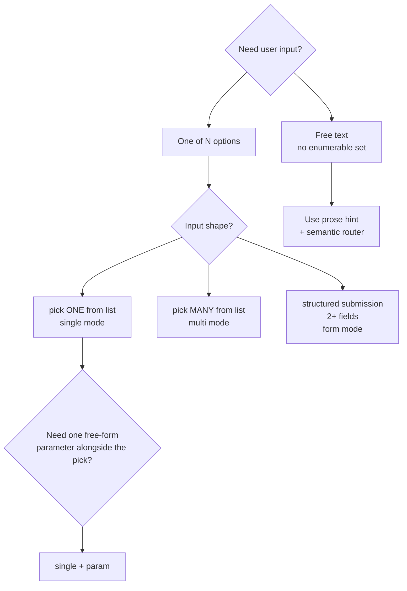

# Choice widget — author cookbook

How to write `choice:` elements: when to reach for each mode, the
patterns that recur across stories, and the gotchas that bite.

Companion documents:

- `kitsoki docs app-schema` §`choice:` — the authoritative field
  reference and TUI keymap tables.
- [`docs/stories/story-style.md`](story-style.md) §3.6 — prescriptive prompt /
  label / hint conventions.
- [`testdata/apps/choice_smoke/`](../../testdata/apps/choice_smoke/) — the
  canonical 23-spoke fixture; every snippet below has a matching
  spoke that runs end-to-end.

This guide is a how-to, not a schema reference. For "what fields does
`form` mode accept?" head to the embedded schema doc.

### Where the widget runs in production (live examples)

Every shipped story uses `choice:` somewhere; these are the best
reading order for new authors:

| Pattern                                | Live in                                             |
|----------------------------------------|-----------------------------------------------------|
| Verdict picker (accept/refine/quit)    | `stories/robbery/app.yaml` (canary)                 |
| Phase navigation (restart_from/jump_to)| `stories/bugfix/rooms/proposing.yaml` (et al.)      |
| Single + optional refine param         | every `*_awaiting_reply` state in cypilot / pr-refinement / implementation |
| Pre-bound enum fan-out                 | `stories/oregon-trail/rooms/intro.yaml`             |
| Form mode (multi-field purchase)       | `stories/oregon-trail/rooms/general_store.yaml`     |
| Form mode (enum + int)                 | `stories/oregon-trail/rooms/river_crossing.yaml`    |
| Dynamic-single-item (templated slot)   | `stories/oregon-trail/rooms/inbox.yaml`             |
| Dynamic-id capture (param + free text) | `stories/code-review/rooms/list_pending.yaml`       |
| Free-text verb coexistence             | `stories/oregon-trail/rooms/general_store.yaml`     |

---

## 1. Picking a mode



Rules of thumb:

- **Use `choice:` whenever the room's `on:` arc set is enumerable and
  stable.** If you can list the available intents in a header comment,
  you can list them in a `choice:`.
- **Use `single`** for verdict picks (accept / refine / quit), action
  pickers (pay / fight / flee), and "pick an entry from this short
  list" patterns. Add `param:` when one item needs a free-form arg
  (a name, a theme, a comment).
- **Use `multi`** when the dispatched slot is naturally a list:
  symptoms, traits, files to keep. The widget submits ONE intent with
  ONE list-valued slot. It is NOT a shorthand for "fire one intent per
  selected item."
- **Use `form`** when the user is composing a structured submission
  with ≥2 fields — purchase proposals, parameter sheets, anything
  where you'd otherwise write a `propose_purchase items=… total_cost=…`
  template synonym.

When NOT to reach for `choice:`:

- Open-ended chat or composition rooms (Agent Room, free-form
  message bodies) — the user is meant to *write* prose, not pick.
- Background-job execution states where the user has no decision to
  make while a job runs.
- Hub rooms where the actions are orthogonal navigation rather than
  a ranked choice (case-by-case — some hubs do convert).

---

## 2. Patterns

Every snippet is runnable as-is against an app that declares the named
intent and its slots. The fixture column links to a spoke in
[`testdata/apps/choice_smoke/`](../../testdata/apps/choice_smoke/) that
exercises the same shape end-to-end.

### 2.1 Confirm / cancel split

A two-item single-mode picker for `accept` / `quit` verdicts. The
intent name is the label.

```yaml
view:
  - prose: "Apply the proposed fix?"
  - choice:
      items:
        - { label: "accept", intent: accept, hint: "apply and continue" }
        - { label: "quit",   intent: quit,   hint: "discard the proposal" }
```

Fixture: `single_no_slots` (`testdata/apps/choice_smoke/app.yaml:357`).

### 2.2 Verdict picker with a disabled row

Show the user *why* an option is unavailable without hiding it. Use
two rows on the same intent with mutually-exclusive `when:` guards.

```yaml
view:
  - choice:
      prompt: "How do you respond?"
      items:
        - label: "pay"
          hint:  "buy them off (${{ world.threat_level * 50 }})"
          intent: pay
          when: "world.party_money >= world.threat_level * 50"
        - label: "✗ pay — not enough money (${{ world.threat_level * 50 }} needed)"
          intent: pay
          when: "world.party_money < world.threat_level * 50"
        - { label: "fight", intent: fight }
        - { label: "flee",  intent: flee }
```

Fixture: `single_per_item_when` (line 394) and its `_blocked`
variant.

### 2.3 Single pick with a free-form parameter

When one item needs a free-form arg — a theme, a name, a comment —
attach a `param:` block. Picking the item with `param:` and an empty
buffer enters param mode; the user types, Enter commits.

```yaml
view:
  - choice:
      items:
        - { label: "use defaults", intent: use_defaults }
        - label: "set a custom theme"
          intent: generate_names
          param:
            slot:        theme
            type:        string
            placeholder: "e.g. norse mythology"
            required:    true
```

Fixtures: `single_param_string` (line 529), `single_param_int`
(line 568), `single_param_enum` (line 605).

**Optional param — the "refine with optional comment" pattern.** Set
`required: false` when the slot is nice-to-have but not required.
Common for `refine` rooms where an LLM judge has already filled in a
reason and the user can either accept it or override with their own:

```yaml
- label:  "refine"
  hint:   "ask for changes (Enter to accept the judge's reason, or type your own)"
  intent: refine
  param:
    slot:        feedback
    type:        string
    placeholder: "(optional — leave blank to use the judge's reason)"
    required:    false
```

Live in `stories/bugfix/rooms/*.yaml` and every `*_awaiting_reply`
state in `stories/cypilot/`, `stories/pr-refinement/`,
`stories/implementation/`.

### 2.4 Multi-pick survey

The user selects ≥0 of a fixed list; the widget submits one intent
with one list-valued slot. `min:` / `max:` enforced by the widget.

```yaml
view:
  - choice:
      mode:   multi
      prompt: "Select symptoms"
      intent: report_symptoms
      slot:   symptoms
      min:    1
      max:    5
      items:
        - { value: fever,   label: "Fever",   hint: ">100.4°F" }
        - { value: cough,   label: "Cough" }
        - { value: fatigue, label: "Fatigue" }
        - { value: rash,    label: "Rash",    when: "world.day > 3" }
```

Fixtures: `multi_basic` (line 647), `multi_min_zero` (line 685),
`multi_no_max` (line 722), `multi_per_item_when` (line 762).

### 2.5 Structured submission form

For composing a ≥2-field submission. Tab cycles fields; Enter
submits one intent with one slot per editable field. Readonly
fields with `expr:` are computed displays.

```yaml
view:
  - choice:
      mode:     form
      prompt:   "Compose your purchase"
      intent:   propose_purchase
      template: "Buy {items} for ${total_cost}, leaving ${remaining}."
      fields:
        items:
          type:        string
          placeholder: "oxen=4, food=1500"
          required:    true
        total_cost:
          type:    int
          min:     1
          max:     "{{ world.money }}"
          default: 0
        remaining:
          type:     int
          expr:     "world.money - world.total_cost"
          readonly: true
```

Fixtures: `form_basic` (line 850), `form_enum` (line 970),
`form_required` (line 1037), `form_readonly_expr` (line 1146).

Keep `template:` short. The static renderer (used by Bitbucket /
Jira transports where viewport width is fixed) prints the template
with `{field}` blanks substituted as authored — it does NOT reflow
or re-wrap when the line exceeds the column. Long templates
horizontally overflow on narrow surfaces. Split into multiple
sentences or use shorter field labels if you're approaching ~80
columns.

### 2.6 Enum field with cycle-on-Space

Inside a form, `type: enum` renders as an inline `[ford ▾]` picker;
Space cycles through `values:`.

```yaml
fields:
  method:
    type:    enum
    values:  [ford, caulk, ferry, wait]
    default: ford
```

Fixture: `form_enum` (line 970).

### 2.7 Per-field guard (hide when unavailable)

A form field hidden by `when:` is not rendered AND not submitted.
Use this when a slot becomes meaningful only after a prior
choice / world bind.

```yaml
fields:
  secret:
    type: string
    when: "world.show_secret_field"
    placeholder: "(only visible when the flag is set)"
```

Fixture: `form_per_field_when` (line 1107), with both `_shown` and
`_hidden` flow variants.

### 2.8 Phase-navigation picker

When a room offers "restart from <earlier phase>" or "jump to <later
phase>", make one row per target phase. The intent is the same on
every row; only the `slots:` literal differs. Use `when:` to hide
phases that aren't reachable from here.

```yaml
view:
  - choice:
      prompt: "Verdict"
      items:
        - { label: "accept",  intent: accept }
        - label:  "refine"
          intent: refine
          param: { slot: feedback, type: string, required: false }
        - { label: "restart from reproducing",  intent: restart_from, slots: { stage: reproducing } }
        - { label: "restart from proposing",    intent: restart_from, slots: { stage: proposing } }
        - { label: "restart from implementing", intent: restart_from, slots: { stage: implementing },
            when: "world.reached_implementing" }
        - { label: "jump to validating", intent: jump_to, slots: { stage: validating },
            when: "world.reached_implementing" }
        - { label: "quit", intent: quit }
```

Why one widget instead of nested submenus: every verdict — accept,
refine, restart, jump, quit — is dispatched the same way (one intent,
one slot literal), so flattening keeps the dispatch path uniform
across humans, the LLM judge, and flow tests.

Live in `stories/bugfix/rooms/*.yaml` (canonical) and several
`stories/cypilot/rooms/*.yaml` rooms.

### 2.9 Pre-bound enum fan-out (one row per literal value)

When an intent declares an enum slot and the user picks from a small
fixed set, render one row per literal. The slot is pre-bound; the
user picks, the intent dispatches with a known-valid value. More
legible than asking the user to remember the enum members.

```yaml
view:
  - choice:
      prompt: "Profession"
      items:
        - { label: "Banker — $1600",   intent: pick_profession, slots: { profession: banker } }
        - { label: "Carpenter — $800", intent: pick_profession, slots: { profession: carpenter } }
        - { label: "Farmer — $400",    intent: pick_profession, slots: { profession: farmer } }
```

Compared to `single + param: { type: enum }`: the fan-out makes every
option visible at once; the enum-param compresses to one row with a
cycle-on-Space picker. Fan-out is right when you want side-by-side
comparison (hints differ per option); the enum-param is right when
the options are interchangeable noise (e.g. "pick a colour").

Live in `stories/oregon-trail/rooms/intro.yaml` (the canonical
multi-pattern test: profession × 3, month × 5).

### 2.10 Coexisting with a free-text verb (one choice per view)

A view may declare exactly one `choice:`. When a room has two
meaningful verbs — e.g. compose a purchase (form-heavy) *and* leave
the store (one bare intent) — pick the dominant one for the widget
and keep the other as a `prose:` hint that names the intent.
Semantic routing still catches the free-typed verb.

```yaml
view:
  - choice:
      mode:     form
      prompt:   "Compose your purchase"
      intent:   propose_purchase
      template: "Buy {items} for ${total_cost}."
      fields:   { ... }
  - prose: "Or say `leave the store` to exit empty-handed."
```

The prose hint should name the verb (`leave the store`, `cancel
crossing`) — the semantic router scores it more reliably than vague
phrasing like "type to exit."

Live in `stories/oregon-trail/rooms/general_store.yaml`,
`stories/oregon-trail/rooms/fort.yaml`,
`stories/oregon-trail/rooms/river_crossing.yaml` (substates).

### 2.11a Multi-phase wizard (split a dump-everything room)

When a room would otherwise put more than ~8 actions on one screen, or
when several decisions are sequential (each depends on the previous),
split the room into a wizard. One state per decision. Use `back` to
return one step, `continue` to advance, and `edit_step` (with an enum
slot for which step) to jump around from a summary screen.

Skeleton:

```yaml
states:
  intro:                        # welcome
    view:
      - prose: "..."
      - choice:
          items:
            - { label: "begin",       intent: begin_setup }
            - { label: "look",        intent: look }
    on:
      begin_setup: [{ target: intro_step1 }]
      look:        [{ target: intro }]

  intro_step1:                  # first decision
    view:
      - choice:
          items:
            - { label: "Option A", intent: pick_x, slots: { x: a } }
            - { label: "Option B", intent: pick_x, slots: { x: b } }
            - { label: "back",     intent: back }
    on:
      pick_x: [{ target: intro_step2, effects: [ { set: { x: "{{ slots.x }}" } } ] }]
      back:   [{ target: intro }]

  # ... intro_step2, intro_step3 ...

  intro_summary:                # final review + start
    view:
      - kv: { Choice X: "{{ world.x }}", ... }
      - choice:
          items:
            - { label: "Start",            intent: start }
            - { label: "Change X",         intent: edit_step, slots: { step: x } }
            - { label: "Change Y",         intent: edit_step, slots: { step: y } }
    on:
      start:     [{ target: next_room }]
      edit_step:
        - when: "slots.step == 'x'"
          target: intro_step1
        - when: "slots.step == 'y'"
          target: intro_step2
```

Live in: `stories/oregon-trail/rooms/intro.yaml` (5-state wizard:
welcome → profession → month → naming → summary).

### 2.11b Multi-phase shop (method picker + dedicated form room)

Variant for rooms that would otherwise drop the user straight into an
8-field form. The first room is a `single`-mode picker that branches
to a focused sub-room per method: browse / set-budget / compose form.
Each branch is itself one focused decision.

```yaml
idle:
  view:
    - choice:
        items:
          - { label: "Browse what's available", intent: browse }
          - label: "Set a budget"
            intent: propose_by_budget
            param: { slot: total, type: int, placeholder: "e.g. 200", required: true }
          - { label: "Compose item-by-item",    intent: open_compose }
          - { label: "Leave",                   intent: leave_store }

compose:
  view:
    - choice:
        mode: form
        intent: propose_kit
        fields:
          oxen: { type: int, default: 0, unit: "head ($40/yoke)" }
          food: { type: int, default: 0, unit: "lbs ($0.20/lb)" }
          # ... no `items` string field, no `total_cost` field —
          # both are computed in the `on:` effect from the slot
          # values × local prices.
```

Live in: `stories/oregon-trail/rooms/general_store.yaml` and
`stories/oregon-trail/rooms/fort.yaml`.

### 2.11c Unit suffixes on numeric form fields

A bare `5` on an int field reads as a dangling number. Annotate each
numeric field with a `unit:` so the value renders as `5 head` /
`1500 lbs` / `20 boxes`. The suffix renders in the muted hint style
both in the live widget and in static (Jira/Bitbucket) output.

```yaml
fields:
  oxen:
    type: int
    default: 0
    unit: "head ($40/yoke)"
  food:
    type: int
    default: 0
    unit: "lbs ($0.20/lb)"
  duration:
    type: int
    default: 0
    unit: "days"
```

The suffix is suppressed when the buffer is empty AND a `placeholder:`
is showing (so you don't get awkward `«0» head` rendering).

Compute fields like `total_cost` server-side in the intent's `on:`
effect rather than asking the user to enter them — the form should
have only fields where the user's intent is non-derivable.

### 2.11 Dynamic single-item via templated pre-bound slot

`choice:` items are a static YAML list, but the slot values inside
each item can be templated. When the "dynamic" list is in practice
"one open job at a time" (an inbox with one pending review, a
ticket-search with the most-recently-picked id), build a single row
whose `slots:` references the world key and guard the row with
`when:`:

```yaml
view:
  - choice:
      items:
        - label: "answer clarification ({{ world.last_job_id }})"
          intent: answer_clarification
          slots:  { job_id: "{{ world.last_job_id }}" }
          param:  { slot: answer, type: string, required: true }
          when:   "world.last_job_id != ''"
        - { label: "back", intent: go_main }
```

For N-of-many dynamic picks, the v1 workaround is `single + param:`
to capture the id at pick time. See §2.3's fixture
`single_param_string` — the user types the id, the intent dispatches
with that as the slot. Use this for `pick_ticket id=<>` /
`pick_review pr_id=<>` patterns.

Live in `stories/oregon-trail/rooms/inbox.yaml`,
`stories/dev-story/rooms/inbox.yaml`,
`stories/dev-story/rooms/ticket_search.yaml`,
`stories/code-review/rooms/list_pending.yaml`.

---

## 3. Gotchas

### 3.1 No `choice` inside `blocks:` (`extends:` views)

The typed view metadata is lost through the inheritance pipeline —
the loader rejects the combination. Workaround: put the `extends:`
at the wrapping view and the `choice:` as a sibling element in the
same `view:`, not inside a block.

```yaml
# WRONG — loader rejects.
view:
  extends: "base"
  blocks:
    choices:
      - choice: { ... }    # ✗ choice cannot live inside a block

# RIGHT — choice is a sibling.
view:
  - choice: { ... }
  # (extends/elements coexistence is not implemented yet — put the
  # extends: on the wrapping view and the choice: as a sibling element.)
```

### 3.2 Readonly form fields ARE submitted when the intent declares them

A readonly form field's value is computed via `expr:` at widget-open
time. If the intent declares a matching slot, the computed value
flows into the dispatch. If the intent does NOT declare the slot,
the field is presentation-only. Read the flow fixture for
`form_readonly_expr` (line 1146) to see the expected shape — it
declares `total` as a required slot so the readonly value
participates in the dispatch.

### 3.3 `form.<other_field>` is NOT live in `expr:` today

The readonly field's `expr:` is evaluated at widget open with
`world.*` and `slots.*` only; sibling form-buffer changes do NOT
re-trigger the eval. **This means the readonly value freezes at
widget open** — typing in another form field will NOT update a
readonly display.

GOTCHA — this looks plausible but does NOT live-update:

```yaml
# WRONG — author expects `remaining` to track `total_cost` as the
# user types. It doesn't. `form.total_cost` isn't plumbed; even if
# it were, `expr:` only fires at open.
fields:
  total_cost: { type: int, default: 0 }
  remaining:
    type:     int
    expr:     "world.money - form.total_cost"   # ✗ never re-evals
    readonly: true
```

The §2.5 example happens to work because `world.total_cost` is
already in world state (bound by an earlier room / effect) — the
`expr:` reads world, not the live form buffer, and the snapshot
taken at open is what the user sees for the whole session of that
widget.

Workarounds today:

- **Precompute into a world key.** Bind the derived value via an
  effect before the widget opens (`on_enter:` on the room, or the
  effect chain of whatever transition led here), then reference
  `world.remaining` in the `expr:`.
- **Drop the readonly field.** If it's purely cosmetic, surface
  the budget in a sibling `prose:` element and let the user do
  the subtraction.
- **Re-open the widget.** Submitting and re-entering the room
  re-evaluates `expr:` against fresh world state — fine for
  multi-step composers, not for one-shot forms.

The proposal's example referenced `form.total_cost`; that key is
not yet plumbed. Track in the proposal §8 if you need live cross-
field eval.

### 3.4 `when:` on items is renderer-side, not behavioural

A guard-false item is hidden from the widget, but the underlying
`on:` arc still fires if someone dispatches the intent another way
(flow fixture, right-pane menu pick, `kitsoki turn --intent ...`).
For true behavioural gating, also guard the transition's `when:`:

```yaml
view:
  - choice:
      items:
        - label: "drink"
          intent: drink
          when:  "world.canteen > 0"   # hide row

on:
  drink:
    - target: drinking
      when: "world.canteen > 0"        # ALSO block the arc
    - default: true
      effects: [ { say: "Canteen is empty." } ]
```

### 3.5 Type matching: `bool` world keys from templated slot values

A world key with `type: bool` set from `"{{ slots.x }}"` will fail
because template substitution always produces strings. Either declare
the world key as `type: string`, or use an effect that coerces:

```yaml
# WRONG — fails when slots.flag is the string "true"
world:
  active: { type: bool, default: false }
effects:
  - set: { active: "{{ slots.flag }}" }

# RIGHT — coerce via expr-lang
effects:
  - set: { active: "{{ slots.flag == 'true' }}" }
```

The `form_bool` spoke (`testdata/apps/choice_smoke/app.yaml:901`)
sidesteps this by storing the captured value as a string.

### 3.6 Multi-mode `items[].value` must be a literal

Templated values are rejected at load time — materialising a list
of templated strings would defeat downstream type checks. If you
need a world-derived option list, precompute it into world and
declare the literal items separately.

### 3.7 One `choice` per view

The loader enforces exactly one `choice:` element per view. To
offer two distinct picks, use two states — or keep one as a prose
hint that the semantic router can resolve (cookbook §2.10).

### 3.8 `param:` in conversational rooms causes duplicate text inputs

**The trap.** A `choice:` item with `param:` renders as a visible text-input
form in the web UI. Separately, any global intent that declares a `string`
slot (`required: true` **or** `required: false`) is also exposed as a
"text-slot" intent, which the web UI renders as a free-text textarea below
the choice buttons. When these overlap in a `mode: conversational` room the
author gets two text inputs for the same intent — one from the param form,
one from the textarea — which is confusing and looks like a bug.

This bit the design pipeline twice:

- `change_existing` (intent with `target: string, required: true`) + "amend
  existing…" choice item with `param: { slot: target }` → two "Amend
  Existing" inputs in `design_search`.
- Adding `intent: discuss, param: { slot: message }` to `design_refine`
  (a conversational room) + the existing `discuss` textarea → two message
  inputs.

**Rules.**

1. **Never use `param:` in a conversational room.** The `discuss` textarea
   already captures free text. For a "re-run with no feedback" button, use
   a plain button that fires the intent with a pre-filled empty slot instead:

   ```yaml
   # RIGHT — plain button; discuss textarea still handles typed feedback.
   - label:  "refine"
     intent: discuss
     slots:  { message: "" }

   # WRONG — adds a second text input alongside the discuss textarea.
   - label:  "refine"
     intent: discuss
     param:  { slot: message, type: string, required: false }
   ```

2. **`param:` is safe in non-conversational rooms**, provided no global
   intent with the same name also declares a matching string slot. The web
   engine now suppresses the text-slot textarea for any intent already
   covered by a plain button in the choice list (`InputBar.vue`
   `coveredByChoiceItem`), but the design intent — not the suppression — is
   what matters. If you rely on the suppression your story will be brittle.

3. **`required: false` on a string slot still creates a textarea.** The
   `required` flag tells the semantic router whether to force LLM slot
   extraction; it does not suppress the web input. If you don't want a
   textarea, don't declare the string slot at all, or ensure the intent is
   covered by a choice button.

### 3.9 Form-mode `default:` discipline

`default:` on a numeric field renders the buffer non-empty at
widget-open. That's right for fields where the operator's job is to
*adjust* an authored recommendation (`confidence: 80` for a river
crossing) and wrong for fields where empty means "I didn't pick
this" (per-item counts in a propose-purchase form, where blank ≠ 0
in the user's head).

- Use `default:` when there is a sensible starting value (a
  recommendation, the last-used value, world-derived).
- Omit `default:` when 0 / "" should look distinct from "the user
  typed 0 / ""."

`required: true` forces an explicit user touch even with a default.
Combine both to mean "we suggest X, but you must confirm or change
it."

Live: `stories/oregon-trail/rooms/river_crossing.yaml` (depth-aware
defaults: `ford/80`, `caulk/70`, `ferry/90`) vs.
`stories/oregon-trail/rooms/general_store.yaml` (per-item counts
left blank).

---

## 4. Where to go next

- **Schema details** — `kitsoki docs app-schema` §`choice:`.
- **Runnable examples** — `./kitsoki run testdata/apps/choice_smoke/app.yaml`
  drops you on the walkthrough, or pick a specific spoke from the
  feature menu.
- **Style guidance** — [`docs/stories/story-style.md`](story-style.md) §3.6.
- **Schema reference** — [`docs/embedded/app-schema.md`](../embedded/app-schema.md).
