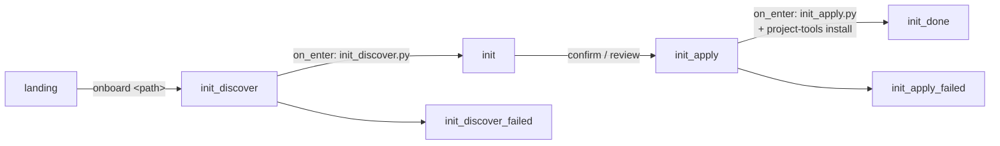

# dev-story onboarding — the `init` pipeline

The [dev-story](../../stories/dev-story/README.md) hub ships a small,
deterministic **project onboarding** pipeline that takes a target checkout from
nothing to a fully working kitsoki environment. This is the dev-story-specific
mechanics; for the user-facing "how do I onboard my repo" walkthrough and the
standalone `kitsoki project-tools install` command, read
[project-onboarding.md](../project-onboarding.md) first.

The pipeline is **boring and auditable on purpose**: discovery and apply are
plain Python scripts that emit JSON, the operator reviews the profile before any
write, and the whole walk is gated by a no-LLM flow fixture.

---

## The rooms



Defined in [`stories/dev-story/rooms/init.yaml`](../../stories/dev-story/rooms/init.yaml).

| Room | Does |
|---|---|
| `init_discover` | `on_enter` runs [`scripts/init_discover.py`](../../stories/dev-story/scripts/init_discover.py) against the target and binds the discovered profile (`init_project_id`, `init_stack`, dev/test/build commands, …). Reads nothing it shouldn't — discovery is **read-only**. |
| `init` | Operator **reviews** the discovered profile. `confirm_init` applies; `revise_init` records feedback; `quit` returns to the workbench. No writes happen until confirm. |
| `init_apply` | `on_enter` runs two best-effort host steps (below) and surfaces the written paths + MCP registration. |
| `init_done` | Read-out of the applied result; `go_main` returns to the workbench. |
| `init_discover_failed` / `init_apply_failed` | Error read-outs with retry arcs. |

## Entering onboarding

Two arcs from [`landing`](../../stories/dev-story/rooms/landing.yaml) reach
`init_discover`:

- **`go_init`** — the explicit "onboard" quick action; discovers `world.workdir`.
- **`work`** with an onboarding utterance — `landing`'s default intent captures
  free text, and a narrow guard routes leading verbs
  (`onboard …` / `project onboarding …` / `init project …`) into onboarding,
  carrying the request as `init_request`. `init_discover.py` parses the target
  path out of the request (`onboard ~/code/foo` → `/abs/.../foo`), falling back
  to `repo_root` / `workdir` / cwd.

## The apply step — two host calls

`init_apply.on_enter` runs two `host.run` invocations, in order:

1. **`init_apply.py`** ([source](../../stories/dev-story/scripts/init_apply.py))
   — writes the checked-in onboarding files: `.kitsoki.yaml`,
   `.kitsoki/project-profile.yaml`, `.kitsoki/stories/<id>-dev/app.yaml` (+
   README), and appends the kitsoki runtime block to `.gitignore`. Binds
   `init_apply_result` (the JSON report); a failure routes to
   `init_apply_failed`.

2. **`kitsoki project-tools install --target <path>`** — installs the agent
   toolkit (skills + subagents) and registers the studio MCP, producing the
   `.agents/` sources, the `.claude/` symlinks, and `.mcp.json`. This is
   **best-effort**: it has no `on_error` bounce, so a tools hiccup never fails
   the file apply — the result (`init_tools_ok` / `init_tools_result`) is
   surfaced read-only in the room view. The command is backed by
   `internal/baseskills` (embedded toolkit; see
   [project-onboarding.md](../project-onboarding.md)).

The generated `.kitsoki/stories/<id>-dev/app.yaml` imports
`@kitsoki/dev-story` from the binary's embedded story library and rebinds the
providers to local implementations (`host.local_files.ticket`, `host.git`,
`host.local`, `host.git_worktree`, `host.append_to_file`), so it runs
standalone with only the `kitsoki` binary present.

## The external-target profile

The instance `app.yaml` carries an **external-target profile**: a block of world
keys (`publish_durable_path`, `prd_doc_filename`, `design_*`, `ticket_repo`, …)
whose defaults reproduce kitsoki's own behaviour, and which an instance overrides
to retarget doc placement, fixed filenames, or a GitHub-issue tracker. That
profile is documented authoritatively in the dev-story README's
[Doc profile section](../../stories/dev-story/README.md#doc-profile--targeting-an-external-project)
— onboarding seeds the defaults; tuning it is a per-instance edit.

## Testing — no LLM

The whole walk is covered by
[`flows/init_slidey_dogfood.yaml`](../../stories/dev-story/flows/init_slidey_dogfood.yaml),
which stubs the discovery, apply, and toolkit-install `host.run` calls (by their
`id`: `discover`, `apply`, `install_tools`) and asserts the routing,
`init_apply_result.status == "applied"`, and `init_tools_ok` with a populated
`init_tools_result` — all with no real LLM and without touching a real checkout:

```sh
kitsoki test flows stories/dev-story/app.yaml
```

## See also

- [project-onboarding.md](../project-onboarding.md) — the user-facing guide +
  the standalone `kitsoki project-tools install` command.
- [../../stories/dev-story/README.md](../../stories/dev-story/README.md) — the
  dev-story hub the onboarded instance imports.
- [imports.md](imports.md) — how the generated instance imports
  `@kitsoki/dev-story`.
