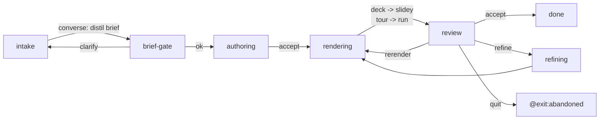

# mockup-video story

**Entry:** `intake` · **Exits:** `done` (requires `video_handle`), `abandoned`

The mockup-video story produces a UI **mockup walkthrough video** from a
scenario brief and loops it through a flag-driven refine checkpoint until the
operator accepts. A discovery conversation distils the brief, an agent authors
the source (static HTML mockups + a tour manifest, or a slidey deck), the
shipped producers render a walkthrough MP4 carrying the
[chapter sidecar](../architecture/hosts.md#hostvideoframe), the operator reviews
it inline, and a refine pass edits the *exact* source that produced each
flagged moment.

It is the produce → review → refine cousin of [`ui-fix`](ui-fix.md) and the
refine-arc cousin of `bugfix`, for video instead of code. It is slice 3 of the
**Mockup Video Studio** epic; it consumes the slice-1 chapter sidecar and the
shipped media producers, and softly depends on the slice-2 web
`/review` panel (without it, inline `refine feedback="…"` still drives the
loop).

## Design: interpretive / deterministic split

Every step is either interpretive (LLM judgment, isolated and recorded) or
deterministic (pure computation, replayable) — the moat spine
(*kitsoki-moat-is-architecture*).

| Step | Kind | Host |
|---|---|---|
| Distil the scenario brief | interpretive (conversation) | `host.agent.converse` + `host.chat.resolve` |
| Brief-concrete gate | interpretive (agent) | `host.agent.decide` |
| Author the source | interpretive (agent, write-jailed) | `host.agent.task` |
| Render the walkthrough | **deterministic** | `host.slidey.render` (deck) / `host.run` → `record_tour.sh` (tour) + `host.artifacts_dir` |
| Drain web feedback notes | deterministic | `host.run` → `drain_feedback.sh` |
| Refine flagged source | interpretive (agent, write-jailed) | `host.agent.task` |

The interpretive *scoping* (brief distillation + the concreteness gate) and the
interpretive *execution* (authoring + refine) are each recorded host calls; the
fixer never grades its own homework. Rendering produces the same bytes from the
same source and is displayed from the record (*narration-belongs-in-trace*).

**The flag → refine link is explicit and recorded.** A feedback note carries a
`source_ref` (`{kind: slidey|tour, spec_path, scene_id|step_id}`), so "edit
scene 3" is a traceable edge from a video moment to a source change — the
refine step dispatches on `source_ref.kind` (epic shared decision 1).

## Room graph



## Two media paths, one chapter shape

`medium: tour | deck` (default `tour`, matching the "static HTML pages walked
through user scenarios" house style; `deck` is the dependency-lighter slidey
opt-in).

- **deck** → `host.slidey.render {spec_path, format: mp4}`.
- **tour** → `host.run scripts/record_tour.sh`, which wraps the existing
  `kitsoki-ui-demo` Playwright recorder (epic shared decision 4: no first-class
  `host.tour.render` producer in v1).

Both emit `<out>.mp4` **and** `<out>.chapters.json` — the producer-agnostic
chapter sidecar (slice 1) — so the refine step targets the producing unit
regardless of medium.

## Refine is fed two ways

`review.on_enter` drains `feedback.jsonl` from the workspace — the structured
notes the slice-2 `/review` web panel appends (transport when no live session:
file append, *the* always-works path). With no panel the batch is empty and the
operator drives the loop with inline `refine feedback="…"`. Either way the
notes reach `refining` as **binding directives**, framed with a per-note
compliance checklist so the agent cannot silently drop a directive
(*refine-honours-operator-guidance*).

`refining` batches a refine pass (one re-render per pass, cheaper than per-flag
re-renders — epic open question 3), records the iteration, then routes back to
`rendering`. The loop is capped by `refine_budget` (default 6).

## Write-jail

The author and refine `host.agent.task` calls are scoped to the per-session
`workspace` under `.artifacts/mockup-video/` (transient, never committed). The
prompt is the v1 write-jail (*task-agents-must-not-implement*): the agent
authors **mockups** — static HTML / a slidey deck — never shippable product
code, and only under the workspace. The durable engine allowlist is the
`agent-capability-model` work.

## Authoring & flows

See [`stories/mockup-video/README.md`](../../stories/mockup-video/README.md) for
the world contract, host requirements, and the 8 Mode-2 flow fixtures (all no
-LLM, agent calls stubbed by per-invoke id). Run them with:

```
kitsoki test flows stories/mockup-video/app.yaml
```

## See also

- [`stories/mockup-video/`](../../stories/mockup-video/) — the story.
- [`kitsoki-ui-demo`](../../.agents/skills/kitsoki-ui-demo/SKILL.md) — the tour recorder this story drives.
- `slidey` — the external deck renderer used by the visual-output pipeline.
- [`ui-fix`](ui-fix.md), `bugfix` — the produce/review/refine cousins.
- `docs/proposals/mockup-video-studio.md` — the epic (slices 1–3).
