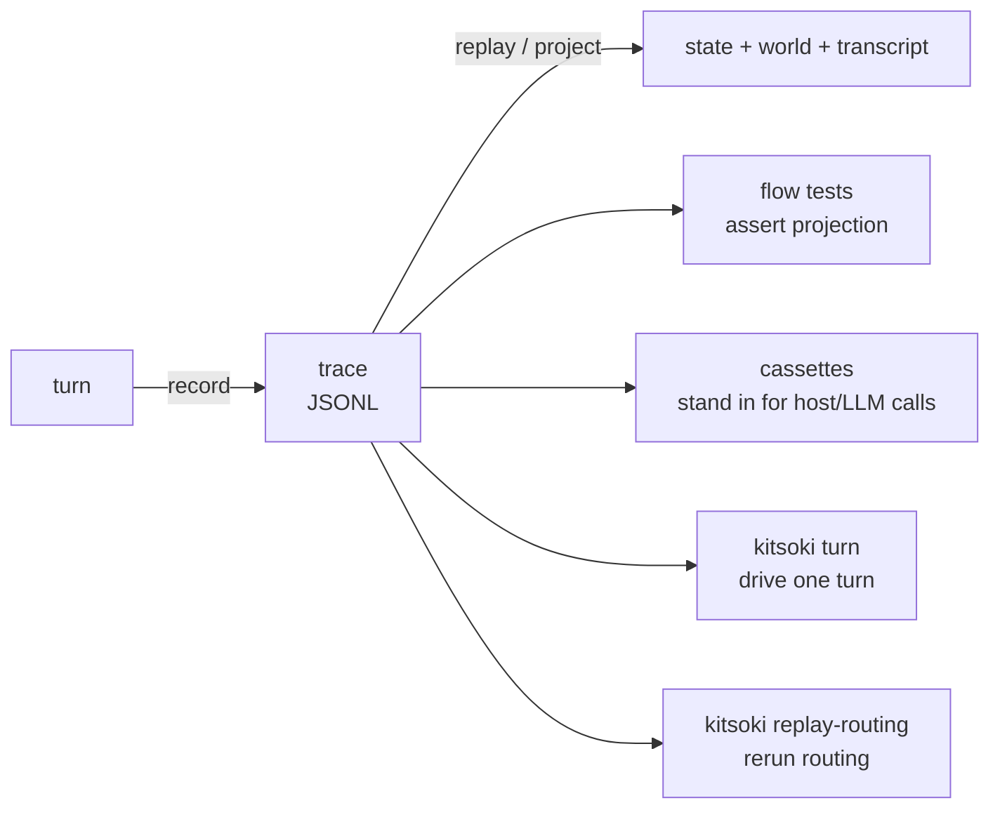

# Tracing & replay

**The session trace is the authoritative state.** Everything kitsoki
shows you — the current room, the world, the transcript, the routing
decision that got you here — is a projection of an append-only event
log. Nothing is "lost" between turns; it is replayed. That single fact
is what makes kitsoki testable, debuggable, and auditable, and it is
what this section is about.

*Audience: anyone testing, debugging, or developing a story — authors
and contributors alike.*

---

## How the pieces fit



- **[`trace-format.md`](trace-format.md)** — the JSONL schema: the
  event vocabulary (`agent.call.start` / `.complete` / `.error`,
  patches, checkpoints), the `EventSink` contract, how `call_id` is
  derived, and the replay determinism guarantees. Read this to
  understand what "the trace is the state" actually means.

## Inspecting a session after the fact

Every `kitsoki run` / session writes its trace to
`~/.kitsoki/sessions/<app>/<id>.jsonl` automatically. `kitsoki trace`
reads one back — and resolves the file for you, so you rarely type a
path:

| You run | It shows |
|---|---|
| `kitsoki trace` | the raw event stream of the **newest** session |
| `kitsoki trace --app kitsoki-dev` | …restricted to that app |
| `kitsoki trace <id-substring>` | the newest session whose filename matches |
| `kitsoki trace <path>` / `-` | that exact file / stdin |

Two views:

- **Default** — one colour-coded line per `store.Event`.
- **`--turns`** — a compact per-**turn** digest: the operator input,
  which routing tier resolved it and **why** (`routed_by` /
  `match_type`), the host calls fired, the **prompt each agent verb
  dispatched** (the source of truth for what the model actually saw),
  editor context (`ide.context_captured`), `on_error` redirects,
  errors, and the outcome. `--turn <n>` focuses one turn and prints its
  prompt **in full**.

The digest is the fastest way to answer *"what actually happened to my
turn?"* — especially the class of bug where a turn **runs cleanly but
does the wrong thing** (context never reached the prompt, free text
mis-routed). For diagnosing those, see the
[`kitsoki-debugging` skill](../../.agents/skills/kitsoki-debugging/SKILL.md).

```sh
kitsoki trace --turns --app kitsoki-dev     # the per-turn story of the latest run
kitsoki trace --turn 3 --app kitsoki-dev    # turn 3, full dispatched prompt
```

## Testing a story

- **[`testing.md`](testing.md)** — the two test modes:
  - **Mode 1 (intent pass-rate)** exercises LLM routing — does the
    model resolve phrasings to the right intent? Costs tokens; run
    selectively.
  - **Mode 2 (deterministic flow)** drives the state machine with
    explicit `intent:` turns and asserts on the resulting state, world,
    view, and inbox. No tokens, fast, the workhorse for locking
    behaviour. This is the test you write for almost every bug.
- **[`cassettes.md`](cassettes.md)** — host cassettes: VCR-style
  recorded host/agent call sequences with episode matching,
  `!include`, record mode, and CI safety. Use them when a flow test
  needs a multi-call host/LLM sequence to be deterministic.

> **Multi-system bugs don't show up in unit tests.** Bugs that involve
> concurrent I/O, slog + TUI rendering, or file writes racing API calls
> hide in isolated function tests. Capture the *combined* output that
> reaches the user, introduce the real concurrency, and confirm the
> test FAILS without the fix. See the project's testing rule in
> `CLAUDE.md` and the `rendering-tests` skill.

## Driving and debugging a session

- **[`turn.md`](turn.md)** — the `kitsoki turn` probe: drive a single
  turn either against a persistent trace (stateful) or as a stateless
  one-shot. The scriptable way to reproduce a turn outside the TUI.
- **`kitsoki replay-routing`** — re-run the routing stack over recorded
  turns to see which tier resolved each intent and where synonyms are
  missing. Documented with the routing stack in
  [`../architecture/semantic-routing.md`](../architecture/semantic-routing.md).
- **The `kitsoki-debugging` skill** — for "went back to idle", "silent
  bounce", "stuck at <state>" complaints. It drives the same state
  machine the TUI uses against the real on-disk repo state and surfaces
  the host-call errors that the TUI's `on_error:` arcs swallow. Invoke
  it before guessing.

## Inspecting a run in a browser

- **[`run-status-ui.md`](run-status-ui.md)** — the run-status web UI: an
  interactive state diagram, a filterable trace timeline, and a detail drawer,
  bundled into the `kitsoki` binary. Export a self-contained `.html` artifact
  with `kitsoki export-status … -o run.html`, or serve a live, updating view
  with `kitsoki status serve … --trace run.jsonl`. Built from the trace, so it
  shows exactly what the trace records.

## See also

- **[`../tui/rendering-tests.md`](../tui/rendering-tests.md)** —
  regression tests for the TUI's *rendered output* (layout, overlaps),
  a sibling discipline to flow tests.
- **[`../stories/background-jobs/testing.md`](../stories/background-jobs/testing.md)**
  — testing async handlers with flow fixtures and a virtual clock.
