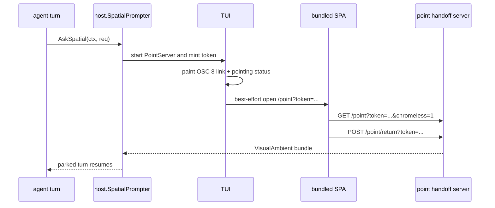

# Spatial handoff — point at the screen from the terminal

The terminal can't render pixels, so a TUI operator can't click a frame the way
the [web capture surface](spatial-capture.md) allows. Instead the TUI does what
it already does when the terminal is the wrong surface for something: it
**hands off to the browser**. When a dispatched oracle wants the operator to
point at something, the TUI prints a clickable
[OSC 8 link](README.md#opening-markdown-artifacts-osc-8-links--open) to a
transient, single-purpose `/point` window — the slice-2 picker + chat stripped
of all chrome — and **blocks the turn** on the operator-ask bridge until the
window posts the bundle back. The window auto-closes; the turn resumes with the
[visual ambient](../architecture/visual-ambient.md) in hand.

The recorded trace shape is in
[`docs/tracing/trace-format.md`](../tracing/trace-format.md#inputvisual--the-spatial-attachment).

## Mental model

The terminal says **"point at it ↗"** as a clickable link. Clicking opens a
tiny, all-signal window — one frame, a crosshair, an element chip, one input.
You click, you send, it closes, and the TUI turn you were on continues with the
oracle's answer. It is the
[operator-ask](../architecture/operator-ask.md) "answer this question" flow,
where the question is *"show me what you mean."* No pixels in the terminal, no
second capture implementation, no persistent second web app.

## Layout

```
Terminal (turn blocked, waiting on the bridge):
  ⟳ The assistant needs you to point at something.
    ↗ Open the pointing window      ← OSC 8 link (one-time token)
  pointing… ↗ open in browser       ← live blocking status

/point?token=…&chromeless=1  (browser, transient):
┌─────────────────────────────────────────────┐
│  [ frame @ 0:14 ]                  ✛          │
│                          ▢ intent-btn-run     │
│  > why is this disabled here?                 │
│  [ Send ]                                     │
└─────────────────────────────────────────────┘
        (on Send: bundle → bridge → window closes)
```

## How it threads



The authoritative sources are
[`internal/tui/spatial_prompter.go`](../../internal/tui/spatial_prompter.go)
(terminal side) and
[`internal/runstatus/server/point_handoff.go`](../../internal/runstatus/server/point_handoff.go)
(serving side).

## The terminal side — block, don't render

`TUISpatialPrompter` implements `host.SpatialPrompter` and mirrors
[`TUIOperatorPrompter`](../architecture/operator-ask.md#the-three-surfaces)
exactly: construct it before `tea.NewProgram`, `Attach(prog)` once the program
exists, `Detach()` on teardown. `AskSpatial` is consulted from the turn
goroutine and **blocks** — the same posture as a forwarded operator question.

The link is appended to scrollback as a **raw block** (not through the
markdown/SlashOutput pipeline) so the OSC 8 escape bytes survive verbatim; a
terminal without OSC 8 support prints the label as plain text. `AskSpatial`
waits until the link is painted (`spatialPointMsg.doneCh`) before opening the
browser, so the operator always has the clickable link in their scrollback even
if `window.close()` never fires.

When no surface is reachable — no bound program, no loopback listener, or no
browser (headless / CI) — `AskSpatial` returns `errSpatialUnavailable` and the
caller **degrades to "proceed text-only."** The turn must never hard-block
forever; abandonment is the same timeout the operator-question modal uses.

## The serving side — one transient route, one token

`PointServer` (built on demand by the TUI, since `kitsoki run` has no
`kitsoki web` server in-process) exposes two routes against a one-time-token
registry that mirrors the existing `questionRegistry`, with a TTL + consumed
guard layered on:

| Route | Behavior |
|---|---|
| `GET /point?token=…&chromeless=1` | Serves the **bundled SPA** in chrome-less mode. The token is validated but **not** consumed (a reload mid-point must not 404). An unknown / consumed / expired token returns **404** (not 403), so a forged token leaks nothing about whether it ever existed. |
| `POST /point/return?token=…` | Validates **and consumes** the token (a second return 404s), then delivers the submitted `host.VisualAmbient` bundle to the parked turn's channel. The body is the same `{visual:{…}}` shape `session.offpath` accepts, so the SPA reuses its existing `visualParams` serializer. |

The token is minted per request keyed to `{session, frame, t_ms}`, is 128-bit
`crypto/rand` (the route is an execution surface, so an unguessable token is the
mint-side guard matching the consumed-token 404), and expires after
`pointTokenTTL` (5 min) — the inner "the link went stale" bound inside the
parked turn's own ctx timeout. The server is torn down with `Shutdown` (not
`Close`) so the in-flight return response drains before the listener closes.

## The web side — chrome-less, single-purpose

The SPA root reads the `?chromeless=1` query flag
([`lib/chromeless.ts`](../../tools/runstatus/src/lib/chromeless.ts)) and renders
**only** `PointPage.vue` — the slice-2
[`SpatialPicker`](spatial-capture.md#components) + chat composer — skipping every
global [web UI](web-ui.md) shell surface (nav, trace timeline, editor, meta,
tour, inbox, the SSE feeds) including the [`/review`](video-review.md) player the
web capture surface lives in. The flag is **inert** for the normal SPA: every other route ignores it,
so the handoff needs no separate bundle. On Send, `PointPage` POSTs the bundle
to `/point/return?token=…` and then calls `window.close()`.

`window.close()` is best-effort — browsers block programmatic close of tabs they
didn't script-open — so the fallback is a "✓ sent — you can close this tab"
state. The bundle returns regardless.

## Tests

No real LLM, no real browser launch (the opener + listener are injected seams):

- **Go `CapturedIO`** ([`internal/tui/spatial_prompter_test.go`](../../internal/tui/spatial_prompter_test.go)) —
  when a spatial ambient is requested the terminal output carries the OSC 8
  hyperlink with the token and the blocking status, and the turn does not
  advance until the bridge returns. Verified to fail without the change.
- **Server unit** ([`internal/runstatus/server/point_handoff_test.go`](../../internal/runstatus/server/point_handoff_test.go)) —
  a fresh token serves the chrome-less SPA; a **consumed** or **expired** token
  404s; the return endpoint validates the token and hands a well-formed bundle
  to the registry.
- **Playwright** ([`tests/playwright/spatial-handoff.spec.ts`](../../tools/runstatus/tests/playwright/spatial-handoff.spec.ts)) —
  open `/point?token=…`, confirm only the picker + chat render (no nav/timeline),
  click a known element, Send; assert the return endpoint received the `visual`
  bundle and the page requested close. Oracle stubbed.

## What it costs, honestly

- **Requires a reachable browser.** Same assumption as `/open` and `kitsoki
  web`; a headless/CI TUI degrades to "spatial input unavailable, proceed
  text-only."
- **`window.close()` is best-effort** — the "you can close this tab" fallback
  covers the blocked case.
- **Round-trip latency.** Clicking out to a browser and back is slower than a
  native pane — but the terminal *cannot* render the frame at all, so the floor
  is "impossible," not "slower." This is the
  [external-review trade](README.md#opening-markdown-artifacts-osc-8-links--open)
  applied to pixels.
- **A new (narrow) execution surface.** `/point` + the token guard is a new
  route; it serves the existing SPA flag-gated and accepts one bundle per token.
  The token-expiry + consumed-token 404 unit test is non-negotiable.

## Non-goals

- **Rendering pixels in the terminal** — no ANSI/sixel image hacks, no in-TUI
  video. The terminal stays text + a link.
- **A persistent second web app** — `/point` is transient and single-purpose,
  not a standalone viewer.
- **The capture mechanics** — reused wholesale from
  [`spatial-capture.md`](spatial-capture.md); this adds only the chrome-less
  mode, the ephemeral lifecycle, and the terminal link.
- **Arbitrary / external media** — kitsoki-rendered frames only.
