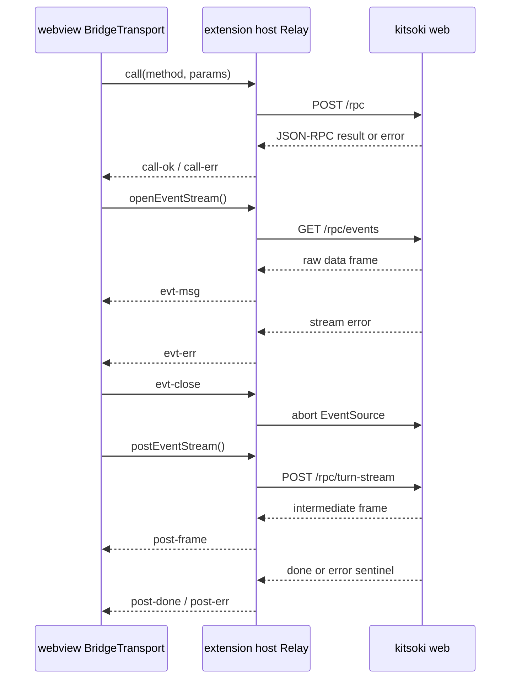

# The VS Code extension

The `tools/vscode-kitsoki/` extension puts kitsoki's **web UI inside the editor**:
the **chat front and center** in an editor-area panel, with the live **trace + state
diagram as a maximizable hint rail** beside it, themed to match VS Code, bound to
the workspace's `stories/` and
`.kitsoki/`. It is a **third head** on the orchestrator body — the same Vue SPA
the [browser web UI](web-ui.md) serves, relayed into a webview instead of a
browser tab, driving the same `kitsoki web` backend over the same JSON-RPC/SSE
protocol. The orchestrator, its method set (`internal/runstatus/server/server.go`),
and the SSE contract are **unchanged**: every interpretive decision still lands
in the trace byte-for-byte, because it is the same process the browser talks to.

> This is **not** the inverse [`/ide`](README.md#editor-awareness-ide) work
> ([`hosts.md`](../architecture/hosts.md#hostide--editor-awareness)), where the
> terminal kitsoki dials *out* to a running editor to rent its capabilities. Here
> the editor *hosts* kitsoki's own UI. The two are complementary and share no code.

*Audience: operators running kitsoki from inside VS Code, and contributors on the
embed/relay/demo plumbing. The shared SPA, JSON-RPC method set, and trace
rendering are documented once in [`web-ui.md`](web-ui.md) — this page covers only
what is unique to the editor embed.*

## Layout

The SPA's own multi-pane layout (chat **and** trace fighting for width) is wrong
inside VS Code's narrow chrome. So the embed runs the SPA in a dedicated **editor
panel** and the SPA detects the webview host (`acquireVsCodeApi` present →
`isEmbedded()`, `tools/runstatus/src/lib/embed.ts`) and renders the interactive
view **chat-only** — trace and graph are their own dockable windows (see
[Surface decomposition](#surface-decomposition--chat-trace-and-graph-as-independent-windows)),
so the chat panel never repeats them.

```
VS Code window
┌──────────┬──────────────────────────────────────────────────────┐
│ Activity │  editor area: Kitsoki CHAT panel (front/center)       │
│   bar    │ ┌──────────────────────────────────────────────────┐ │
│ [K] chat │ │  CHAT  — story library → transcript · room view   │ │
│ [K] surf │ │  > type a message…                                │ │
│          │ └──────────────────────────────────────────────────┘ │
│ Trace ▏  │   Trace + Graph open as their OWN docked surfaces      │
│ Graph ▏  │   ("Kitsoki Surfaces" container) — never in the chat.  │
└──────────┴──────────────────────────────────────────────────────┘
```

- **Editor panel** — a `WebviewPanel` (`ChatPanel`, `src/webview.ts`) in the
  editor area, registered with a `WebviewPanelSerializer` so it revives after
  reload / restart / window-move (its persisted state is just a marker; the live
  session is re-discovered on boot, see [Surface decomposition](#surface-decomposition--chat-trace-and-graph-as-independent-windows)).
  It mounts the **full SPA** (no surface marker) but the embed interactive layout is
  **chat-only**: the conversation fills the panel — no trace/graph hint rail.
- **Standalone trace / graph surfaces** — the `TraceTimeline` / `StateDiagram` each
  dock as their **own webview** in the **Kitsoki Surfaces** activity-bar container
  (`kitsoki.trace`, `kitsoki.graph` `WebviewView`s). See
  [Surface decomposition](#surface-decomposition--chat-trace-and-graph-as-independent-windows).
- **Activity-bar launcher** — the `kitsoki` `viewsContainer` hosts a thin
  `kitsoki.launch` tree view whose `viewsWelcome` is an **Open Kitsoki Chat** button
  → `command:kitsoki.openChat`. Revealing the view (clicking the Kitsoki icon) also
  auto-opens the editor panel. (The launcher is the *only* view in this container,
  so its `onDidChangeVisibility` auto-open fires reliably — the trace/graph views
  live in a separate container precisely to keep that signal clean.)
- **Code + kitsoki in one workspace** — open your story's `app.yaml` (or any code)
  in a split beside the Kitsoki panel; both are themed to the editor.

`mountSpa(webview, …, surface?)` (`src/webview.ts`) is the one shared path that
wires a webview's relay, brings up the backend, and renders the bundle. The chat
panel calls it with **no** `surface` (full SPA); the trace/graph providers pass
`'trace'`/`'graph'`. Commands `Kitsoki: Open Chat`, `Open Trace`, `Open Graph`, and
`Restart Backend` are contributed in the `Kitsoki` category (`src/extension.ts`).

## Surface decomposition — chat, trace, and graph as independent windows

The chat panel is the primary surface, but the three UI elements — **chat**,
**trace**, **state graph** — can each exist in their **own** VS Code window
independently, all sharing the **one** backend session. This is "N windows, one
session," and it costs almost nothing because of how the embed is already built:
each webview is its own document → its own SPA instance → its own Pinia store →
its own `Relay`, all pointed at the single `Backend` process. There is no
store-singleton to untangle (that hazard only exists for two Vue roots in *one*
document, which never happens here).

**Single-surface boot.** The chat panel boots the full SPA. A trace-only or
graph-only webview instead mounts just that one component: `renderSpaHtml` injects
`window.__KITSOKI_SURFACE = 'trace' | 'graph'`, and `main.ts` reads it at boot —
if set, it mounts a `SurfaceHost` (`tools/runstatus/src/surfaces/`) rendering a
single thin view (`TraceSurface.vue` / `GraphSurface.vue`) instead of the router.
Absent the marker, the full SPA boots unchanged (the browser is also unchanged; a
`?surface=trace` query param is the browser-dev fallback). The surface views reuse
the **exact same** `TraceTimeline` / `StateDiagram` components — they are prop-only
and decoupled, so mounting one standalone is trivial.

**Follow-the-session seam.** Chat is what *starts* a session; a trace/graph
window has no chat, so it must **discover and follow** the active one. The backend
hosts exactly one "current" session, so it is the source of truth (works in the
browser too — least surprise):

- RPC `runstatus.session.current` → `{ session_id | null }` — the most recently
  created (`session.new`) or attached (`session.attach`) session. The
  `SessionRegistry` tracks `currentSessionID` (guarded by its existing mutex) and
  the server exposes it via an optional `CurrentSessionProvider`
  (`internal/runstatus/server/`).
- Notification `runstatus.session.changed` `{ session_id }` over a dedicated SSE
  feed (`runstatus.session.current.subscribe`/`unsubscribe` →
  `/rpc/session-current`, `session_current.go`), mirroring the existing
  notifications feed. A new subscriber is seeded with the current value so it
  syncs immediately.

On the client, `DataSource` gains `getCurrentSession()` and
`subscribeCurrentSession(onChange)` (`LiveSource` + `SnapshotSource`); the
transport is generic (`call` + `openEventStream` proxy any method/path), so this
needed **zero** transport/relay changes. Each surface on mount: resolve the
session; if none, show "Start a chat to begin"; else `hydrate()` (graph also reads
the current room view so the diagram shows the room's moves) and re-hydrate on
`session.changed`.

**Placement (hybrid).** Chat lives in the editor area (`WebviewPanel`,
pop-out / "Move into New Window" capable). Trace + Graph are `WebviewView`s in a
dedicated **Kitsoki Surfaces** activity-bar container (`kitsoki-surfaces`),
revealed by `Kitsoki: Open Trace` / `Open Graph` (`kitsoki.trace.focus` /
`kitsoki.graph.focus`) — draggable to the panel or secondary sidebar. They are in
their own container (not the launcher's) so the launcher's auto-open signal stays
clean. One of each: revealing focuses the existing surface.

> **Hidden webview views drop `postMessage`** even with `retainContextWhenHidden`,
> so the surfaces never push state into a hidden view — state lives backend-side
> and re-hydrates on (re)resolve / visibility (the `session.current` seam). The
> serializer keys the chat panel by `viewType` alone, which is fine for one-of-each.

### Native integration roadmap (not built yet)

The webview decomposition above ships now; deeper native surfaces are planned on
top of it: a **Testing API** `TestController` exposing flows/stories in the Test
Explorer in **publish-only** mode (the Go no-LLM flow/cassette harness pushes
results — no JS runner, no LLM cost); a native **`TreeView`** trace mirror; a
**`CustomReadonlyEditorProvider`** graph editor for a saved trace; a **Chat
Participant** (evaluated against the bespoke chat webview before committing); and
supporting surfaces (`LogOutputChannel`, a status-bar item, `withProgress`).

## The transport seam — where the embed plugs in

The proposal assumed the seam was the SPA's `createDataSource()` factory. It is
**not**: ~14 stores and components construct `new LiveSource("/")` *directly*
(`App.vue`, `stores/{run,meta,inbox}.ts`, `MetaOverlay.vue`, `InboxPanel.vue`,
`AnnotateButton.vue`, …), so swapping a factory would miss most of them. There is
**no `BridgeSource`**.

Instead the embed bridges one layer lower, at the **transport** — the single
choke point every backend call funnels through. An injected `RpcTransport`
interface (`tools/runstatus/src/transport/transport.ts`) has exactly three
primitives:

| Method | Replaces | Used by |
|---|---|---|
| `call()` | `fetch(${base}rpc)` | every request/response RPC (`JsonRpcClient.post`) |
| `openEventStream()` | `new EventSource(${base}rpc/events│notifications│questions)` | per-session trace SSE, notifications, questions |
| `postEventStream()` | POST-then-SSE `fetch` | `LiveSource.turnStream` / `metaStream` |

Two implementations satisfy it:

- **`HttpTransport`** (same file) — the production browser transport. The exact
  `fetch`/`EventSource` bodies that previously lived inline in `JsonRpcClient` and
  `LiveSource` were lifted here **verbatim**, reconnect/backfill/backoff (the
  `[250, 500, 1000, 2000, 5000]` schedule) preserved. `JsonRpcClient` and
  `LiveSource` now delegate to an injected transport with **identical public
  signatures** — no store or component changed.
- **`BridgeTransport`** (`tools/runstatus/src/transport/bridge-transport.ts`) —
  the webview transport. Each wire op rides a `postMessage` envelope to the
  extension host.

`createTransport(base)` (in `transport.ts`) picks the implementation:
`acquireVsCodeApi` present ⇒ `BridgeTransport`, else `HttpTransport`. Every
existing `new LiveSource("/")` call site transparently bridges in the editor with
**zero call-site edits**.

> **Singleton, by necessity.** The SPA constructs ~15 `LiveSource`/`JsonRpcClient`
> instances, so `createTransport()` runs many times in one webview.
> `acquireVsCodeApi()` may be called **only once** per webview — so
> `createTransport()` returns a process-**singleton** `BridgeTransport`
> (`getSharedBridgeTransport()`). One `acquireVsCodeApi`, one `postMessage`
> listener, one monotonic id space. (Calling it ~15× was the original
> webview-blank bug.) Because all clients share one transport,
> `BridgeTransport.call()` **mints its own wire id** and ignores the
> caller-supplied one — otherwise two clients each starting at `id=1` would
> cross-resolve each other's replies.

### The postMessage envelope protocol

The webview cannot reach the cross-origin `http://127.0.0.1:PORT` backend from a
`vscode-webview://` document, so the **extension host holds the only HTTP/SSE
connection** and relays. The host owns reconnect; the webview side never backs
off (a closed stream is the host's to revive).



The discriminant is `t`; `id` is a monotonic int minted in the webview and echoed
on every reply for correlation. The wire contract is defined once on both ends and
guarded by a real `bridge↔relay` integration test (the host emits exactly what the
webview's `BridgeTransport` expects). Key fidelity detail: `evt-msg` carries the
**raw SSE `data:` string** — the data layer (`JsonRpcClient.subscribe` /
`LiveSource.subscribe*`) `JSON.parse`s it, exactly as `HttpTransport` passes
`EventSource` `ev.data` through — so the bridge is byte-transparent to the layer
above it.

- **Webview side:** `BridgeTransport` (`bridge-transport.ts`) — correlates pending
  calls / open streams / pending posts by `id`, throws `JsonRpcError` on
  `call-err`, applies the same `reduce()` terminal-frame logic as `HttpTransport`.
- **Host side:** `Relay` (`tools/vscode-kitsoki/src/relay.ts`) — a Node
  `fetch`/SSE relay, deliberately free of any `vscode` import so it is unit-tested
  against a stub HTTP server. It owns the reconnect backoff for GET-SSE channels
  and parses the `{type:"done"|"error"}` sentinels for POST-SSE channels.

## Backend lifecycle and free-port allocation

The extension owns one `kitsoki web` child per workspace
(`tools/vscode-kitsoki/src/backend.ts`), spawned on the first webview resolve and
shared by both views.

> **Free-port allocation in the extension (no backend change).** `kitsoki web`
> prints the *requested* addr, not the resolved one, so `--addr :0` is
> unparseable. Rather than change the Go server, the **extension** allocates a
> free port in Node (`net.createServer().listen(0)` → read `.address().port` →
> close), then spawns `kitsoki web --addr 127.0.0.1:<port>`. `Backend.start()`
> health-polls `GET /` until the server answers before any webview RPC resolves —
> readiness is asserted, never slept. The port is unique per run, so parallel
> sessions (and parallel e2e runs) never collide. This keeps "Backend: none" true.

Posture flags `--flow`, `--host-cassette`, `--stories-dir`, and the binary path
are read from extension settings (`kitsoki.flow`, `kitsoki.hostCassette`,
`kitsoki.storiesDir`, `kitsoki.binaryPath`) and passed through at spawn — this is
how the deterministic no-LLM demo posture (below) reaches the editor. Child
stdout/stderr stream to the `Kitsoki` `OutputChannel`; the child is killed on
`deactivate()` and via `Kitsoki: Restart Backend`.

## Theming — native, no shim

The SPA themes itself **natively** off VS Code's theme. The webview inherits
VS Code's `--vscode-*` CSS custom properties and `vscode-light`/`vscode-dark`/
`vscode-high-contrast` body classes (re-applied live on theme switch); the SPA
consumes them through a single token layer — `tools/runstatus/src/theme.css`,
imported globally in `main.ts`. Every token is a `var(--vscode-*, <fallback>)`
chain (prefix `--k-`):

```css
--k-bg:       var(--vscode-editor-background, #0f172a);
--k-fg:       var(--vscode-editor-foreground, #e2e8f0);
--k-paper-bg: var(--vscode-editorWidget-background, #f7f8fa);  /* the agent card */
/* …28 tokens: surfaces, fg, borders, semantic, buttons, the paper card… */
```

- **Inside a webview**: the `--vscode-*` value resolves → the whole UI tracks the
  active editor theme, light or dark, with **zero extension round-trip** on a theme
  switch. The agent room-view "paper" card follows the editor surface via
  `--k-paper-*` (dark under a dark theme, light under a light theme) instead of
  being a hardcoded light card.
- **In a plain browser**: `--vscode-*` is absent → the fallback (the original
  Kitsoki hex) applies, so the web UI is visually unchanged.

This **retired** the old webview-only `THEME_SHIM` (which force-darkened the paper
card with `!important` overrides) and the SPA's bespoke dark palette (~990
hardcoded hex were migrated onto the token layer). Map colors by *meaning* (e.g. a
button's label uses `--k-button-fg`, never the accent link color — that would
vanish on the button fill under a light theme). The light-theme run of the demo
gate (below, `KITSOKI_VSCODE_THEME="Default Light Modern"`) is the proof: the entire
embed — library, report card, hint rail, and the standalone trace/graph surfaces —
renders light to match a light editor.

> Per `tools/runstatus/CLAUDE.md` this is presentation only — theming never
> touches the trace.

### CSP

The webview loads the singlefile SPA via a strict per-resolve CSP
(`webview.ts:renderHtml`):

```
default-src 'none'; script-src 'nonce-<N>'; style-src 'unsafe-inline';
img-src ${cspSource} data: blob:; font-src ${cspSource}
```

A nonce is stamped onto every inline `<script>` at resolve time. **`style-src` uses
`'unsafe-inline'` alone — no nonce.** Vue injects runtime `<style>` elements with
no nonce, and *a nonce in `style-src` makes the browser ignore `'unsafe-inline'`*,
which would refuse every injected style and strip the UI. Inline styles cannot
execute code, so this is the safe, standard webview posture; the script nonce stays
strict. The SPA is same-document (singlefile, no network), so `connect-src` stays
`'none'`.

## The demo + de-risk pipeline — one spec, two modes

The extension is demoable exactly the way the web UI is
([`kitsoki-ui-demo`](../skills/kitsoki-ui-demo/SKILL.md)), but the frame is the
**whole editor** (activity bar, chat panel, the docked trace/graph surfaces, split
editor), not just the embedded SPA. One Playwright spec serves both roles — the
worked reference is
**`tools/vscode-kitsoki/tests/vscode-tour.e2e.spec.ts`**, the `_electron` analog of
the web tour's `agent-actions-video.spec.ts`.

`KITSOKI_VSCODE_PACE` gates the two modes (mirroring `WEB_CHAT_PACE`):

| Mode | `PACE` | What runs | Make target |
|---|---|---|---|
| **fast / assert** | `0` (default) | every critical-path beat is a hard assertion; no dwells, no recording. The CI / **de-risk gate**. | `make vscode-e2e-fast` |
| **record** | `≥1` | the *same* asserted beats + per-beat dwells + `recordVideo` + an in-webview narration tour + the editor-pane beats; emits the MP4. | `make vscode-e2e` |

The recorder only **adds** pacing on top of the path the gate proves — it cannot
drift from what the gate asserts. **Validate green at `PACE=0` before recording.**

**Determinism (no LLM, ever).** The spawned backend runs
`kitsoki web --flow stories/weather-report/flows/tour.yaml
--stories-dir stories/weather-report`; the flow's `starlark_http_cassette` replays
*all* HTTP (geocode + forecast). No model, no socket. VS Code is pinned to
**1.96.4** (`@vscode/test-electron`, cached under `.vscode-test/`), with throwaway
user-data + extension dirs, a fixed window, and all `VSCODE_*` env stripped (these
launch facts live in `tools/vscode-kitsoki/tests/_helpers/launch.ts`).

**Two beat kinds, one clock.** A *webview beat* descends the two-iframe webview
guest (`iframe.webview.ready >>> iframe[title]`, the proven 1.96.4 chain in
`launch.ts:webviewFrame`) and drives the SPA by its existing `data-testid`s; it
**reuses the web tour manifest** (`WEATHER_REPORT_TOUR_STEPS`) injected via
`window.__startTourWithSteps`, asserting each popover title against the manifest (a
drift guard — the recording can't diverge from the live overlay). An *editor beat*
(open the docked trace/graph surfaces, split the story's `app.yaml` beside the
panel) is driven on the outer workbench page from a thin in-spec `EDITOR_BEATS`
manifest. Both advance one `ChapterRecorder` clock, so the chapter sidecar spans
the whole editor tour.

**Critical path asserted beat-by-beat** (and the scenarios the QA gate checks the
video against): (a) the Kitsoki editor panel opens and shows the themed story
library (clicking the activity-bar icon auto-opens it); (c) a session starts
(`current-state = lobby`) and the chat panel is **chat-only** (`hint-rail` count is
0 — no trace/graph in the chat); (d) a turn is driven and state advances
(`forecast` → `current-state = report`, the "Tokyo, Japan" forecast renders —
proving the cassette replay ran end-to-end through bundle → CSP → BridgeTransport →
relay → backend); (h) **`Kitsoki: Open Trace`** docks a **standalone** Trace
surface (`surface-trace`) in the Kitsoki Surfaces sidebar that followed the same
session — its own webview, separate store, rendering the driven timeline
(`trace-timeline` with a `host` row); (i) **`Kitsoki: Open Graph`** docks a
standalone Graph surface (`surface-graph`) following the session, current station
marked (`diagram-current-station`); (j) **one backend** — chat + trace + graph relay
to a single spawned process (asserted via the host log: exactly one
`[backend] spawn`); (g) the finale splits `app.yaml` beside the panel — code +
kitsoki side by side (record only). The standalone-surface beats find the right
webview among several via a `surfaceFrame(testid)` scan (the single-webview
`webviewFrame` helper can't disambiguate once 3 webviews are open).

In record mode `app.close()` flushes the Playwright `.webm`, an in-spec transcode
emits a faststart H.264 MP4 to `.artifacts/vscode-tour/vscode-tour.mp4` with a
`*.chapters.json` sidecar and numbered `NN-<beat>.png` frames. This ships as the
**"full-editor" mode** of [`kitsoki-ui-demo`](../skills/kitsoki-ui-demo/SKILL.md);
the [`kitsoki-ui-qa`](../skills/kitsoki-ui-qa/SKILL.md) vision gate validates the
result (proven `pass`, 8/8 scenarios — including the standalone trace/graph
surfaces following the same session) using the same frames + chapter sidecar.

### Per-panel review (Vue layer)

The full-editor video proves the *flow*; it does not show each surface at the
**exact size it occupies** when docked. `make surface-panels`
(`tools/runstatus/tests/playwright/surface-panels.spec.ts`) is the Vue-layer
companion: it spawns `kitsoki web` (no-LLM), drives one forecast turn over RPC, then
screenshots each `?surface=` target at its real VS Code sizes/orientations — chat
(editor), trace + graph (narrow sidebar, **stacked** half-height, and wide bottom
panel) — into `.artifacts/surface-panels/`. Feed those PNGs straight to
`kitsoki-ui-qa --frames` to QA each panel as actually presented. This is how the
trace's filter-bar-crowding-out-rows regression was caught: in a docked panel the
`TraceTimeline` filter bar now collapses behind a one-line **Filters** toggle
(`compact` prop) so the event rows fill the height; the state graph's Metro view
already fits narrow/short. Re-run it in any review that touches surface layout.

## Build and run

The SPA builds to a single inlined `index.html`
(`vite-plugin-singlefile`); the extension build copies that artifact into
`tools/vscode-kitsoki/media/spa/index.html`, the same `make web` staging the Go
embed uses. `make vscode-e2e-fast` does the full chain: build the SPA + stage it,
build the binary, build the extension bundle (esbuild), then run the gate.

> **macOS: `go build` the binary, never `cp` it.** Copying `./kitsoki` to
> `bin/kitsoki` invalidates the ad-hoc Mach-O signature, so Gatekeeper SIGKILLs the
> spawned child (exit 137 → "backend exited before becoming healthy"). Build
> directly to the destination:
> ```
> go build -o bin/kitsoki ./cmd/kitsoki
> ```
> The make targets do exactly this.

Manual run (outside the e2e harness): build `bin/kitsoki`, build the extension
(`cd tools/vscode-kitsoki && pnpm install && pnpm build`), point
`kitsoki.binaryPath` at it, click the Kitsoki activity-bar icon (or run
`Kitsoki: Open Chat`). The editor panel spawns the backend and renders the story
library; start a session for chat front/center with the trace + graph hint rail.

Tests:

```
cd tools/vscode-kitsoki && pnpm test        # relay unit + bridge↔relay integration
cd tools/runstatus      && pnpm test        # transport/data-layer unit (incl. BridgeTransport)
make vscode-e2e-fast                         # the no-LLM, no-editor-flake de-risk gate
```

## What we lose, honestly

- **Desktop-only.** The web extension host (vscode.dev / github.dev) runs in a
  browser WebWorker with no `child_process`, so it cannot spawn the Go backend. A
  hosted `kitsoki web` could serve vscode.dev later; out of scope.
- **A relay hop per call.** `postMessage` adds a serialise/await per RPC versus the
  browser's direct `fetch` — imperceptible against agent-bound turn latency.
- **No deep editor wiring.** Selection-aware prompts, open-file actions, and
  diagnostics belong to the inverse [`/ide`](README.md#editor-awareness-ide)
  substrate; this extension only *embeds* the UI. Composing the two is a deliberate
  follow-up.
