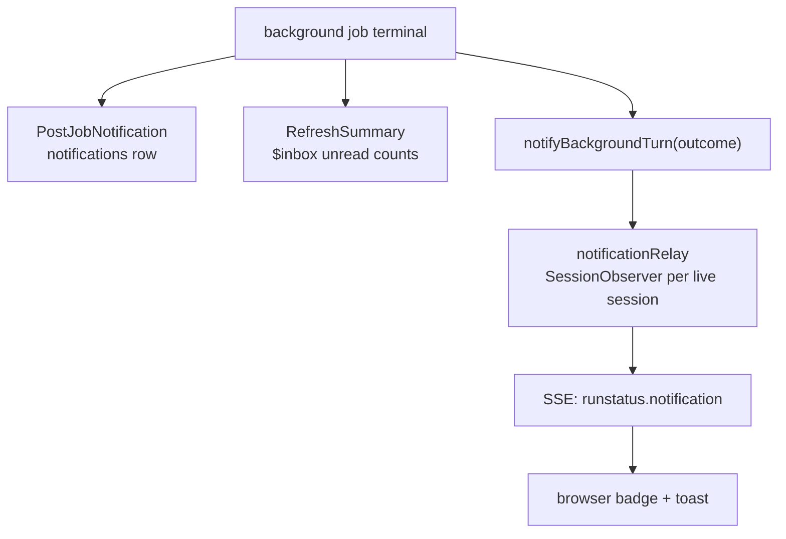
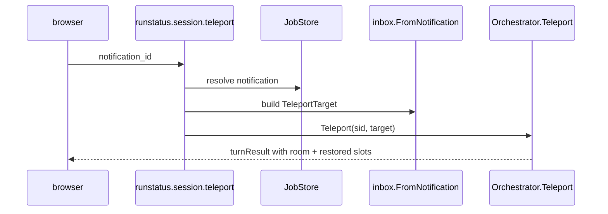
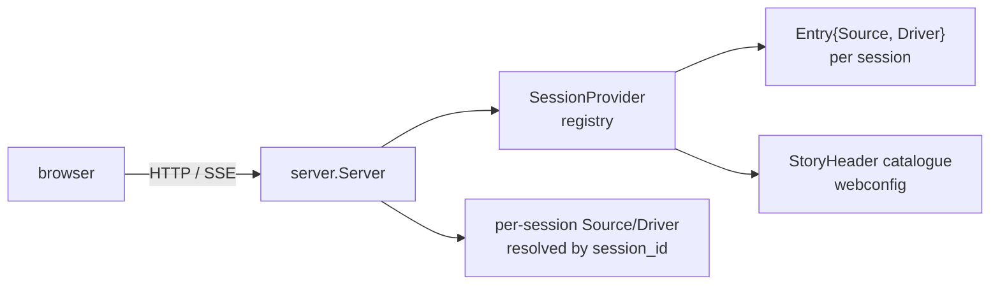

# The multi-story web UI (`kitsoki web`)

`kitsoki web` serves a **browser-based, interactive** surface that hosts many
live kitsoki sessions at once. It starts **story-less**: the home screen lists
the stories it discovered on disk and every session currently running, and the
operator starts a new session from a story or opens an existing one. Each
session is its own in-process orchestrator, independently navigable and
reloadable.

It is the writable, multi-session sibling of the read-only
[run-status UI](../tracing/run-status-ui.md) (`kitsoki status serve` /
`export-status`) — same Vue SPA, same JSON-RPC + SSE contract — but backed by
**live orchestrators running in the same process** rather than a recorded trace
file. It is the multi-story evolution of the original single-story `kitsoki web
<app.yaml>`: where that bound one `app.yaml` for the life of the process, this
discovers a catalogue and routes every RPC to the right session.

```
kitsoki web
# → kitsoki: web UI (7 stories across 1 dir(s)) on http://127.0.0.1:7777
# open http://127.0.0.1:7777/  →  the home screen (stories + live sessions)
```

*Audience: operators who want to drive stories from a browser, and contributors
working on the surface. For the terminal surface see [the TUI](../tui/README.md);
for the read-only run viewer see [the run-status UI](../tracing/run-status-ui.md).*

> **Status:** PoC quality, functional over polished. Localhost / trusted-network
> only — there is **no authentication**. See [Limitations](#limitations--non-goals).

---

## What it is

One process hosts a **`SessionRegistry`** (`cmd/kitsoki/registry.go`) and an
HTTP server. The registry discovers stories, owns one live session per
operator-started session, and fulfils the server's `SessionProvider` seam; the
server (`internal/runstatus/server`) routes every RPC to the right session by
its `session_id` and exposes the story-browser / session-lifecycle methods the
home screen needs. The browser:

- **observes** a session — the current room render, the live event trace, and
  the state diagram (the same `runstatus.Snapshot` the read-only UI projects);
- **drives** a session — submits intents / free text / confirmations and reads
  the resulting room, turn by turn; and
- **manages** sessions — browses the discovered stories, starts new sessions,
  reloads a story in place.

The orchestrator is transport-agnostic: the TUI, the headless `kitsoki turn`,
the flow-test rig, and this web server all drive the same engine.

---

## Story discovery & configuration

`kitsoki web` discovers stories by walking one or more directories for files
named exactly `app.yaml`; each one found becomes a story in the catalogue. The
loader is `internal/webconfig`.

### Resolution order (first non-empty wins)

1. **`--stories-dir <dir>` flags** (repeatable) — ad-hoc override, no config edit.
2. **`story_dirs` in `.kitsoki.yaml`** in the working directory (a sibling,
   gitignored `.kitsoki.local.yaml` is deep-merged on top, local wins — see
   [harness profiles](../architecture/harness-profiles.md#shared-file-and-local-override)).
3. **`./stories`** — the default when neither is given, so the common single-repo
   case needs no configuration.

The config file is **optional** and carries only `story_dirs` for now (the
struct is the stable extension point for future keys — mode/addr/db are *not*
config keys):

```yaml
# .kitsoki.yaml
story_dirs:
  - stories
  - testdata/apps
```

A malformed `app.yaml` under a scanned directory is **logged and skipped**, not
fatal — valid siblings still appear in the catalogue. Discovery is **explicit**:
the operator triggers a re-walk with the home screen's **Rescan** button
(`stories.rescan`); there is no `fsnotify` watch (that is future work).

### Story identity is the path

A story's canonical key is the **absolute path to its `app.yaml`**, not its
`app.id`. `app.id`/title are display-only, so two stories that share an `app.id`
never collide. `session.new` takes a `story_path`; `StoryHeader` carries
`{path, app_id, title, active_sessions}`.

---

## The home screen

The SPA `/` route (`tools/runstatus/src/views/HomeView.vue`) is the story
browser + live-session list.

- **Stories** — a card per discovered story: title, relative path, an
  active-session-count badge, and a **New session** button. New session calls
  `session.new {story_path}` then opens the new session on its **drive** surface
  (`/s/<returned_id>/chat`) — a fresh session is live and meant to be driven, so
  the operator lands on the conversation (opening prompt + composer), not the
  read-only observer.
- **Active sessions** — a row per live session: story title + path, a truncated
  session id, current state, last activity, and an **Open** link to the observer
  (`/s/<id>`), which itself offers a **Drive (chat) ↗** link for live sessions.
  The list refreshes on a short **poll interval** (consistent with explicit
  rescan — no new SSE event type).
- **Rescan** — re-walks the configured dirs and refreshes the catalogue,
  leaving live sessions untouched.
- **Auto-navigation** — on first load, if there is exactly one session and no
  others, the SPA replaces `/` with that session — a still-live one on its drive
  surface (`/s/<id>/chat`), a finished one on the observer (`/s/<id>`);
  otherwise it stays on the home screen.

A single session view lives at `/s/:sessionId`
(`tools/runstatus/src/views/RunView.vue`); the conversational view is at
`/s/:sessionId/chat`. The live-source client (`data/live-source.ts`) is
initialised with the route's `session_id` and sends it on every RPC.

The meta menu also includes a **Dynamic workflows** launcher. It opens a modal
that creates, validates, launches, exports, and refreshes workflow receipts
through the same runstatus RPCs the CLI and MCP surfaces use.

---

## The session view

A session has two surfaces over the same live trace:

- **Observe** (`/s/:sessionId`, `RunView.vue`) — the read-only state diagram and
  filterable trace timeline, identical to the [run-status UI](../tracing/run-status-ui.md),
  plus the **Reload** button (see [Reload](#reload-parity-with-the-tui-reload))
  and, while the session is live, a **Drive (chat) ↗** link onto the drive surface.
- **Drive** (`/s/:sessionId/chat`, `InteractiveView.vue`) — the conversational
  surface: a chat transcript you drive on the left, the live diagram + trace on
  the right, and an **Observe ↗** link back to the read-only view.

The two surfaces link to each other both ways, so neither is a dead-end: a live
session always offers the path to driving it, a driven session the path to its
trace.

When `harness_profiles:` are declared in `.kitsoki.yaml`, **both** the Observe
and Drive headers carry a **provider dropdown** and a dependent **model
dropdown** — the live control over which LLM backend/provider and model answer
this session. Switching fires `runstatus.session.set_selection` and takes effect
on the next turn; the model dropdown appears only for a profile that declares a
model catalog. Each agent row in the trace is then **stamped with the profile
and model it ran on**, so the trace provenance matches what was picked. See
[Harness Profiles](../architecture/harness-profiles.md) for the full mechanism
(it is the same selection the TUI's `/provider` / `/model` drive).

The Drive header also carries a **proposals badge** (`ProposalsBadge.vue`, a
count pill modelled on `InboxBadge.vue`, orange when a write-mode opt-in is
parked) — the web mirror of the TUI's `proposals: N` chip. Clicking it opens
the head proposal in the **same** `OperatorQuestionModal.vue` card the operator
answers for a forwarded agent question, resolving accept/refine/dismiss over the
shared `runstatus.session.answer_question` RPC. The badge and its FIFO queue
(`stores/proposals.ts`) are the surface only; the producer is the
[ambient miner](../architecture/ambient-mining.md), where this is documented
canonically.

### Layout (Drive)

```
┌──────────────────────────────┬───────────────────────────────────┐
│ ← Sessions · <app>  <state> live                         Observe ↗│
├──────────────────────────────┼───────────────────────────────────┤
│  AGENT                        │            STATE DIAGRAM           │
│    <rendered room view>       │   (mermaid, current node lit)      │
│                          You ▸│                                    │
│    <next room view>           ├───────────────────────────────────┤
│                               │            TRACE                   │
│                               │   (filterable timeline, live SSE)  │
├──────────────────────────────┤                                    │
│ [start] [quit] [look]         │                                    │
│ > discuss…              [Send]│                                    │
└──────────────────────────────┴───────────────────────────────────┘
   chat transcript + composer        live trace + state diagram
```

- **Chat (left)** — a transcript of the exchange. Each agent turn renders the
  room's view; user turns show what you submitted. The **composer** shows a
  button per allowed action intent, plus a text box bound to the room's
  free-text intent (see [Driving a turn](#driving-a-turn)). On a terminal state
  the composer is replaced by a "Session complete — no further input accepted."
  note.
- **Trace + diagram (right)** — the same `StateDiagram` / `TraceTimeline`
  components as the read-only UI, updated live over SSE as the session emits
  events.

Vue components: `views/InteractiveView.vue` (composition),
`components/{ChatTranscript,InputBar,ViewElement}.vue`; store `stores/run.ts`.

### Driving a turn

The composer maps UI controls to the engine's intents:

- **Action buttons** — one per allowed intent that takes no free-text slot
  (e.g. `start`, `confirm`, `accept`). Clicking submits that intent with no slots.
- **Text box** — bound to the allowed intent that has a single free-text
  (`string`) slot (e.g. `discuss`'s `message`, `submit_answers`'s `answers`).
  Typing + **Send** submits that intent with the text as the slot value. If a
  room offers more than one text intent, a small selector chooses which.

The menu metadata that drives this comes from the enriched `intents` field of
the room view (`intentInfo{name, title, text_slot, has_slots}`), derived
server-side from each intent's slot schema (`OrchestratorDriver.IntentInfo`).

Every composer action submits a **structured intent**
(`runstatus.session.submit` → `Orchestrator.SubmitDirect`) — the operator picked
a concrete intent and the slot value is already bound, so it is deterministic and
LLM-free, and works under the no-harness `--flow` posture. Free-text → LLM
**routing** (`runstatus.session.turn` → `Orchestrator.Turn`, the
semantic→cache→LLM tiers) is wired in the backend but the composer does not use
it yet; see [Limitations](#limitations--non-goals).

### Render fidelity

The engine renders a room's view to **text server-side**, at its stable width,
against the live world — exactly what the operator sees in the TUI. The browser
**never evaluates pongo**; `session.view` ships already-rendered text (not a raw
`{{ … }}` template), so the page never leaks template markers. `ChatTranscript.vue`
renders that text **verbatim in a monospace, pre-wrapped card** — preserving the
engine's column alignment, numbered lists, and indentation rather than re-flowing
them — and formats only inline `**bold**` / `` `code` `` / `##` headings.

This honours the rule in `tools/runstatus/CLAUDE.md`: the **trace/render must be
correct at the source — never patch it with a UI hack**. If a room view looks
wrong in the browser, fix the view/render, not the CSS.

---

## Session lifecycle

- **Creation.** `session.new {story_path}` runs `buildSessionRuntime` over the
  registry's session-invariant `runtimeBase` (so the deterministic `--flow` /
  `--host-cassette` no-LLM posture, the harness, mode, db path, and recording
  options apply to **every** session), starts the orchestrator, and returns a
  fresh **UUID** id that routes subsequent calls. An **invalid story YAML fails
  fast** with a structured error, so the UI can surface it before navigating.
- **In-memory only.** Sessions live in the registry's maps and **die with the
  process** — they are *not* persisted across restarts. The per-session JSONL
  trace on disk survives (`kitsoki trace` / `export-status` / `kitsoki status
  serve` work against it afterward), but re-attaching a live session to an old
  trace is out of scope.
- **No cap.** A long-lived server accumulates orchestrators; there is no session
  limit in the PoC.
- **No kill action.** There is no "close session" affordance; sessions end when
  the process exits.

---

## Reload (parity with the TUI `/reload`)

A session view's **Reload** button hot-reloads the story's `app.yaml` in place,
**mirroring the TUI's `/reload` command exactly** — no new reload mechanism is
introduced in the orchestrator. `session.reload {session_id}` runs the same
sequence the TUI does (`SessionRegistry.Reload`, `cmd/kitsoki/registry.go`):

1. read the session's current state from its snapshot;
2. `Orchestrator.Reload(storyPath, currentState)` — re-validate and swap in the
   new `AppDef`, rebinding the current state if it still exists;
3. `RecordEffectiveStory` so the trace stays self-contained across the reload;
4. when the prior state still exists, `RerunOnEnter` to re-fire the room's
   `on_enter` chain.

The response is `{ok, prev_state_exists}`. When **`prev_state_exists` is
false** — the edit removed the session's current state — the engine cannot
re-enter it, so the session stays put and the UI shows the warning **"current
state removed; staying put"**, matching the TUI's "re-render only" notice. When
true, the normal SSE-driven refresh repaints.

The reload mechanics themselves are documented once, canonically, in the engine:
see the **Hot reload** bullet under [the turn loop in
`docs/stories/state-machine.md`](../stories/state-machine.md#8-the-turn-loop-state-machine-of-the-orchestrator)
(and `on_enter` idempotence under
[`docs/stories/state-machine.md`](../stories/state-machine.md#on_enter-must-be-idempotent)).

---

## Meta mode (overlay chat)

A global **Meta** button (bottom-right, on every screen) opens a large,
**persistent** overlay chat with one of kitsoki's named meta agents — the web
surface for the same overlay the TUI reaches with `/meta` (see
[`docs/stories/meta-mode.md`](../stories/meta-mode.md) for the engine
mechanism). The dropdown offers three modes:

| Mode | Agent | Writes? | Scope |
|---|---|---|---|
| **Story edit** | `story-author` | yes — edits the story YAML, commits, reloads | the running session's state |
| **Story Q&A** | `story-explainer` | no (read-only) | the running session's state |
| **Kitsoki help** | `kitsoki-explainer` | no (read-only) | cross-app (needs `$KITSOKI_REPO`) |

- **Persistent** — the overlay state lives in an app-global store, so closing it
  and navigating (Drive ⇄ Observe ⇄ home) and reopening returns to the **same
  conversation**. The durable backing is the chat row in the session's
  `chats.Store`, keyed by `(mode, state)` exactly as the TUI keys it, so a full
  page reload resumes the same transcript. **New chat** archives the active row
  and starts fresh.
- **Story modes need a session.** On the home screen (no session) the two story
  modes are disabled; **Kitsoki help** is cross-app and works there.
- **Edit → reload content, not the page.** When a Story-edit turn changes a file
  in the story tree, the server returns `reload_requested` + `changed_files`;
  the SPA then calls `session.reload` and **re-hydrates the run store in place**
  (no `window.location.reload`), so the edited story takes effect live. This
  reuses the [Reload](#reload-parity-with-the-tui-reload) path verbatim.
- **Same activity presentation as the main chat.** While a meta turn streams
  (`/rpc/meta-stream` SSE), the overlay's bubble renders the agent's 🧠
  thoughts and tool calls in arrival order, and the finished assistant message
  keeps that feed collapsed ("🧠 N thoughts · M tool calls", expandable) — the
  exact components the main chat uses (`ActivityFeed.vue` /
  `ActivityDisclosure.vue`, re-tinted via `--activity-*` CSS variables). The
  wire protocol splits `think` frames (extended thinking — always intermediate,
  rendered immediately) from `delta` frames (narration — deferred, because the
  final reply also arrives as narration; flushed into the feed when later
  activity proves it intermediate, dropped on `done`). This mirrors the TUI's
  `metaStreamPending` deferral.

**Architecture.** The server exposes a separate optional `MetaDriver` seam
(`internal/runstatus/server/meta.go`) on each `Entry`; the concrete
implementation (`cmd/kitsoki/meta_driver.go`) wraps an
`internal/metamode.Controller` built per session from that session's
`chats.Store` + agent registry + `AppDef` (the home-screen "self" driver uses a
synthetic `AppDef` for the cross-app `kitsoki.*` modes). Read-only surfaces
(`kitsoki status serve`) leave `Entry.Meta` nil, so meta RPCs report
`codeReadOnly`.

**No-LLM posture.** Under `--flow` / `--host-cassette` the meta agent is
replaced by a deterministic stub (`internal/metamode/stub_agent.go`): read-only
modes return a scripted reply; Story-edit makes a real, controlled disk write so
the edit→commit→reload handshake fires for real with no LLM. This is what the
Playwright demo (`tests/playwright/meta-mode.spec.ts`) records.

---

## Onboarding tour

A **generic, story-agnostic** guided tour walks a first-time user from the home
screen into a live run, spotlighting each control with a tooltip. It auto-starts
on first login (gated by a `localStorage` flag, **home route only**) and is
replayable anytime via the persistent **?** button (bottom-right, above the Meta
launcher). It is also the surface we use to **highlight new features over time** —
adding a spotlight is one entry appended to the manifest, no other code.

- **One manifest, two consumers.** The ordered steps live in a single Vue-free
  module, `tools/runstatus/src/tour/manifest.ts`. The live overlay
  (`components/tour/TourOverlay.vue`, fed by `stores/tour.ts`) renders them, and
  the Playwright video demo imports the **same** array — so the recording can
  never drift from the shipped tour. The store is a render-free Pinia store
  mirroring [Meta mode](#meta-mode-overlay-chat)'s `stores/meta.ts`; the overlay
  owns all route / DOM observation.
- **Generic by construction.** Every step anchors to a `data-testid` that exists
  on *every* story and *every* run — the top bar (`current-state`, `state-badge`,
  `observe-link`), the chat (`chat-section`), the input bar (`input-bar`), the
  trace panels (`trace-diagram`, `trace-timeline`), and the global `meta-button`.
  Steps **never** wait on a story-specific state or an LLM turn, so the tour is
  robust for any story and any harness, and never strands on a slow turn.
- **Explain vs. action steps.** Almost every step is `explain` (highlight + a
  four-rect spotlight with a clickable hole + the popover's **Next**). The only
  `action` step is "start a session" (`route-match` → the interactive view) —
  cheap, universal navigation. A per-step watchdog auto-skips any step that
  can't anchor within a grace window, and the holding state is non-blocking and
  always dismissible, so the tour can never freeze the UI.
- **Robustness guards.** The tour self-disables in snapshot/artifact mode
  (`window.__KITSOKI_SNAPSHOT__`) and under browser automation
  (`navigator.webdriver`, so it can't sabotage the other Playwright UI specs).

**Video demo.** `tests/playwright/tour-video.spec.ts` runs the generic tour
against a real `kitsoki web` server in the [no-LLM posture](#deterministic-no-llm-for-development-demos-playwright)
(it picks the Oregon Trail card at the one navigation step and drives one real
turn so the trace lights up), asserts each step's title against the live popover,
and records to `.artifacts/tour-video/`. A companion guard,
`tests/playwright/tour-onboarding.spec.ts`, simulates a real first-time user and
asserts the tour auto-starts, is dismissible, never blocks the UI, and does not
auto-start on a deep-linked session. See the
[`kitsoki-ui-demo`](../../.agents/skills/kitsoki-ui-demo/SKILL.md) recipe for rendering
shareable MP4/GIF/contact-sheet artifacts.

---

## Global inbox (background-turn notifications)

A `background: true` turn (an `agent.task`, a `host.run`, a test run) runs off
the turn loop; when it terminates the engine posts a **notification** stamped
with where the work began. The TUI surfaces these via a polling panel
(`internal/tui/inbox.go`); the web surfaces the **same** notifications as a
global inbox in the SPA chrome — so you can kick off a long turn, navigate to
another session or the home view, and get pinged the moment it's ready.

The inbox is a mailbox that belongs to **you**, not to the room you're looking
at: it rides in the chrome on every screen, a new item means "a turn somewhere
is ready," and clicking it walks you back there. Closing the tab and reopening
**re-fetches** the inbox (no OS / Web-Notification alert in v1 — a fully
backgrounded tab won't raise a system notification).

This is pure transport + UI over the existing engine substrate — the
`notifications` table, the `$inbox` projection, `Orchestrator.Teleport`, and the
`SessionObserver` fan-out — all documented canonically with
[background jobs](../stories/background-jobs/runtime.md#persistence-model). No
new engine concepts.

### The flow



A per-session relay (`internal/runstatus/server/notifications.go`) multiplexes
every live session's posts onto **one** cross-session SSE feed the home chrome
subscribes to; the badge increments and, for `success` / `action_required`
severity only, a transient toast appears. Clicking either jumps you back:



Teleport is request/response, not push — it reuses the stackless jump the TUI
and the Agent Room banner already drive, so a browser teleport is
indistinguishable from a TUI one in the trace.

### The surfaces

- **Global badge** (`components/InboxBadge.vue`) — the larger of unread
  notification count and active-work item count, plus queued proposal-review
  items, in the chrome on every screen. Backend trace-backed mining proposals
  are part of active work; locally queued web proposals are added by the web
  proposal store. Attention color appears when either the notification feed,
  active-work summary, or proposal queue reports work that needs intervention.
  Active-work attention is limited to unread `action_required` notifications,
  unanswered operator questions, awaiting-input or failed jobs, failed subagent
  drives, and write-mode approval proposals; passive `success` / `info` rows
  and low-stakes structure proposals remain listed and jumpable without coloring
  the badge.
- **`InboxPanel.vue`** — opens on badge click: first the prioritized active-work
  queue from `runstatus.work.list` (notifications, jobs, queued/dispatching
  drives, failed drives, backgrounded chats, unanswered operator questions, and
  trace-backed mining proposals), merged with the web proposal queue's review
  items, then notification history.
  Rows show the next action explicitly: **jump** for notifications and
  notification-backed jobs, **open context** for chat-backed work including
  failed subagent drives, **answer** for forwarded operator questions,
  **review** for proposals, and **open session** for job rows that have no
  matching unread notification yet.
  Awaiting-input job rows show their clarification prompt in the row body unless
  a linked notification supplies a more specific body. Operator-question rows
  reopen the same blocking answer modal used by the live question SSE feed.
  Notification history keeps **dismiss** affordances; an origin session that is
  no longer live degrades to a non-jumping, read-only item (teleport returns a
  typed error). The panel's **Sync GitHub** action uses the same idempotent
  intake path as background polling and reports new/existing/error feedback.
- **`InboxToast.vue`** — transient, shown only on a `success` / `action_required`
  push; auto-dismisses; click = the same jump as a panel item.

The store is `stores/inbox.ts` (Pinia): it subscribes to the notification feed,
holds the unread list + counts, refreshes `runstatus.work.list` while mounted,
runs idempotent GitHub sync when requested, and reconciles `read` / `dismiss`
against the RPC result.

### Deep-link

A notification jump navigates to `#/s/<sessionId>/chat?notif=<notificationId>`.
The link carries the **notification id**, not encoded state/slots, so it can't
forge a teleport — `InteractiveView.vue` resolves it on mount via
`session.teleport`, applies the resulting room, marks the notification read,
then clears the param (a refresh doesn't re-teleport). The link is shareable.

`#/s/<sessionId>/chat?inbox=1` opens the global inbox panel directly. It is a
testability and reacquisition affordance: `render.web` and bookmarked live
sessions can land with the active-work queue visible without synthesizing a
badge click.

For deterministic demo/render paths, `#/s/<sessionId>/chat?proposal=<json>`
seeds the web proposal queue from a URL-encoded proposal object, then clears
only the `proposal` query key. Combine it with `inbox=1` to open the
active-work panel on a proposal-review row in `render.web` without a real miner.

### v1 scope & limits

- **In-memory sessions.** A tab reconnect re-fetches via `notifications.list`;
  there is no durability across a server restart (gated on continue-mode's
  journal — see [Limitations](#limitations--non-goals)).
- **No OS / Web-Notification alerts;** no per-severity muting or filtering. A
  noisy `info`-heavy story bumps the badge but stays silent in the panel.
- **The relay is registered per live session and never unregistered** — the PoC
  never evicts sessions (see [Session lifecycle](#session-lifecycle)'s "no kill
  action" / "no cap" bound), so the cross-session feed is capped at currently
  registered sessions.

**Demo.** The deterministic no-LLM tour `web-inbox-video.spec.ts` drives
`kitsoki web` against the demo story `stories/inbox-demo/` (manifest
`src/tour/web-inbox-manifest.ts`) and walks the full badge → toast → teleport
path; run it to see the surface end to end (the
[`kitsoki-ui-demo`](../../.agents/skills/kitsoki-ui-demo/SKILL.md) recipe renders the
shareable artifacts).

---

## Flags

`kitsoki web` takes **no positional argument**. The story directories come from
`--stories-dir` / `--config` / `.kitsoki.yaml`; the remaining flags set the
**per-session defaults** every new session inherits.

| Flag | Default | Meaning |
|---|---|---|
| `--config` | `.kitsoki.yaml` | Path to the checked-in web config file (`story_dirs`, profiles). A sibling `*.local.yaml` is deep-merged on top, local wins. |
| `--stories-dir` | — | Story directory to walk for `app.yaml` (repeatable; overrides `.kitsoki.yaml`). |
| `--addr` | `127.0.0.1:7777` | HTTP listen address. |
| `--mode` | `staged` | Execution mode applied to every session: `staged` \| `one-shot`. |
| `--db` | nearest `.kitsoki/sessions.db` | SQLite session store path. |
| `--harness` | auto-select | `claude` \| `live` \| `replay` \| `recording`. Ignored with `--flow`. |
| `--claude-model` | engine default | Model for `--harness claude` (e.g. `opus`, `sonnet`). |
| `--recording` | — | Recording YAML for `--harness replay`. |
| `--record` | — | Output JSONL recording for `--harness recording`. |
| `--flow` | — | Drive every session deterministically from a flow fixture (no LLM; `host_handlers:` stub `host.*`; intents submitted explicitly). |
| `--host-cassette` | — | Host cassette backing `host.*` calls (deterministic, no LLM); combinable with `--flow`. |

### Deterministic, no LLM (for development, demos, Playwright)

```
kitsoki web --stories-dir stories/prd --flow stories/prd/flows/happy_path.yaml
```

With `--flow`, the fixture's `host_handlers:` stub **every** `host.*`/agent
call and **no harness is built**; the posture is threaded into `runtimeBase`, so
**every** session the home screen starts is fully reproducible. This is the same
fixture `kitsoki test flows` replays, so the web UI and the tests resolve a stub
identically.

The determinism is not a bespoke replay mode — the web UI reuses the **same**
machinery as the rest of kitsoki: `--flow` registers `host_handlers:` via the
shared `testrunner.RegisterHostStubs`, and `--host-cassette` installs cassette
dispatchers (`testrunner.LoadCassette` / `BuildCassetteDispatcher`), the exact
paths the flow rig uses. So any deterministic scenario that runs under `kitsoki
run` / `kitsoki test` drives the web UI identically.

---

## The RPC + SSE contract

`POST /rpc` (JSON-RPC 2.0) and `GET /rpc/events` (text/event-stream), served by
`internal/runstatus/server` and consumed by
`tools/runstatus/src/data/live-source.ts`. Every session-routed method takes a
`session_id` param; the server resolves the live session via the provider and a
**missing or unknown id returns a structured not-found error**. The
`runstatus.event` SSE wire format is unchanged from the read-only UI — each
subscription captures its `session_id` and the poller resolves that session's
source per tick.

### Lifecycle methods (the home screen)

| Method | Params | Returns |
|---|---|---|
| `runstatus.stories.list` | `{}` | `[]StoryHeader` (`{path, app_id, title, active_sessions}`) |
| `runstatus.stories.rescan` | `{}` | `[]StoryHeader` (refreshed catalogue) |
| `runstatus.session.new` | `{story_path}` | `{session_id}` (structured error on invalid story) |
| `runstatus.session.reload` | `{session_id}` | `{ok, prev_state_exists}` |
| `runstatus.sessions.list` | `{}` | `[]SessionHeader` (one per live session) |

### Session-routed read / write methods

The read methods (`session.get/app/mermaid/trace/view`,
`session.subscribe/unsubscribe`) and write methods
(`session.turn/submit/continue/offpath`) are unchanged in shape from the
single-story surface; they are now resolved per `session_id`. See [the contract
section of the run-status UI](../tracing/run-status-ui.md) for the read shapes.

Write methods exist only when a session has a **`Driver`** attached (every
`kitsoki web` session does; `kitsoki status serve` does not — see [Read-only
surface unaffected](#read-only-surface-unaffected)):

| Method | Params | → Orchestrator |
|---|---|---|
| `runstatus.session.turn` | `{input}` | `Turn` (free text, routes internally) |
| `runstatus.session.submit` | `{intent, slots}` | `SubmitDirect` (chosen intent) |
| `runstatus.session.continue` | `{slots}` | `ContinueTurn` (supply missing slots) |
| `runstatus.session.offpath` | `{input}` | `AskOffPath` (read-only side question) |

The [global inbox](#global-inbox-background-turn-notifications) adds four more
session-routed methods (also `Driver`-gated):

| Method | Params | Returns |
|---|---|---|
| `runstatus.session.notifications.list` | `{session_id, limit?}` | `{notifications: [...]}` (`JobStore.ListNotifications`) |
| `runstatus.session.notifications.read` | `{session_id, id}` | `{ok}` (`MarkNotificationRead`) |
| `runstatus.session.notifications.dismiss` | `{session_id, id}` | `{ok}` (`DismissNotification` — sets `dismissed_at`) |
| `runstatus.session.teleport` | `{session_id, notification_id}` | `turnResult` (resolve notification → `inbox.FromNotification` → `Orchestrator.Teleport`) |

A non-teleportable or unknown notification id makes `session.teleport` return a
JSON-RPC error (`codeServerError`, `-32000`); the surface renders that
notification as a read-only, non-jumping item.

> **Wire shape (PascalCase).** The `notification` object — returned by `.list`
> and carried in the SSE frame below — serializes with **Go field names**, not
> camelCase: `ID`, `SessionID`, `CreatedAt`, `Severity`, `Title`, `Body`,
> `TeleportState`, `TeleportSlots`, `TeleportProposalID`, `TeleportJobID`,
> `OriginKind`, `OriginRef` (severity ∈ `info`|`success`|`warn`|`error`|`action_required`).
> A frontend must not assume camelCase.

### Cross-session notification feed (the global inbox)

The badge/toast feed is **not** per-session: the browser opens one
session-less subscription and the server multiplexes every live session's posts
onto it (see [Global inbox](#global-inbox-background-turn-notifications)).

| Method | Params | Returns |
|---|---|---|
| `runstatus.notifications.subscribe` | `{}` | `{subscription_id}` |
| `runstatus.notifications.unsubscribe` | `{subscription_id}` | `{ok}` |

Open the stream at **`GET /rpc/notifications?subscription_id=<id>`** (text/event-stream).
Each frame is:

```jsonc
{"jsonrpc":"2.0","method":"runstatus.notification",
 "params":{"session_id":"…","notification":{…},"unread":2,"needs_attention":1}}
```

`notification` is the PascalCase object noted above; `unread` / `needs_attention`
are the refreshed `$inbox` counts. These methods and the event are **additive** —
the read-only surface and older frontends are unaffected.

### Meta-mode methods (the overlay chat)

Routed to the session's optional **`MetaDriver`** seam (`Entry.Meta`); a
`session_id` of `""` targets the home-screen session-less "self" driver
(`kitsoki.*` modes). See [Meta mode](#meta-mode-overlay-chat).

| Method | Params | Returns |
|---|---|---|
| `runstatus.meta.modes` | `{session_id}` | `{modes: []MetaModeInfo}` (`{key, label, banner, agent, read_only, group}`) |
| `runstatus.meta.enter` | `{session_id, mode, chat_id?}` | `MetaSession` (`{chat_id, mode_key, messages}`) — resumes by scope when `chat_id` omitted |
| `runstatus.meta.send` | `{session_id, mode, chat_id, input}` | `MetaSendResult` (`{assistant, chat_id, reload_requested, changed_files, commit_sha}`) |
| `runstatus.meta.new` | `{session_id, mode, chat_id}` | `MetaSession` (fresh, empty) |
| `runstatus.meta.transcript` | `{session_id, chat_id}` | `{messages: []MetaMessage}` |

### `turnResult` (the write / `view` response)

The write methods and `session.view` return the room as a `turnResult`
(`internal/runstatus/server/driver.go`):

```jsonc
{
  "mode": "transitioned",         // transitioned|clarify|rejected|completed|offpath|cancelled
  "state": "clarifying",          // current/landed state path
  "view": "CLARIFYING …",         // server-RENDERED room text (markdown)
  "typed_view": null,             // present only for template-free element views
  "allowed_intents": ["submit_answers","skip","quit"],
  "intents": [                    // enriched menu the composer renders
    {"name":"submit_answers","title":"Submit answers","text_slot":"answers","has_slots":true},
    {"name":"skip","has_slots":false}
  ],
  "slots_needed": [ … ],          // on mode=clarify
  "pending_intent": "",           // on mode=clarify
  "error_code": "", "error_message": "", "guard_hint": "",  // on mode=rejected
  "turn_number": 3
}
```

A guard rejection or a missing slot is **not** a transport error — it rides back
as `mode: "rejected"` / `mode: "clarify"` with the structured reason, because it
is a normal interpreted outcome of the turn. Only infrastructure failures surface
as a JSON-RPC error.

### Read-only surface unaffected

`kitsoki status serve` still uses the single-entry `server.New(tracePath, def,
…)` path. It satisfies the **full** `SessionProvider` via a one-session adapter
(`singleEntryProvider`): the lifecycle methods (`session.new` / `session.reload`
/ `stories.rescan`) return a structured **read-only** error (JSON-RPC code
`-32001`) rather than nil-derefing; `stories.list` is a tolerant empty read.

---

## Architecture



- **`internal/webconfig`** — config load (`.kitsoki.yaml`), directory resolution
  (`Resolve`), and `DiscoverStories` (walk for `app.yaml`, one `StoryMeta` each).
- **`SessionRegistry`** (`cmd/kitsoki/registry.go`, package main) — the concrete
  `SessionProvider`. It lives in `main` because it must call `buildSessionRuntime`
  (`cmd/kitsoki/runtime.go`) and clone the session-invariant `runtimeBase`;
  `internal/` packages cannot import `main`, which is why the server *defines* the
  `SessionProvider` seam and the registry *depends on* it.
- **`server.SessionProvider` / `server.Entry` / `server.StoryHeader`**
  (`internal/runstatus/server/provider.go`) — the multi-session seam, an entry's
  read `Source` + write `Driver`, and the story-browser shape. `server.NewMulti`
  serves a provider; `server.New` keeps the read-only single-entry path.
- **`server.LiveSession` / `OrchestratorDriver`** — per the shared web plumbing;
  the registry wires one of each per session over `buildSessionRuntime`'s output.

The shared per-session machinery (`buildSessionRuntime`, `LiveSession`, the
`Driver`, render fidelity, cassettes/flows/warps commonality, and SPA build &
embedding) is documented with the read-only viewer and the SPA itself; see the
[Pointers](#pointers) below rather than restating it here.

---

## Building & embedding

The SPA (`tools/runstatus/`) is built by Vite and **staged into the Go embed
dir** (`internal/runstatus/web/assets/index.html`, gitignored — only `.gitkeep`
is committed) so the binary serves it with no Node at runtime.

```
make build      # pnpm build + stage + go build (the binary embeds a fresh SPA)
make web        # just rebuild + stage the SPA (incremental)
make install    # build + install kitsoki to $GOBIN
```

If the SPA was not built, the page reports the UI as unbuilt (HTTP 503) while
the RPC/SSE endpoints still work.

## Demo, video & testing

The end-to-end Playwright spec
`tools/runstatus/tests/playwright/multi-story.spec.ts` drives the full flow —
home discovery → new session → reload → driving the PRD `happy_path` chat to
completion → back to the active-sessions list — in a headless browser at MacBook
resolution (1440×900 @2× retina), asserting the state badge at every scene.

```
cd tools/runstatus && pnpm exec playwright test multi-story --project=chromium
```

It records a stable video and per-scene screenshots into `.artifacts/multi-story/`
(`multi-story-demo.webm` plus numbered `NN-*.png` frames). It is **human-paced**
by default (visible typing, a beat before each action, a dwell on each scene) so
the recording is watchable; set `WEB_CHAT_PACE=0` to collapse the delays for a
fast assertion-only CI run.

A second spec, `tools/runstatus/tests/playwright/meta-mode.spec.ts`, demos
[Meta mode](#meta-mode-overlay-chat) end-to-end (home help → drive → Story Q&A →
Story-edit reload → persistence across navigation → new chat). It runs against a
**throwaway copy** of `stories/` (a Story-edit commits into the story's git repo,
so the demo keeps the real repo clean) with `$KITSOKI_REPO` exported so the
`kitsoki.*` modes light up.

A third spec, `tools/runstatus/tests/playwright/tour-video.spec.ts`, drives the
[onboarding tour](#onboarding-tour) end-to-end against the Oregon Trail story,
walking the shared step manifest and asserting each step's title against the live
popover. All three specs share the live-server harness
(`tests/playwright/_helpers/server.ts`) and follow the reusable
[`kitsoki-ui-demo`](../../.agents/skills/kitsoki-ui-demo/SKILL.md) recipe for rendering
shareable MP4/GIF/contact-sheet artifacts.

**Binary-native rendering.** [`kitsoki tour`](tour.md) records the same kind of
demo MP4 (+ chapter sidecar + per-step PNGs) straight from the binary — headless
Chrome + ffmpeg, no Node/pnpm/Playwright — driving a self-describing tour
manifest from the feature catalog. It is how a foreign repo that owns a kitsoki
instance (importing `@kitsoki/<name>`) produces its own demo video; see the
[`kitsoki tour` reference](tour.md).

Other tests: `cd tools/runstatus && pnpm test` (Vitest, frontend);
`go test ./internal/runstatus/... ./cmd/kitsoki/` (backend).

---

## The story editor

The same server hosts the [story editor](../tui/story-editor.md) at the
`/editor` hash route — a **per-story static inspector** (BFS room list, per-room
hooks / domain model / typed view / IDE deep-link, and the Agent Workbench with
its cassette browser + cassette-only replay). It needs no session: the
`runstatus.editor.*` RPC family recompiles the story off disk on every call,
backed by the registry's optional `EditorProvider` capability. See the
[story-editor doc](../tui/story-editor.md#editor-rpc-surface) for the endpoint
shapes and safety rules.

---

## Limitations & non-goals

- **No auth, single-tenant.** Localhost / trusted-network dev server.
- **Sessions are ephemeral.** In-memory only; not persisted across restarts (a
  database-backed registry is explicit future work). Re-attaching to a trace
  after a restart is `kitsoki status serve`'s job.
- **Explicit rescan only.** No `fsnotify` watch for auto-discovery (future work).
- **No session cap, no kill action.** Sessions accumulate and die with the process.
- **Composer submits structured intents.** Free-text → LLM routing through the UI
  (`session.turn`) exists in the backend but the composer binds typing to the
  room's text-slot intent instead (see [Driving a turn](#driving-a-turn)).
- **Off-path only; no full meta-mode.** `session.offpath` is wired; the
  persistent meta-mode sidebar from the TUI is not yet ported.
- **PoC UI.** Functional over designed; the agent room view is rendered
  faithfully (monospace) rather than re-styled as bespoke HTML. A richer
  server-rendered `typed_view` HTML render is possible future work.

---

## Pointers

- Entrypoint: `cmd/kitsoki/web.go`; registry: `cmd/kitsoki/registry.go`; shared
  runtime + `runtimeBase`: `cmd/kitsoki/runtime.go`
- Discovery / config: `internal/webconfig/`
- Server / provider / RPC / SSE: `internal/runstatus/server/{server,provider,live,driver}.go`
- Story editor: `internal/runstatus/server/editor.go`, pure graph
  `internal/app/graph/` — narrative: [story editor](../tui/story-editor.md)
- SPA: `tools/runstatus/src/` (`views/{HomeView,RunView,InteractiveView}.vue`,
  `data/live-source.ts`, `router.ts`)
- Reload mechanics (canonical): [`docs/stories/state-machine.md`](../stories/state-machine.md#8-the-turn-loop-state-machine-of-the-orchestrator)
- Read-only sibling: [run-status UI](../tracing/run-status-ui.md) ·
  Terminal sibling: [the TUI](../tui/README.md)
