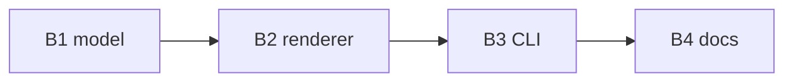

# Work Plan: Speaker-Notes Export

> Status: **Validated** · From: [Design: Speaker-Notes Export](../../slidey-dev/assets/architect_design-doc.md) · Decomposed into agent-sized briefs

## Overview

The design's three slices decompose into four right-sized, dependency-ordered
briefs. Each is small enough for one agent to land end-to-end with its own test
gate, and they fan out from a shared notes model.

## Briefs

### B1 — `collectSceneNotes` model · *ready*

- **Scope:** pure `(spec) -> SceneNote[]`, scenes in order, no I/O.
- **Files:** `src/notes.js` (new), `test/notes-model.test.js` (new).
- **Done when:** unit test over a 3-scene fixture asserts order, fields, and the
  empty-narration marker shape.
- **Depends on:** —

### B2 — `renderNotesMarkdown` renderer · *ready*

- **Scope:** pure `(SceneNote[]) -> string`; one `##` per scene, body + narration +
  type label; *(no narration)* marker; duplicate-eyebrow suffixing.
- **Files:** `src/notes.js`, `test/notes-render.test.js` (new).
- **Done when:** golden snapshot is byte-stable across two runs.
- **Depends on:** B1.

### B3 — `--notes` CLI seam · *ready*

- **Scope:** parse spec → run B1+B2 → write file (`-` → stdout); non-zero exit on
  invalid spec with a clear message.
- **Files:** `src/index.js`, `test/notes-cli.test.js` (new).
- **Done when:** `slidey deck.json --notes out.md` writes the expected file; bad
  spec exits non-zero with no partial write.
- **Depends on:** B2.

### B4 — Docs + changelog · *ready*

- **Scope:** document the flag in the CLI reference and the authoring guide; add a
  changelog entry.
- **Files:** `docs/cli.md`, `docs/authoring.md`, `CHANGELOG.md`.
- **Done when:** the flag is discoverable from the reference and the guide example
  runs as written.
- **Depends on:** B3.

## Dependency Order

## Estimates & Sequencing

| Brief | Size | Test gate | Can start |
|---|---|---|---|
| B1 | S | notes-model | now |
| B2 | S | notes-render | after B1 |
| B3 | M | notes-cli | after B2 |
| B4 | S | guide example | after B3 |

## Validation

- Every brief carries its own test gate; the fleet runs them independently.
- The manifest is byte-stable: same design in → same briefs out.
- No brief exceeds one agent's working set (single file + its test).
