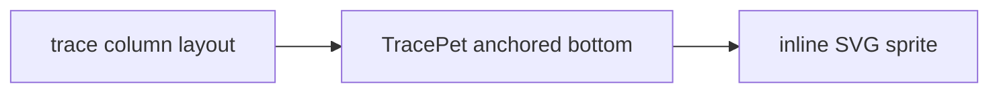

# Design: Trace-Column Pet

> Status: **Published** · Realizes: [PRD: Trace-Column Pet](pm_idea-prd.md) · Owner: Architecture

## Summary

Add a tiny, opt-in animated **SVG pet** anchored at the bottom of the existing
kitsoki web **trace column** — pure inline SVG + CSS keyframes, no images, no
dependencies. The work is a self-contained component, a dock seam in the
trace-column layout, and an opt-in toggle (off by default).

## Epic & Slices

- **Slice 1 — Sprite component.** `TracePet.vue`, a self-contained component that
  renders an inline-SVG sprite with a CSS keyframe **idle animation** (a gentle
  bob and an occasional blink). No images, no deps, no props required.
- **Slice 2 — Dock seam.** Anchor `TracePet` at the **bottom of the trace column**
  in the trace-column layout (`InteractiveView.vue` / the trace column component),
  absolutely positioned over the column footer so it never displaces trace rows.
- **Slice 3 — Opt-in setting.** A persisted toggle, **off by default**, that
  mounts the pet only when enabled.

## Data Flow

## ADRs

### ADR-1: Inline SVG + CSS keyframes only — zero dependencies

The sprite and its animation are authored as inline SVG markup with CSS keyframes
in the component. No image files, no sprite sheets, no animation library, no added
network requests. **Decision: inline SVG + CSS only**, so the feature ships zero
assets and cannot slow the UI.

### ADR-2: Opt-in, absolutely positioned at the column bottom

The pet is off by default and, when enabled, is **absolutely positioned** at the
bottom of the trace column. It overlays the column footer rather than participating
in the trace list's flow, so it can never push, clip, or block trace rows.
**Decision: opt-in + absolute bottom anchor.**

### ADR-3: Respect reduced-motion

Continuous motion can be distracting or inaccessible. The idle animation is gated
behind `prefers-reduced-motion`, dampening or pausing the bob/blink when the user
asks for less motion. **Decision: honor the reduced-motion preference.**

## Interfaces

| Surface | Shape | Notes |
|---|---|---|
| `TracePet.vue` | self-contained component | inline SVG + CSS keyframe idle anim |
| Trace-column dock | mount point at column bottom | absolutely positioned, non-displacing |
| Opt-in setting | persisted boolean, default `false` | gates whether the pet mounts |

## Risks & Mitigations

- **Overlapping trace rows** → absolute positioning over the footer + bottom
  padding so the last row is never hidden.
- **Animation jank on long traces** → CSS-only transform animation (compositor
  friendly), no JS animation loop.
- **Accessibility** → reduced-motion gate; the pet is decorative (`aria-hidden`).

## Test Plan

- Component renders the SVG sprite and applies the idle-animation class.
- With the setting off (default), the pet is not mounted.
- The pet is absolutely positioned and the trace list height is unchanged when it
  mounts (no row displacement).
- Reduced-motion preference dampens/pauses the animation.

## Rollout

Land the component + dock seam behind the opt-in toggle (off by default), document
the setting in the web UI reference, announce in the changelog. Purely additive —
no migration.
