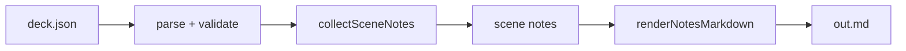

# Design: Speaker-Notes Export

> Status: **Published** · Realizes: [PRD: Speaker-Notes Export](pm_idea-prd.md) · Owner: Architecture

## Summary

Add a deterministic `slidey deck.json --notes out.md` path that emits a per-scene
Markdown handout from the existing spec — no render, no LLM. The work is a thin
read-only projection over the parsed deck, slotted behind the current CLI.

## Epic & Slices

- **Slice 1 — Notes model.** A pure `collectSceneNotes(spec)` that walks scenes in
  order and returns `{ index, eyebrow, type, body, narration }[]`. No I/O.
- **Slice 2 — Renderer.** `renderNotesMarkdown(notes)` → a deterministic Markdown
  string: one `##` section per scene, body + narration + a type label, with an
  explicit *(no narration)* marker so no scene is dropped.
- **Slice 3 — CLI seam.** A `--notes <path>` flag in `src/index.js` that parses the
  spec, runs the two pure functions, and writes the file (`-` → stdout).

## Data Flow

## ADRs

### ADR-1: Project over the parsed spec, do not re-render

We read the already-parsed deck rather than driving the render pipeline. The notes
are a *text projection*, so coupling to the renderer (Puppeteer, timing) would add
cost and nondeterminism for no benefit. **Decision: pure spec read.**

### ADR-2: Emit every scene, mark empties

A reviewer must see one section per scene. Silently dropping narration-less scenes
hides structure. **Decision: emit the section with a *(no narration)* marker.**

### ADR-3: Byte-stable output

Output must diff cleanly in review and be identical across machines. No timestamps,
no map iteration order, no locale formatting. **Decision: deterministic string
assembly in spec order.**

## Interfaces

| Function | Signature | Purity |
|---|---|---|
| `collectSceneNotes` | `(spec) -> SceneNote[]` | pure |
| `renderNotesMarkdown` | `(SceneNote[]) -> string` | pure |
| CLI `--notes` | `(path) -> writes file / stdout` | I/O at the edge |

## Risks & Mitigations

- **Duplicate eyebrows** collide as section titles → suffix by scene index.
- **Very long narration** → emitted verbatim; no truncation (a handout wants it).
- **Spec drift** (new scene type) → the model passes unknown types through with the
  type label, so the export never crashes on a forward-compatible spec.

## Test Plan

- Golden fixture deck → snapshot the exact `out.md` bytes; re-run asserts identical.
- A narration-less scene asserts the *(no narration)* marker appears.
- Invalid spec → non-zero exit with a clear message (no partial file written).

## Rollout

Land behind the existing CLI with the golden test, document the flag in the slidey
reference + authoring guide, announce in the changelog. Purely additive — no
migration.
